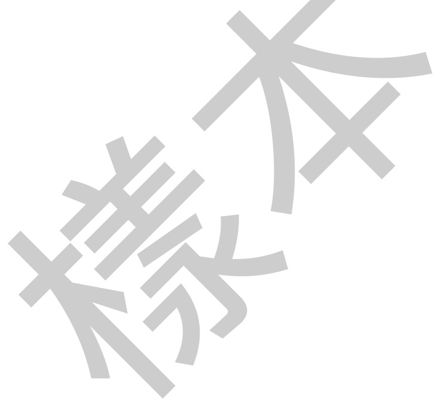
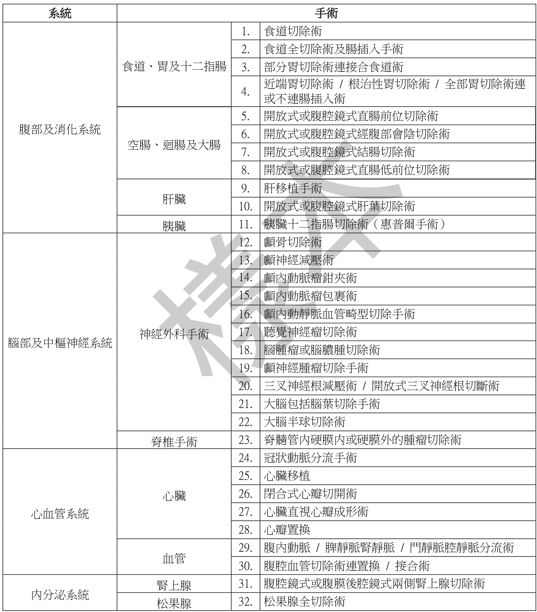
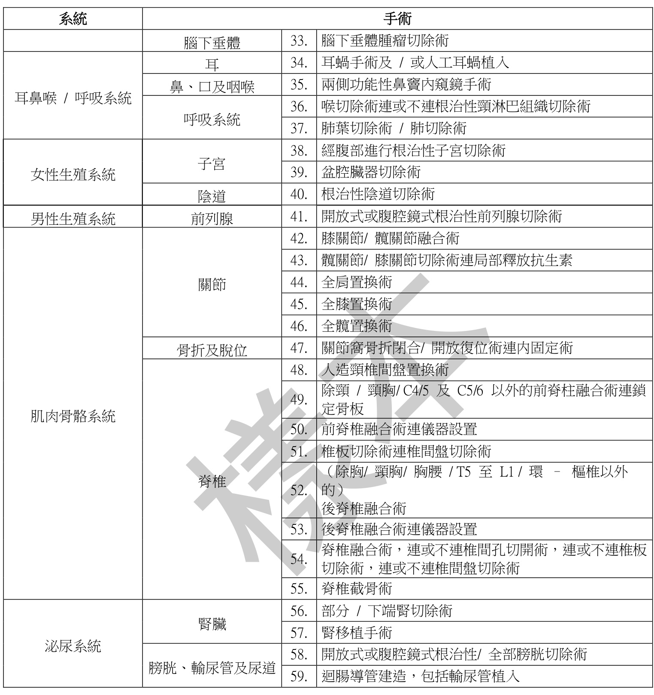
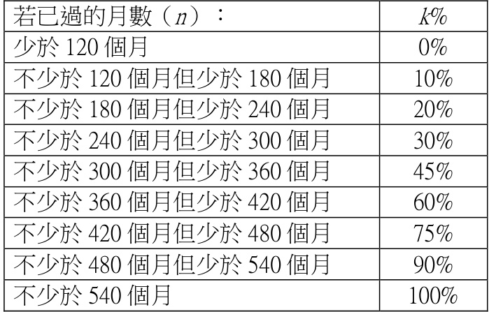

## 第 0 页

受保人：

保單編號：

保單生效日：

守護無間危疾保此乃分紅人壽保單。

戴明鈞  
首席行政總監  
宏利人壽保險（國際）有限公司  
（於百慕達註冊成立之有限責任公司）

## 第 1 页

目 錄

頁 數

保單詳情 3

1. 除嚴重危疾、早期危疾及兒童疾病以外之定義 ..4  
2. 嚴重危疾定義 . 7  
3. 早期危疾定義 . ....17  
4. 兒童疾病定義 . .24  
5. 複雜手術表 ... ..28  
6. 合 約..... ....30  
7. 管轄法律 ...30  
8. 保單年度及周年日 .. ..30  
9. 繳付保費 . ....30  
10. 付款貨幣 . ...30  
11. 受益人 ..31  
12. 保單擁有權 .. ...32  
13. 保單轉讓 . ...32  
14. 年齡及性別 .. ...32  
15. 自殺 . ...32  
16. 不可異議條文 . ...32  
17. 在生保障 ...33  
18. 身故賠償 . ...42  
19. 保單退保 .... ....42  
20. 保單復效 . ...44  
21. 終期紅利 .. ...44  
22. 終期紅利鎖定權益 . ....44  
23. 累積已鎖定終期紅利 ... ...44  
24. 保單期滿 . ..45  
25. 保單貸款 .. ....45  
26. 自動貸款代繳保費 . ...45  
27. 貸款規定 ..45  
28. 緩接期 . ....46  
29. 索償收款及終止保單 . ....46  
30. 索償通知及證明 .. ..47  
31. 不受保項目 . ...49  
32. 收款方式選擇條款 . ...49  
33. 第三者權利 . .49

## 第 2 页

守護無間危疾保

1. 除嚴重危疾、早期危疾及兒童疾病以外之定義

「累積已鎖定終期紅利」之涵義於條款23「累積已鎖定終期紅利」一章中界定。

「積極治療」指任何就癌症的干預治療（包括但不限於外科手術、電療、化療、標靶治療、骨髓移植、質子治療、免疫治療、數碼導航刀、伽瑪刀或以上治療的組合），並為必須之醫療服務。定義特別不包括激素治療; 實驗及／或非主流醫療技術／程序／治療; 尚未由當地政府、相關機構及當地認可醫學會批准之新型藥物或幹細胞治療。

「日常生活之活動」指：

(1) 沐浴 － 浸浴或淋浴方式自我清洗（包括能進入及離開浴缸或淋浴間）或以其他方式達到滿意自我清洗的能力。  
(2) 更衣 － 穿戴並固定及解開並脫下所有衣物及任何矯正器、義肢或其他醫學用支架（視何者適用而定）的能力。  
(3) 行動 － 從床移動至直立的椅子或輪椅上的能力，反之亦然。  
(4) 移動 － 於平坦地面之室內由一個房間移動到另一房間的自由活動能力。  
(5) 如廁 － 自行如廁或能自我控制肛門及膀胱功能，以保持合理程度之個人衛生的能力。  
(6) 進食 － 自行進食預先準備妥當及獲提供之食物的能力。

若受保人能在借助特別儀器的情況下進行以上之活動，將被視為能夠自行進行此活動。

「年齡」指最接近一個生日所達之歲數。任何出現於本保單內之特定年齡，是指在保單周年日當天，受保人於最接近一個生日所達之歲數。

「終期紅利鎖定總百分比」之涵義於條款22「終期紅利鎖定權益」一章中界定。

「癌症」之涵義於條款2「嚴重危疾定義」一章中界定。

「公司」為宏利人壽保險（國際）有限公司。

「複雜手術」指條款5「複雜手術表」一章中界定之手術程序。

「持續守護保障」之涵義於條款17「在生保障」一章中界定，並由（1） 癌症的持續守護保障、及（2） 突發性心臟病/中風的持續守護保障及（3） 痴呆/柏金遜病的持續守護保障所組成。

「危疾」指任何嚴重危疾、早期危疾、兒童危疾或合資格的深切治療部留醫。

「危疾賠償」之涵義於條款17「在生保障」一章中界定，並由（1） 嚴重危疾賠償、（2） 早期危疾賠償、（3）兒童疾病危疾賠償及（4） 深切治療保障所組成。

「醫生」指獲取西方醫學學士學位，於其行醫地區獲政府認可合法提供醫療及外科醫療服務（不包括牙科相關服務）之註冊醫生，除非該人士已預先獲得本公司以書面認可，否則醫生不可同時為本保單下之受保人或保單持有人，或保單持有人或受保人之商業合作夥伴、保險代理或僱主／僱員，或受保人或保單持有人之直系親屬。

「生活守護保障」之涵義於條款17「在生保障」一章中界定。

4 - KG_TC (07/2022)

## 第 3 页

守護無間危疾保

「早期危疾」指在條款3「早期危疾定義」一章中描述及定義之早期危疾及/或已進行的治療或手術。

「晚期護理」指在醫院或註冊善終院舍接受紓緩癌症症狀之治療，而該癌症正在惡化且未有醫治或控制該癌症的治療方法。

「緩接期」之涵義於條款28「緩接期」一章中界定。

「保證現金價值」之涵義於條款19「保單退保」一章中界定。

「醫院」指任何可合法為患病及受傷病人提供醫療服務之政府認可醫院，院內須設有符合政府規定之設備作診斷及進行主要外科手術、24小時護士服務及駐院醫生。惟並不包括療養院、護理院、老人院及戒酒或戒毒診療所。若該醫院位處於中華人民共和國（台灣、香港特別行政區及澳門特別行政區除外），則須為本公司的指定醫院，本公司將不時修訂有關醫院名單，恕不另行通知。

「深切治療保障」之涵義於條款17.1.4「深切治療保障」一章中界定，並由級別一深切治療保障及級別二深切治療保障所組成。

「深切治療部」指醫院的住宿或其部分，除提供房間及住宿外，並符合下列各項規定，而非手術後療養之病房：

(a) 由醫院為正規之深切治療而設立；  
(b) 特別為需要按醫生之指示而持續接受由醫生利用視聽器材進行觀察之重病患者而設立；及(c) 能即時於病房內提供所有必須之救生設備、藥物及物資。

「事件」包含（i）一項造成身體受傷並導致證實患上兩種或以上危疾的意外；或（ii）導致證實患上兩種或以上危疾的疾病包括其治療或併發症。

「欠款」包括任何有關於本保單下欠本公司之欠款，當中包括而並不限於欠繳到期保費、任何未償還之保單貸款及/或其累積應繳利息。

「侵入性維生支持」指就維持生命而借助氣管插管機械式呼吸輔助、使用左心室輔助裝置（LVAD）、主動脈內氣囊泵或體外膜肺氧合支援療法（ECMO）。為免存疑，任何非侵入性呼吸機（例如持續性正壓呼吸器 （CPAP）、雙正壓呼吸器（BiPAP） 或面罩）將不被視作為侵入性維生支持。

「簽發日」指在本保單第3頁內列明之簽發日。

「兒童疾病」指在條款4「兒童疾病定義」一章中界定之兒童疾病。

「受保人」指在本保單第3頁內列明之受保人。

「在生保障」之涵義於條款17「在生保障」一章中界定，並由（1） 危疾賠償、（2） 持續守護保障、（3） 持續癌症現金保障選項、（4） 末期癌症靈活選、（5） 生活守護保障及（6） 嚴重危疾保費豁免所組成 。

「嚴重危疾」指在條款2「嚴重危疾定義」一章中描述及定義之嚴重危疾及/或已進行的治療或手術。

「嚴重危疾保費豁免」之涵義於條款17「在生保障」一章中界定。

5 - KG_TC (07/2022)

## 第 4 页

守護無間危疾保

「期滿利益」之涵義於條款24「保單期滿」一章中界定。

「必須之醫療服務」 指符合下列各項規定之醫療服務：

(1) 符合診斷結果，就有關病況而採用之慣常治療方式；(2) 符合醫生良好醫療守則標準；及  
(3) 並非純粹為方便受保人或醫生。

「名義金額」見本保單第3頁，並由本保單簽發之日起生效。名義金額唯有透過保單持有人與本公司隨後另立書面協議方可作出修改。

「計劃」指在本保單第3頁內所示的「計劃」或「基本計劃」，而並不包括任何附加於本保單的附加保障。

「保單持有人」指為本保單的合約之另一方並在本保單第3頁內列明。

「保單生效日」指在本保單第3頁內列明之保單生效日。

「合資格的深切治療部留醫」之涵義於條款17.1.4「深切治療保障」一章中界定，並由級別一深切治療保障之合資格的深切治療部留醫及級別二深切治療保障之合資格的深切治療部留醫所組成。

「終期紅利鎖定周年日」指第20個保單周年日或其後每5個保單周年日。

「終期紅利鎖定權益」之涵義於條款22「終期紅利鎖定權益」一章中界定。

「專科醫生」指在引起索償之危疾或複雜手術（根據情況而定）範疇通常負責診治該病症的醫生，例如在心臟病個案中，專科醫生是指心臟科專科醫生。除非該人士已預先獲得本公司以書面認可，否則專科醫生不可同時為本保單下之受保人或保單持有人，或保單持有人或受保人之商業合作夥伴、保險代理或僱主／僱員，或受保人或保單持有人之直系親屬。

「退保價值」之涵義於條款19「保單退保」一章中界定。

「必須之手術服務」指符合下列各項規定之手術服務：

(1) 符合診斷結果，就有關確診病況而採用之慣常治療方式；(2) 按常規只適合在住院的情況下進行；  
(3) 符合醫生良好醫療守則標準；及  
(4) 並非純粹為方便受保人或醫生。

「終期紅利」之涵義於條款21「終期紅利」一章中界定。

## 第 5 页

守護無間危疾保

2. 嚴重危疾定義

本保單之保障範圍包括60種嚴重危疾，並定義如下，以下所有醫療情況的診斷及嚴重性必須有病理學組織及/或其他適當之測試結果及檢查支持，以及所有治療及手術必須由專科醫生認為是必須之醫療服務及/或必須之手術服務（根據情況而定）。

(1) 癌症

須有癌細胞不受控制地生長並侵入和破壞其他正常組織的特徵的惡性腫瘤。  
癌症必須獲病理學報告中提交的組織學化驗結果證實為惡性。

定義不包括下列各項：

(a) 腫瘤出現原位癌惡性病變, 子宮頸細胞病變、CIN-1、CIN-2、CIN-3 或組織化驗顯示腫瘤處於癌變前期；(b) 所有皮膚癌（惡性黑色素瘤除外）；  
(c) 經組織化驗證實屬於 TNM 分期系統中的 T1a 或 T1b 期的前列腺癌，或按其他分期系統屬同期或較早期的前列腺癌；  
(d) 經組織化驗證實屬於TNM 分期系統中的T1N0M0 或較早期的甲狀腺惡性腫瘤；  
(e) 尚未進入Rai 分期第三期的慢性淋巴球白血病；及  
(f) 所有感染人類免疫力缺乏症病毒後罹患的癌症。

(2) 急性壞死性胰臟炎

指發生於胰臟實質的急性炎症和壞死，胰酶導致的局部胰臟脂肪壞死以及血管壞死導致的出血。

診斷須符合以下所有條件：

(a) 必須進行手術以清除壞死組織或切除胰臟﹔及(b) 診斷必須有組織病理學病徵支持並且由消化科專科醫生確認。

定義不包括由酒精或藥物濫用導致的胰臟炎

(3) 因輸血而感染愛滋病

受保人受人類免疫力缺乏症病毒感染或患上後天免疫力缺乏症候群，並符合以下所有條件：

(a) 感染事故乃受保人於保單生效日、批註生效日或保單復效日後（以較後者為準）接受輸血所用的受污染之血液而引致；  
(b) 受污染之血液來源可透過提供此受污染之血液的機構追查；  
(c) 受感染之受保人並非血友病患者；及  
(d) 未有可以治癒之療法。

「可以治癒之療法」指任何可令人類免疫力缺乏症病毒不活躍或不具傳染性之治療方法。

(4) 亞爾茲默氏症/ 不可還原之器質腦退化性疾病（痴呆）

經臨床狀態及認可標準問卷檢查或測試，證實受保人因患上亞爾茲默氏症/不可還原之器質腦退化性疾病（痴呆）而出現智能逐漸退化或喪失或異常行為，導致智力及社交活動能力嚴重減退，必需持續依賴他人照顧及看護。診斷必須由老人科專科醫生、神經科專科醫生或老人精神科專科醫生經臨床證實。

## 第 6 页

守護無間危疾保

定義不包括因精神病、任何藥物或酒精或任何可逆轉之器質退化性腦病引致之亞爾茲默氏症及其他痴呆症。

(5) 肌萎縮性脊髓側索硬化

由一名神經科專科醫生明確診斷證實出現定義清晰的神經系統受損，並有持續性徵狀顯示涉及脊柱神經及大腦運動中樞，且引致肢體肌肉痙攣性衰弱及萎縮。診斷須由神經科專科醫生作出，並經適當的神經肌肉測試如肌電圖檢查等確定。

(6) 植物人

指大腦皮質全面壞死而腦幹完整無損之狀況。診斷必須由神經科專科醫生證實，並有最少一個月之紀錄證明。

(7) 再生障礙性貧血

因慢性骨髓衰竭導致貧血、中性白細胞減少及血小板減少，而須接受以下其中最少一項治療：

(a) 輸血；(b) 骨髓刺激劑；(c) 免疫抑制劑；或(d) 骨髓移植。

診斷必須經由血液學專科醫生證實。

(8) 細菌性腦（脊）膜炎

因細菌性腦膜炎引起腦膜或脊髓膜發炎，導致神經系統功能嚴重及永久受損。診斷必須經由神經科專科醫生證實。

(9) 良性腦腫瘤

危害生命之腦部或顱腦膜內的非癌性腫瘤，導致病者神經系統功能嚴重受損連續六個月或以上。

潛在腫瘤必須經由如電腦斷層掃描及磁力共振等顯影結果證實。

保障範圍不包括水囊腫、肉芽瘤、腦動脈或靜脈畸形、血腫、膿腫、聽覺神經瘤及下垂體或脊椎腫瘤。

(10) 雙目失明

雙眼不可逆轉地失去視力（不論有否使用輔助工具），並須符合下列任何一項條件:

(a) 根據斯內倫（Snellen） 視力表或同等測試，每隻眼睛的最佳矯正視力皆是相等或低於2/60；或(b) 每隻眼睛的最佳矯正視野闊度皆是相等或低於五度。

失明必須經眼專科醫生確定。

(11) 心肌病

由任何病因引起心室功能損傷，導致受保人身體永久及不可逆轉地受損最少達紐約心臟協會界定的第三級心臟受損程度。診斷必須由心臟科專科醫生證實，並有包括超聲心動圖在內的適當測試報告支持。

定義特別不包括因酗酒或濫用藥物引致的心肌病。

## 第 7 页

守護無間危疾保

(12) 慢性腎上腺功能不全

一種導致類固醇荷爾蒙分泌不足的慢性腎上腺疾病。

診斷須符合以下所有條件：

(a) 受保人已經開始接受持續性的荷爾蒙替代治療，並預期將持續終身接受該項治療；及(b) 慢性腎上腺功能不全的診斷必須由內分泌科專科醫生確認。

(13) 再發性慢性胰臟炎

因胰臟炎發作超過三次引致胰臟功能障礙，導致吸收不良而須接受酵素補充治療。  
診斷須由腸胃病學專科醫生作出，並經胰臟功能測試及放射照相及顯影技術結果確認。  
定義不包括由酗酒引致之再發性慢性胰臟炎。

(14) 昏迷

不省人事，並對外來刺激及內在需要毫無反應，長期不斷使用維持生命儀器最少 96 小時，並經一名神經科專科醫生診斷證實受保人因此而出現神經系統永久受損。  
定義不包括因酒精或藥物所導致的昏迷。

(15) 冠狀動脈搭橋手術

實際進行之開胸手術，透過冠狀動脈搭橋手術治療一條或以上冠狀動脈血管縮窄或阻塞。  
定義不包括血管成形術、植入血管支架及其他所有動脈內導管技術、鎖孔或激光治療。

(16) 克雅二氏症

受保人必須經由神經科專科醫生診斷證實患上克雅二氏症，該症為一種罕見及通常可以致命的海綿狀腦病，伴有小腦功能障礙、嚴重漸進式痴呆、肌肉不自主痙攣、顫抖及手足徐動等病徵及症狀。診斷必須基於具決定性之腦電圖及腦脊髓液檢查結果配合電腦斷層掃描及磁力共振掃描證明。

(17) 伊波拉出血熱

指因伊波拉病毒感染造成的發熱以及內出血或外出血。

診斷須符合以下所有條件：

(a) 經實驗室檢驗證實伊波拉病毒的確存在；(b) 已發生粘膜或胃腸道出血；及(c) 伊波拉出血熱的診斷必須由傳染病科專科醫生確認。

(18) 象皮病

指絲蟲感染的末期損害，因血液和淋巴管阻塞而出現特徵性的嚴重水腫。象皮病的診斷必須：

(a) 由專科醫生確認；  
(b) 有實驗室檢查證實微絲蚴存在；及(c) 經本公司醫生確認。

## 第 8 页

守護無間危疾保

其他傳染疾病、創傷、手術後瘢痕、充血性心力衰竭或先天性淋巴系統異常導致的淋巴水腫除外。

(19) 腦炎

經神經科專科醫生診斷證實由於感染病毒或細菌而引致之腦部（大腦半球、腦幹或小腦）發炎，導致神經系統功能嚴重及永久受損。

定義特別不包括受寄生蟲感染而引致之疾病，如瘧疾。

(20) 末期肝病

永久性不可逆轉之末期肝衰竭，受保人出現永久性黃疸病、水腹及腦病。定義不包括由酗酒或濫用藥物引致之肝病。

(21) 末期肺病

經證實一秒用力呼出量測試結果持續少於一公升，並需永久接受補充氧氣治療以防血氧過低，及導致呼吸衰竭之末期肺病。

動脈血管氣體分析的結果必須顯示分氧壓只有 55 毫米水銀柱或以下（PaO2 ≤ 55mmHg），且靜止時出現呼吸困難。

(22) 暴發性病毒性肝炎

由肝炎病毒引起的大塊或亞大塊肝臟壞死，急速地導致肝衰竭。其診斷必須符合下列所有準則：

(a) 肝臟體積急劇縮小；  
(b) 廣泛性肝小葉壞死，僅剩下萎陷的網狀結構；(c) 肝功能測試結果顯示急劇退化；及  
(d) 黃疸加深，

惟任何直接或間接由意圖自殺、中毒、服用過量藥物及飲酒過多引致之暴發性病毒性肝炎除外。

受保人必須提供以下證明：

(a) 肝功能測試結果以證明受保人患有嚴重肝實質病變；及(b) 肝門靜脈分流性腦病之客觀徵象

(23) 溶血性鏈球菌引致之壞疽

包圍肢體或軀幹肌肉之淺及/或深筋膜受到感染，病情屬暴發性並需要即時進行手術及清創術。確診必須經細菌培養及由專科醫生於進行手術探察後證實。

(24) 突發性心臟病（心肌梗塞）

因血液供應不足而導致部份心臟肌肉（心肌）壞死。診斷必須得到下列所有準則支持，並與急性心肌梗塞相符：

(a) 胸痛病歷；  
(b) 心電圖出現改變；及  
(c) 具診斷意義的心臟酵素CK-MB上升，或心肌肌鈣蛋白 $\mathrm{T}{>}0.6$ 微克/公升，或肌鈣蛋白I>0.5微克/公升。

## 第 9 页

守護無間危疾保

定義不包括其他所有急性冠狀綜合症，包括但不限於不穩定型心絞痛、輕微梗塞及心肌輕微受損。

(25) 心瓣手術

剖開心臟實際進行手術以置換心瓣或治療心瓣異常。心導管或超聲心動圖必須證實心瓣異常，而手術須由一名心臟科專科醫生或心胸肺外科專科醫生認為是必須之手術服務。

定義不包括氣囊瓣膜切開術。

(26) 因侵害而感染之人類免疫力缺乏症病毒

指人類免疫力缺乏症病毒（HIV）感染並符合以下所有條件：

(a) 因人身侵害而被迫接觸受HIV感染的針頭或銳器，或被已感染HIV人士性侵害；  
(b) 侵害事件在保單生效日、批註生效日或保單復效日後（以較後者為準）於香港特別行政區或澳門特別行政區發生，並在事件發生後十四天內向香港特別行政區或澳門特別行政區警方報案；及  
(c) 須在事件發生後十四天內進行測試，顯示HIV或HIV抗體為陰性。以及，在事件發生後6個月內重新進行測試，並顯示感染人類免疫力缺乏症病毒。

(27) 感染性心內膜炎

感染性心內膜炎是指由於感染導致的心臟內層覆膜炎症。

診斷須符合以下所有條件：

(a) 感染病原體血液培養出現陽性結果；  
(b) 由於感染性心內膜炎造成至少中度的瓣膜關閉不全（血液回流部分等於或大於 $20\%$ ）或者中度瓣膜狹窄（瓣膜面積減少至正常水平的 $30\%$ 或以下）；及  
(c) 感染性心內膜炎的診斷以及瓣膜受損的嚴重程度必須由心臟科專科醫生確認。

(28) 腎衰竭

兩邊腎臟不可逆轉的慢性衰竭，需要永久接受腎臟透析治療。

(29) 失聰

因急性疾病或意外而導致雙耳不可逆轉地喪失所有頻率中最少 80 分貝之聽覺（不論有否使用輔助工具）。  
須出示由一名專科醫生發出之診斷證明，證明內須包括聽力及音頻閾測試結果。

(30) 斷肢

二肢於腳踝或手腕或以上完全且不可逆轉地截斷。

(31) 失去一肢及一眼

指受保人因外傷或疾病出現以下兩項情況：

(a) 單眼不可逆轉地失去視力，並須符合下列任何一項條件：

(i) 根據斯內倫（Snellen） 視力表或同等測試，一隻眼睛的最佳矯正視力是相等或低於 2/60；或(ii) 一隻眼睛的最佳矯正視野闊度是相等或低於5 度。  
診斷須由眼科專科醫生確認；及

## 第 10 页

守護無間危疾保

(b) 一肢於手腕或腳踝或以上完全且不可逆轉地截斷。

(32) 喪失語言能力

因聲帶受損而導致不可逆轉地完全喪失語言能力並持續 12 個月。須出示由一名相關專科醫生發出之診斷證明，以證明其聲帶受損或出現病變。定義不包括所有由精神病有關的原因所引致之喪失語言能力。

(33) 嚴重灼傷

第三級嚴重灼傷，即受保人身上總皮膚範圍最少 $20\%$ 之皮膚的所有皮層受到破壞。

(34) 嚴重頭部創傷

頭部因意外受傷導致功能嚴重及永久受損，並由創傷或受傷之日起計持續最少三個月。該永久性嚴重功能受損之診斷必須經由神經科專科醫生證實。

(35) 主要器官移植

受保人須為器官移植的接受者，並實際進行人與人之間的造血幹細胞骨髓移植手術，且於手術前曾進行骨髓完全消融；或人與人之間的心、肺、肝、胰或腎移植手術之器官移植接受者。移植手術從醫學角度而言是必須之手術服務，以治療相關器官不可逆轉的末期衰竭。

定義不包括其他幹細胞移植、胰島細胞移植及部份器官移植。

(36) 囊腫性腎髓病

因腎髓出現囊腫而導致之遺傳性腎臟機能障礙，病徵包括腎臟逐步喪失功能。

診斷必須經由顯影術檢查結果顯示皮層萎縮多重髓質囊腫確定。

(37) 多發性硬化

大腦神經組織因脫髓鞘病變所引致的疾病。必須經一名神經科專科醫生診斷為臨床定義的多發性硬化症，並有詳細病歷證實病況曾出現多於一次的惡化及緩解。磁力共振掃描、電腦斷層掃描或其他可靠的顯影技術檢查所得的結果，須明確地確認此診斷。

必須有證據顯示神經系統出現的永久病徵 $o$

定義不包括因紅斑狼瘡及人類免疫力缺乏症病毒所引致的神經受損。

(38) 遺傳性肌肉萎縮症

肌肉逐漸衰退之遺傳性疾病，病徵包括肌肉逐步衰弱及萎縮。診斷須經一名神經科專科醫生明確作出，並有適當的神經肌肉測試如肌電圖檢查等核實。受保人必須因此於無協助之情況下不能進行六項「日常生活之活動」中最少三項。

(39) 重症肌無力

發生於神經肌肉接頭的獲得性自身免疫疾病，會造成波動性的肌肉無力和易感疲倦。診斷須符合以下所有條件：

(a) 出現肌肉無力症狀，並且符合美國重症肌無力基金會臨床分類中第三、四或五級的標準；及(b) 重症肌無力診斷及其分類必須由神經病科專科醫生確認。

美國重症肌無力基金會臨床分類標準：

## 第 11 页

守護無間危疾保

第一級： 任何眼肌無力，可能出現上眼瞼下垂，沒有其他肌肉無力的證據第二級： 任何程度的眼肌無力，其他肌肉出現輕度無力第三級： 任何程度的眼肌無力，其他肌肉出現中度無力第四級： 任何程度的眼肌無力，其他肌肉出現嚴重無力第五級： 需要氣管插管以保持氣道通暢

(40) 因職業引致之人類免疫力缺乏症病毒

受保人於執行其慣常職業之職務期間因意外感染人類免疫力缺乏症病毒，並於意外發生後六個月內出現血清轉呈陽性。

任何可能會引致索償之意外必須於發生後14天內向本公司報告，並須同時提交於意外發生後立即接受之人類免疫力缺乏症病毒抗體測試之陰性結果報告以作支持。

受保人必須讓本公司取得所有曾接受測試之血液樣本進行個別測試，及於有需要時抽取額外之血液樣本。「因職業引致之人類免疫力缺乏症病毒」之定義不包括下列各項：

(a) 如意外發生前此病症已有可以治癒之藥物供應；  
(b) 受保人決定不接種於意外發生前已有供應之有效疫苗；或  
(c) 由任何其他途徑感染之人類免疫力缺乏症病毒，其他感染途徑包括性行為或違禁藥物靜脈注射。

「可以治癒之療法」指任何可令人類免疫力缺乏症病毒不活躍或不具傳染性之治療方法。

(41) 其他嚴重冠狀動脈疾病

不論受保人曾否接受任何冠狀動脈外科手術，經冠狀動脈造影檢查證實最少三條主要冠狀動脈管腔縮窄達$60\%$ 。此段之主要冠狀動脈指左主幹、左前降支、回旋支及右冠狀動脈（不包括分支血管）。

(42) 癱瘓

最少二肢因癱瘓而不可逆轉地完全喪失功能。

(43) 柏金遜病

因腦部喪失含色素神經細胞而導致中樞神經系統逐漸衰退。診斷須經一名神經科專科醫生明確作出，而病況：

(a) 已不受藥物控制；  
(b) 出現逐步退化徵狀；及  
(c) 於無協助之情況下，受保人永久失去進行六項「日常生活之活動」中的其中三項活動能力。

只有特發性柏金遜病方獲保障。定義不包括因藥物或中毒導致之柏金遜病。

(44) 嗜鉻細胞瘤

一種發生於腎上腺或腎上腺外嗜鉻組織的神經內分泌腫瘤，導致身體分泌過量的兒茶酚胺。

診斷須符合以下所有條件：

## 第 12 页

守護無間危疾保

(a) 已對腫瘤實施手術清除；及(b) 嗜鉻細胞瘤的診斷必須由已經註冊的內分泌科專科醫生確認。

(45) 脊髓灰質炎（小兒麻痺症）

經神經科專科醫生明確診斷，證實受保人因急性感染脊髓灰質炎病毒而導致癱瘓，並確實運動功能受損及呼吸疲弱，而病因必須被確定為脊髓灰質炎病毒感染。定義特別不包括不涉及癱瘓之病例。

(46) 原發性側索硬化

大腦皮質運動神經元逐漸退化失調，導致由上運動神經元控制的肌肉廣泛衰弱，臨床特徵為肢體肌肉漸進式出現痙攣性衰弱，此前或其後伴有痙攣性發音及吞嚥困難，顯示皮質脊髓束及皮質延髓束同時受到影響。診斷須由神經科專科醫生證實，並經由肌電圖檢查等適當的神經肌肉測試驗證實。

(47) 原發性肺動脈高血壓

經由包括心導管插入術在內之檢查明確診斷為原發性肺動脈高血壓及伴有右心室嚴重擴大，導致永久性身體受損最少達到紐約心臟協會界定的第三級心臟受損程度。

定義不包括繼發性肺動脈高血壓，其起因包括但不限於慢性肺部疾病、肺栓塞、瓣膜疾病及左心室疾病。

(48) 延髓性逐漸癱瘓

經神經科專科醫生診斷之肌肉（包括延髓肌肉）逐步虛損及萎縮。診斷必須由一名神經科專科醫生證實，並經適當的神經肌肉測試如肌電圖檢查等核實。

(49) 進行性肌肉萎縮

經神經科專科醫生診斷之肌肉虛損及逐漸惡化之痙攣。診斷須經適當的神經肌肉測試如肌電圖檢查等核實。

(50) 核上神經逐漸癱瘓

一種退化性神經系統疾病，以核上性眼肌麻痹，假性球麻痹，中軸性僵直和癡呆為特徵。核上神經逐漸癱瘓的診斷必須由已經註冊的神經科專科醫生確認。

(51) 嚴重克羅恩氏病

克羅恩氏病是一種發生於腸道的慢性炎症性疾病，以肉芽腫為特徵。

診斷須符合以下所有條件：

(a) 疾病必須已經造成以下腸道併發症中的至少一項：

(i) 瘻管形成（肛瘻除外）；(ii) 腸梗阻；或(iii) 腸穿孔（並非由於介入性操作所致）；及(b) 診斷必須有組織病理學病徵支持並且由已經註冊的消化科專科醫生確認。

(52) 嚴重類風濕關節炎

廣泛之慢性及進行性關節破壞及嚴重變形，影響最少三個主要關節（例如足、手、手腕、膝蓋、髖關節）。診斷須經下列各項證實：

## 第 13 页

守護無間危疾保

(a) 清晨僵硬；  
(b) 對稱性關節炎；  
(c) 類風濕性結節；  
(d) 類風濕因子滴定度上升；及(e) 放射照相證實病情嚴重

診斷必須經由風濕病學專家專科醫生證實。

(53) 嚴重潰瘍性結腸炎

嚴重潰瘍性結腸炎是指急性暴發性潰瘍性結腸炎，伴隨危及生命的電解質平衡紊亂。

診斷須符合以下所有條件：

(a) 全部結腸被累及並導致嚴重的血性腹瀉；  
(b) 必須進行全結腸切除和迴腸造口術；及  
(c) 診斷必須有組織病理學病徵支持並且由已經註冊的消化科專科醫生確認。

(54) 脊骨肌萎縮症

由脊髓前角細胞及腦幹運動神經核退化引致的病變，其特徵為近端肌肉（主要為腿部）嚴重衰弱萎縮，遠端肌肉的影響其次。此病症的診斷須由神經科專科醫生證實，及須經適當的神經肌肉測試如肌電圖檢查等核實。

(55) 中風

因腦組織梗塞、大腦及蛛網膜下出血、腦栓塞及腦血栓等腦血管病症，導致神經系統功能上受損並須從身體檢查中確定其具有客觀的神經異常症狀，而病症必須於發生最少四個星期後經神經科專家專科醫生核實。

診斷須由磁力共振掃描、電腦斷層掃描或其他可靠的顯影技術測出與新一次中風相符的結果支持。定義不包括下列各項：

(a) 短暫性腦缺血及任何可逆轉性缺血神經功能缺損；  
(b) 視覺神經疾病或影響眼睛的血管疾病 $\wp$   
(c) 前庭系統缺血疾病；及  
(d) 經腦部或其他掃描中發現的異常，而其異常沒有明確相關的臨床症狀和神經系統病徵。

(56) 主動脈手術

實際進行之開胸或開腹手術，以治療動脈瘤、主動脈縮窄、阻塞或內壁分離。定義不包括微創性或動脈內手術，亦不包括因外傷導致之主動脈損傷。

定義中，主動脈指胸部及腹部之主動脈，惟其分支除外。

(57) 紅斑狼瘡

多系統之自體免疫力失常症，病徵包括產生自體抗體侵襲自體抗原。

紅斑狼瘡之定義只限於下文所界定涉及腎臟及中樞神經系統之紅斑狼瘡類別。狼瘡腎炎必須已達嚴重程度，據腎活組織檢查證實並按國際腎臟病協會/腎臟病理協會 （ISN/RPS） 的狼瘡腎炎分類 （2003） /世界衛生組織之分類法而界定屬第三至第六級狼瘡腎炎。

## 第 14 页

守護無間危疾保

中樞神經系統紅斑狼瘡則指癲癇發作或神經系統功能永久受損。定義不包括由藥物引致之紅斑狼瘡、盤狀紅斑狼瘡及其他類別之紅斑狼瘡。最終診斷須由擁有風濕病學及免疫學專科資格之專科醫生證實。

(58) 系統性硬化

一種慢性及全身性的自身免疫疾病，特徵有組織纖維化、小血管病變和自身抗體形成。

診斷須符合以下所有條件：

(a) 有證據顯示下列至少一個器官受到損害：

(i) 食道；  
(ii) 肺；  
(iii) 心臟；或(iv) 腎臟；  
及

(b) 系統性硬化的診斷及器官損害須由註冊的風濕病學專科醫生或免疫病學專科醫生確認。

(59) 末期疾病

據醫生之意見認為，並經本公司醫生認同，受保人極有可能於六個月內因病死亡。

(60) 完全及永久傷殘

於受保人16 歲至64 歲期間（首末包括在內），完全及永久傷殘指受保人因疾病或身體受傷而導致完全不能從事或執行任何可獲報酬或利潤之職業或工作，而其傷殘狀態須不間斷持續 180 天或以上。於合理情況之下，本公司或會要求該傷殘狀態須持續一段更長時間，以證明其為永久傷殘。

於受保人65 歲或之後，完全及永久傷殘指受保人無法進行六項「日常生活之活動」中最少三項，並且在整個活動過程中需要另一個人從旁協助，而該情況在根據現時醫學知識及技術，被視為已完全沒有復原的希望。

於受保人16 歲前，本公司將不會就完全及永久傷殘作出賠償。

## 第 15 页

守護無間危疾保

3. 早期危疾定義

本保單保障範圍包括44 種早期危疾，並定義如下，以下所有醫療情況的診斷及嚴重性必須有病理學組織及/或其他適當之測試結果及檢查支持，以及所有治療及手術必須由專科醫生認為是必須之醫療服務及/或必須之手術服務（根據情況而定）。

(1) 因腎上腺腺瘤的腎上腺切除術

為治療由醛固酮分泌性腎上腺腫瘤引起的惡性系統性高血壓及難治性高血壓而實施的腎上腺切除手術

(2) 於頸動脈進行血管成形術及植入支架

於頸動脈進行血管成形術及/或植入支架是指就一條或以上的頸動脈狹窄程度達到 $50\%$ 或以上及獲血管成影術證據支持而作出的治療。同時必須符合以下所有標準：

(a) 確實進行血管內介入治療，例如血管成形術及/或進行植入支架或動脈粥樣斑塊清除手術，以減輕症狀；(b) 診斷治療必須由相關專科醫生確認；及  
(c) 治療必須由相關專科醫生確認為必須之醫療服務。

(3) 因冠狀動脈疾病進行血管成形術及其他創傷性治療

因冠狀動脈疾病進行血管成形術及其他創傷性治療為實際進行之血管成形術及支架植入、氣囊血管成形術、動脈粥樣硬化斑塊切除術或激光手術，以治療一條或以上之主要冠狀動脈縮窄（狹窄程度最少達$50\%$ ）。治療必須由相關專科醫生確認為必須之醫療服務。

醫療證明須包括以下各項在內：

(a) 心臟科主診醫生的完整報告；及(b) 血管造影檢查結果確定一條或以上的主要冠狀動脈病變之狹窄位置及程度。

主要冠狀動脈指左主幹、左前降支、回旋支及右冠狀動脈。

(4) 膽道重建手術

因疾病或膽道創傷而需接受包含膽總管小腸吻合術在內的膽道重建手術。膽道閉鎖並不在保障範圍內。

(5) 原位癌

原位癌是指局部自行增生而尚未侵略正常組織之新生癌細胞。侵略是指基底膜下的正常組織受到浸潤及 /或活躍的破壞。原位癌限於下列器官，並以所列出的分類為準。原位癌之診斷必須附有組織病理學化驗報告作為證明。

(a) 乳房；  
(b) 子宮頸或子宮；  
(c) 結腸及直腸；  
(d) 肝；  
(e) 肺；  
(f) 鼻咽；  
(g) 卵巢或輸卵管；  
(h) 陰莖；  
(i) 胃及食道；  
(j) 睪丸

## 第 16 页

守護無間危疾保

(k) 泌尿道，Ta 期的膀胱乳頭狀癌也視作原位癌；及(l) 陰道；  
（每項稱為「器官類別」）

若器官類別的結構分為左右兩部分，包括但不限於乳房、卵巢及輸卵管，左右兩部分的器官類別會被視為一個及相同的器官類別。

子宮頸原位癌所指的原位癌，必須經由顯微鏡檢驗以圓錐形切除術抽取的固定組織或以陰道窺鏡結合子宮頸抹片檢查，證實診斷結果屬陽性方可作實。臨床診斷一概不可作準。保障範圍並特別不包括屬於子宮頸上皮內瘤（CIN）分類中的 CIN I 及 CIN II 病變。  
子宮原位癌的腫瘤必須證實屬於 TNM 分期法中的 TisN0M0 期或國際婦產科協會（The Federation Internationalede Gynecologie etd'Obstetrique）分期法中的 FIGO 0 期。

卵巢原位癌的腫瘤必須包膜完整，卵巢表面無癌症組織，並且證實屬於 T1aN0M0 期（TNM 分期法）或FIGO1A 期（FIGO 國際婦產科協會分期法）。輸卵管原位癌的腫瘤必須局限於輸卵管黏膜並且屬於TNM 分期法中的Tis 期。

陰道原位癌的腫瘤必須屬於 TNM 分期法中的 Tis 期或國際婦產科協會（The Federation Internationale deGynecologie etd'Obstetrique）分期法中的 FIGO 0 期。

(6) 心臟起搏器植入術

因嚴重心律失常而需要植入心臟起搏器或除纖顫器，而且此嚴重心律失常並不能以其他方法治療。

(7) 頸動脈手術

確實進行的頸動脈內膜切除術。頸總動脈或頸內動脈狹窄程度須達到至少 $50\%$ 。

除頸動脈以外，其他的血管內膜切除術並不在保障範圍內。

(8) 須作手術之大腦動脈瘤或動靜脈畸形

經顱骨切開進行的顱內手術以夾閉、修補或切除腦動脈瘤或腦動靜脈畸形；或以伽馬刀消除動靜脈畸形顱骨切開或伽馬刀之外的其他手術方式除外。

(9) 植入大腦內分流器

確實進行的腦室分流器植入手術，以舒緩腦脊液壓力。

(10) 慢性肺病

診斷為間質性肺纖維化並需要接受間歇性氧氣治療，及在接受適當的藥物治療情況下肺活量（FVC）或肺總量（TLC） 仍減少至正常估計值的 $70\%$ 或以下。

(11) 植入人工耳蝸手術

由於耳蝸或聽神經永久損害而接受人工耳蝸植入手術，且須符合以下所有條件：

(a) 受保人雙耳出現嚴重感覺神經性聽力受損並已持續連續12個月以上；及(b) 佩戴助聽器並不能緩解聽力受損情況。

## 第 17 页

守護無間危疾保

(12) 糖尿病視網膜病變

因糖尿病導致視網膜血管出現嚴重病變。必須符合下列所有條件：

(a) 確診糖尿病視網膜病變時已患有糖尿病；(b) 以Snellen視力檢查表的標準，雙眼視力為6/18 或更差；及(c) 確實已進行治療（例如：激光治療），以改善視力障礙。

(13) 早期惡性腫瘤

出現以下任何一種惡性腫瘤：

(a) RAI 分期為I期或II期的慢性淋巴球白血病；  
(b) 非黑色素瘤的皮膚癌；或  
(c) 經組織化驗證實屬於T N M分期系統中的T1a或T1b期的前列腺癌。

以上並未列出的其它癌前病變除外。

(14) 早期甲狀腺癌

任何甲狀腺的惡性腫瘤經組織學證實診斷結果屬陽性及其癌細胞有不受控制地生長並侵入組織的特徵，並經由組織化驗證實屬於TNM分期系統中的T1N0M0或按其他分期系統屬同期的早期甲狀腺癌。

(15) 大腦動脈瘤的血管介入治療

實際進行的血管內介入治療，如經血管內栓塞治療、經血管內盤繞治療、血管成形術及／或植入支架或置入流量分流器，以預防腦動脈瘤破裂或減輕因腦動脈瘤破裂而導致的出血。

(16) 周圍動脈疾病的血管介入治療

周圍動脈疾病的血管介入治療是指就一條或以上的下列血管狹窄程度達到 $50\%$ 或以上及獲血管成影術證據支持而作出的治療：

(a) 為下肢或上肢供血的動脈；(b) 腎動脈；或  
(c) 腸系膜動脈。

同時必須符合下列所有準則：

(a) 確實進行血管內介入治療，例如血管成形術及/或進行植入支架或動脈粥樣斑塊清除手術，以減輕症狀；(b) 周圍動脈疾病的診斷必須由血管疾病專科醫生確認；及  
(c) 治療必須由血管疾病專科醫生確認為必須之醫療服務。

(17) 主動脈疾病的血管介入治療或主動脈瘤

主動脈疾病的血管介入治療或主動脈瘤是指下列任何一項：

(a) 主動脈疾病的血管介入治療是指接受微創或動脈內的手術修補或矯正主動脈內的動脈瘤、狹窄、阻塞或夾層分離。本定義中的主動脈是指胸主動脈或腹主動脈而非其分支；或  
(b) 主動脈瘤是指胸主動脈瘤或腹主動脈瘤，或主動脈夾層分離，並由適當的影像技術證明主動脈的直徑增大至最少50毫米。

## 第 18 页

守護無間危疾保

(18) 意外引致的臉部灼傷

意外導致面部最少 $30\%$ 的皮膚受到三級燒傷（皮膚全層燒傷）。

若意外引致的臉部灼傷及意外引致的次級嚴重身體灼傷由同一事故引起，在本計劃內只能獲得一次賠償。

(19) 意外受傷所需的面容重建手術

確實進行的整形或重建手術（意外導致頸部以上的面部構造不完整、缺失或受損，從而須對其形態及觀進行修復或重建）以治療因意外導致的面部受損，受保人須住院接受該手術。純粹因整容原因、獨立的牙齒修復、獨立的鼻骨折斷或獨立的皮膚傷口所進行的手術均不受此保障。

(20) 肝炎連肝硬化

因肝炎病毒感染發展為肝硬化。必須由專科醫生確認肝炎病毒導致肝硬化的診斷，且有肝活檢組織學檢查證明疾病於Metavir分級表中屬F4階段或Knodell肝纖維化標準達4。

由酒精或濫用藥物而引起或與其有關的肝病不受此保障。

(21) 植入靜脈過濾器

因反覆發作的肺栓塞而須植入靜脈過濾器。須有抗凝治療失敗的書面紀錄。

(22) 心瓣膜疾病的次級創傷性治療

進行經皮穿刺瓣膜修補，例如瓣膜成形術或瓣膜切開及經皮穿刺瓣膜置換術，有關治療需完全透過血管介入的方式進行。

(23) 次級嚴重細菌性腦（脊）膜炎

由於細菌感染導致的腦膜或脊膜炎症從而須接受住院治療。

(24) 意外引致的次級嚴重身體灼傷

意外導致身體表面最少 $10\%$ 的皮膚受到三級燒傷（皮膚全層燒傷）。

若意外引致的次級嚴重身體灼傷及意外引致的臉部灼傷由同一意外引起，在本計劃內只能獲得一次賠償。

(25) 次級嚴重昏迷

持續最少48小時的次級嚴重昏迷 ，並需有下列症狀證明：

(a) 對外來刺激毫無反應；及(b) 需要利用生命維持系統。

定義不包括因酒精或濫用藥物而直接引致的次級嚴重昏迷及醫療誘導的昏迷。

(26) 次級嚴重腦炎

因病毒感染導致腦實質（大腦半球、腦幹或小腦）發炎並需要入住醫院。由人類免疫力缺乏病毒（HIV）引致的腦炎不受此保障。

## 第 19 页

守護無間危疾保

(27) 次級嚴重心臟疾病

因血液供應不足而導致部份心臟肌肉（心肌）壞死。診斷必須得到下列所有準則支持，並與急性心肌梗塞相符：

(a) 胸痛病歷；(b) 心電圖出現改變；及(c) 肌鈣蛋白提高至確診水平

定義不包括其他所有急性冠狀綜合症，包括但不限於不穩定型心絞痛、輕微梗塞及心肌輕微受損

(28) 次級嚴重腎臟疾病

末期慢性腎功能不全，以 Modification of Diet in Renal Diseases （MDRD） 或 Cockcroft-Gault 公式作評估的腎小球濾過率 （GFR） 結果少於每分鐘30毫升/1.73平方米，及該情況須維持至少連續90天。

(29) 次級嚴重系統性紅斑狼瘡

多系統之自體免疫力失常症，病徵包括產生自體抗體以侵襲自體抗原。

在下列五項情況中出現最少兩項：

(a) 關節炎：非磨損性關節炎，需涉及兩個或以上關節；  
(b) 漿膜炎：胸膜炎或心包炎；  
(c) 腎病（以下其中一項）：每天尿蛋白持續超過0.5 克或尿液檢查出現細胞管型；  
(d) 血液異常：溶血性貧血、白血球減少、淋巴球減少或血小板減少；或(e) 抗核抗體測試、抗雙鏈DNA測試或抗Smith抗體測試呈陽性。

(30) 肝臟手術

受保人因疾病或意外切除左側或右側肝臟的至少一整葉及為必須之醫療服務。  
其他原因導致的肝臟手術，包括但不限於因酒精或濫用藥物引致的疾病以及捐贈肝臟等均不受此保障。

(31) 單耳失聰因疾病或受傷導致單耳完全失去聽覺（即在所有測試頻率下聽力損失均達到最少80分貝）及不可復原。

(32) 失去一肢

因疾病或受傷導致一肢於手腕或腳踝或以上完全且不可逆轉地截斷。

(33) 單眼失明

因疾病或受傷導致單眼不可逆轉地失去視力，須符合下列任何一項條件：

(a) 根據斯內倫（Snellen） 視力表或同等測試，一隻眼睛的最佳矯正視力是相等或低於2/60；或(b) 一隻眼睛的最佳矯正視野闊度是相等或低於五度。

視力損失必須由眼科專科醫生確定。

## 第 20 页

守護無間危疾保

(34) 主要器官移植（於器官移植輪候冊名單上）

受保人於香港醫院管理局或其居住國家政府所監管的官方正式器官移植輪候冊名單上，以器官接受者身份輪候移植下列器官：

(a) 在全身骨髓消融後進行骨髓造血幹細胞移植；或  
(b) 為治療相應器官的不可復原的功能衰竭而進行以下任何一項人體器官移植：心臟、肺、肝、腎、或胰腺。

除上述（a）項所列器官移植外，其他幹細胞移植及胰腺組織或細胞移植均不受此保障。

若受保人於其居住國家政府所監管（香港醫院管理局除外）的官方正式器官移植輪候冊名單上，除了要符合上述條件外，亦須符合下列所有之額外條件：

(a) 由兩位擁有適合之醫療專業的專科醫生確認診斷及證實該器官移植為必須之醫療服務；及(b) 提供支持該器官移植的臨床及／或病理證據。

(35) 粟粒性肺結核

結核菌感染並發生全身廣泛擴散，一個或多個器官出現粟粒狀結節。並發於人類免疫力缺乏病毒（HIV）感染的粟粒性結核除外。

(36) 中度嚴重癱瘓

因疾病或受傷導致最少單臂或單腿癱瘓及永久完全喪失活動能力。喪失活動能力是指在功能上完全及永久殘障，可被視為永久喪失有關肢體。由於精神疾病導致的癱瘓除外。

(37) 脊髓炎

因脊髓的炎症導致嚴重神經功能受損而需住院治療，神經功能受損須持續至少連續14天。

(38) 骨質疏鬆症連骨折

出現骨質疏鬆症連骨折並必須符合下列兩項條件：

(a) 出現最少一處股骨頸骨折或兩處脊柱椎體骨折，骨折因骨質疏鬆症導致或有骨質疏鬆症伴隨出現；及(b) 以雙能量X光吸收儀 （DE X A） 或定量電腦斷層掃描 （CT）量度出最少兩處位置的骨骼礦物質密度與嚴重骨質疏鬆症的定義一致（即低於-2.5的T數值）。

必須已確實進行骨折內部固定術或骨折部位置換術。

骨質疏鬆症連骨折的保障將於受保人年滿70歲時即時自動終止。

(39) 心包切除術

為治療心包疾病而實際進行的心包切除手術或小切口心臟手術。

(40) 皮膚移植

實際進行的以受保人為受體的皮膚移植手術。手術是為了治療因疾病或因熱力、化學物質或電源媒體引致的受傷，導致皮膚損失。皮膚移植必須覆蓋身體表面面積的至少 $10\%$ 。身體表面面積的計算採用九分法 （The Rule of Nines） 或 Lund及Browder 身體表面面積表 （The Lund and Browder BodySurface Chart） 。

## 第 21 页

守護無間危疾保

(41) 腦硬膜下血腫手術

於頭部進行鑽孔手術 （Burr Hole），以引流因意外導致的腦硬膜下血腫。

(42) 單腎切除手術

受保人因任何疾病或意外導致需要完全切除一側腎臟。

(43) 單肺切除手術

受保人因疾病或意外接受全左肺或全右肺切除手術。定義不包括肺部分切除。

(44) 腦下垂體腫瘤切除手術

實際進行的腦下垂體腫瘤切除手術，以治療因腦下垂體腫瘤導致的顱內壓上升、腦下垂體源性的內分泌失調或因腦下垂體腫瘤壓迫正常腦組織導致的神經機能缺失。

腫瘤必須由影像學檢驗證實，檢驗包括電腦斷層掃描（CT） 或磁力共振掃描（MRI）。保障範圍不包括腦下垂體微腺瘤（腫瘤直徑為8毫米或以下）的切除手術。

## 第 22 页

守護無間危疾保

4. 兒童疾病定義

本保單之保障範圍包括17種兒童疾病，並定義如下，以下所有醫療情況的診斷及嚴重性必須有病理學組織及/或其他適當之測試結果及檢查支持。

(1) 一型糖尿病

此類糖尿病是由於胰臟製造胰島素的細胞受到自身免疫力破壞。

須符合以下所有條件：

(a) 該疾病在診斷後已經持續最少六個月，而期間每日使用處方胰島素以調節糖代謝，是必須之醫療服務；及  
(b) 必須由內分泌專科醫生確定診斷。

定義不包括第二型糖尿病或妊娠糖尿病。

(2) 川崎病

一種自身免疫性疾病，特點為中型血管系統性血管炎壞死。

須符合以下所有條件：

(a) 有一條或以上直徑最少為六亳米的冠狀動脈持續擴張或有動脈瘤形成；及(b) 在註冊心臟科專科醫生就此疾病作出初步診斷後，該擴張或動脈瘤已持續最少六個月。

(3) 風濕熱合併心瓣膜損害

風濕熱合併一個或多個心瓣膜損害。

須符合以下所有條件：

(a) 必須由兒科專科醫生根據已修訂Jones標準診斷證實患上急性風濕熱；及  
(b) 由於風濕熱引致一個或多個心瓣膜出現至少是輕度的瓣膜閉鎖不全，該病變需由心臟病專科醫生通過瓣膜功能定量檢查確認。

(4) 斯蒂爾病

一種自身免疫性疾病，特點為關節炎，發燒和橙紅色皮疹。

須符合以下所有條件：

(a) 因該病引致廣泛性關節破壞，以致需要進行髖及膝關節置換；及(b) 由風濕病學專科醫生確定診斷。

## 第 23 页

守護無間危疾保

(5) 嚴重哮喘

帶有併發症之哮喘。

以下五種特徵至少出現其中四種：

(a) 過去兩年有哮喘持續狀態；  
(b) 持續而顯著下降的運動能耐；  
(c) 因肺部持續慢性過度通氣所引致的胸部畸型；  
(d) 需要在家內接受醫生處方的氧氣治療；或  
(e) 需要連續性每日服用口服皮質類固醇藥物（不少於六個月）

帶有併發症之嚴重哮喘須由兒科或肺科專科醫生確定診斷。

(6) 出血性登革熱

出血性登革熱是登革病毒感染的嚴重類型，以高熱、出血、肝腫大和循環系統衰竭為特徵。診斷必須由專科醫生確認。定義不包括非出血性的登革熱

(7) 自閉症

一種嚴重的兒童精神障礙疾病，導致社交互動困難，語言、溝通和社會發展能力出現缺陷。

須出現下列（a）項內的至少兩種情況、（b） 項內的至少一種情況、（c） 項內的至少一種情況及於（a）、（b）或（c）三項內的其中另外兩種情況：

(a) 社交能力缺陷

(i) 在多種非語言行為方面出現顯著的缺陷。非語言行為包括使用眼對眼凝視，面部表情，身體姿勢及姿態等來調節社交互動；  
(ii) 無法建立跟自己發展水平相符合的朋輩關係；  
(iii) 缺乏自我尋找與別人分享樂趣，興趣或成就的能力（例如：缺乏表現、帶出或指出感興趣的事物）；及  
(iv) 缺乏社交或感情的互動性。

(b) 溝通能力缺陷

(i) 語言能力缺乏或發展遲緩（沒有試圖過其他的溝通模式，如以肢體動作或以手勢來補充）；(ii) 雖然有足夠語言能力，但明顯缺乏與他人發起談話和維持談話的能力；(iii) 刻板地重覆使用同樣語句或怪癖的語句；及(iv) 較其同等發育水平程度的兒童，缺乏有變化的假扮角色遊戲或模仿社交遊戲。

(c) 拘謹且刻板的行為、興趣及活動

(i) 全神貫注於一種或多種的有限的、重覆的及刻板的興趣模式並顯得過度強烈及集中；(ii) 呆板地遵循一些特定並無意義的常規行為或儀式；  
(iii) 重覆的作出一些小動作（例如：手或手指上下或左右擺動或扭動、或整個身體移動不定）；及(iv) 持續性關注某物體的某部份。

診斷必須由兒童精神科專科醫生確定且以上徵狀在診斷後還須不間斷地持續至少六個月。受保人須已開始接受社交心理治療和／或特殊教育和／或行為治療。定義特別不包括阿斯伯格綜合症以及非典型自閉症

## 第 24 页

守護無間危疾保

(8) 威爾遜病

威爾遜病是一種可能危及生命的銅代謝疾病，以銅沉積造成的漸進性肝功能損害和／或神經功能惡化為特徵。

診斷須由專科醫生確認。

(9) 第一型兒童脊髓肌萎縮

指兒童脊髓肌肉萎縮症，特徵是脊髓前角細胞及腦幹顱神經的逐步功能障礙並有嚴重肌肉無力及延髓功能障礙。

第一型兒童脊髓肌萎縮必須由分子基因檢測或肌電圖及肌肉活檢證實確診。第一型兒童脊髓肌萎縮的診斷必須經由腦神經科專科醫生或兒童腦神經科專科醫生證實。

(10) 第二型兒童脊髓肌萎縮

指兒童脊髓肌肉萎縮症，特徵是脊髓前角細胞及腦幹顱神經的逐步功能障礙並有嚴重肌肉無力及延髓功能障礙。

第二型兒童脊髓肌萎縮必須由分子基因檢測或肌電圖及肌肉活檢證實確診。第二型兒童脊髓肌萎縮的診斷必須經由腦神經科專科醫生或兒童腦神經科專科醫生證實。

(11) 成骨不全症

特徵是骨骼脆弱、骨質疏鬆和易骨折。

受保人必須確診為第三型成骨不全症且出現下列所有情況：

(a) 受保人經相關醫學範疇的專科醫生檢驗發現有發育障礙和聽力障礙；(b) X光檢查發現多處骨折及漸進脊柱後側凸；及  
(c) 皮膚活組織檢驗呈陽性。

第三型成骨不全症的診斷必須由兒科專科醫生確認。

(12) 兒童亨廷頓舞蹈症

兒童亨廷頓舞蹈症必須由兒科專科醫生以基因測試診斷證實。

有永久性和不可逆轉的認知功能障礙和神經功能缺損的證據，須出現下列所有情況：

(a) 動作遲緩，僵硬和僵固；  
(b) 自主活動障礙；及  
(c) 由註冊語言治療師證實之口腔活動功能失調，包括言語和吞咽障礙。

(13) 嚴重血友病

受保人必須是患有嚴重血友病，出現自發性出血而第8或第9凝血因子低於 $1\%$ 。

診斷必須由相關醫學範疇的專科醫生確認。

## 第 25 页

守護無間危疾保

(14) 因疾病及／或意外受傷導致智力受損

經兒童精神專科醫生作出明確診斷，認爲智力缺陷是直接由疾病或外傷所導致，及獨立於任何其他原因，並須符合以下所有條件：

(a) 經兒童精神心理學的評估，確定受保人整體智力功能低於常人、患上精神殘障或學習障礙；受保人的主診兒童精神科醫生證實其情況由該疾病或外傷所導致；  
(b) 經其中一種獲廣泛使用的標準智商測試 -「瑞文氏標準推理測驗」或「韋氏兒童智力量表」證明智商（IQ）低於70；  
(c) 診斷時受保人必須為四歲或以上，有關情況需在診斷後持續出現最少六個月；及  
(d) 有文件證明受保人是因疾病或受傷導致智力缺陷而住院。

為免存疑，由任何物質濫用而導致的智力缺陷將不獲保障。

(15) 腎小球腎炎合併腎病綜合症

確診腎小球腎炎合併腎病綜合症持續最少六個月，並須符合下列所有狀況：

(a) 白蛋白/肌酸酐比值（ACR）達到250mg/mmol 或以上， 或蛋白質/肌酸酐比值（PCR）達到300 mg/mmol或以上；  
(b) 治療方案需使用類固醇或其他免疫抑制藥物；及  
(c) 診斷及治療方案必須由相關的專科醫生確定。

(16) 大理石骨病

大理石骨病的特徵是骨密度增加，骨脆和骨骼異常。

受保人必須被診斷為中度骨硬化（亦稱「大理石骨病」），並由相關領域的專科醫生確認出現以下所有的狀況：

(a) 由經相關醫學範疇的專科醫生為受保人身體檢查的結果顯示受保人患有腦神經麻痺；(b) 由血液測試的結果證實全血細胞減少；及(c) X光檢查結果顯示彌漫性骨骼異常硬化，多發性骨折及關節變形。

大理石骨病的診斷必須由專科醫生確認。

(17) 嚴重腦癇症

受保人由腦神經科專科醫生或兒科專科醫生透過視頻腦電圖和按情況所需配合其他調查性檢測（包括磁力  
共振）確診患上腦癇症，並且：  
(a) 過去六個月雖已由腦神經科專科醫生或兒科專科醫生給予最大限度的特設治療並定期監察抗痙攣藥物水平，其間仍有最少6次無促因強直─ 陣攣性發作或大發作；或  
(b) 已接受神經外科手術治療腦癇症發作。

熱性發作、失神發作（小發作）、局部發作及任何不列為全身強直─ 陣攣性發作的其他類型發作均不符合本疾病的定義。

受保人必須已由腦神經科專科醫生或兒科專科醫生直接監督最少6個月並一直服用適當劑量的處方抗腦癇（抗痙攣）藥物，本公司方會支付保障。

## 第 26 页

守護無間危疾保

5. 複雜手術表

保障範圍包括下列59 種複雜手術，受保人所進行之複雜手術必須由專科醫生確認是必須之醫療服務及/或必須之手術服務（根據情況而定）。

<html><body><table><tr><td>系統</td><td colspan="3">手術</td></tr><tr><td rowspan="10">腹部及消化系統</td><td rowspan="3">食道丶胃及十二指腸</td><td>1.</td><td>食道切除術</td></tr><tr><td>2.</td><td>食道全切除術及腸插人手術</td></tr><tr><td>3.</td><td>部分胃切除術連接合食道術</td></tr><tr><td></td><td>4 或不連腸插人術</td><td>近端胃切除術／根治性胃切除術／全部胃切除術連</td></tr><tr><td rowspan="4">空腸、迥腸及大腸</td><td>5.</td><td>開放式或腹腔镜式直腸前位切除術</td></tr><tr><td>6.</td><td>開放式或腹腔镜式經腹部會陰切除術</td></tr><tr><td>7.</td><td>開放式或腹腔鏡式結腸切除術</td></tr><tr><td>8.</td><td>開放式或腹腔镜式直腸低前位切除術</td></tr><tr><td rowspan="2">肝</td><td>9.</td><td>肝移植手術</td></tr><tr><td>10.</td><td>開放式或腹腔镜式肝葉切除術</td></tr><tr><td>胰</td><td>11. 12.</td><td>胰藏十二指腸切除術 （惠普爾手術)</td></tr><tr><td rowspan="8">神經外科手術 腦部及中神經系統</td><td>13.</td><td>骨切除術 神經减壓術</td></tr><tr><td>14.</td><td>内動服瘤灰術</td></tr><tr><td>15.</td><td>内動服瘤包裹術</td></tr><tr><td>16.</td><td>内動靜血管畸型切除手術</td></tr><tr><td>17.</td><td>覺神經瘤切除術</td></tr><tr><td>18.</td><td>腦瘤或腦濃切除術</td></tr><tr><td>19.</td><td>神經瘤切除手術</td></tr><tr><td>20.</td><td>三叉神經根減壓術／開放式三叉神經根切術</td></tr><tr><td rowspan="5">脊椎手術</td><td>21.</td><td>大腦包括腦葉切除手術</td></tr><tr><td>22.</td><td>大腦半球切除術</td></tr><tr><td>23.</td><td>脊髓管内硬膜内或硬膜外的瘤切除术</td></tr><tr><td>24.</td><td>冠狀動胍分流手術</td></tr><tr><td>25. 26.</td><td>心移植</td></tr><tr><td rowspan="6">心血管系統</td><td>心藏</td><td>開合式心瓣切開術</td></tr><tr><td>27. 28.</td><td>心直視心瓣成形術</td></tr><tr><td></td><td>心瓣置換</td></tr><tr><td rowspan="3">血管</td><td>29.</td><td>腹内動胍／脾臀靜胍／门静靜胍腔靜胍分流術</td></tr><tr><td>30.</td><td>腹腔血管切除術連置換／接合術</td></tr><tr><td>31.</td><td>腹腔镜式或腹膜後腔鏡式雨侧臀上腺切除術</td></tr><tr><td>内分泌系統</td><td>松果腺</td><td>32.</td><td>松果腺全切除術</td></tr></table></body></html>

## 第 27 页

守護無間危疾保

<html><body><table><tr><td>系統</td><td colspan="3">手術</td></tr><tr><td></td><td>腦下垂體</td><td>33.</td><td>腦下垂體瘤切除術</td></tr><tr><td rowspan="4">耳鼻喉／呼吸系統</td><td>耳</td><td>34.</td><td>耳手術及／或人工耳植人</td></tr><tr><td>鼻丶口及咽喉</td><td>35.</td><td>兩功能性鼻寳内窥鏡手術</td></tr><tr><td rowspan="2">呼吸系統</td><td>36.</td><td>喉切除術連或不連根治性淋巴組織切除術</td></tr><tr><td>37.</td><td>肺葉切除術／肺切除術</td></tr><tr><td rowspan="3">女性生殖系統</td><td rowspan="2">子宫</td><td>38.</td><td>經腹部進行根治性子宫切除術</td></tr><tr><td>39.</td><td>盆腔器切除術</td></tr><tr><td>陰道</td><td>40.</td><td>根治性陰道切除術</td></tr><tr><td>男性生殖系統</td><td>前列腺</td><td>41.</td><td>開放式或腹腔镜式根治性前列腺切除術</td></tr><tr><td rowspan="20">肌肉骨骼系統</td><td rowspan="5">關節</td><td>42.</td><td>膝關節／關節融合術</td></tr><tr><td>43.</td><td>關節／膝關節切除術連局部放抗生素</td></tr><tr><td>44.</td><td>全局置换術</td></tr><tr><td>45.</td><td>全膝置換術</td></tr><tr><td>46.</td><td>全置換術</td></tr><tr><td>骨折及脱位</td><td>47.</td><td>關節骨折閑合/開放復位術連内固定術</td></tr><tr><td rowspan="8"></td><td>48. 49.</td><td>人造椎間盤置換術 除／胸/C4/5及C5/6以外的前脊柱融合術連鎖</td></tr><tr><td></td><td>定骨板</td></tr><tr><td>50. 51.</td><td>前脊椎融合術連儀器設置</td></tr><tr><td></td><td>椎板切除術連椎間盤切除術 （除胸/ 胸/胸腰/T5 至L1/ 環－ 福椎以外</td></tr><tr><td>52. 的）</td><td>後脊椎融合術</td></tr><tr><td>53.</td><td>後脊椎融合術連儀器設置</td></tr><tr><td>54.</td><td>春融合，或椎問孔切開循，連或不椎板</td></tr><tr><td>55.</td><td>脊椎截骨術</td></tr><tr><td rowspan="4">泌尿系統</td><td rowspan="2">臀</td><td>56.</td><td>部分／下端腎切除術</td></tr><tr><td>57.</td><td>臀移植手術</td></tr><tr><td rowspan="2">膀胱丶輸尿管及尿道</td><td>58.</td><td>開放式或腹腔镜式根治性／全部膀胱切除術</td></tr><tr><td>59.</td><td></td></tr><tr><td rowspan="2"></td><td></td><td>腸導管建造，包括輸尿管植人</td></tr><tr><td></td><td></td></tr></table></body></html>

## 第 28 页

守護無間危疾保

6. 合 約

本保單、投保申請書、健康證明文件及任何作為受保資格證明之書面說明及答覆，均為整個合約構成部份

唯本公司之總裁或副總裁方可代表本公司僅以書面形式更改、修訂或刪除本保單內任何條款。

除上述人士外，由任何代理或人士作出的或向任何代理或人士作出的任何承諾或聲明均對本公司不具約束力。

7. 管轄法律

如本保單於香港特別行政區簽發，則受香港特別行政區法律規管，並以此為詮譯。如本保單於澳門特別行政區簽發，則受澳門特別行政區法律規管及以其詮譯。

8. 保單年度及周年日

保單之年份、月份及周年日將根據本保單第三頁所示之保單生效日釐定。

9. 繳付保費

保費支付人須於受保人在世期間根據「保費表」（見本保單第三頁）內所列資料繳交保費。如有需要，任何列於「保費表」上，假定受保人將達某特定年齡之日期將會作出修訂，以便保費表上日期與受保人之真實年齡相符。

繳交第一期/第一次保費後，隨後所有保費到期日，定於保單持有人所選擇之繳付形式的繳費週期第一天。若未能於每個到期日或之前透過本公司當時採納之繳費方法繳交保費，即作欠繳保費論。所有於保費到期日或之前或於寬限期內繳付的到期及應繳保費（不論全部或部分）將不予退還。

保費若於到期日仍未繳清，將有三十一天寬限期，期間本保單仍然有效。若保費在寬限期後仍未繳交，亦未採用本公司之「自動貸款代繳保費」條款下之方式向本公司借貸繳付，本保單將告失效。

不論有何其他規定，欠繳保費將從任何本保單的應得利益中扣除。

10. 付款貨幣

詳情見本保單第3頁「貨幣」一項。

## 第 29 页

守護無間危疾保

11. 受益人

指派受益人

保單持有人如要指定受益人，須以本公司指定格式（以本公司提供的申請表或其他表格）向本公司提供受益人的姓名及其他有助識別身份的資料。保單持有人必須簽署受益人指定書並交回本公司。

除本保單或根據本保單生效的受益人指定書另有規定外，下列條款一律適用：

受益人類別

本保單的身故賠償受益人將根據保單持有人的指派，分為基本受益人、次位受益人或最終受益人。受益人應得的身故賠償將取決於以上分類。於受保人身故時仍然在世並屬於同一類別的受益人將平分該類別受益人應得之身故賠償款項。如同一類別受益人有不同的分配百分比或比例，則上述類別受益人中該等在世受益人將根據該比例享有該類別受益人應得的身故賠償，惟倘若於派發身故賠償時一名或以上受益人已早於其他同一類別受益人身故，則在世受益人會按比例（按照各名該等在世受益人應得的百分比或比例）分享有關賠償。如於受保人身故時，同一類別受益人中只有一名受益人在世，則該名受益人將獨自享有該類別受益人應得的身故賠償。

付款予受益人

本保單的身故賠償將給予：

(1) 任何於受保人身故時在世的基本受益人；(2) 如受保人身故時，並無基本受益人在世，身故賠償將給予當時仍在世的次位受益人；或(3) 如受保人身故時，基本或次位受益人均不在世，身故賠償將給予當時仍在世的最終受益人。

受益人身故或未有指派受益人

若受保人身故時並無在世保單受益人，或保單持有人未有根據本條款指派受益人，則保單持有人的遺產將以受益人的身份收取本保單應付的身故賠償。

更換受益人、委任及更換信託人

保單持有人可於受保人在世期間，無須獲得任何受益人或信託人的同意，隨時以書面聲明作出下列安排：

(1) 更改任何已指派或委任的受益人。  
(2) 委任信託人代任何受益人接收賠償；更換已指派或委任之信託人或撤銷該項指派。  
本公司對任何指派或聲明是否有效，概不負責。

妥收賠款

當於本保單或根據本條款指定的任何受益人或信託人或法定合資格人士於身故賠償收據上簽署後，本公司的賠償責任已圓滿結束。該收據為有關身故賠償已由法定合資格人士妥為接收及該等人士對本公司的一切索償及要求已獲得圓滿解決的最終及不可推翻憑證。

## 第 30 页

守護無間危疾保

12. 保單擁有權

受保人在世期間，保單持有人隨時有權為其自身利益行使保單所賦予之一切權益及特權而毋須得到受益人或信託人之同意。

13. 保單轉讓

辦理任何本保單之轉讓，須採用本公司所提供之轉讓表格，並將該表格送交本公司之總辦事處存檔。經登記轉讓後，表格的副本將予以發還。本公司不會對任何轉讓有效與否負上任何責任。

14. 年齡及性別

若受保人之年齡或性別被錯誤填報於投保申請書，而未曾被更正，本公司將按照其正確年齡及性別，根據已繳交之保費金額，重新釐定賠款金額及一切本保單應得之利益。有關受保人之年齡，須有認可之證明，本公司方會接納用於本保單。

當受保人的正確年齡及性別未能符合本公司的受保資格，本公司保留作廢本保單的權利，如同本保單從未簽發。

當本公司處理本保單的任何保障的索償或賠償的支付時，本公司有權要求本公司認可有關受保人的年齡的證明。

15. 自殺

於本保單簽發日起計一年內，若受保人自殺身亡，不論事發時精神是否健全，本公司於本保單下之責任只限於把已繳交之保費，在扣除本公司對本保單支付之任何款項後退還。

以本保單之任何復效日起計一年內，若受保人自殺身亡，不論事發時精神是否健全，本公司於本保單下之責任只限於保單復效前之責任，如同保單從未復效，以及加上在保單復效後向本公司繳交之款項（不包括向本公司清償的欠繳保費）扣除本公司對本保單支付之任何款項後之餘額。

16. 不可異議條文

於受保人在世期間，從本保單簽發日或復效日（以較後者為準）起計兩年後，若發現保單持有人或受保人在投保申請書、任何健康證明文件或作為受保資格證明之任何書面說明及答覆內，漏報或錯誤申報其所知悉（而未被其他人士披露）對本計劃的身故賠償有關之任何重要事實或資料，除非含蓄意詐騙成份，否則本保單將不會因此而作廢。

然而本條款不適用於（i）本計劃內任何在生保障；（ii）任何附加保障；或（iii）虛報年齡。為免存疑，若發現保單持有人或受保人漏報或錯誤申報其所知悉對本計劃的任何在生保障有關之任何重要事實或資料，本公司保留於本保單生效期間作廢本保單的權利。

## 第 31 页

守護無間危疾保

17. 在生保障

當本公司收到認可證明，證實受保人身患危疾，並符合條款30「索償通知及證明」及本保單內其他條款的規定，及受保人必須於診斷患上危疾及此診斷之醫學證明發出時依然在世，本公司將會給予（i）危疾賠償、（ii）持續守護保障、（iii） 持續癌症現金保障選項或（iv）末期癌症靈活選（根據情況而定）。

當符合條款30「索償通知及證明」及本保單內其他條款的規定，及受保人必須於診斷患上條款17.5「生活守護保障」一節內註明之該傷殘，且該傷殘已不間斷地持續180天或以上時依然在世，本公司將會給予生活守護保障（惟於本計劃嚴重危疾賠償下獲賠償之嚴重危疾的診斷日期後或級別二深切治療保障下獲賠償之合資格的深切治療部留醫的出院日期後的首180天不計算在內）。

本保單應付之（i）危疾賠償、（ii）持續守護保障、（iii） 持續癌症現金保障選項、（iv）末期癌症靈活選及（v）生活守護保障將給予保單持有人，或經醫生以書面形式證實保單持有人的精神狀況及/或身體狀況受損，導致保單持有人無能力與他人有效地溝通或正確地理解法律文件的性質及影響，本公司將給付予本保單內指定之受益人。

17.1 危疾賠償

在任何情況下，本公司根據此計劃就早期危疾、兒童疾病及級別一深切治療保障作出的賠償總額不可超過名義金額的 $80\%$ 。

若因單一及相同事件引起並獲診斷患上兩種或以上的危疾（包括合資格的深切治療部留醫），本公司只會（i）就其中一種危疾；或（ii）就當中可獲最高危疾賠償之危疾作出危疾賠償。若因此事件應付之嚴重危疾賠償、早期危疾賠償或兒童疾病危疾賠償的金額高於或等於應付之級別一或級別二深切治療保障的金額，本公司將不會給予級別一或級別二深切治療保障之賠償。

17.1.1 嚴重危疾賠償

若受保人經診斷證實患上符合嚴重危疾定義條款下列明之嚴重危疾，本公司會給予相等於下述賠償額的嚴重危疾賠償﹕

(i) 若受保人於第10個保單周年日前經診斷證實患上嚴重危疾，危疾賠償為名義金額的 $150\%$ 扣減本公司給付的任何危疾賠償後之餘額；或  
(ii) 若受保人於第10個保單周年日或之後經診斷證實患上嚴重危疾，危疾賠償為名義金額的 $100\%$ 扣減本公司給付的任何危疾賠償後之餘額。

此嚴重危疾賠償將會於以下情況發生後自動終止，以最先出現者為準：

(i) 本公司根據此計劃已就此項保障作出一次賠償；或(ii) 本公司根據此計劃已就級別二深切治療保障作出賠償。

17.1.2 早期危疾賠償

若受保人經診斷證實患上符合早期危疾定義條款下列明之早期危疾，本公司會給予相等於下述賠償額之早期危疾賠償﹕

## 第 32 页

守護無間危疾保

(1) 若早期危疾為因冠狀動脈疾病進行血管成形術及其他創傷性治療

若受保人已進行符合條款3「早期危疾定義」下列明之因冠狀動脈疾病進行血管成形術及其他創傷性治療，本公司會根據下述賠償額的較低之金額，作出早期危疾賠償

(i) 名義金額之 $20\%$ ；或  
(ii) 美元50,000（若貨幣為美元）或港幣400,000（若貨幣為港幣）並須從中扣減由受保人於本公司其他保單獲得之相同或相似保障的賠償總額。

本公司根據此計劃只給付因冠狀動脈疾病進行血管成形術及其他創傷性治療之早期危疾賠償一次。

因冠狀動脈疾病進行血管成形術及其他創傷性治療保障的早期危疾賠償將會於以下情況發生後自動終止，以最先出現者為準

(i) 本公司根據此計劃已就此項保障作出一次賠償  
(ii) 受保人就（a）因冠狀動脈疾病進行血管成形術及其他創傷性治療所獲得之早期危疾賠償及（b）本公司的其他保單內之相同或相似保障所獲得的賠償總額已達美元 50,000（若貨幣為美元）或港幣400,000（若貨幣為港幣）﹔  
(iii) 本公司根據此計劃就早期危疾、兒童疾病及級別一深切治療保障作出的賠償總額已達或超過名義金額的$80\%$ ﹔或  
(iv) 本公司根據此計劃已作出嚴重危疾賠償或級別二深切治療保障賠償。

(2) 若早期危疾為原位癌

若受保人經診斷證實患上符合條款3「早期危疾定義」下列明之原位癌，本公司會根據下述賠償額的較低之金額，給予早期危疾賠償

(i) 名義金額之 $20\%$ ；或  
(ii) 美元50,000（若貨幣為美元）或港幣400,000（若貨幣為港幣）並須從中扣減由受保人於本公司其他保單獲得之相同或相似保障的賠償總額。

本公司根據此計劃可給付原位癌之早期危疾賠償兩次。若某一個器官類之原位癌已獲早期危疾賠償，該器官類別將不獲第二次的原位癌之早期危疾賠償。

早期危疾賠償下之原位癌保障將會於以下情況發生後自動終止，以最先出現者為準

(i) 本公司根據此計劃已就此項保障作出兩次賠償  
(ii) 受保人就（a）原位癌所獲得之早期危疾賠償及（b）本公司之其他保單內之相同或相似保障所獲得的賠償總額已達美元50,000（若貨幣為美元）或港幣400,000（若貨幣為港幣）  
(iii) 本公司根據此計劃就早期危疾、兒童疾病及級別一深切治療保障作出的賠償總額已達名義金額的 $80\%$ ；或  
(iv) 本公司根據此計劃已作出嚴重危疾賠償或級別二深切治療保障賠償。

## 第 33 页

守護無間危疾保

(3) 若早期危疾為早期惡性腫瘤

若受保人經診斷證實患上符合條款3「早期危疾定義」下列明之早期惡性腫瘤，本公司會根據下述賠償額的較低之金額，給予早期危疾賠償

(i) 名義金額之 $20\%$ ；或  
(ii) 美元50,000（若貨幣為美元）或港幣400,000（若貨幣為港幣）並須從中扣減由受保人於本公司其他保單獲得之相同或相似保障的賠償總額。

本公司根據此計劃只給付早期惡性腫瘤之早期危疾賠償一次。早期惡性腫瘤的早期危疾賠償將會於以下情況發生後自動終止，以最先出現者為準

(i) 本公司根據此計劃已就此項保障作出一次賠償  
(ii) 受保人就（a）早期惡性腫瘤所獲得之早期危疾賠償及（b）本公司之其他保單內之相同或相似保障所獲得的賠償總額已達美元50,000（若貨幣為美元）或港幣400,000（若貨幣為港幣）  
(iii) 本公司根據此計劃就早期危疾、兒童疾病及級別一深切治療保障作出的賠償總額已達或超過名義金額的$80\%$ ﹔或  
(iv) 本公司根據此計劃已作出嚴重危疾賠償或級別二深切治療保障賠償。

(4) 若早期危疾為早期甲狀腺癌

若受保人經診斷證實患上符合條款3「早期危疾定義」下列明之早期甲狀腺癌，本公司會根據下述賠償額的較低之金額，給予早期危疾賠償﹕

(i) 名義金額之 $20\%$ ；或  
(ii) 美元50,000（若貨幣為美元）或港幣400,000（若貨幣為港幣）並須從中扣減由受保人於本公司其他保單獲得之相同或相似保障的賠償總額。

本公司根據此計劃只給付早期甲狀腺癌之早期危疾賠償一次。

早期甲狀腺癌的早期危疾賠償將會於以下情況發生後自動終止，以最先出現者為準

(i) 本公司根據此計劃已就此項保障作出一次賠償  
(ii) 受保人就（a） 早期甲狀腺癌所獲得之早期危疾賠償及（b）本公司之其他保單內之相同或相似保障所獲得的賠償總額已達美元50,000（若貨幣為美元）或港幣400,000（若貨幣為港幣）﹔  
(iii) 本公司根據此計劃就早期危疾、兒童疾病及級別一深切治療保障作出的賠償總額已達或超過名義金額的$80\%$ ﹔或  
(iv) 本公司根據此計劃已作出嚴重危疾賠償或級別二深切治療保障賠償。

(5) 若早期危疾為骨質疏鬆症連骨折

若受保人經診斷證實患上符合條款3「早期危疾定義」下列明之骨質疏鬆症連骨折，本公司會給予相等名義金額之 $10\%$ 的早期危疾賠償。

本公司根據此計劃只給付骨質疏鬆症連骨折之早期危疾賠償一次。

## 第 34 页

守護無間危疾保

骨質疏鬆症連骨折之早期危疾賠償將會於以下情況發生後自動終止，以最先出現者為準

(i) 本公司根據此計劃已就此項保障作出一次賠償  
(ii) 本公司根據此計劃就早期危疾、兒童疾病及級別一深切治療保障作出的危疾賠償總額已達或超過名義金額的 $80\%$ ;  
(iii) 本公司根據此計劃已作出嚴重危疾賠償或級別二深切治療保障賠償；或  
(iv) 受保人已達70歲。

(6) 因冠狀動脈疾病進行血管成形術及其他創傷性治療、原位癌、早期惡性腫瘤、早期甲狀腺癌及骨質疏鬆症連骨折（「指定早期危疾」）除外之早期危疾的早期危疾賠償

若受保人經診斷證實患上指定早期危疾以外之早期危疾，並符合早期危疾定義條款，本公司會給予相等名義金額之 $20\%$ 的早期危疾賠償。

本公司根據此計劃只給付指定早期危疾以外之每種早期危疾賠償一次。

指定早期危疾除外之早期危疾賠償將會於以下情況發生後自動終止，以最先出現者為準

(i) 本公司根據此計劃已就指定早期危疾以外之每種早期危疾作出一次賠償﹔  
(ii) 本公司根據此計劃就早期危疾、兒童疾病及級別一深切治療保障作出的賠償總額已達或超過名義金額的 $80\%$ ﹔或  
(iii) 本公司根據此計劃已作出嚴重危疾賠償或級別二深切治療保障賠償。

17.1.3 兒童疾病危疾賠償

若保單於受保人16歲前獲簽發，並於18歲前經診斷證實患上兒童疾病，本公司會根據下述賠償額的較低之金額，就該兒童疾病給予危疾賠償﹕

(i) 名義金額之 $20\%$ ；或  
(ii) 美元50,000（若貨幣為美元）或港幣400,000（若貨幣為港幣）並須從中扣減由受保人於本公司其他保單因相同的兒童疾病而獲得之相同或相似保障的賠償總額。

本公司根據此計劃只給付每種兒童疾病危疾賠償一次。

兒童疾病危疾賠償將會於以下情況發生後自動終止，以最先出現者為準

(i) 本公司根據此計劃已就每種兒童疾病作出一次賠償﹔  
(ii) 本公司根據此計劃就早期危疾、兒童疾病及級別一深切治療保障作出的賠償總額已達或超過名義金額的 $80\%$ ﹔或  
(iii) 本公司根據此計劃已作出嚴重危疾賠償或級別二深切治療保障賠償。

## 第 35 页

守護無間危疾保

17.1.4 深切治療保障

「級別一深切治療保障之合資格的深切治療部留醫」是於醫院內入住的深切治療部（「深切治療部留醫」），並須符合以下所有條件

(a) 該深切治療部留醫需於同一間醫院內留醫連續3天或以上；  
(b) 該深切治療部留醫需被醫生確認為必須之醫療服務的治療。如果受保人可以在任何其他處所得到安全和適切的治療，本公司不會視該深切治療部留醫是必須之醫療服務；及  
(c) 該深切治療部留醫並不是直接或間接由下列原因引致或與之相關  
(i) 受保人進行整形手術，但若受保人因意外而引致受傷並因而必須接受整形手術，及該治療於意外發生起計90天內已獲本公司預先批核則除外  
(ii) 因受保人之妊娠、代母身份、分娩或終止妊娠、節育、不育或人工受孕或任何一性別絕育  
(iii) 受保人患有精神紊亂、心理或精神疾病、行為問題或人格障礙  
(iv) 任何只為物理治療或就檢查徵狀及／或病徵而進行之診斷影像、化驗室檢查或其他診斷程序的深切治療部留醫；或  
(v) 受保人接受實驗及／或非主流醫療技術／程序／治療，或尚未由當地政府、相關機構及當地認可醫學會批准之新型藥物或幹細胞治療。

為免存疑，如入住的深切治療部不符合條款1「除嚴重危疾、早期危疾及兒童疾病以外之定義」中有關深切治療部的定義，本公司將不會就級別一深切治療保障作出賠償。

若受保人符合上述級別一深切治療保障之合資格的深切治療部留醫之所有條件，本公司會根據下述賠償額的較低之金額，給予級別一深切治療保障賠償﹕

(i) 名義金額之 $20\%$ ；或  
(ii) 美元50,000（若貨幣為美元）或港幣400,000（若貨幣為港幣）並須從中扣減由受保人於本公司其他保單獲得之相同或相似保障的賠償總額。

級別一深切治療保障將會於以下情況發生後自動終止，以最先出現者為準

(i) 本公司根據此計劃已就此項保障作出一次賠償  
(ii) 受保人就（a） 級別一深切治療保障，及（b）本公司之其他保單內之相同或相似保障所獲得的賠償總額已達美元50,000（若貨幣為美元）或港幣400,000（若貨幣為港幣）  
(iii) 本公司根據此計劃就早期危疾、兒童疾病及級別一深切治療保障作出的危疾賠償總額已達或超過名義金額的 $80\%$ ﹔  
(iv) 本公司根據此計劃已作出嚴重危疾賠償或級別二深切治療保障賠償；或  
(v) 受保人已達85歲。

「級別二深切治療保障之合資格的深切治療部留醫」是於醫院內入住的深切治療部（「深切治療部留醫」），並須符合以下所有條件

(a) 該深切治療部留醫需於同一間醫院內留醫連續5天或以上並同時使用侵入性維生支持，及受保人確實已接受複雜手術；  
(b) 該深切治療部留醫需被醫生確認為必須之醫療服務的治療。如果受保人可以在任何其他處所得到安全和適切的治療，本公司不會視該深切治療部留醫是必須之醫療服務；及  
(c) 該深切治療部留醫並不是直接或間接由下列原因引致或與之相關(i) 受保人進行整形手術，但若受保人因意外而引致受傷並因而必須接受整形手術，及該治療於意外發生起計90天內已獲本公司預先批核則除外﹔(ii) 因受保人之妊娠、代母身份、分娩或終止妊娠、節育、不育或人工受孕或任何一性別絕育

## 第 36 页

守護無間危疾保

(iii) 受保人患有精神紊亂、心理或精神疾病、行為問題或人格障礙  
(iv) 任何只為物理治療或就檢查徵狀及／或病徵而進行之診斷影像、化驗室檢查或其他診斷程序的深切治療部留醫；或  
(v) 受保人接受實驗及／或非主流醫療技術／程序／治療，或尚未由當地政府、相關機構及當地認可醫學會批准之新型藥物或幹細胞治療。

為免存疑，如入住的深切治療部不符合條款1「除嚴重危疾、早期危疾及兒童疾病以外之定義」中有關深切治療部的定義，本公司將不會就級別二深切治療保障作出賠償。

若受保人符合上述級別二深切治療保障之合資格的深切治療部留醫之所有條件，本公司會給予相等於名義金額的 $100\%$ 之級別二深切治療保障賠償，並須從中扣減本公司給付的任何危疾賠償後之餘額。

級別二深切治療保障將會於以下情況發生後自動終止，以最先出現者為準(i) 本公司根據此計劃已就此項保障作出一次賠償(ii) 本公司根據此計劃已就嚴重危疾作出賠償；或(iii) 受保人已達85歲。

17.2 持續守護保障（「CCB」）

持續守護保障（「CCB」）的保障範圍只限於癌症、突發性心臟病（心肌梗塞）、中風、亞爾茲默氏症/ 不可還原之器質腦退化性疾病（痴呆）及柏金遜病（「CCB危疾」）。

若本計劃已作出嚴重危疾賠償或級別二深切治療保障賠償後，受保人經診斷證實患上任何CCB危疾，本公司將根據本條款17.2給予持續守護保障的賠償。

於持續守護保障下作出索償之任何CCB危疾的診斷日期與之前於本保單內曾於嚴重危疾賠償、持續守護保障（根據情況而定）獲賠償之嚴重危疾的診斷日期或級別二深切治療保障下獲賠償之合資格的深切治療部留醫的出院日期，必須相隔最少一年，方可獲得持續守護保障的賠償。

若本公司根據本保單曾就癌症作出嚴重危疾賠償或持續守護保障賠償（根據情況而定）（「前一次癌症」），其後索償之癌症（「及後之癌症」）的診斷日期（「及後之癌症的診斷日期」）與其最接近的前一次癌症之診斷日期，必須相隔最少三年，方可獲得持續守護保障的賠償。

就本條款17.2而言

(i) 「CCB等候期」指以上段落內描述的有關期間；及(ii) 「診斷日期」應包括由專科醫生進行醫學調查證實以確認持續、擴散或復發癌症之醫療報告的日期。

## 第 37 页

守護無間危疾保

17.2.1 癌症的持續守護保障

若受保人經診斷證實癌症（「其後癌症」），本公司將根據本保單條款，包括但不限於CCB等候期條款，給予相等於名義金額的 $100\%$ 之癌症的持續守護保障賠償。

同時，必須符合以下情況

(i) 受保人於獲診斷證實患上其後癌症之診斷日期起計，必須仍然在世至少14日；及  
(ii) 若其後癌症與之前於本計劃內曾獲賠償的嚴重危疾因同一事件引起，而該其後癌症的診斷日期與之前一次於本計劃內曾獲賠償之嚴重危疾的診斷日期相隔少於三年，本公司將不會作出癌症的持續守護保障賠償。

如其後癌症為前列腺癌（「其後前列腺癌」）及該癌症的診斷日期為受保人已達70歲後，而符合以下所有條件，本公司將就其後前列腺癌作出癌症的持續守護保障

(i) 本公司根據此計劃就前列腺癌已作出的嚴重危疾賠償及/或癌症的持續守護保障賠償（「前一次前列腺癌」）；  
(ii) 此其後前列腺癌是前一次前列腺癌的延續（持續癌症），而並未曾完全緩和；及  
(iii) 受保人已接受或正接受由相關專科醫生建議並屬必須之醫療服務的積極治療，而積極治療於前一次前列腺癌的診斷日期與其後前列腺癌的診斷日期期間（包括首尾兩天）進行。

癌症的持續守護保障將會於以下情況發生後自動終止，以最先出現者為準

(i) 受保人已達85歲；  
(ii) 已行使此計劃下的持續癌症現金保障選項；或  
(iii) 本公司作出的癌症的持續守護保障賠償總額已達名義金額的 $50\%$ 。

17.2.2 突發性心臟病/中風的持續守護保障

若受保人經診斷證實患上突發性心臟病（心肌梗塞）或中風，本公司將根據保單條款，包括但不限於CCB等候期條款，給予相等於名義金額的 $100\%$ 之突發性心臟病/中風的持續守護保障賠償。

受保人於獲診斷證實患上突發性心臟病（心肌梗塞）或中風（根據情況而定）之診斷日期起計，必須仍然在世至少14日，方可符合獲取持續守護保障賠償之資格。

若本計劃曾就突發性心臟病（心肌梗塞）給予賠償後，其後可獲給予突發性心臟病/中風的持續守護保障賠償之突發性心臟病（心肌梗塞），必須由主診醫生證實與任何之前一次相比，為新一次及不同的突發性心臟病（心肌梗塞），同時該診斷必須獲條款2「嚴重危疾定義」內的突發性心臟病（心肌梗塞）定義內之全部三項準則的新診斷證明支持。

若本計劃曾就中風給予賠償後，其後可獲給予突發性心臟病/中風的持續守護保障賠償之中風，必須由主診神經科專家證實與任何之前一次相比，為新一次及不同的中風，同時診斷須由顯影技術測出與新一次中風相符的結果支持。

突發性心臟病及中風的持續守護保障將會於以下情況發生後自動終止，以最先出現者為準(i) 受保人已達85歲；或(ii) 本公司作出的突發性心臟病/中風的持續守護保障賠償總額已達名義金額的 $200\%$ 。

## 第 38 页

守護無間危疾保

17.2.3 痴呆/柏金遜病的持續守護保障

若受保人經診斷證實患上亞爾茲默氏病／不可還原之器質性腦退化疾病（痴呆）或柏金遜病，本公司將根據保單條款，包括但不限於CCB等候期條款，給予相等於名義金額的 $100\%$ 之痴呆/柏金遜病的持續守護保障賠償。

受保人於獲診斷證實患上亞爾茲默氏病／不可還原之器質性腦退化疾病（痴呆）或柏金遜病（根據情況而定）之診斷日期起計，必須仍然在世至少14日，方可符合獲取持續守護保障賠償之資格。

痴呆/柏金遜病的持續守護保障將會於以下情況發生後自動終止，以最先出現者為準

(i) 受保人已達85歲；  
(ii) 本公司根據此計劃已就亞爾茲默氏病／不可還原之器質性腦退化疾病（痴呆）或柏金遜病作出嚴重危疾賠償；或  
(iii) 本公司作出的痴呆/柏金遜病的持續守護保障賠償總額已達名義金額的 $100\%$ 。

17.3 持續癌症現金保障選項

若本計劃已就癌症作出嚴重危疾賠償或持續守護保障賠償，於該癌症之診斷日期起計一年後，保單持有人可行使在此計劃所提供之持續癌症現金保障選項。當行使此選項，且本公司收到認可證明，並符合條款30「索償通知及證明」，本公司將每月給予名義金額的 $5\%$ 的賠償（「每月現金」），最高可達名義金額的 $50\%$ 。

同時，必須符合以下情況

(i) 受保人於獲診斷證實患上癌症之診斷日期起計，必須仍然在世至少14日；及(ii) 受保人接受由專科醫生建議並屬必須之醫療服務的積極治療或晚期護理。

為免存疑，若每月現金中止，每月現金可以重啟，惟須提交認可證明，而符合條款30「索償通知及證明」內的規定。

若本公司根據此計劃已就持續癌症現金保障選項作出賠償，則將不會就癌症的持續守護保障作出賠償。

持續癌症現金保障選項將會於以下情況發生後自動終止，以最先出現者為準

(i) 受保人已達85歲；  
(ii) 本公司根據此計劃就癌症的持續守護保障及持續癌症現金保障選項作出的賠償總額已達名義金額的$50\%$ 。

17.4 末期癌症靈活選

若本計劃已就癌症（「該癌症」）作出嚴重危疾賠償，並且該癌症符合下列定義之末期癌症，保單持有人可於該癌症之診斷日期起計一年內行使在此計劃所提供之末期癌症靈活選。當行使此選項，且本公司收到認可證明，並符合條款30「索償通知及證明」及本保單條款內的規定，本公司會支 付下述賠償額相等之金額：

(i) 名義金額的 $75\%$ ，若該癌症為：

(a) 根據美國癌症聯合委員會（American Joint Committee on Cancer）癌症分期系統分類為第III期之癌症；(b) 根據世界衛生組織腫瘤分類（WHO Classification of Tumours）下為第III級之腦腫瘤；或(c) 根據盧加諾分期法（Lugano Classification） 分類為第III期之何傑金淋巴瘤或非何傑金淋巴瘤。

(ii) 名義金額的 $100\%$ ，若該癌症為：

## 第 39 页

守護無間危疾保

(a) 根據美國癌症聯合委員會（American Joint Committee on Cancer）癌症分期系統分類為第IV期之癌症；(b) 根據世界衛生組織腫瘤分類（WHO Classification of Tumours）下為第IV級之腦腫瘤；或(c) 根據盧加諾分期法（Lugano Classification） 分類為第IV期之何傑金淋巴瘤或非何傑金淋巴瘤。

於該癌症之診斷日期起計一年內，並在保單持有人申請行使此末期癌症靈活選前，若該癌症由第III期演變為第IV期或由第III級演變為第IV級（根據情況而定），本公司將給予較高的賠償金額，即名義金額的 $100\%$ 。

末期癌症靈活選的保障將會於以下情況發生後自動終止，以最先出現者為準

(i) 受保人已達85歲；  
(ii) 本公司根據此計劃已就符合末期癌症定義之癌症以外之嚴重危疾作出嚴重危疾賠償或已作出級別二深切治療保障賠償；  
(iii) 本公司根據此計劃已就持續守護保障、持續癌症現金保障選項或生活守護保障作出賠償；  
(iv) 本公司根據此計劃已就末期癌症靈活選作出一次賠償。

為免存疑，此末期癌症靈活選將於該癌症之診斷日期起計一年後失效。

當本公司已就末期癌症靈活選作出賠償，本保單即告終止。

17.5 生活守護保障

若本計劃就嚴重危疾或級別二深切治療保障作出賠償後，受保人無法進行六項「日常生活之活動」中任何兩項，並且在整個活動過程中需要另一個人從旁協助（「該傷殘」），且不間斷地持續180 天或以上，惟於本計劃嚴重危疾賠償下獲賠償之嚴重危疾的診斷日期後或級別二深切治療保障下獲賠償之合資格的深切治療部留醫的出院日期後的首180 天不計算在內，本公司將就此項保障給予相等於名義金額之 $100\%$ 賠償，

同時，必須符合以下情況

(a) 根據現時醫學知識及技術，該傷殘已完全沒有復原的希望；  
(b) 該傷殘並非由精神病有關的原因所引致；及  
(c) 受保人被診斷證實該傷殘須由專科醫生確認，同時必須獲客觀的醫療證明支持，包括但不限於身體檢查、影像及化驗室報告。

於受保人16 歲前，本公司將不會作出賠償。

此項保障將會於以下情況發生後自動終止，以最先出現者為準

(i) 受保人已達65歲  
(ii) 本公司根據此計劃已就此項保障作出一次賠償  
(iii) 本公司已就完全及永久傷殘或末期疾病作出嚴重危疾賠償﹔或  
(iv) 該傷殘於嚴重危疾之診斷日期前或級別二深切治療保障之合資格的深切治療部留醫的入院日期前已經出現。

17.6 嚴重危疾保費豁免

當此計劃已作出嚴重危疾賠償或級別二深切治療保障賠償，本公司將由本計劃嚴重危疾賠償下獲賠償之危疾的診斷日期或級別二深切治療保障下獲賠償之合資格的深切治療部留醫的出院日期後起，豁免本計劃往後之到期保費。

## 第 40 页

守護無間危疾保

18. 身故賠償

當本公司收到認可證明，證實受保人身故，而符合條款 $30^{\textsf{r}}$ 「索償通知及證明」及本保單條款內的規定，本公司將給予受益人本保單之身故賠償，相等於：

(a) 名義金額的 $100\%$ 扣減本公司於此計劃給付的危疾賠償（以零作為下限），加  
(b) 累積已鎖定終期紅利（如有）；  
(c) 終期紅利（如有）；及  
(d) 在本保單下因身故而應予支付的任何其他賠償。

一切欠款將根據本保單的條款，從該身故賠償款項中扣除。

此身故賠償將於本公司根據此計劃作出嚴重危疾賠償或級別二深切治療保障賠償後自動中止。

本保單將於受保人身故並給予身故賠償（如有）後自動終止。

19. 保單退保

保單持有人可退保本保單以獲取相等於保證現金價值（如有）加上累積已鎖定終期紅利（如有）及終期紅利（如有）的退保價值。

所有本保單之退保申請均須按本公司指定格式提交。本公司會盡快支付應給付的退保價值，而在任何情況下，支付日期將不會超出申請日期起計的六個月。本保單及所有附加保障（如有）將於退保時自動終止。在最接近受保人85 歲生日的保單周年日及其後之保證現金價值相等於名義金額之 $90\%$ 。

在最接近受保人85 歲生日的保單周年日前之保證現金價值相等於以下金額（以較低者為準）：

a) k% x 年繳首期保費 x n；或12b) 名義金額之 $90\%$ ，

而：

• $\boldsymbol{\eta}$ 則指由保單生效日起計的月數或繳清保費的所需月數，以較少者為準。

$k\%$ 則表列如下：

<html><body><table><tr><td>若已過的月數（n）：</td><td>k%</td></tr><tr><td>少於120個月</td><td>0%</td></tr><tr><td>不少於120個月但少於180個月</td><td>10%</td></tr><tr><td>不少於180個月但少於240個月</td><td>20%</td></tr><tr><td>不少於240個月但少於300個月</td><td>30%</td></tr><tr><td>不少於300個月但少於360個月</td><td>45%</td></tr><tr><td>不少於360個月但少於420個月</td><td>60%</td></tr><tr><td>不少於420個月但少於480個月</td><td>75%</td></tr><tr><td>不少於480個月但少於540個月</td><td>90%</td></tr><tr><td>不少於540個月</td><td>100%</td></tr></table></body></html>

## 第 41 页

守護無間危疾保

• 年繳首期保費為於本保單生效當日就本計劃所應繳之按年應繳保費，而無論保單持有人實際以何種形式支付保費，本公司皆假定其以年繳方式繳付保費。年繳首期保費並不包括任何額外繳交的保費。

若有欠繳到期保費，保單之保證現金價值（如有）將相等於欠繳到期保費前的保費到期日之保證現金價值。

危疾賠償之索償

若本公司曾就本計劃支付任何危疾賠償，保證現金價值（如有）將會按「名義金額扣除已索償金額後的餘額（以零作為下限）」與「名義金額」之比率調整。若本公司根據此計劃已作出嚴重危疾賠償或級別二深切治療保障賠償，保證現金價值將為零。

更改保費率組別

若本保單於保單生效日後更改保費率組別（例如吸煙者保費率），年繳首期保費將按上述相同原則計算，惟加權分子將被加入一併計算其平均之按年應繳保費，保費按照保單生效時之不同保費率組別的保費率計算，而加權分子是指按照不同保費率組別的實際已繳保費月數計算。

增加名義金額

若於本保單之保單生效日後增加名義金額，所增加的名義金額的部分之保證現金價值（如有）將按上述相同原則運算，惟

• 所增加的名義金額的部分之年繳首期保費將按本保單增加名義金額生效當日之保費率計算。年繳首期保費不包括任何額外繳交的保費。• n 則指由增加名義金額生效日期起計的月數或繳清增加名義金額的部分之保費的所需月數，以較少者為準。

儘管本保單設有其他條款規定，本公司擁有全權決定可能拒絕保單持有人增加名義金額的申請。

調低名義金額

若於保單生效日後調低名義金額，年繳首期保費會按已調低的名義金額及保單生效當日的保費率而釐定。

儘管本保單設有其他條款規定，本公司擁有全權決定可能拒絕保單持有人調低名義金額的申請。

## 第 42 页

守護無間危疾保

20. 保單復效

保單持有人可於欠交保費或因保單內之欠款相等於或超過保單之保證現金價值（如有）及累積已鎖定終期紅利（如有）而導致本公司終止對保單之一切責任起一年內提出復效申請。本公司將於妥收以下各項後將保單復效：（a） 本公司認可之受保資格證明；（b） 所有過期保費連同利息（金額由每個到期日起以每年複利計算，年利率由本公司釐定並有權不時加以修訂）；及（c） 還因欠交保費而導致保單停止生效或本公司終止對保單之一切責任（根據情況而定）所給付予保單持有人之終期紅利連同利息（金額以每年複利計算，年利率由本公司釐定並有權不時加以修訂）；（d） 所有欠款連同利息（金額以每年複利計算，年利率由本公司釐定並有權不時加以修訂）。

21. 終期紅利

終期紅利將作為一次性紅利於保單退保、給付嚴重危疾賠償時、給付級別二深切治療保障賠償時、保單期滿或受保人身故時（以最先出現者為準）給付。終期紅利為非保證。終期紅利的金額由本公司不時加以修訂及全權決定。本公司或會隨時更改或撤消終期紅利。

22. 終期紅利鎖定權益

於終期紅利鎖定周年日起計30 日內，保單持有人可選擇將終期紅利的最多 $50\%$ （「終期紅利鎖定百分比」）轉移為累積已鎖定終期紅利。惟本保單內的終期紅利鎖定權益（「終期紅利鎖定權益」）只可於每份保單下行使兩次，而行使此兩次終期紅利鎖定權益的終期紅利鎖定總百分比（「終期紅利鎖定總百分比 $\lrcorner$ ）不可超過 $50\%$ 。

所有行使終期紅利鎖定權益的申請必須按本公司指定格式遞交。保單持有人一旦遞交申請行使此權益，該申請將不獲退回。

終期紅利將於終期紅利鎖定申請日期起計的六個月內鎖定。當終期紅利鎖定權益的申請將終期紅利鎖定生效時，當時之終期紅利金額將會扣除已鎖定的終期紅利金額。於本保單內已轉移之已鎖定終期紅利將不可重新轉為終期紅利。

23. 累積已鎖定終期紅利

任何根據條款22「終期紅利鎖定權益」而鎖定的終期紅利將由本公司於保單内積存生息直至保單持有人要求支取。有關利率由本公司釐定並不時修訂。本保單下之累積已鎖定終期紅利為所有累積已鎖定的終期紅利加上利息及扣減保單持有人的已提取金額之餘額。

累積已鎖定終期紅利將在保單退保、給付嚴重危疾賠償、給付級別二深切治療保障賠償、保單期滿、受保人身故或保單終止時給付。

## 第 43 页

守護無間危疾保

24. 保單期滿

在最接近受保人100歲的保單周年日，本公司將派發期滿利益，而本計劃將於給付期滿利益後自動終止。期滿利益之金額相等於名義金額之 $100\%$ ，扣除本公司根據本計劃已給付的任何危疾賠償（以零作為下限）。

此期滿利益將於本公司根據此計劃作出嚴重危疾賠償或級別二深切治療保障賠償後自動終止。

25. 保單貸款

於任何時間只要保單擁有貸款價值，本公司將會提供貸款，並以本保單為唯一之貸款抵押。貸款金額以保單的貸款價值扣除任何現有的欠款後之餘額為限。於保費到期日或寛限期間之貸款價值將相等於保單的保證現金價值（如有）及累積已鎖定終期紅利（如有）的總和之某個百分比，比率由本公司釐定並不時修訂。在其他時間，保單之貸款價值（包括利息）將相等於保單於下一個保費到期日（若無須再繳付保費，則以下一個保單周年日為準）之保證現金價值（如有）及累積已鎖定終期紅利（如有）的總和的某個百分比，比率由本公司釐定並不時修訂。本公司或會要求貸款人簽署貸款協議。

若保單內有任何欠款，本保單於支付任何金額時將扣除該欠款

26. 自動貸款代繳保費

本公司將自動提供貸款給保單持有人繳付任何所欠保費。若扣除欠款後之貸款價值不足以按現行之繳付保費分期形式代繳所欠保費，則本公司將有全權酌情改以本保單所允許之另一分期形式代繳所欠保費。若保單之保證現金價值（如有）及累積已鎖定終期紅利（如有）的總和於扣除欠款後少於一期的月繳保費，本公司於保單內之一切責任即告終止，惟本保單內之條款20「保單復效」，仍然適用。

27. 貸款規定

無論以「保單貸款」或「自動貸款代繳保費」條款下之形式借貸，均要支付利息，金額以每年複利計算，年利率由本公司釐定並有權不時加以修訂。任何受讓人、受益人或其他人就本保單提出索償時，本公司可優先於賠款中扣除欠款。若任何時間欠款相等於或超過保證現金價值（如有）及累積已鎖定終期紅利（如有）的總和，本公司對保單之一切責任即告終止。惟本保單內之條款20「保單復效」仍然適用。

## 第 44 页

守護無間危疾保

28. 緩接期

此條款的緩接期是指於下列日期（以較後者為準）起計90天內：

(1) 於保單簽發日；(2) 於保單生效日；或(3) 保單復效生效日。

如受保人在緩接期內或以前，有任何身體狀況屬下列任何情況，該身體狀況所導致的危疾將不獲支付任何賠償：

(a) 被診斷患上；  
(b) 被治療；  
(c) 已接受醫生的診斷；或  
(d) 有關病患或疾病的病徵或症狀已經存在。

儘管本條款設有其他條款規定，若受保人患上之危疾乃是直接及完全因意外而導致，緩接期將不適用。

29. 索償收款及終止保單

收取本公司給予之款項時，收款方必須出示保單並履行及依循本公司釐定及不時修訂之索償程序。

一切欠款將於本保單之支付金額內扣除。

若支付款項時正值保費寬限期，任何到期而未付之保費將從有關款項中扣除。

遇有以下情況（以較早者為準），本保單即告終止，此後本公司毋須再為本保單承擔責任或作出任何其他賠償：

(1) 若保費在寬限期屆滿後仍未繳交，亦未採用本公司之「自動貸款代繳保費」條款下之方式向本公司借貸繳付；  
(2) 受保人身故後本公司根據條款18「身故賠償」給予身故賠償（如有）；  
(3) 保單持有人退保，並已根據本保單條款給予保證現金價值（如有）加上累積已鎖定終期紅利（如有）及本公司當時釐定之終期紅利（如有）；  
(4) 本公司在受保人最接近100歲之保單周年日根據本保單條款給予期滿利益（如有）；  
(5) 在受保人最接近85歲之保單周年日，並且本公司已根據本保單條款給予嚴重危疾賠償或級別二深切治療保障賠償；  
(6) 本公司批准保單持有人作出的終止保單書面申請當日；或  
(7) 本公司根據此計劃已就末期癌症靈活選作出賠償。

本保單之終止並不會影響於其終止前已提出之索償。

## 第 45 页

守護無間危疾保

30. 索償通知及證明

(1) 嚴重危疾賠償、早期危疾賠償、兒童疾病危疾賠償、持續守護保障及末期癌症靈活選

本公司必須於受保人首次被診斷患上危疾之日起計30天內，收到書面索償通知及下列認可患病證明，方會按照本保單條款批核及 / 或承擔給予嚴重危疾賠償、早期危疾賠償、兒童疾病危疾賠償、持續守護保障或末期癌症靈活選之責任。有關索償所遞交的證明必須為正本方會受理。若未有在指定時間內提交索償通知及證明，則索償人士必須證明已於合理時間內盡早提交，否則本公司不會給予嚴重危疾賠償、早期危疾賠償、兒童疾病危疾賠償、持續守護保障或末期癌症靈活選。

患上危疾的證明必須包括：

(a) 如本保單於香港特別行政區簽發，即在香港特別行政區或本公司認可的地方註冊及行醫的適當專科醫生所作的診斷。如本保單於澳門特別行政區簽發，即在澳門特別行政區或本公司認可的地方註冊及行醫的適當專科醫生所作的診斷；或於本公司認可的其他地方的醫院行醫之適當專科醫生。該名專科醫生必須為受保人、保單持有人、受保人直系親屬或保單持有人直系親屬以外之人士；  
(b) 決定性的醫學檢查結果，包括但不限於臨床診斷、放射診斷、組織化驗及實驗檢查結果；及  
(c) 若該危疾需要進行外科手術，該等外科手術為必須之手術服務及常用的療法。

本公司保留要求受保人接受檢驗或其他合理及適當測試之權利，以確定受保人患上危疾。有關費用由保單持有人支付。

危疾個案必須由本公司醫學顧問確認後方可作實。

(2) 深切治療保障

本公司必須於受保人合資格的深切治療部留醫的出院後當日起計 30 天內收到書面索償通知，方會按照本保單條款批核及 / 或承擔給予深切治療保障之責任。有關索償所遞交的證明必須為正本方會受理。若未有在指定時間內提交證明，則索償人士必須證明已於合理時間內盡早提交，否則本公司不會給予深切治療保障。

合資格的深切治療部留醫的證明必須包括：

(a) 該收據正本及/ 或分項賬單正本連同深切治療部留醫日數、診斷、所提供的治療、程序、測試及服務類別的證明；及  
(b) 於合理情況之下，本公司要求的所有相關資料、證明書、報告、證據及其他數據或資料。  
有關費用由保單持有人支付。

(3) 持續癌症現金保障選項

本公司必須於受保人進行及 / 或完成積極治療或晚期護理該日後起計 30 天內收到書面索償通知，方會按照本保單條款批核及 / 或承擔給予持續癌症現金保障選項的每月現金之責任。有關索償所遞交的證明必須為正本。本公司收到認可證明後將盡快支付每月現金。

持續癌症現金保障選項的積極治療或晚期護理證明必須包括：

## 第 46 页

守護無間危疾保

(a) 一份客觀診斷程序的醫療報告確認癌症截至在報告日期當天仍存在，包括但不限於組織病理學報告、電腦斷層掃描／正子斷層掃描／磁力共振掃描證明；  
(b) 該收據正本及/ 或分項賬單正本連同治療類別及治療程序的證明；及  
(c) 於合理情況之下，本公司要求的所有相關資料、證明書、報告、證據、轉介信及其他數據或資料。

有關費用由保單持有人支付。

以啓動或重啟每月現金，須提交組織病理學報告以及（a） - （c）所述的報告以證明癌症的診斷結果。

就維持每月現金而言，（a） - （c）所述的持續癌症現金保障選項的積極治療或晚期護理證明須於每月現金之啓動日或重啟日（根據情況而定）起每 6 個月期間結束前（包括該 6 個月期間的最後一天）遞交一次給本公司並由本公司收妥。須提交的證明應為最新發出的正本文件，以證明受保人持續接受積極治療或晚期護理。若本公司未能按照上述時間收到證明，每月現金將會中止。若每月現金在中止後重啟，本公司將不追溯支付停止期間的每月現金。

(4) 生活守護保障

本公司必須於受保人被診斷證實該傷殘不間斷地持續 180 天或以上，惟於本計劃嚴重危疾賠償下獲賠償之嚴重危疾的診斷日期後或級別二深切治療保障下獲賠償之合資格的深切治療部留醫的出院日期後的首 180天不計算在內，在該診斷日後起計30 天內收到書面索償通知及認可之書面證明予本公司，方會按照本保單條款批核及 / 或承擔給予生活守護保障之責任。有關索償所遞交的證明必須為正本方會受理。若未有在指定時間內提交證明，則索償人士必須證明已於合理時間內盡早提交，否則本公司不會給予生活守護保障。

本公司保留要求受保人接受檢驗或其他合理及適當測試之權利，以確定受保人患上該傷殘。有關費用由保單持有人支付。本公司或可指派醫生及／或其他相關之專業人士，為受保人進行身體檢查及／或其他相關檢查。

(5) 身故賠償

受保人身故後，本公司認可之身故證明必須於合理時間內送交本公司，並待本公司批核後，方可給予身故賠償。

對於在中國內地確診之嚴重危疾、早期危疾、兒童疾病和該傷殘，本公司只會接納本公司發佈之「中國內地指定醫院名單」內的醫院之專科醫生所作的診斷。對於在中國內地進行及 / 或完成之積極治療或晚期護理及合資格的深切治療部留醫，本公司只會接納本公司發佈之「中國內地指定醫院名單」內的醫院。本公司有權不時對「中國內地指定醫院名單」作出修訂，而毋須另行通知。

## 第 47 页

守護無間危疾保

31. 不受保項目

於下列情況下，本公司將不會就在生保障作出任何賠償：

（1） 受保人直接或間接因患上後天免疫力缺乏症候群（愛滋病）、與愛滋病有關之併發症、或感染人類免疫力缺乏症病毒而引致患上危疾或該傷殘。惟註明於條款2「嚴重危疾定義」一節內之「因職業引致之人類免疫力缺乏症病毒」、「因輸血而感染愛滋病」及「因侵害而感染之人類免疫力缺乏症病毒」除外；

（2） 不論事發時精神是否健全，由於受保人自殺、試圖自殺或蓄意自我傷害而受傷引致患上危疾或該傷殘；  
（3） 在任何符合條款28「緩接期」列明的情況將不獲賠償；  
（4） 若受保人患上之危疾或該傷殘是直接或間接由服用藥物（根據註冊醫生指示服用者除外）、服毒或飲酒而引致；  
（5） 若受保人患上之危疾或該傷殘是直接或間接由於不論宣戰與否之戰爭或任何與戰爭有關之行動、暴動、叛亂或民眾騷動而引致；  
（6） 若受保人患上之危疾或該傷殘是由於參加任何刑事活動而引致；或  
（7） 若受保人患上之危疾或該傷殘是由於乘搭任何航空交通工具而引致。惟受保人以乘客身份或因機艙服務工作原因乘搭固定班次之民航客機則除外。

32. 收款方式選擇條款

除可選擇一次整筆領取款項外，保單持有人（於受保人仍然在世時）或受益人（於受保人身故後）亦可要求以其他方式領取該款項。請向本公司查詢有關以年金或分期方式領取金額之條款及細則。

33. 第三者權利

如本保單在香港特別行政區簽發，任何不是本保單某一方的人士或實體，不能根據《合約﹙第三者權利﹚條例》﹙香港法例第623章﹚強制執行本保單的任何條款。