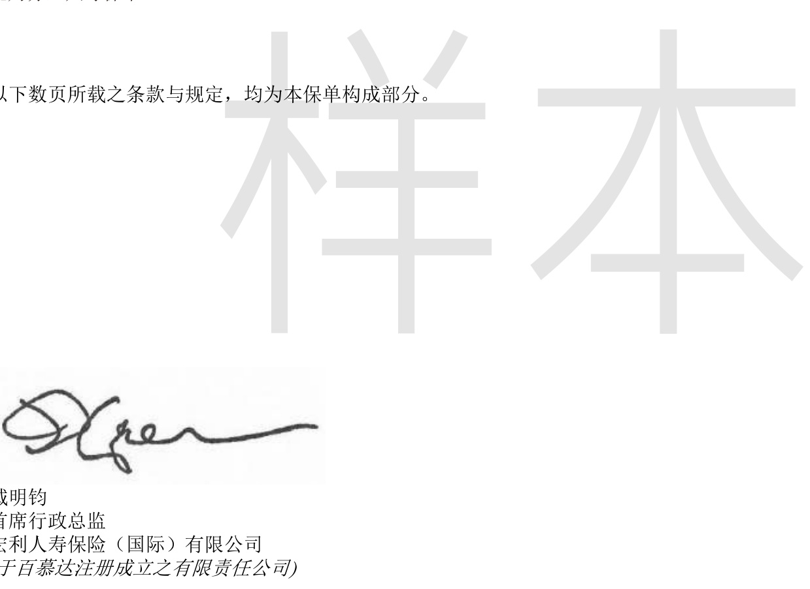
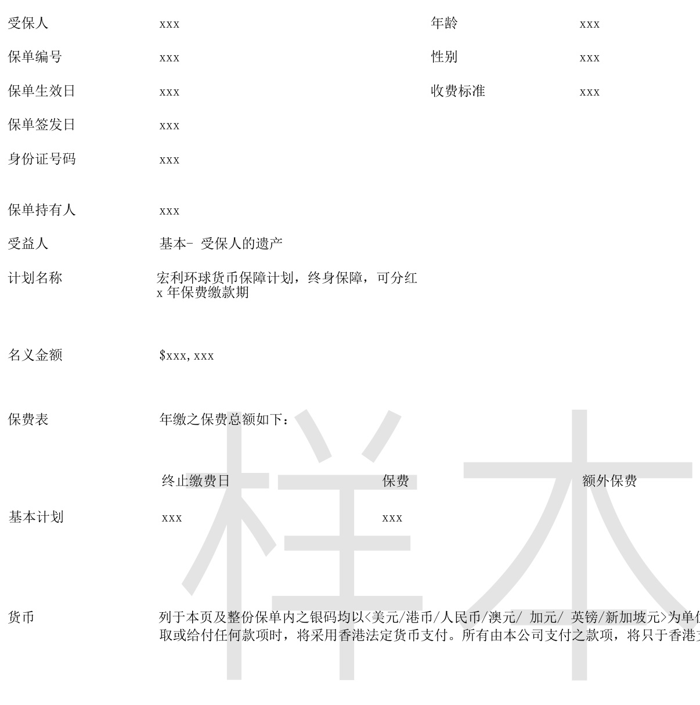
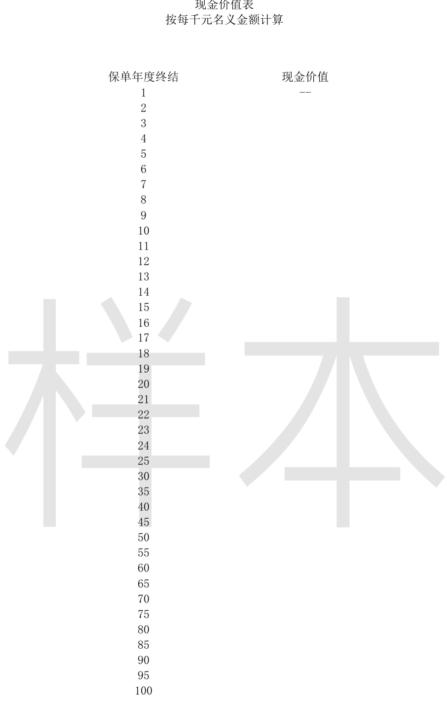
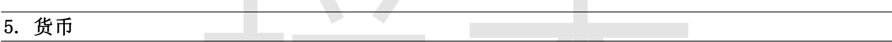
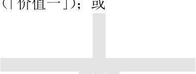
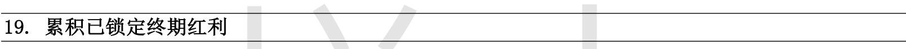

## 第 0 页

受保人：保单编号 ：保单生效日：

宏利环球货币保障计划

此乃分红人寿保单。

备注︰此简体中文本只供参考用途，并非保单之一部分，亦不构成对任何条款之诠译或赋予任何条款之涵义。

第1页1-MGL-SC (05/2022)

## 第 1 页

目录

页数保单详情 .3现金价值表 . 3

一般条款

1. 定义. 4  
2. 合约 . .6  
3. 管辖法律. .6  
4. 保单年度及周年日 .6  
5. 货币. .6  
6. 缴付保费 . .6  
7. 受益人 .7  
8. 保单所有权 8  
9. 保单转让. .. 8  
10. 身故赔偿 . .8  
11. 意外身故赔偿 ..8  
12. 年龄及性别 ... 9  
13. 自杀. .9  
14. 不可异议条文 .9  
15. 身故赔偿或退保金额. .9  
16. 收款方式选择 .9  
17. 终期红利 . .10  
18. 终期红利锁定权益 10  
19. 累积已锁定终期红利 10  
20. 现金价值 .11  
21. 货币转换权益 .12  
22. 保单复效 . .13  
23. 保单贷款 . .13  
24. 自动贷款代缴保费. ..13  
25. 贷款规定 . ..13  
26. 终止保单 .14  
27. 索偿通知及证明 .14  
28. 意外身故赔偿不受保项目 ..15  
29. 第三者权利 .15

更改受保人条款  
保费假期条款  
批注（如适用）  
附加保障条款（如适用）  
保单投保申请书副本

备注︰此简体中文本只供参考用途，并非保单之一部分，亦不构成对任何条款之诠译或赋予任何条款之涵义。

## 第 2 页

备注︰此简体中文本只供参考用途，并非保单之一部分，亦不构成对任何条款之诠译或赋予任何条款之涵义。

## 第 3 页

备注︰此简体中文本只供参考用途，并非保单之一部分，亦不构成对任何条款之诠译或赋予任何条款之涵义。

## 第 4 页

一般条款

1. 定义

以下为阁下保单中具有特定含义的若干用词，供阁下阅读保单时作参考。其他用词可能在阁下保单内文另作定义。

「意外身故」指受保人在本保单生效期间直接因无法预见和意料之外的事件且并无涉及所有其他因素而导致的身体受伤发生后的一百八十天内身故。

「意外身故赔偿」的涵义在「意外身故赔偿」条款一章中界定。

「累积已锁定终期红利」的涵义在「累积已锁定终期红利」条款一章中界定。

「年龄」指最接近一个生日所达的岁数。出现在本保单的特定年龄，是指在保单周年日当天，受保人在最接近一个生日所达的岁数。

「终期红利锁定总百分比」的涵义在「终期红利锁定权益」条款一章中界定。

「公司」为宏利人寿保险（国际）有限公司。

「货币」的涵义在「货币」条款一章中界定。

「货币转换周年日」指第3 个保单周年日或其后每个保单周年日。

「身故赔偿」的涵义在「身故赔偿」条款一章中界定。

「欠款」指任何有关本保单的欠款，当中包括而并不限于任何欠缴到期保费、任何未偿还的保单贷款和其累积应缴利息。

「名义金额」（在本保单签发时的金额）已显示在本保单第3 页。该金额仅可通过保单持有人与本公司其后所作的协议方可更改。

「计划」在以下是指在本保单第3 页或最新批注（如有）内的「计划」及在「保费表」内所示的「基本计划」，而并不包括任何附加于本保单的附加保障条款。

「保单持有人」指为本保单的合约之另一方并在本保单第3 页或最新批注（如有）内列明。

「保单生效日」指在本保单第3页或最新批注（如有）内列明的保单生效日。

「保费缴付期」指须就计划支付保费的保单年度。

「当时货币汇率」指本公司在独有和绝对酌情权下，参考市场当时汇率而厘定并不时修订的当时货币汇率。

备注︰此简体中文本只供参考用途，并非保单之一部分，亦不构成对任何条款之诠译或赋予任何条款之涵义。

## 第 5 页

一般条款

1.定义（续）

「终期红利锁定周年日」指第 15 个保单周年日或其后每个保单周年日。

「终期红利锁定权益」指在「终期红利锁定权益」条款一章中描述和定义的终期红利锁定权益。

「终期红利锁定百分比」指在行使终期红利锁定权益时，被转移为累积已锁定终期红利的终期红利的百分比 $\left(\%\right)$ 。为免存疑，如果任何指定终期红利锁定周年日并未有行使终期红利锁定权益，相关保单年度的终期红利锁定百分比将被视为 $0\%$ 。

「表格所示现金价值」指根据本保单第3 页或最新批注（如有）内的「现金价值表」计算的现金价值部分。

「终期红利」指在「终期红利」条款一章中描述和定义的终期红利。

## 第 6 页

一般条款

2. 合约

本保单、投保申请书、健康证明文件和任何作为受保资格证明的书面说明和答复，均为合约构成部分。

仅本公司的首席行政总监方可代表本公司仅以书面形式更改、修订或删除本保单内任何条款。

除上述人士以外，由任何代理人或人士作出的或向任何代理人或人士作出的任何承诺或声明均对本公司不具约束力。

3. 管辖法律

本保单如果1) 在香港特别行政区签发，则需按香港特别行政区法律加以管辖和阐释;如果2) 在澳门特别行政区签发，则需按澳门特别行政区法律加以管辖和阐释。

4. 保单年度及周年日

保单的年份、月份和周年日将根据本保单第3 页或最新批注（如有）所示的保单生效日（即首个保单年度和首个保单月份的首日）厘定。首个保单周年日即第二个保单周年的首日。

详情见本保单第3 页或最新批注（如有）内「货币」一项。

6. 缴付保费

保费支付人须在受保人在世期间根据「保费表」（见本保单第3 页或最新批注（如有） 内所列资料缴交保费。如有需要，任何列于「保费表」上，假设受保人将达到某特定年龄的日期将会作出修订，以便保费表上日期与受保人的真实年龄相符。

缴交第一期／第一次保费后，随后所有保费到期日，定于保单持有人所选择的缴付形式的缴费周期第一天。如果未能在每个到期日或之前通过本公司当时采纳的缴费方法缴交保费，即作欠缴保费论。所有在保费到期日或之前或在宽限期内缴付的到期及应缴保费（不论全部或部分）将不予退还。

如果保费在到期日仍未缴清，将有三十一天宽限期，期间本保单仍然有效。如果保费在宽限期后仍未缴交，也未采用本公司的「自动贷款代缴保费」条款下的方式向本公司借贷缴付，本保单将告失效。

不论有何其他条款，拖欠的保费将从任何本保单的支付的利益中扣除。

备注︰此简体中文本只供参考用途，并非保单之一部分，亦不构成对任何条款之诠译或赋予任何条款之涵义。

## 第 7 页

一般条款

7. 受益人

指派受益人

保单持有人指派受益人时，须以本公司指定格式（以本公司提供的申请表或其他表格）向本公司提供受益人的姓名和其他有助识别身份的资料。保单持有人必须签署受益人指定书并交回本公司。

除本保单或本保单生效的受益人指定书另有规定外，下列条款一律适用：

受益人类别

本保单的身故赔偿受益人将根据保单持有人的指派，分为基本受益人、次位受益人或最终受益人。受益人应得的身故赔偿将取决于以上分类。在受保人身故时仍然在世并属于同一类别的受益人将平分该类别受益人应得的身故赔偿款项。如果同一类别受益人有不同的分配百分比或比例，则上述类别受益人中该等在世受益人将根据该比例享有该类别受益人应得的身故赔偿，但倘若在派发身故赔偿时一名或以上受益人已早于其他同一类别受益人身故，则在世受益人会按比例（按照各名该等在世受益人应得的百分比或比例）分享有关赔偿。如果在受保人身故时，同一类别受益人中仅有一名受益人在世，则该名受益人将独自享有该类别受益人应得的身故赔偿。

付款予受益人

本保单的身故赔偿将给予：

(1) 任何在受保人身故时在世的基本受益人；或(2) 如果受保人身故时，并无基本受益人在世，身故赔偿将给予当时仍在世的次位受益人；或(3) 如果受保人身故时，基本与次位受益人均不在世，身故赔偿将给予当时仍在世的最终受益人。

受益人身故或未有指派受益人

如果受保人身故时并无在世保单受益人，或保单持有人未有根据本条款指派受益人，本保单应付的所有有关赔偿将支付予保单持有人。如果保单持有人已身故，则支付予保单持有人的遗产。

更换受益人、委托及更换信托人

保单持有人可在受保人在世期间，无须获得任何受益人或信托人的同意，随时以书面声明作出下列安排：

(1) 更改任何已指派或委任的受益人。

(2) 委任信托人代任何受益人接收赔偿;更换已指派或委托的信托人或撤销该项指派。

本公司对任何指派或声明是否有效，概不负责。

妥收赔款

当在本保单或根据本条款指定的任何受益人或信托人或法定合资格人士在身故赔偿收据上签署后，本公司的赔偿责任将圆满结束。该收据为有关身故赔偿已由法定的合资格人士妥为接收及该等人士对本公司的一切索偿和要求已获得圆满解决的最终及不可推翻凭证。

备注︰此简体中文本只供参考用途，并非保单之一部分，亦不构成对任何条款之诠译或赋予任何条款之涵义。

## 第 8 页

一般条款

8. 保单所有权

受保人在世期间，保单持有人随时有权为其自身利益行使保单所赋予的一切权益和特权而无须得到任何受益人或信托人的同意。

办理任何本保单的转让，须采用本公司所提供的转让表格或本公司行使独有和绝对酌情权下接受的其他表格，并将表格送交本公司的总办事处存档。本公司不会对任何转让的有效性负上任何责任。

当受保人身故及本公司收到符合「索偿通知及证明」条款规定的认可身故证明，并且经本公司批核后，本公司将给予身故赔偿。任何欠款将根据本保单条款从支付金额内扣除。

受限于本保单的条款规定，本公司将给付本保单下的身故赔偿而该赔偿款项将包括以下两者的较高者：

(a) 本计划的表格所示现金价值和终期红利（如有）的总和（「价值一」）；或

(b) 本计划所有到期及已缴保费的总和（「价值二」）；

及根据保单条款因身故而应预支付的任何其他赔偿。

如果名义金额在任何情况下调整，每笔到期及已缴保费将根据在应支付身故赔偿当时的名义金额而计算。

11. 意外身故赔偿

当受保人在首五个保单年度内意外身故及本公司收到受保人身故的认可证明，并且经本公司批核后，本公司将根据「受益人」条款、「意外身故赔偿不受保项目」条款及「索偿通知及证明」条款向受益人支付意外身故赔偿。

意外身故赔偿相当于下列的较低者：

(1) 价值二；或

(2) 125,000 美元/ 1,000,000 港币/ 750,000 人民币/ 125,000 加元/ 125,000 澳元/ 62,500 英镑/ 125,000 新加坡元（根据适用的货币）并扣除由受保人在本公司其他保单获得的相同或相似保障的赔偿总额。

如果名义金额在任何情况下调整，每笔到期及已缴保费将根据在应支付意外身故赔偿当时的名义金额而计算。

备注︰此简体中文本只供参考用途，并非保单之一部分，亦不构成对任何条款之诠译或赋予任何条款之涵义。

## 第 9 页

一般条款

12. 年龄及性别

如果受保人的年龄或性别被错误填报在投保申请书，而未曾被更改，本公司将按照其正确年龄和性别，根据已缴交的保费金额，重新厘定赔款和一切本保单应得的利益。有关受保人的年龄，须有认可的证明，本公司方会接纳。

当受保人的正确年龄和性别未能符合本公司的受保资格，本公司保留作废本保单的权利，如同本保单从未签发。

当本公司处理本保单的任何保障索偿或支付时，本公司有权要求令本公司满意的受保人年龄证明。

13. 自杀

从本保单签发日起计一年内，如果受保人自杀身亡，不论事发时精神是否健全，本公司在本保单下的责任仅限于把已缴交的保费，在扣除本公司对本保单支付的任何款项后退还。

从本保单的任何复效日起计一年内，如果受保人自杀身亡，不论事发时精神是否健全，本公司在本保单下的责任仅限于保单复效前的责任，如同保单从未复效，以及退还在保单复效后向本公司缴交的保费（不包括向本公司清偿的欠缴保费）扣除本公司对本保单支付的任何款项后的余额。

14. 不可异议条文

在受保人在世期间，从本保单签发日或复效日（以较晚者为准）起计两年后，如果发现保单持有人或受保人有任何漏报或错误申报其所知悉（而未被其他人士披露）的对保险为重要的资料，除非是蓄意诈骗，否则本保单不会因此作废。有关漏报或错误申报的资料可以包括投保申请书、健康证明文件或作为受保资格证明的任何书面说明或答复。本条款不适用于虚报年龄和性别或任何附加保障。

## 第 10 页

一般条款

17. 终期红利

终期红利将作为一次性红利在保单退保或受保人身故时给付，但在受保人身故的情况下当价值一低于价值二，终期红利将不获给付。终期红利为非保证。终期红利的金额由本公司不定期加以修订和全权决定。本公司可能会随时更改或撤销终期红利。

18. 终期红利锁定权益

从终期红利锁定周年日起计 31 日内及受保人在世期间，保单持有人可选择将终期红利的最多 $50\%$ 转移为已锁定终期红利并作为累积已锁定终期红利的一部分。但本保单内的终期红利锁定总百分比（「终期红利锁定总百分比」）不可超过 $50\%$ 。终期红利的锁定将从终期红利锁定申请日期起计的六个月内生效。

保单持有人必须按本公司指定的书面格式递交申请行使终期红利锁定权益。保单持有人一旦递交申请行使此权益，该申请将不可撤回。在本保单内已转移的终期红利将不可重新转为终期红利。

当行使终期红利锁定权益后，已锁定的终期红利金额将会从当时的终期红利中扣除。

任何根据「终期红利锁定权益」条款而锁定的终期红利将由本公司在保单内积存生息直至保单持有人要求支取。有关利率为非保证并由本公司厘定并不时修订。本保单下的累积已锁定终期红利为所有累积已锁定终期红利加上利息和扣减保单持有人的已提取金额的余额。

累积已锁定终期红利将在受保人身故时作为身故赔偿的一部分给付、保单退保时作为现金价值的一部分或保单终止时给付。

## 第 11 页

一般条款

20. 现金价值

只要本保单拥有现金价值，保单持有人有权在受保人在世期间随时退保以取回现金价值。退保申请须采用本公司指定的书面格式提交。现金价值款项将从退保申请日期起计的六个月内支付。本保单以及附加保障（如有）将在退保时终止。为免存疑，无论本保单是否有现金价值，本保单在受保人身故或之后不可退保。

如果无欠缴保费，本保单的现金价值为表格所示现金价值加上任何累积已锁定终期红利及当时公司决定的任何终期红利。  
现金价值支付款项相当于现金价值减去任何欠款。

如果有欠缴到期保费，本保单内的现金价值将相当于欠缴到期保费前的保费到期日的金额，并扣减任何之后提取累积已锁定终期红利金额。在本保单第3 页或最新批注（如有）内「现金价值表」所示数值建基于下列假设：(a) 本保单仍然生效，而期内至所列保单年度终结的所有到期保费已经缴清；及(b)终期红利，累积已锁定终期红利和欠款并非表格所示现金价值的一部分。本公司将会在保单持有人提出要求时，提供任何未列于本保单第3 页或最新批注（如有）内「现金价值表」的保单年度终结的数值。

在某保单年度内任何时间的表格所示现金价值，将由本公司全权酌情决定，并根据该保单年度内已过的时间和已缴交到期保费的日期计算。

## 第 12 页

一般条款

21. 货币转换权益

在本保单生效并从货币转换周年日起计31日内及受保人在世期间，保单持有人可在保单无须退保的情况下按本公司规定的指定格式递交申请，通过转换本保单的计划至在本公司独有和绝对酌情权下提供的指定计划（「新计划」），将本保单的货币转换至以下「可供选择的新货币」部分内列明的其他货币（「新货币」）。保单持有人无须再提供受保资格证明。

为免存疑，新计划可能与本保单的计划相同或不同，也可能具有与计划不同的利益、计划特色和保单条款。

将本保单的货币转换至新货币（「货币转换」）的申请需符合下列全部条件并受限于本公司在独有和绝对酌情权下厘定的当时的规条以及对该申请的批核：

(1) 保单持有人必须在货币转换周年日起计31日内递交货币转换申请；  
(2) 在同一个保单年度内未曾递交过货币转换申请；  
(3) 行使货币转换权益的申请一旦递交将不可撤回或更改；  
(4) 保单的名义金额在货币转换后必须不少于本公司在保单持有人递交该申请时厘定的最低金额；及(5) 保单持有人必须在本公司批准货币转换申请前偿还全部欠款。

可供选择的新货币

受限于适用法律和法规，保单持有人可选择转换本保单的货币至以下任何一种货币作为新货币：美元、港币、人民币、澳元、加元、英镑、新加坡元或本公司在保单持有人申请货币转换时提供选择的任何其他货币，但前提是：

(a) 在递交申请时，新货币不可与本保单的货币相同；及(b) 在货币转换时，新货币没有被其发行国家或地区停止通用。

货币转换的影响

当本公司批核货币转换申请后，货币转换和任何保单的相关更改将从有关批注所示的生效日起开始。货币转换的影响如下：

(1) 本保单的基本计划将转换至提供新货币的新计划。全部利益、计划特色和保单条款将会跟随新计划。保单生效日在货币转换后将维持不变；  
(2) 在货币转换的生效日当天，本保单的现金价值（涵义在「现金价值」条款一章中界定）将按当时货币汇率以四舍五入方式转换至新货币；  
(3) 在货币转换后，本保单的名义金额、到期及应付保费（如有）、表格所示现金价值及任何终期红利将由本公司独有和全权酌情厘定并调整；  
(4) 在货币转换后，任何累积已锁定终期红利将根据新计划的有关利率继续积存生息。有关利率为非保证并由本公司厘定并不时修订，或与货币转换前的有关利率不同；及  
(5) 任何附加于本保单的附加保障将继续生效而该附加保障的货币将转换至新货币，但该附加保障须为新计划并在新货币下仍可提供。为免存疑，如果新计划并未提供该附加保障或在新货币下未能提供该附加保障，该附加保障将从有关批注所示的生效日自动终止。

## 第 13 页

一般条款

22. 保单复效

如果保单持有人并未退保，保单持有人可在以下情况发生后一年内提出复效申请。

(1) 因欠交保费而导致保单停止生效；或  
(2) 因保单内的欠款相当于或超过保单的表格所示现金价值和任何累积已锁定终期红利的总和而导致本公司终止对保单的一切责任。

本公司将在妥收以下各项后将保单复效：

(a) 本公司认可的受保资格证明；及  
(b) 所有逾期未缴交的保费连同利息（金额从每个到期日起以每年复利计算，年利率由本公司厘定并有权不时加以修订）；及  
(c) 偿还因欠交保费而导致保单停止生效或本公司终止对保单的一切责任（根据情况而定）所给付予保单持有人的终期红利（如有）连同利息（金额以每年复利计算，年利率由本公司厘定并有权不时加以修订）；及  
(d) 所有欠款连同利息（金额以每年复利计算，年利率由本公司厘定并有权不时加以修订）。

23. 保单贷款

当受保人在世期间及只要保单拥有贷款价值，本公司将会提供贷款，并以本保单为唯一的贷款抵押。贷款金额以保单的贷款价值扣除任何现有的欠款后的余额为限。在保费到期日或宽限期间的贷款价值将相当于保单的表格所示现金价值和任何累积已锁定终期红利的某个百分比，比率由本公司不时厘定。在其他时间，保单的贷款价值（包括利息）将相当于保单在下一个保费到期日（如果无须再缴付保费，则以下一个保单周年日为准）的表格所示现金价值和任何累积已锁定终期红利的总和的某个百分比，比率由本公司不时厘定。本公司可能会要求贷款人签署贷款协议。

## 第 14 页

一般条款

26. 终止保单

遇有以下情况（以较早者为准），本保单即告终止，此后本公司无须再为本保单承担责任或作出任何其他赔偿：

(1) 如果保费在宽限期届满后仍未缴交，且未采用本公司的「自动贷款代缴保费」条款下的方式处理向本公司借贷缴付；  
(2) 受保人身故后本公司根据本保单条款给予身故赔偿和意外身故赔偿（如适用）；  
(3) 当欠款相当于或超过表格所示现金价值和任何累积已锁定终期红利的总和；  
(4) 保单退保，本公司已根据本保单条款给予表格所示现金价值加上任何累积已锁定终期红利及公司在退保时决定的任何终期红利；  
(5) 本公司批准保单持有人作出的终止保单书面申请当日。

本保单的终止并不会影响在其终止前已提出的索偿。

27. 索偿通知及证明

受保人身故后，本公司认可的身故证明和索偿通知必须在合理时间内送交本公司，并待本公司批核后，方可给予身故赔偿和／或意外身故赔偿（根据情况而定）。

## 第 15 页

一般条款

28. 意外身故赔偿不受保项目

倘若因身体受伤而身故乃是直接或间接由于下列任何一项而导致，本公司将不会作出意外身故赔偿：

(1) 不论受保人在受伤或自杀时（根据情况而定）的精神是否健全，受保人蓄意自我伤害或自杀；

(2) 不论自愿与否，受保人服食、管理、吸收或吸入任何药物、毒药、令人醺醉的酒类、气体或烟雾。但受保人因职务附带的危害物而遭遇该次意外则作别论；

(3) 任何战争、与战争有关的行动，或在任何战乱国家的武装部队或辅助民事部队中服役。「战争」指不论宣战与否的任何战事或任何国家、国际机构等武装部队参与的冲突。「任何战乱国家的武装部队」指陆军、海军及空军，更包括任何参战国际机构的武装部队；

(4) 受保人乘搭任何航空交通工具。但受保人以乘客身份乘搭民航客机者除外；

(5) 受保人从事或参与：

(a) 任何赛车或骑术比赛；或  
(b) 在水深超过130英尺进行的水底活动；或  
(c) 以专业资格参与运动或通过参与该运动以或可能赚取收入或报酬；或(d) 其他危险活动例如爬山、瓯穴探测、跳伞或绑绳跳；

(6) 任何因其犯罪或意图犯罪行为、或在拒捕或逃避逮捕过程中发生或因而导致的受伤；

(7) 分娩、怀孕、流产或堕胎，不论是否由意外促使或导致；或(8) 担任或从事以下任何类别工作或职业（不论临时或长期性质）的受保人在工作期间直接或间接因暴乱及民众骚动导致受伤：(a) 酒吧、酒廊、夜总会、桑拿浴室、按摩院、桌球室、游戏机中心、赌博场所（香港赛马会除外）、保龄球馆、的士高或卡拉OK职员；或(b) 纪律部队（如警务处、辅助警察队、消防处、入境事务处、海关、惩教署或军队里的纪律部队人员）、小贩管理队、交通督导员或保安；或(c) 在海外工作的记者、飞机机组人员、船员或导游。

29. 第三者权利

如果本保单在香港特别行政区签发，任何不是本保单某一方的人士或实体，不能根据《合约（第三者权利）条例》（香港法例第623 章）强制执行本保单的任何条款。

备注︰此简体中文本只供参考用途，并非保单之一部分，亦不构成对任何条款之诠译或赋予任何条款之涵义。

## 第 16 页

更改受保人条款

更改受保人条款附加于本保单内，为保单构成部分。

更改受保人

从第一个保单周年日起或保单签发一年后（以较晚者为准）及在受保人在世期间，保单持有人可提出更改现受保人（「现受保人」）至另一受保人（「新受保人」）的申请。

在行使此权益时，新受保人的年龄需符合以下条件：

(1) 60 岁或以下；或(2) 不大于现受保人的年龄和不大于75 岁。

在本公司妥收认可的受保资格证明及受限于在本公司独有和绝对酌情权下厘定并不时修订的当时的规条，并在本公司独有和绝对酌情权下批核后，新受保人的计划保障将从有关批注所示的更改生效日起开始，而现受保人的计划保障也将在同一时间终止。在「不可异议条文」条款中描述的年期将从更改生效日起重新计算。

附加于本保单上的所有附加保障（如有）将从有关批注所示的更改生效日起自动终止。

为免存疑，在更改受保人的生效日时的名义金额、表格所示现金价值、身故赔偿、意外身故赔偿、累积已锁定终期红利、终期红利和欠款将维持不变。

## 第 17 页

此页为空白页。

## 第 18 页

保费假期条款

保费假期条款（「本保费假期条款」）由本公司附加于本保单内，为本保单构成部分。

保单生效日两年后，保单持有人可申请实施保费假期并冻结保单。在保费假期内，保单持有人无须缴付保费。在每个保费假期终结时，表格所示现金价值将维持在相关保费假期生效时的水平。

在保费假期内，如果公司须支付任何赔偿，保费假期会立即终止。所有从保费假期开始后到期而未缴付的保费会视为保单欠款的一部分，如同保费假期未被执行，并将从赔偿金额内先行扣除。表格所示现金价值将如同保费假期未被执行而确定。

保费假期的申请必须遵照本公司规定的指定格式以书面提出。在保费假期生效前，保单持有人必须偿还所有欠款。首次申请免收费用。其后的申请则须缴费。保费假期总限期不得超过两年。

在保费假期内不得作出任何会导致保单价值改变的保单更改，包括但不限于行使货币转换权益、调减名义金额及保单贷款。

所有附加保障将从保费假期生效时终止。

保单持有人可申请终止保费假期并经本公司批准后恢复缴付保费。此申请必须遵照本公司规定的指定格式以书面提出。此举无须出示受保资格证明。保费假期将在保费假期已实施总共两年时自动终止。

保单生效日和保费表将延迟并遵照本公司在保费假期终结时所发出的批注重新订定。

## 第 19 页

此页为空白页。