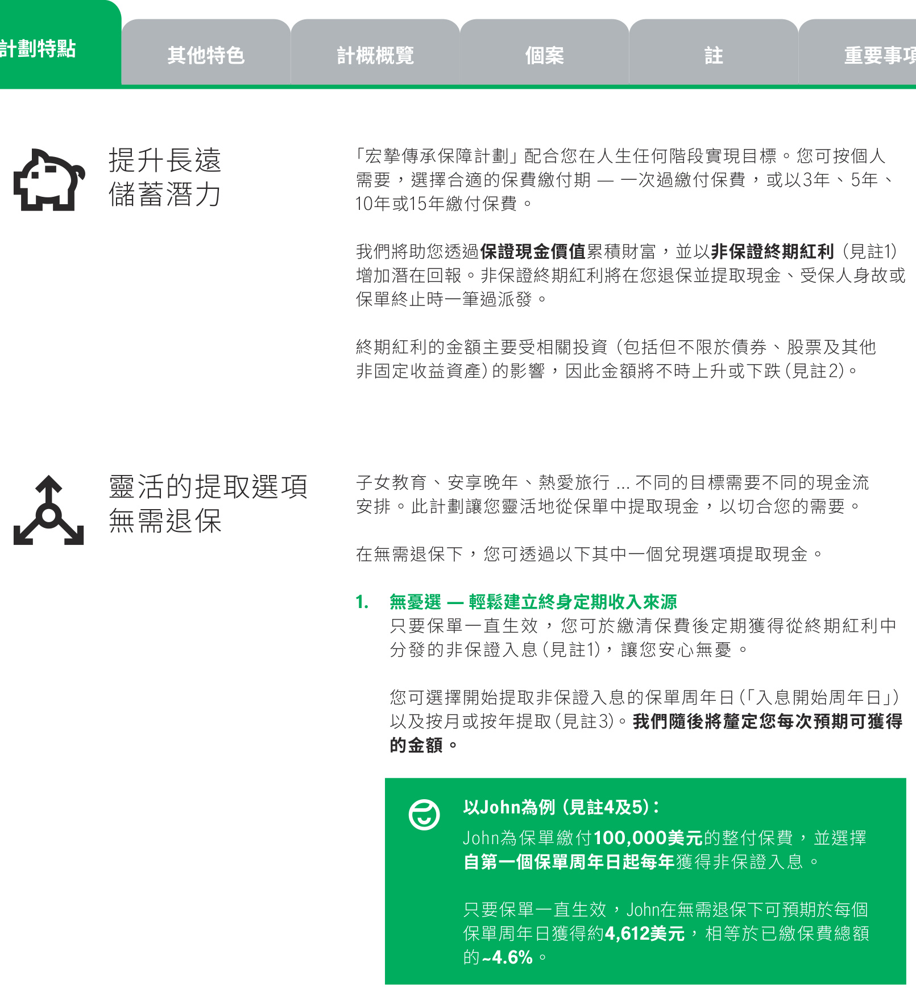
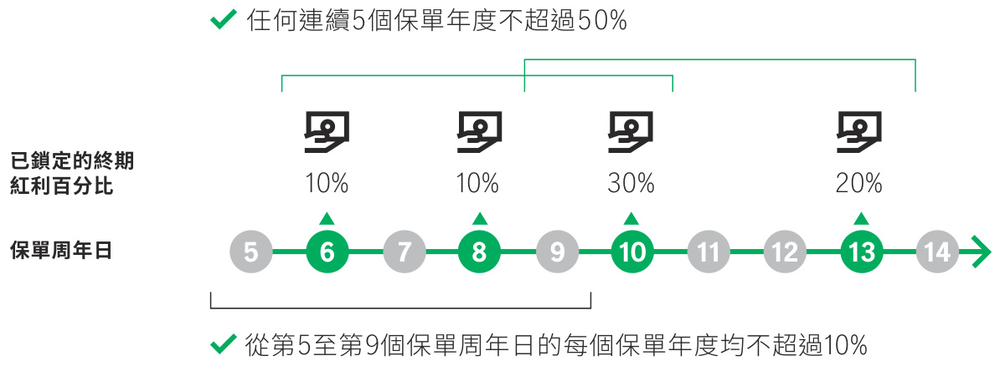
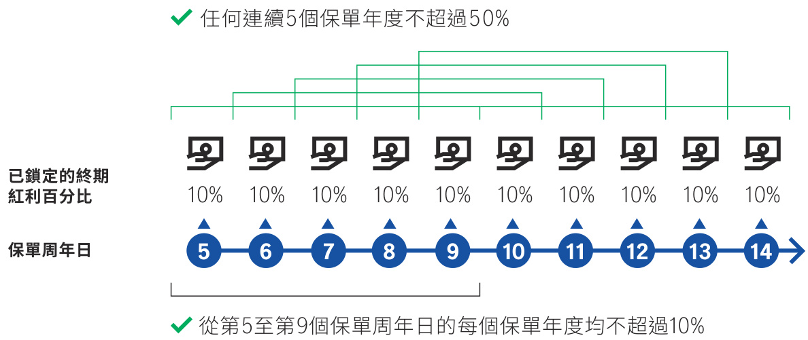
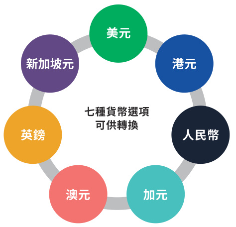
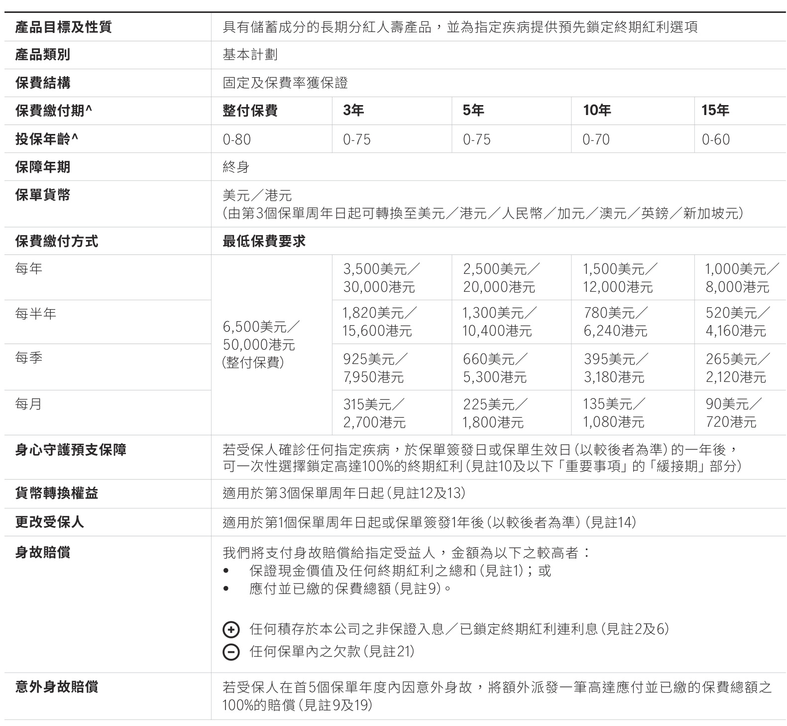
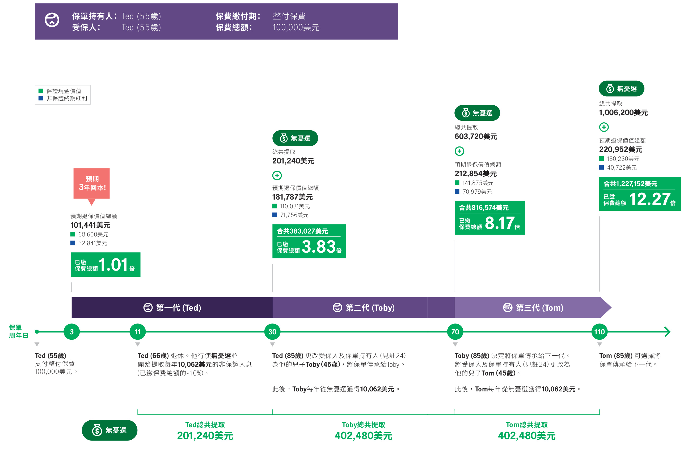
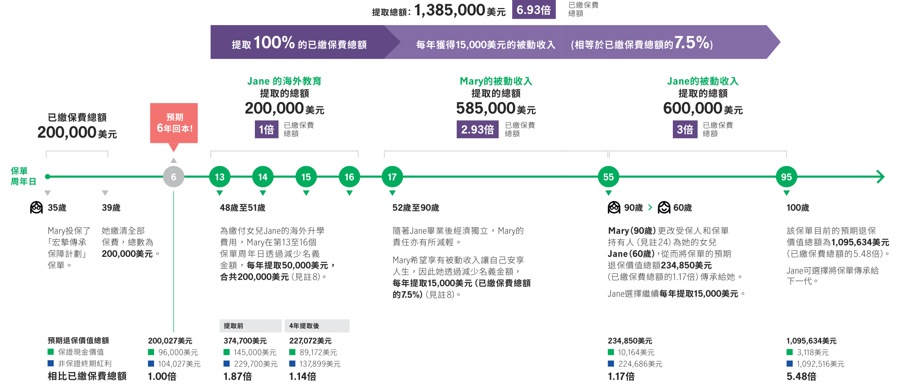

## 第 0 页

1 Manulife宏利

宏摯傳承保障計劃Genesis

## 第 1 页

宏摯傳承保障計劃

有選擇 ， 就自有出路 。 一段邁向豐盛財富的旅程 ，不單只源自增加財產的本領 ， 沿途更同步需要提高理財的能力 。 畢竟 ， 在瞬息萬變的世界中 ，於理財上擁有靈活性 ， 就是您成功的源泉 。

因此 ， 我們推出 「宏摯傳承保障計劃」 ， 不單提供長期潛在回報 ， 更配備靈活的提取選項以滿足您的資金需要 。 計劃亦為指定危疾及精神疾病提供預支保障 ， 及備有貨幣轉換權益以迎合您未來發展 。 同時 ， 我們可助您靈活策劃將財富世代相傳 。

選擇 「宏摯傳承保障計劃」， 開啟豐盛的未來 。

宏摯傳承保障計劃乃宏利提供及承保的一份具有儲蓄成分的長期分紅人壽產品 ， 並為指定疾病提供預先鎖定終期紅利選項 。 本產品單張只提供本產品之一般資料 ， 並不構成保單的一部分 ， 及並未載有保單的所有條款 。 投保前 ，您應參閱保單條款以了解本產品之確實條款及細則 。 我們可按閣下要求提供該複本 。

計劃特點

提升長遠儲蓄潛力

靈活的提取選項 無需退保

身心守護預支保障獲取備用資金

七種貨幣供轉換將來可抓緊環球機遇

安枕無憂服務助您未雨綢繆

8 財富靈活世代承傳

## 第 2 页

## 第 3 页

<html><body><table><tr><td rowspan="2">計劃特點</td><td colspan="4"></td></tr><tr><td>其他特色</td><td>計概概</td><td>個案</td><td>重要事项</td></tr><tr><td rowspan="3"></td><td rowspan="3">提升長遠 蓄滘力</td><td colspan="2">「宏挚傳承保障計劃」配合您在人生任何段實現目標。您可按個人 需要，選合適的保費付期－一次過付保費’或以3年丶5年</td></tr><tr><td>10年或15年付保費° 增加潘在回報。非保證終期紅利將在您退保提取現金丶受保人身故或</td><td>我們將助您透過保證現金价值累財富，以非保證終期紅利(見1)</td></tr><tr><td colspan="2">保單終止時一筆過派發。 終期紅利的金额主要受相關投資（包括但不限於券丶股票及其他 非固定收益資產)的影響，因此金额將不時上升或下跌(見2）。</td></tr><tr><td colspan="2"></td><td colspan="2">子女教育丶安享晚年丶熱愛旅行..不同的目標需要不同的現金流 安排。此計劃您靈活地保單中提取現金’以切合您的需要· 在無需退保下，您可透過以下其中一個允現選頂提取現金°</td></tr></table></body></html>

您亦可將非保證入息積存在本公司賺取利息（見註6）， 直至您日後提取 。

開始提取非保證入息後 ， 您仍可靈活地暫停及重新開始獲得入息 ，並將入息支付方式從每年更改為每月 ， 反之亦然 。 您的非保證入息將相應地重新計算 。（見註3）

## 第 4 页

2. 終期紅利鎖定權益 — 按您需要自訂提取

此選項可讓您決定提取時間及提取金額 ， 助您更容易掌控如何實現理財目標 。

您可於第5個保單周年日或其後的每個保單周年日（「終期紅利鎖定周年日」）選擇鎖定終期紅利以提取現金（見註1）， 而提取時間及金額可由您決定（見註2及7）， 惟 ：

• 從第5至第9個保單周年日（見註7）的每個保單年度 ， 終期紅利鎖定總百分比不得超過 $10\%$ ； 及• 任何連續5個保單年度的終期紅利鎖定總百分比不超過 $50\%$ 。

此外 ， 您亦可利用此選項鎖定終期紅利的潛在回報 。 已鎖定的終期紅利可積存在本公司賺取利息（見註2）， 直至您日後提取 。

您可於第一個保單周年日後由無憂選更改至終期紅利鎖定權益 ， 反之亦然 。 若兌現選項已經開始 ， 您將不能更改至另一選項 。 （見註3）

此外 ， 您亦可選擇部分退保作提取 ， 即透過減少名義金額以提取部份保證現金價值及非保證終期紅利 ， 惟隨後的保單價值及利益將因而減少（見註8及9）。

如作任何提取 ， 保單內隨後之利益將會減少 。

## 第 5 页

身心守護  
預支保障  
獲取備用資金危疾或精神健康問題不單影響身體及情緒 ， 亦對財務狀況構成壓力 。  
我們明白當您可於最需要的時候及時獲得財務支援 ， 是非常重要 。

因此 ， 我們提供額外的一次性選項 ， 讓您可在受保人確診以下任何指定疾病時鎖定最高 $100\%$ 的終期紅利 。 已鎖定的終期紅利可積存在本公司賺取利息（見註2）， 直至您日後提取 ， 讓您在康復之路上獲得備用資金 。 （ 見註10及以下 「重要事項」 的 「緩接期」 部分）

身心守護預支保障涵蓋的指定疾病

国

危疾

精神疾病

植物人  
癌症  
昏迷  
突發性心臟病 （ 心肌梗塞）  
中風  
嚴重頭部創傷  
癱瘓  
末期疾病  
完全及永久傷殘  
自閉症  
躁狂抑鬱症  
精神上無行為能力  
精神分裂症  
嚴重認知障礙

+ 「完全及永久傷殘」 的涵蓋範圍將於受保人達16歲起開始生效 。

行使此權益後 ， 您仍有機會在將來再次獲取終期紅利（見註1）。 您仍然可以透過 「靈活的提取選項 無需退保」 部分所述的安排進行提取 。

## 第 6 页

七種貨幣供轉換將來可抓緊環球機遇

日後 ， 您可能有需要將財富重新集中到另一種貨幣上 ， 以應對不斷變化的需要或把握新的市場機會 。

此計劃提供貨幣轉換權益 ， 讓您可靈活地將保單貨幣轉換至下列任何一種貨幣（「貨幣轉換」）， 助您把握新機遇 。

美元  
港元  
人民幣  
加元  
澳元  
英鎊  
新加坡元

由第3個保單周年日起 ， 您可於每個保單年度在無須另外進行驗身的情況下 ， 透過將您的計劃轉換至可提供您所選擇之貨幣（「新貨幣」）的指定宏利計劃（可能與 「宏摯傳承保障計劃」 相同或不同）， 以轉換保單貨幣一次（見註12）。 您的保單生效日期於貨幣轉換後將維持不變 。

於貨幣轉換生效日 ， 現有保單貨幣下之退保價值將按照當時貨幣匯率換算 ， 而保證現金價值 、 非保證終期紅利及非保證入息金額（如有）可能會改變 。 名義金額 、 到期及應付保費（如有）、 預期保單價值將由我們釐定及調整 ， 並可能高於或低於貨幣轉換前的相應價值（見註13）。

可讓您安心的是 ， 於貨幣轉換生效日 ， 貨幣轉換後之退保價值總額（  以新貨幣計算）及貨幣轉換前之退保價值總額（以原有保單貨幣計算）為價值相等（見註13）。

## 第 7 页

## 第 8 页

安枕無憂服務@ 助您未雨綢繆

未來始終難以預測 。 因此 ， 我們必須未雨綢繆 ， 確保做好周全準備 。 有效的應變計劃不僅令我們可保障摯愛家人的財務狀況 ， 亦能讓自己安心 。

透過安枕無憂服務 ， 您可指定一位家人（「指定人士」） 代您執行下列其中一個您預設的保單管理指示 。 如您於保單生效期間在精神和／或身體上喪失行為能力 ， 該指示將生效（見註11）， 確保您的摯愛家人在困難時期獲得周到的預先安排 。

選項1 – 轉移保單擁有權

將保單擁有權轉移給指定人士

選項2 – 從保單中作一次性提取

提取保單價值的指定百分比（由您指定） ， 並支付該款項給指定人士

@ 此為行政安排 ， 並不屬於產品特點 。 有關申請須符合本公司當時適用的行政規則 ， 本公司有權不時釐定及更改相關行政規則而無需預先通知 。 請注意 ， 行使貨幣轉換權益後 ， 指定的新計劃可能不提供該服務 。

## 第 9 页

8 財富靈活世代承傳

您的財富源自努力奮鬥 。 因此 ， 您自然希望確保您的財富能夠延續一生甚至世代承傳 。 此計劃讓您可選擇更改受保人為您的另一位摯愛家人 。 例如 ， 您可為自己投保計劃 ， 其後將受保人轉為子女 ， 藉此將財富傳承給後代（見註14）。

同時 ， 我們更提供各種靈活的增值服務 ， 確保您的財富代代承傳 。

後備受保人@

您可選擇提名另一位後備受保人 ， 若現任受保人突然身故 ， 後備受保人可成為新受保人 。 因此 ， 保單將繼續生效 ， 而所有利益將得以保留（見註15）。

身故賠償支付選項@

除以計劃預設之方式一筆過支付身故賠償給受益人 ， 您亦可選擇其他身故賠償支付方式（見註16）， 以您的意願守護您摯愛未來的理財所需 。 例如 ， 您可選擇以分期方式 ， 或結合一筆過支付及分期支付方式按您指定的開始日期及支付形式支付身故賠償 。 您亦可設定按固定或每年按遞增百分比支付身故賠償 。

保單承繼人@ (見註17)

為增加財富傳承的靈活性 ， 除安排支付身故賠償給受益人的方式 ，您可提名一位摯愛家人為保單承繼人 。 若您離世 ， 保單將會轉移至保單承繼人 。

保單暫托選項@\* 更可讓您安排在指定日期或保單承繼人達到指定歲數才進行保單轉移 。 例如 ， 若您打算提名現時未滿18歲的保單承繼人 ， 您可以首先預先指定一名保單暫托人 。 於您離世後 ， 保單暫托人將按您預設的保單管理權限負責管理保單 ， 直至指定日期或保單承繼人的指定年齡（必須為18歲或以上）。 屆時 ， 保單暫托人的管理權限將終止 ， 而保單的擁有權亦將轉移 。 因此 ， 您可以安心確保您保單的價值 、 保障及財富增長潛力將傳承予您所選擇的承繼人 。

保單分拆@

由第5個保單周年日或保費繳付期結束起（以較遲者為準）， 您可以選擇分拆您的保單 ， 以便更有效地規劃財富傳承 。 分拆出之保單的保單生效日期將與您的原保單相同（見註18）。

@ 此為行政安排 ， 並不屬於產品特點 。 有關申請須符合本公司當時適用的行政規則 ，本公司有權不時釐定及更改相關行政規則而無需預先通知 。 請注意 ， 行使貨幣轉換權益後 ， 指定的新計劃可能不提供該服務 。

\* 僅適用於在香港簽發的保單 。

## 第 10 页

## 第 11 页

其他特色

人壽保障 安心無憂

如受保人不幸身故 ， 我們將支付一筆過身故賠償 ， 金額相等於任何積存於本公司之非保證入息／已鎖定的終期紅利連利息 ， 並加上以下之較高者 ：

保證現金價值加非保證終期紅利（見註1）； 或• 應付並已繳的保費總額（見註9）。

附加保障 加倍安心

如選擇港元或美元為保單貨幣並以3年 、 5年 、 10年或15年繳付保費，您可增添其他附加保障 ， 例如額外的人壽 、 住院 、 危疾或意外保障 ， 以獲得更全面保障 。

S

意外身故額外保障

如受保人於首5個保單年度內因意外身故 ， 我們將支付額外的意外身故賠償 ， 高達應付並已繳保費總額的 $100\%$ （見註9及19）， 助您的家人應付及減輕突如其來的財務負擔 。

簡易投保

申請程序簡單 。 若名義金額不超過我們當時的行政程序所指定的限額 ， 受保人無須進行任何驗身以證明其健康狀況 。

保費假期

如選擇以5年 、 10年或15年繳付保費 ， 在踏入第2個保單周年日後 ， 您可隨時選擇實施最多2年的保費假期（ 見註20）， 期間所有保費供款及保證現金價值將被暫時凍結 。 任何在保費假期前選擇無憂選的入息開始周年日、入息支付選項及入息支付方式將被撤銷 。 當保費假期結束 ， 如果您沒有行使終期紅利鎖定權益 ， 可以再次設定無憂選 。

## 第 12 页

計劃概覽

<html><body><table><tr><td colspan="6">產品目標及性質 具有蓄成分的長期分紅人產品，為指定疾病提供先定終期紅利</td></tr><tr><td>產品類别 保費結構</td><td colspan="5">基本計劃 固定及保費率獲保證</td></tr><tr><td>保費付期^</td><td>整付保费</td><td>3年</td><td>5年</td><td>10年</td><td>15年</td></tr><tr><td>投保年龄^</td><td>0-80</td><td>0-75</td><td>0-75</td><td>0-70</td><td>0-60</td></tr><tr><td>保障年期 保單貨</td><td colspan="5">終身</td></tr><tr><td></td><td colspan="5">美元／港元 (由第3個保單周年日起可轉換至美元／港元／人民／加元／澳元／英／新加坡元)</td></tr><tr><td>保費缴付方式 每年</td><td colspan="5">最低保費要求</td></tr><tr><td>每半年</td><td rowspan="4">6,500美元／ 50,000港元 (整付保费)</td><td>3,500美元 30,000港元</td><td>2,500美元／ 20,000港元</td><td>1,500美元／ 12,000港元</td><td>1,000美元/ 8,000港元</td></tr><tr><td>每季</td><td>1,820美元／ 15,600港元</td><td>1,300美元／ 10,400港元</td><td>780美元／ 6,240港元</td><td>520美元／ 4,160港元</td></tr><tr><td></td><td>925美元／ 7,950港元</td><td>660美元／ 5,300港元 225美元／</td><td>395美元／ 3,180港元 135美元／</td><td>265美元／ 2,120港元 90美元／</td></tr><tr><td>每月</td><td colspan="4">315美元／ 2,700港元 1,800港元</td></tr><tr><td>身心守護预支保障 貨轉換權益</td><td colspan="5">若受保人確任何指定疾病，於保單發日或保單生效日(以较后者為)的一年後， 可一次性選鎖定高達100%的終期紅利(見10及以下「重要事」的「接期」部分)</td></tr><tr><td>更改受保人 身故賠價</td><td colspan="5">適用放第3個保單周年日起（見12及13) 適用於第1個保單周年日起或保單發1年後(以较後者為）(見14)</td></tr><tr><td></td><td colspan="5">保證現金價值及任何終期紅利之總和（見1）；或 應付已的保費總（見9）。 ? 任何存於本公司之非保證入息／已定終期紅利連利息(見2及6) 任何保單内之欠款(見21)</td></tr><tr><td>意外身故賠價</td><td colspan="5">若受保人在首5個保單年度内因意外身故，將额外派發一筆高達應付已的保費總之 100%的賠價（見9及19)</td></tr></table></body></html>

*表格标题：宏摯傳承保障計劃*

*表格脚注：^ 您可能需於退休後定時繳付保費及在某些情況下需繳付保費超過80歲 。 因此 ， 您應預備足夠的資金以繳付未來的保費 。 備註 ： 年齡是指最接近一個生日所達之歲數 。*

## 第 13 页

個案1 長遠財富增長潛力 ， 幫助建立退休收入和財富傳承

55歲的Ted是一位成功的企業家 。 他和妻子育有一名兒子Toby 。 他正在尋找一份儲蓄保險計劃 ， 可以讓他能夠分散投資同時建立穩定的退休收入 。 由於他打算最終將自己的財富傳承給Toby ， 因此該計劃最好具有長遠的財富增長潛力 。 經過深思熟慮後 ， 他決定投保「宏摯傳承保障計劃」。（見註22及5）

## 第 14 页

個案2 全方位方案 ， 建立子女教育基金及未來被動收入

Mary今年35歲 ， 也是一位5歲女孩Jane的母親 。 除了為家庭的未來做好理財準備 ， 她亦希望在Jane長大後將她送到海外升學 。 亦計劃當Jane畢業後開始工作時 ， 可以開始提取被動收入讓自己生活更舒適 ， 並可在未來將保單傳承給 Jane 。 因此她決定投保 「宏摯傳承保障計劃」 。 （見註23及5）

保單持有人 ： Mary (35歲) 保費繳付期 ： 5年受保人 ： Mary (35歲) 每年保費 ： 40,000美元保費總額 ： 200,000美元

## 第 15 页

註

1. 終期紅利並非保證 。 我們將最少每月作出一次有關終期紅利的檢討及調整 ， 並且我們或會決定隨時作出更經常的檢討及調整 。 在受保人身故之情況下 ， 如保證現金價值與終期紅利之總和少於應付並已繳的保費之總和 ， 終期紅利將不獲發 。 請參閱以下 「重要事項」 的 「影響非保證終期紅利 、 非保證入息及非保證入息／已鎖定終期紅利之積存利率的主要風險」 。

2. 於支付保單退保 、 行使終期紅利鎖定權益或身心守護預支保障時 ， 特別是當市值出現大幅波動的時候 ， 或會出現延遲 。 實際可得到的終期紅利只會在您的申請被處理後而釐定 。 在特定情況下 ， 例如該申請並非在我們現行的截止時間前收到 ， 或並非按我們指定的書面格式提交 ，該金額可能會比您提交申請時暫時向您所示的終期紅利金額較低或較高 。 於行使終期紅利鎖定權益或身心守護預支保障前 ， 請向宏利查詢現行的運作規則以及您保單下最新的終期紅利金額 。 保留於本公司之已鎖定終期紅利的積存利率並非保證及我們可不時對之作出變動 。請參閱以下 「重要事項」 的 「影響非保證終期紅利 、 非保證入息及非保證入息／已鎖定終期紅利之積存利率的主要風險」 。

3. 您可於投保時或第一個保單周年日後 ， 按本公司指定的書面格式遞交申請設定無憂選 ， 選擇入息開始周年日 、 入息支付選項和入息支付方式 。 非保證入息由本公司不時調整及全權決定 。 行使此兌現選項將減少未來之終期紅利 。 在第一個保單周年日後 ， 則可更改入息開始周年日 、 入息支付選項和入息支付方式 。 更改將在下一個保單周年日生效 。

設定無憂選之入息開始周年日為第1個保單周年日之整付保費保單將不可更改入息開始周年日及由無憂選更改至終期紅利鎖定權益 。 您僅可在第一個保單周年日後申請暫停和重新開始獲得入息 ， 以及更改入息支付選項和入息支付方式 。

一旦遞交申請 ， 該設定或更改申請將不能撤回或變更 。 非保證入息將根據該新選擇而調整 。 有關無憂選的設定及更改的詳細內容及規則 ，請參閱保單條款 。

4. 此個案之數字乃假設John為非吸煙 ， 健康狀況良好 ， 現居於香港 。 此個案亦假設在整個保單年期內 (i) 沒有行使身心守護預支保障；(ii) 沒有提取保單貸款； (iii) 沒有行使貨幣轉換權益； (iv) 保單下之非保證入息於可派發時立即支付及 (v) 沒有透過減少名義金額提取現金（ 見註8及9）。

5. 此個案所述的終期紅利及／或非保證入息金額 (視情況而定) 僅按現時的紅利預測而估算 。 終期紅利及／或非保證入息 (視情況而定) 並非保證及只用作說明及例子之用 。 實際派發之終期紅利及／或非保證入息金額 (視情況而定) 可能低於或高於此個案之數字 。 在某些情況下 ， 非保證金額可能為零 。 此個案只供參考用途 。 所有於個案內所述之金額均以四捨五入方式調整至整數 。 有關您的建議書說明 ，請聯絡您的宏利保險顧問 。

6. 保留於本公司之非保證入息的積存利率並非保證及我們可不時對之作出變動 。 請參閱以下 「重要事項」 的 「影響非保證終期紅利 、 非保證入息及非保證入息／已鎖定終期紅利之積存利率的主要風險」 。

7. 您可於終期紅利鎖定周年日（指第5個保單周年日或其後的保單周年日）起計31日內 ， 行使終期紅利鎖定權益 ， 惟於任何連續5個保單年度的終期紅利鎖定總百分比不可超過 $50\%$ 及於首個終期紅利鎖定周年日起計的5個保單年度內 ， 每保單年度的終期紅利鎖定總百分比不得超過10% 。 您必須按本公司指定的書面格式遞交申請行使終期紅利鎖定權益 。 一旦遞交申請行使此權益 ， 該申請將不獲撤回 ， 而已鎖定的終期紅利將不可被還原 。 行使終期紅利鎖定權益將減少未來之終期紅利 。

8. 如減少名義金額 ， 將會同時減少未來的利益 ， 包括非保證入息（如有）、 保證現金價值 、 終期紅利 、 身故賠償 、 身心守護預支保障及意外身故賠償 。 惟減少後的名義金額仍需達到其最低要求 。 有關要求將由我們不時修訂而不作任何通知 。

9. 如名義金額曾調整 ， 每筆到期及已繳保費將對應於應支付身故賠償當時的名義金額 。

10. 身心守護預支保障可於保單簽發日或保單生效日（以較後者為準）起計一年後行使 。 行使身心守護預支保障可能大幅減少未來的終期紅利及非保證入息（如有）。 為免存疑 ， 身心守護預支保障下的已鎖定終期紅利百分比將不計入終期紅利鎖定權益下的終期紅利鎖定總百分比 。請參閱 「身心守護預支保障條款」 了解有關指定疾病的定義及身心守護預支保障的條款及細則 。

11. 有關以下適用於安枕無憂服務的詳情 ， 請參閱有關單張 。

i. 受保的精神／身體無行為能力的情況;ii. 一次性提取的機制; 及iii. 您設立此服務之權利及限制 。

12. 有關貨幣轉換之申請須符合下列全部條件並受限於本公司在獨有及絕對酌情權下釐定的當時的規條以及對該申請的批核：i. 保單持有人必須於貨幣轉換周年日（指第3個保單周年日或其後的保單周年日）起計31日內遞交貨幣轉換申請；

ii. 在同一個保單年度內並未曾遞交過貨幣轉換之申請；  
iii. 行使貨幣轉換權益的申請一旦遞交將不可撤回或更改；  
iv. 保單的名義金額在貨幣轉換後必須不少於本公司在保單持有人遞交該申請時釐定的最低金額； 及v. 您必須在本公司批准貨幣轉換申請前償還全部欠款 。

提供新貨幣之計劃 (由本公司獨有及絕對酌情權決定) (「新計劃」) 可能與 「宏摯傳承保障計劃」 相同或不相同 ， 亦可能具有不同利益 、 計劃特色 、 保單條款及投資策略 。 在您行使此權益前 ， 請檢視計劃之間的差異 ， 並考慮新計劃是否適合您的需要 。

請參閱以下 「重要事項」 的 「行使貨幣轉換權益的風險」 。

## 第 16 页

13. 經我們批核貨幣轉換之申請後 :

i. 「 宏摯傳承保障計劃」 將轉換至提供新貨幣的新計劃 (可能與 「宏摯傳承保障計劃」 相同或不相同) 。 全部利益 、 計劃特色 、 保單條款及投資策略亦會跟隨新計劃 。 您的保單生效日期（在保單條款中亦稱作 「保單生效日」） 在貨幣轉換後將維持不變；  
ii. 退保價值將於貨幣轉換生效日按當時貨幣匯率以四捨五入方式轉換至新貨幣 。 在貨幣轉換後 ， 您的保單之名義金額 、 到期及應付保費（ 如有）、 保證現金價值 、 非保證入息 (如有) 及終期紅利將根據不同因素包括但不限於當時市場貨幣匯率 、 新舊資產組合的投資收益和資產價值及／或由現有資產轉移至新資產之交易由本公司獨有及全權酌情釐定及調整；  
iii. 貨幣轉換後的預期保證現金價值和終期紅利將根據不同因素釐定 ， 包括但不限於新計劃相關資產組合的預期投資收益和資產價值；  
iv. 在貨幣轉換後 ， 任何累積非保證入息／已鎖定終期紅利將根據新計劃的有關利率繼續積存生息 。 有關利率為非保證及由本公司釐定並不時修訂 ， 或與貨幣轉換前的有關利率不相同； 及  
v. 任何附加於您的保單的附加保障將繼續生效而該附加保障的貨幣將轉換至新貨幣 ， 惟該附加保障須為新計劃及在新貨幣下仍可提供 。如新計劃並未提供該附加保障或於新貨幣下未能提供該附加保障 ， 該附加保障將自動終止 。

當時貨幣匯率由本公司在獨有及絕對酌情權下 ， 並參考市場當時貨幣匯率而釐定並不時修訂 。 請參閱以下 「重要事項」 的 「行使貨幣轉換權益的風險」 。

14. 於首個保單周年日起或保單簽發1年後（以較後者為準）， 您可選擇將受保人更改為另一受保人（須與您存在可保利益關係）而保單價值不受影響 ， 惟需符合以下條件：

i. 新受保人的年齡為60歲或以下； 或ii. 新受保人的年齡不大於現受保人的年齡 ， 並不大於80歲； 及iii. 申請必須在現受保人及新受保人在世時完成 。

有關申請需在我們的絕對酌情決定權下 ， 並根據現行行政規則及指引批核後才會被接納 ， 本公司擁有不時釐定及更改相關行政規則及指引的絕對酌情權 。 更改受保人的申請一旦生效 ， 保單內的所有現有附加保障（如有）將會自動終止 。

15. 保單持有人可於受保人在生時及保單生效期間提名後備受保人 。 若需要於受保人身故後 ， 把受保人改為後備受保人 ， 應在規定的期限內向我們提交相關文件以作申請 。 請參閱相關單張以了解更多適用於後備受保人選項的詳情及條款及細則 。

16. 有關適用於身故賠償支付選項您所享有之權利及限制 ， 請參閱有關單張 。

17. 請參閱有關單張 ， 以了解您所享有適用於保單承繼人的權利和限制的更多詳細資訊 。

18. 您可以選擇透過將您保單之名義金額分拆至新保單 （「拆分保單」）以分拆您的保單 。 根據您所要求之分拆百分比 ， 名義金額及保單價值和利益將從您的保單中轉移到拆分保單中 ， 並以四捨五入方式調整 。 如您的保單已行使終期紅利鎖定權益 ， 相同之終期紅利鎖定總百分比將應用於拆分保單 。 您的保單和每份拆分保單必須達到最低名義金額和最低保費之要求 ， 以及其他由我們不時釐定及更改之相關行政規則而無需預先通知 。 您必須在本公司批准保單分拆申請前償還全部欠款 。 請聯絡您的宏利保險顧問了解詳情 。

19. 意外身故賠償之應付賠償的最高總額為125,000美元／1,000,000港元／750,000人民幣／125,000加元／125,000澳元／62,500英鎊／125,000新加坡元（根據適用之保單貨幣）， 並扣除由受保人於本公司其他保單獲得之相同或相似保障的賠償總額 。 請參閱保單條款了解有關本公司會或不會就意外身故賠償作出賠償的情況 。

20. 有關 「保費假期」 之詳情 ， 請參閱保單條款 ， 以及下文 「重要事項」 部分下的 「實施保費假期的風險」 。

21. 欠款是指任何有關保單內之欠款 ， 當中包括而並不限於任何欠繳到期保費 、 任何未償還之保單貸款及其累積應繳利息 。

22. 此個案之數字乃假設Ted為非吸煙 ， 健康狀況良好 ， 現居於香港 。 此個案亦假設在整個保單年期內 (i) 沒有行使身心守護預支保障； (ii) 沒有提取保單貸款； (iii) 沒有行使貨幣轉換權益; (iv) 保單下之非保證入息於可派發時立即支付及 (v) 沒有透過減少名義金額提取現金（見註8及9）。

23. 此個案之數字乃假設Mary為非吸煙 ， 健康狀況良好 ， 現居於香港 。 此個案亦假設在整個保單年期內 (i) 沒有行使無憂選／終期紅利鎖定權益；(ii) 沒有提取保單貸款； (iii) 沒有行使貨幣轉換權益； (iv) 透過減少名義金額提取現金（見註8及9）； (v) 沒有行使身心守護預支保障； (vi) 沒有行使保費假期； 及 (vii) 所有年繳保費在到期日已全數繳清 。

24. 若原保單持有人於行使更改受保人選項時並沒有保留保單持有人之身份 ， 原保單持有人將喪失保單的所有權益包括獲得所有保單利益的資格 。

## 第 17 页

重要事項

本計劃屬於分紅計劃 ， 為您提供非保證利益 ， 亦即終期紅利 。

您的保單將設有 「名義金額」 ， 我們會以此計算計劃之保費及其他保單價值及利益 ， 但此名義金額並不代表我們應支付的身故賠償總額 。 對此名義金額所作之任何變動 ， 將引致計劃之保費及其他保單價值及利益的相應變動 。

終期紅利理念

我們的分紅計劃旨在向保單持有人提供具競爭力的長期回報 ， 並同時為股東創造合理利潤 。 我們亦致力確保在保單持有人及股東之間公平分配利潤 。 原則上 ， 相較最佳估計假設之所有經驗損益全歸於保單持有人 ， 此等損益包括理賠 、 投資回報及續保率（保單繼續生效的可能性）等 ， 惟相較最佳估計假設之開支損益不會由保單持有人承擔 。 當實際開支不同於原先預期時 ， 股東將承擔所有開支損益 。 開支指與保單直接相關的開支（例如佣金 、 核保 (審視和批核保單申請) 產生的開支 、 簽發保單及收取保費產生的開支）， 及分配至產品組別的間接開支（例如一般行政費用）。

為避免終期紅利出現大幅變動 ， 我們在釐定終期紅利時作出了緩和調整 。 當表現優於預期 ， 其表現並不會即時全面反映於終期紅利增加 ， 而當表現遜於預期 ， 其表現並不會即時全面反映於終期紅利減少 。 優於／遜於預期的表現會在數年間攤分 ， 以確保每年的終期紅利相對較穩定 。

上述緩和調整機制的一個例外情況 ， 是當若干相關投資（包括但不止於債券 ， 股票及其他非固定收益資產）的市值出現波動 。 這種經驗損益將透過及時調整終期紅利分派給保單持有人 ， 而非經過一段時間緩和調整 。

在分紅帳戶中保留的經驗損益會於不同組別及年代的保單持有人之間分配 ， 其中會考慮各組別的相對份額 。 終期紅利管理旨在將該等經驗損益於合理時間內分配 ， 並確保保單持有人獲公平對待 。 考慮不同組別的保單持有人之間的公平性時 ， 本公司將考慮 ， 例如：

保單持有人購買的產品（包括附加保障）保費繳付期或保單年期或保單貨幣保單於何時發出

已公佈的終期紅利並非永久構成保單的一部分 ， 其金額可於其後公佈時減少或增加 。 終期紅利的實際金額僅於其應予支付或當您鎖定終期紅利時方會釐定 。 終期紅利的金額主要受相關投資的表現影響 ， 因此該金額相對較為波動且不時上升下跌 。 我們將最少每月作出一次有關預計的終期紅利的檢討及調整 ， 並且本公司或會決定隨時每月作出多於一次有關預計終期紅利的檢討及調整 。

我們的董事會主席 ， 獨立非執行董事及獲委任精算師已就機制能確保各方獲公平對待作出書面聲明 。 有關您的分紅保單之詳情 ， 請參閱以下網頁：www.manulife.com.hk/link/par-zh

投資政策 、 目標及策略

我們的投資政策旨在於本公司的風險承受能力下達至預期的長遠投資收益 。 此外 ， 投資政策亦力求控制及分散風險 、 保持充足的資產流動性 ，及按負債狀況管理資產 。 預期長期資產組合如下表所示的範圍 。 若投資表現偏離預期 ， 實際組合或會超出該等範圍 。

<html><body><table><tr><td>資產類别</td><td>预期資產組合</td></tr><tr><td>债券及其他固定收入資產</td><td>25%至55%</td></tr><tr><td>非固定收入資產</td><td>45%至75%</td></tr></table></body></html>

債券及其他固定收入資產主要包括政府債券及企業債券 ， 並大多數投資於美國及亞洲市場 。 非固定收入資產可包括公募股票 、 私募股票及房地產等 ， 並主要投資於美國 、 歐洲及亞洲市場 。 投資策略亦可能會利用衍生工具主要用作對沖 。

如債券及其他固定收益資產的資產貨幣與保單貨幣不相同 ， 我們會利用貨幣對沖 ， 以抵銷任何匯率波動的影響 。 但非固定收入資產則相對享有更大彈性 ， 我們可以投資於與保單貨幣不相同的資產 ， 以從多樣化投資中受益（換言之 ， 分散風險）。

實際投資將根據購入資產時的市場時機而決定 ， 因而將可能與預期資產組合有所不同 。

投資策略可能根據市況及經濟前景而變動 。 如投資策略有任何重大變更 ， 我們將知會您相關變更 、 變更原因及對保單的影響 。

分紅實現率

您可參閱以下關於分紅實現率的網頁 ，了解我們過往派發紅利的資料 。 資料只作參考之用 。 過往紅利資料及表現並不能作為分紅產品未來表現的指標。  
www.manulife.com.hk/link/div-zh

## 第 18 页

其他產品說明

1.  產品性質

本產品是一份具有儲蓄成分的長期分紅人壽保單 ， 部分保費用以支付保險及相關費用 ， 而儲蓄成分已反映於退保價值 ， 當中包括保證現金價值 、非保證終期紅利及任何累積非保證入息／已鎖定終期紅利 。 本產品適合有能力於保費繳付期繳付全期保費的客戶 ， 因此 ， 您應預備足夠的資金以繳付未來的保費 ， 並為長期持有本產品作好準備 ， 以達至儲蓄目標 。

2. 冷靜期

若您不滿意保單 ， 您有權在冷靜期內取消保單 ， 並獲退還任何已繳保費及任何已繳保費徵費（如適用）。

• 如保單於香港簽發: 如要取消保單 ， 您必須在冷靜期內將已簽署的書面通知直接送達宏利人壽保險 (國際) 有限公司個人理財產品部： 香港九龍觀塘偉業街223-231號宏利金融中心A座22樓 。 換言之 ， 取消保單的書面通知需於緊接保單或通知書 (通知您保單可供領取及冷靜期的屆滿日) 交付予您或您的指定代表之日起計21個曆日期間內送達宏利的有關地址 ， 以較先者為準 。• 如保單於澳門簽發: 如要取消保單 ， 您必須在冷靜期內將已簽署的書面通知送達宏利人壽保險（國際）有限公司個人理財產品部：澳門新馬路61號永光廣場14樓A 。 換言之 ， 取消保單的書面通知需於緊接保單交付予您或您的指定代表之日起計的21個曆日內送達宏利的有關地址 。

3. 保費年期及欠繳保費的後果（不適用於整付保費的保單）

您須於整個保費繳付期按時繳付保費 。 基本計劃及／或附加保障（如有）的保費若於到期日仍未繳清 ， 由到期日起計您可獲31天寬限期 ， 而期間保單仍然有效 。 若您於31天寬限期後仍未繳交保費 ， 只要保單擁有足夠保證現金價值及累積非保證入息／已鎖定終期紅利 ， 我們將提供 「自動貸款代繳保費」（請參閱下述第12項）以維持保單生效 。 若保單沒有累積足夠保證現金價值及累積非保證入息／已鎖定終期紅利 ， 保單將告失效 ，而受保人亦不再受保障 。 在這情況下 ， 本公司只可向您支付終期紅利（如有）， 而您可能會蒙受本金上的重大損失 。

4. 影響非保證終期紅利 、 非保證入息及非保證入息／已鎖定終期紅利之積存利率的主要風險

非保證入息從終期紅利中派發 。 終期紅利及因此而產生的非保證入息均是非保證的 。 可能會對終期紅利構成重大影響的因素包括但不限於下述各項 。

理賠 – 本公司的理賠經驗 ， 例如支付身故賠償及身心守護預支保障等 。

投資回報 – 包括利息收入 ， 紅利收入 ， 利率前景及任何支持本產品的資產之市場價值之變動 。 某些市場風險會影響投資回報 ， 包括但不限於信用利差 、 違約風險 ， 以及股票和房地產價格之升跌 。

請注意 ， 終期紅利的金額主要受相關投資的表現影響 ， 因此該金額相對較為波動且不時上升下跌 。 如相關投資市值顯著下跌 ， 您的終期紅利將會比之前所能提供的終期紅利顯著減少； 若於保單年度內相關投資市值輕微上升 ， 惟增長不及我們先前向您展示終期紅利時之預期 ， 您的實際終期紅利仍然有機會低於先前展示之該保單年度之終期紅利 。

續保率 – 包括其他保單持有人自願終止其保單（不繳交保費 、 全數退保及部分退保）， 以及其對投資項目的相應影響 。

您可把所得非保證入息／已鎖定終期紅利保留於本公司積存生息 。 本公司會因應投資回報 、 市場情況及預期保單持有人選擇累積非保證入息／已鎖定終期紅利的時間長短等因素 ， 釐定分紅保單可享的利率 ， 而該利率也屬非保證 ， 且會因外在投資環境的轉變而不時變動 。

5. 信貸風險

任何已繳付的保費會成為宏利資產的一部分 。 因此 ， 您將承受本公司的信貸風險 。 本公司的財政狀況或會影響其履行保單的責任的能力 。

6. 貨幣風險

本計劃適用以外幣作為貨幣單位 。 您應考慮潛在的貨幣風險 。 匯率可跌亦可升 ， 而任何匯率波動會直接影響您以本地貨幣計算時所需繳付保費及利益的金額 。 匯率波動可能會造成損失 。 兌換貨幣潛在的損失可能抵銷（或甚至超過）來自保單的利益 。

由於匯率波動 ， 受保人於保單年期內身故 、 退保或於冷靜期內取消保單 ， 外幣兌換當地貨幣可能出現大幅貶值的風險 。 在這種情況下 ， 由於保單價值的計算貨幣為外幣 ， 如果您以當地貨幣繳付保費 ， 便會蒙受巨大損失 。 當時適用的匯率由宏利釐定 ， 相關匯率可能會不時變動 。 有關現行匯率詳情，請瀏覽本公司宏利網站 (https://www.manulife.com.hk)。

人民幣現時並非自由兌換的貨幣 ， 其兌換可能受制於若干政策 、 監管要求及／或限制（有關政策 、 監管要求及／或限制將不時更改而毋須另行通知）。 實際的兌換安排須依據當時的政策 、 監管要求及／或限制而定 。

當行使貨幣轉換權益時 ， 您亦應考慮上述潛在的貨幣風險 。

7. 行使貨幣轉換權益的風險

• 行使貨幣轉換權益後的保證現金價值 、 非保證終期紅利及非保證入息（如有）之金額將被調整（較高或較低）， 且調整幅度可能十分顯著 。若您於保費繳付期內行使貨幣轉換權益 ， 任何未來保費會被調整 。於行使貨幣轉換權益時可供選擇之貨幣將受限於適用之法律及法規 。  
新計劃可能與您保單之現有計劃不同 ， 亦可能具有不同利益 、 計劃特色 、 保單條款及投資策略 。 請注意 ， 貨幣轉換權益可能並不適用於行使貨幣轉換權益後之新計劃中 ， 這代表您或可能無法再更改新計劃的保單貨幣 ， 及在最壞情況下 ， 根據新計劃的產品特點 ， 此權益可能為一次性選項 。  
• 如新計劃並未提供該附加保障或於新保單貨幣下未能提供該附加保障 ， 該附加保障將被終止 。

8. 通脹風險

因通脹關係 ， 未來生活成本可能更高 。 因此 ， 目前計劃的保障或許未能滿足您未來的需要 。

## 第 19 页

9. 提早退保風險

如您退保 ， 您可收回的款項為於退保時計算的退保價值並扣除任何欠款 。 視乎您的退保時間而定（不論作全數或部分退保）， 有關款項可能遠低於您所繳付的總保費 。 您應參閱建議書以了解預期的退保價值之說明 。

10. 流動性及提取風險

您可以提取累積的非保證入息／已鎖定終期紅利 ， 申請保單貸款 ， 甚至退保以提取退保價值 。 您可以提取部分保證現金價值及終期紅利 ，但這將減低名義金額及其後的退保價值 、 身故賠償 、 意外身故賠償、身心守護預支保障和其他保單價值及利益 ， 惟減低後的名義金額不能少於我們不時訂立而不另行通知的下限 。 申請保單貸款將會減低您的退保價值及身故賠償。

11. 保單貸款

您可以申請不多於扣除欠款後的貸款價值作保單貸款 。 貸款價值為保證現金價值與任何累積非保證入息／已鎖定終期紅利的總和之 $90\%$ （由本公司釐定並不時修改而不作另行通知）。 保單貸款需要支付利息 ， 金額以每年複利計算 (即利息會產生進一步利息) ， 利率由本公司釐定並有權不時加以修訂 。 若於任何時間欠款相等於或超過保證現金價值與任何累積非保證入息／已鎖定終期紅利的總和 ， 保單將會終止而我們只可向您支付終期紅利 (如有) ， 而您可能會蒙受本金上的重大損失 。 保單貸款會減低保單的身故賠償及退保價值 。 詳情請參閱保單條款內的 「保單貸款」 及 「貸款規定」 條款 。

12. 自動貸款代繳保費（不適用於整付保費的保單）

若您未能按時繳付保費（請參閱以上第3項） ， 只要保單擁有足夠貸款價值 ， 我們會在寬限期後提供自動貸款代繳保費以維持保單生效 。若貸款價值扣除任何欠款後不足以繳付所欠保費 ， 本公司將改以另一分期形式代繳所欠保費 。 若保證現金價值與任何累積非保證入息／已鎖定終期紅利的總和扣除任何欠款後少於一期的月繳保費 ， 保單將會終止 ， 我們只可向您支付終期紅利 (如有) ， 而您可能會蒙受本金上的重大損失 。 自動貸款代繳保費需要支付利息 ， 金額以每年複利計算 (即利息會產生進一步利息) ， 利率由我們釐定並有權不時加以修訂 。 自動貸款代繳保費會減低保單的身故賠償及退保價值 。 詳情請參閱保單條款內的 「保單貸款」 、 「自動貸款代繳保費」 及 「貸款規定」 條款 。

13. 終止保單之條件

保單將會於下列情況終止:

i. 您於保費到期日後31天寬限期內仍未繳交保費 ， 而且保單不符合 「自動貸款代繳保費」 之要求（不適用於整付保費的保單）；  
ii. 受保人身故；  
iii. 全額保單退保 ， 且本公司已支付退保價值；  
iv. 當欠款相等於或超過保證現金價值及累積非保證入息／已鎖定終期紅利的總和； 或v. 本公司批核保單持有人申請終止保單的書面通知；  
並以較早出現者為準 。

上述的書面通知須由您簽署並送達至我們在本產品單張最後所載的香港或澳門地址 ， 並標註 「個人理財產品部」（如保單於香港簽發）或 「宏利行政部」 （如保單於澳門簽發）。

14. 實施保費假期的風險（不適用於整付保費或3年保費繳付期的保單）

如您選擇實施保費假期以暫停繳付保費最多合共2年 ， 我們將會收取手續費 。 首次申請實施保費假期為免費 ， 其後每次申請保費假期須支付200港元的手續費 ， 惟本公司可不時變更手續費金額而不作另行通知 。 此外 ， 您需繳清任何欠款及終止所有保單的附加保障 。 於保費假期內 ，本公司不會接受任何導致保單價值改變的保單更改的申請 ， 包括但不限於從調減名義金額 、 申請保單貸款或行使貨幣轉換權益 、 無憂選及終期紅利鎖定權益 。 當保費假期生效時 ， 任何已行使的無憂選（如有）都將被撤銷 。 請注意 ， 終期紅利價值並非保證 ， 即使在保費假期期間也可能會有所變動 。 倘若本公司須支付身故賠償 ， 則保費假期隨即終結 ， 且本公司將從您的保單價值扣除您於保費假期期間未繳付之保費 ， 即本公司將從賠償金額內扣除 。 您可向本公司發出通知書提出終止保費假期 ， 並在本公司批准有關申請後恢復繳付保費 。 本公司將重新訂定您的保單生效日及您的保費表 。

15. 自殺

於保單簽發日起計一年內 ， 若受保人自殺身亡 ， 不論事發時精神是否健全 ， 本公司之責任只限於將已繳交之保費 ， 在扣除本公司對支付之任何款項後退還 。 詳細之條款及細則 ， 包括保單復效之情況 ， 請參閱保單條款 。

16. 索償程序

有關索償程序之詳情 ， 請參閱保單條款中的 「索償通知及證明」 及 「身心守護預支保障索償通知及證明」 部分及瀏覽網站www.manulife.com.hk/claims-procedure-zh。

17. 緩接期

「緩接期」是指於基本計劃的保單簽發日 、 保單生效日 、 保單復效生效日或更改受保人生效日（以較後者為準）起計90天內 。 若受保人患上之指定疾病乃是直接及完全因意外而導致 ， 受保人之緩接期仍然適用 。

如受保人在緩接期內或以前 ，就指定疾病有任何健康狀況屬任何下列情況 ， 將不符合身心守護預支保障資格 ：

i. 被診斷患上 ；  
ii. 被治療 ；  
iii. 對於尚未確認但可能需要進一步檢查的情況 ； 或iv. 有關病患或疾病的病徵或症狀已經存在 。

## 第 20 页

18. 不保事項及限制

下列情況下將不符合身心守護預支保障資格：

i. 受保人直接或間接因患上後天免疫力缺乏症候群 (愛滋病) 、 與愛滋病有關之併發症 、 或感染人類免疫力缺乏症病毒而引致患上指定疾病；  
ii. 不論事發時精神是否健全 ， 由於受保人自殺 、 試圖自殺或蓄意自我傷害而受傷引致患上指定疾病；  
iii. 在任何符合 「身心守護預支保障緩接期」 條款列明的身體 、 精神和神經發展狀況將不獲賠償；  
iv. 若受保人患上之指定疾病是直接或間接由服用藥物 (根據註冊醫生指示服用者除外) 、 服毒或飲酒而引致；  
$\mathsf{V}.$ 若受保人患上之指定疾病是直接或間接由於不論宣戰與否之戰爭或任何與戰爭有關之行動 、 暴動 、 叛亂或民眾騷動而引致； 或vi. 若受保人患上之指定疾病是由於參加任何刑事活動而引致 。

若受保人直接或間接因以下任何一項導致身體受傷而身故 ， 本公司將不會作出意外身故賠償：

i. 不論受保人精神是否健全 ， 蓄意自我傷害或自殺；  
ii. 不論自願與否 ， 受保人服食 、 管理 、 吸收或吸入任何藥物 、 毒藥 、 酒精 、 氣體或煙霧 。 惟因職務附帶的危害物而遭遇該次意外則作別論；iii. 任何戰爭 、 與戰爭有關之行動 ， 或於任何戰亂國家之武裝部隊或輔助民事部隊中服役；  
iv. 乘搭任何航空交通工具 。 惟以乘客身份乘搭民航客機者除外；  
$\mathsf{V}.$ 從事或參與任何賽車或騎術比賽； 或於水深超過130英尺進行之水底活動； 或以專業資格參與運動或透過參與該運動以或可能賺取收入或報酬； 或其他危險活動例如爬山 、 甌穴探測 、 跳傘或綁繩跳；  
vi. 任何因其犯罪或意圖犯罪行為 、 或於拒捕或逃避逮捕過程中發生或因而導致的受傷；  
vii. 分娩 、 懷孕 、 流產或墮胎 ， 不論是否由意外促使或導致； 或  
viii. 擔任或從事特定類別的工作期間因暴亂及民眾騷動導致受傷 。  
（ 請參閱保單條款中的工作列表）

以上只概括有關保單利益不獲支付的情況 。 請參閱保單條款內的確實條款及細則 ， 並特別留意保單利益不獲支付之條款 ， 以及保單轉讓的限制 。

本產品單張內 ， 「您」 及 「閣下」 指保單持有人 ， 「我們」 、 「本公司」 及 「宏利」 指宏利人壽保險（國際）有限公司（於百慕達註冊成立之有限責任公司）。

閣下不應在未完全瞭解此產品的性質及風險前購買本產品 。 如欲了解計劃詳情 ， 歡迎與您的宏利保險顧問聯絡 ， 或致電客戶服務熱線(852) 2510 3383 （如閣下身處於香港）及 (853) 8398 0383 （如閣下身處於澳門）。 如閣下有任何疑問 ， 請諮詢獨立專業意見 。

由2018年1月1日起 ， 凡在香港簽發的保單 ， 保險業監管局將向保單持有人收取保費徵費 。 有關徵費及其收取安排之詳情 ， 請瀏覽宏利網站www.manulife.com.hk/link/levy-zh。

如欲參閱宏利之私隱政策 ， 閣下可瀏覽宏利網站 ， 網址為www.manulife.com.hk 。 閣下並可要求宏利停止使用閣下的個人資料作直接促銷用途 ，如有此需要 ， 請致函至以下地址 。 我們不會因此而收取任何費用 。

本產品單張只可於香港及澳門傳閱 ， 並不可於中國內地傳閱 。

宏利人壽保險（國際）有限公司（於百慕達註冊成立之有限責任公司）

(宏利金融有限公司之附屬公司)  
香港: 香港九龍觀塘偉業街223-231號宏利金融中心A座22樓  
澳門: 澳門新馬路61號永光廣場14樓A

## 第 21 页

1 Manulife 宏利