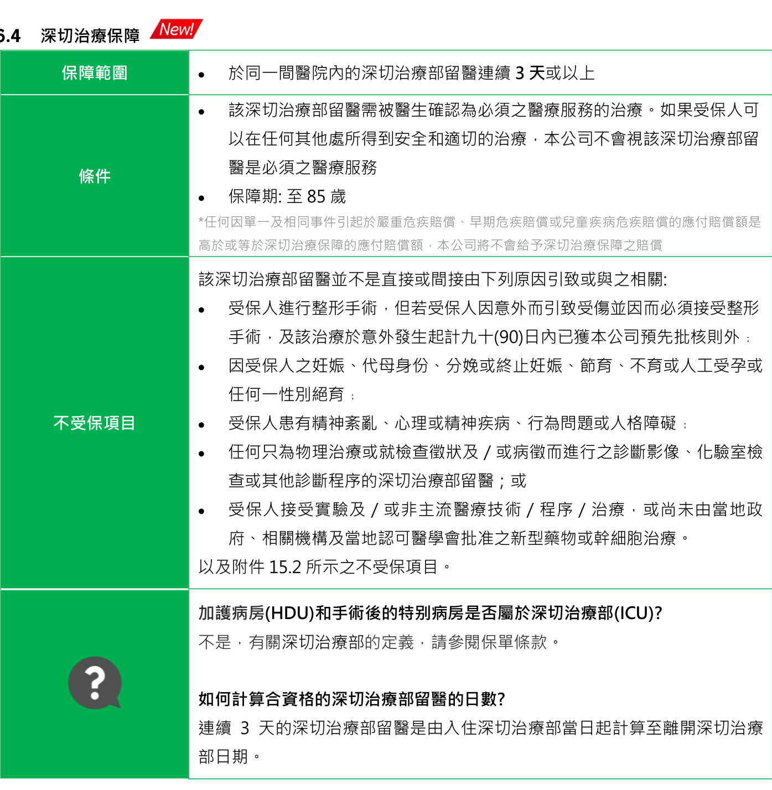
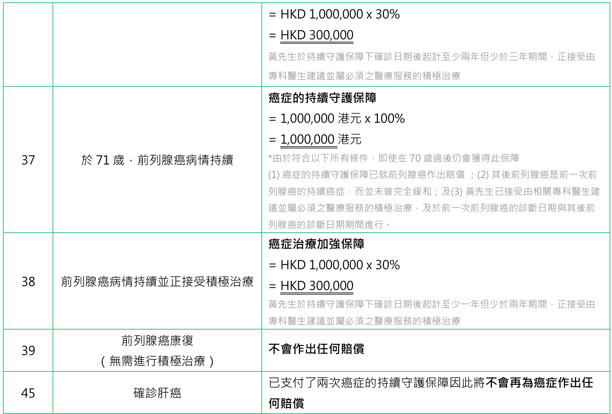
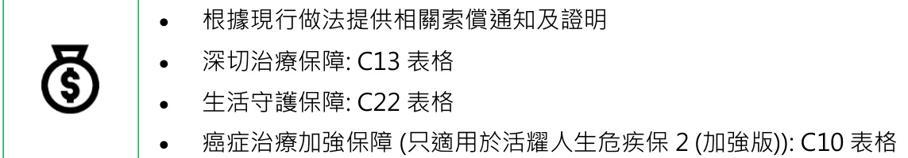

## 第 0 页

ManuBright Care 2/ ManuBright Care 2 Plus 活耀人生危疾保 2/活耀人生危疾保 2 (加強版)

活耀人生危疾保 2/ 活耀人生危疾保 2 (加強版)

產品手冊

## 第 1 页

ManuBright Care 2/ ManuBright Care 2 Plus

活耀人生危疾保 2/活耀人生危疾保 2 (加強版)

目錄

產品簡介 .  
市場機遇 .  
3. 目標客戶 .4  
4. 產品定位 .  
產品概覽及焦點 .  
5.1 產品概覽 ..  
5.2 產品焦點 .  
詳細產品資料 ...  
6.1 嚴重危疾賠償 . 7  
6.2 早期危疾賠償 .. 7  
6.3 兒童疾病危疾賠償 .... 9  
6.4 深切治療保障 . 9  
6.5 持續守護保障. . 10  
6.6 癌症治療加強保障 (只適用於活耀人生危疾保 $2$ (加強版).. .. 11  
6.7 生活守護保障 . 12  
6.8 嚴重危疾保費豁免 ... . 13  
6.9 保證現金價值(GCV) . .. 13  
6.10 非保證終期紅利及終期紅利鎖定權益 .. .. 14  
6.11 期滿利益 . .. 14  
6.12 身故賠償 . .. 14  
6.13 通脹加保權益 . .. 15  
6.14 轉介服務 ... . 15  
6.15 危疾定義更新方案 . 15  
6.16 保單貸款 ... 21  
更多關於危疾賠償 .. ..21  
7.1 等候期 .. . 21  
7.2 生存期 .. .. 21  
7.3 未獲發現之先天性情況 .. .. 21  
賠償表 . .22  
. 計算賠償方法 （附例子） .... ..24  
0. 特別行政規條 .. .27  
10.1 核保 . . 27  
10.2 申請 .. .. 27  
10.3 保單服務 . . 28  
10.4 理賠 . . 28  
11. 主要分別  (活耀人生危疾保 與 活耀人生危疾保 2 系列的比較) .. ....29  
12. 特點比較 . ..30  
12.1 產品比較 （活耀人生危疾保2 系列 與 心愛一家保的比較） . 30  
12.2 市場產品比較 .... ... 33  
12.3 危疾定義更新計劃 . .. 39  
3. 每年保費比較 . ..40  
14. 回報 . .....41  
5. 附件 ... .44  
15.1 受保障之危疾列表 . ... 44  
15.2 不受保項目列表.. .. 46  
15.3 轉介服務 . ... 46  
15.4 舊有危疾保障計劃/ 附加保障列表 .. .... 47  
15.5 定義更新 . ... 48  
15.6 活耀人生危疾保2 系列 與 心愛一家保的詳細比較 . 50

2021年11月版

本文件所載的所有資料由宏利人壽保險（國際）有限公司（「宏利」）編制，只供指定人士參考之用。宏利不會就該等資料的真實性及準確性負責。在未經授權的情況下，任何人士均嚴禁將本文件之全部或部分再行發布或複製。

## 第 2 页

ManuBright Care 2/ ManuBright Care 2 Plus 活耀人生危疾保 2/活耀人生危疾保 2 (加強版)

1. 產品簡介

危疾總是突如其來，難以預測，並影響我們日常生活和將來的計劃。面對一些危疾如癌症，更有機會需要長期抗戰。為確保在應付危疾或復發後生活能從上軌道，需要一份持續的保障，為治療以至復康提供支援，我們因此推出活耀人生危疾保 2 系列。

活耀人生危疾保 2 系列為受保人提供周全保障至 100 歲，涵蓋多達 112 種危疾。即使已就嚴重危疾作出索償，其後亦持續就癌症、突發性心臟病 (心肌梗塞) 及中風提供額外保障。此外，計劃亦為危疾後所出現的的傷殘，即使因受傷及將來未知的疾病而需入住深切治療部(ICU)，都可同獲保障。

除此之外，計劃亦會提供保證現金價值、終期紅利、期滿利益及身故賠償。

2. 市場機遇

新發現疾病的數目持續上升

 於近年，全球每年約有100 種新發現的疾病 於 2003 年出現的 SARS 期間

在香港，約有 $20\%$ 的確診者需要入住深切治療部 (ICU)在新加坡，入住深切治療部的平均日數為10 日

 於2019 年出現的新型冠狀病毒期間

在美國，約有 $4.9\%-11.5\%$ 的確診者需要入住深切治療部 (ICU)在中國，入住深切治療部的留醫時間中位數為8 (4–12)日

資料來源:

<html><body><table><tr><td>(1)</td><td>OrphanetJournalof RareDiseasesvolume,biomedcentral,</td></tr><tr><td></td><td>https://ojrd.biomedcentral.com/articles/10.1186/s13023-018-0892-5</td></tr><tr><td>2</td><td>SARS in the IntensiveCare Unit,PubMed</td></tr><tr><td>3</td><td>CriticallyIli Patients With Severe Acute Respiratory Syndrome,JAMA Network</td></tr><tr><td>(4)</td><td>"Percentage of COVID-19 cases in the United States fromFebruary 12 to March 16, 2020 that required intensive care unit (Icu) admission, by age group*” Statista</td></tr><tr><td>(5)</td><td>"Clinical course and risk factors for mortality of adult inpatients with COVID-19 in Wuhan, China: a retrospective cohort study”The Lancet</td></tr></table></body></html>

危疾患者容易出現殘疾

 中風患者  : 約有 $25\mathrm{-}74\%$ 需依賴別人去進行「日常生活之活動」約有 $11\%$ 首次中風的病人於病發5 年後須依賴他人照顧日常生活 癌症患者 : 約有 $33\%$ 對進行「日常生活之活動」感到困難 心臟衰竭患者 : 約有 $60\%$ 對進行「日常生活之活動」感到困難

資料來源:

(1) “Disability in activities of daily living among adults with cancer: A systematic review and meta-analysis”, Cancer Treatment Reviews Outcomes after first-ever stroke, Hong Kong Med J. 2007   
(3) Disability and Recovery of Independent Function in Obstructive Lung Disease: The Cardiovascular Health Study, Respiration   
(4) “Activities of Daily Living and Outcomes in Heart Failure” US National Library of Medicine National Institutes of Health

2021 年 11 月版

第3頁

本文件所載的所有資料由宏利人壽保險（國際）有限公司（「宏利」）編制，只供指定人士參考之用。宏利不會就該等資料的真實性及準確性負責。在未經授權的情況下， 任何人士均嚴禁將本文件之全部或部分再行發布或複製。

## 第 3 页

ManuBright Care 2/ ManuBright Care 2 Plus 活耀人生危疾保 2/活耀人生危疾保 2 (加強版)

<html><body><table><tr><td rowspan="3"></td><td>復發機會高 ·中風的5年復發率為25% (2) Recurrence rate of colorectal cancerin late stage: "Staging of Disease" , The Colorectal and Laparoscopic Surgery Centre.</td></tr><tr><td>·第三期的大腸癌復發率高達50% ·估計每年約有25%的心病患者是由復發引致</td></tr><tr><td>資料來源： (1) State of the nation - stroke statistics 2018, Stroke Association (UK).</td></tr></table></body></html>

3. 目標客戶

• 關注健康，尤其憂慮危疾和其高昂治療費用的人士  
• 對危疾保險產品有一定程度認識的人士  
• 於危疾索償後，對日後投保危疾計劃之可保性有顧慮的人士  
• 正在尋求多種保障集於一身的方案 – 一份擁有全面保障，更涵蓋非指定疾病及將來未知的疾病、人壽保障及長遠儲蓄成份之危疾保險產品的人士  
• 正在尋找多重危疾保障，以加強其現有危疾保障的人士  
• 向危疾定義更新計劃的合資格現有客戶追加銷售的機會

4. 產品定位

2021 年 11 月版

第4頁

本文件所載的所有資料由宏利人壽保險（國際）有限公司（「宏利」）編制，只供指定人士參考之用。宏利不會就該等資料的真實性及準確性負責。在未經授權的情況下， 任何人士均嚴禁將本文件之全部或部分再行發布或複製。

## 第 4 页

ManuBright Care 2/ ManuBright Care 2 Plus 活耀人生危疾保 2/活耀人生危疾保 2 (加強版)

5. 產品概覽及焦點

<html><body><table><tr><td></td><td colspan="3"></td></tr><tr><td rowspan="2">計划名</td><td rowspan="2"></td><td colspan="3">KC:活耀人生危疾保2 (加强版)</td></tr><tr><td rowspan="2">KD:活耀人生危疾保2 KC110 / KC120 / KC125 / KC165</td><td colspan="2"></td></tr><tr><td rowspan="2">計划代号</td><td rowspan="2"></td><td colspan="2"></td></tr><tr><td colspan="2">KD110 / KD120 / KD125 / KD165</td></tr><tr><td>計划類别</td><td>危疾保障產品</td><td colspan="2"></td></tr><tr><td>計劃類型</td><td>基本計劃</td><td colspan="2"></td></tr><tr><td>保障期</td><td>至100崴* *重危疾索價後:至 85 崴</td><td colspan="2"></td></tr><tr><td>保費結構</td><td colspan="3">水平式及保證保費</td></tr><tr><td>保單貨</td><td colspan="2"></td><td></td></tr><tr><td rowspan="4">保費付期 及 投保年龄</td><td>港元／美元 10年</td><td></td><td>0崴（15日）至65崴</td></tr><tr><td>20年</td><td></td><td>0崴（15日）至65崴</td></tr><tr><td>25年</td><td></td><td></td></tr><tr><td>直至65崴</td><td></td><td>0崴（15日）至60崴 0崴（15日）至55崴</td></tr><tr><td rowspan="2">年龄定義</td><td rowspan="2">最接近一個生日所達之數</td><td colspan="2"></td></tr><tr><td colspan="2">（適用於本計劃下所有保障）任何出現於本保單内之特定年龄，是指在保單 周年日當天，受保人於最接近一個生日所達之數。</td></tr><tr><td rowspan="4">費形式 及 保費因子</td><td>每年</td><td></td><td>1.00</td></tr><tr><td>每半年</td><td></td><td>0.52</td></tr><tr><td>每季</td><td></td><td>0.265</td></tr><tr><td>每月</td><td></td><td>0.09</td></tr><tr><td rowspan="5">費形式 及 保單因子</td><td></td><td>費形式</td><td>港元</td><td>美元</td></tr><tr><td></td><td>每年</td><td>300</td><td>38</td></tr><tr><td></td><td>每半年</td><td>180</td><td>23</td></tr><tr><td></td><td>每季</td><td>110</td><td>14</td></tr><tr><td></td><td>每月</td><td>30</td><td>4</td></tr><tr><td>保費計算方法</td><td colspan="4">根據投保年懿丶性别丶吸煙狀况丶費形式和保單貨計算</td></tr><tr><td>最低名義金额</td><td colspan="4">100,000港元/12,500美元</td></tr><tr><td rowspan="4">最高名義金额</td><td colspan="2">0至15</td><td colspan="2">4,000,000港元/500,000美元</td></tr><tr><td colspan="2"></td><td colspan="2">8,000,000港元/1,000,000美元</td></tr><tr><td colspan="2">16崴至65崴 详情請参閣eAOM</td><td colspan="2"></td></tr><tr><td>可供暹選的附加保障</td><td colspan="4">可参考宏利全接觸（Manutouch）的附加保障表</td></tr></table></body></html>

*表格标题：5.1 產品概覽 *

## 第 5 页

ManuBright Care 2/ ManuBright Care 2 Plus

活耀人生危疾保 2/活耀人生危疾保 2 (加強版)

5.2 產品焦點

周全保障

<html><body><table><tr><td></td><td></td><td>涵蓋60種重危疾、44種早期危疾丶8種兒童疾病以及合資格的深切治療部留醫 若在首10個保單年度内患上重危疾，可獲额外保障</td></tr><tr><td rowspan="2">S</td><td rowspan="2">深切治療保障</td><td>New!</td></tr><tr><td>保障延伸至非指定的疾病及受傷</td></tr><tr><td rowspan="2"></td><td rowspan="2"></td><td>缔造安全，需要於同一間醫院留醫深切治療部連續3天或以上亦獲保障</td></tr><tr><td></td></tr><tr><td rowspan="2"></td><td rowspan="2">持續守護保障</td><td>当嚴重危疾再度來时；就癌症丶突發性心病／中風提供额外保障</td></tr><tr><td>New! 癌症治療加強保障 (只適用於活耀人生危疾保2(加强版)</td></tr><tr><td rowspan="4">b</td><td></td><td>當受保人於重危疾或持續守護保障索價之癌症日期後第二年或/及第三年内仍然患 上癌症，正接受極治療或晚期護理，可獲外賠價</td></tr><tr><td>生活守護保障New!</td><td></td></tr><tr><td></td><td>缓於危疾後患上残疾的财政負</td></tr><tr><td rowspan="2"></td><td>若受保人不間地持續180天或以上無法進行六頂「日常生活之活動」中任何兩頂，</td></tr><tr><td>且在整個活動過程中需要另一個人旁協助(由首次重危疾賠之日期後至少180 日起計），可獲额外賠價</td></tr><tr><td rowspan="2"></td><td rowspan="2"></td><td>未獲發現之先天性情况均得到保障</td></tr><tr><td>）只要該病微和症狀於保單發出前及保單發出後首90日内未發現，本計划將為該先天性 情况所引起的危疾提供保障</td></tr><tr><td rowspan="2">8</td><td rowspan="2">重危疾保費豁免</td><td></td></tr><tr><td>當嚴重危疾來時，日後之保費將獲豁免，受保人仍可得到保障</td></tr><tr><td></td><td></td><td>人需保供身故路偿· 助家庭成员经解财政因截</td></tr><tr><td rowspan="2"></td><td rowspan="2">長期蓄</td><td></td></tr><tr><td>提供保證現金价值和期满利益</td></tr><tr><td rowspan="2"></td><td rowspan="2"></td><td>提供終期紅利·可以鎖定高達50%終期紅利，存生息或隨時提取</td></tr><tr><td></td></tr><tr><td rowspan="2"></td><td rowspan="2">保費保證固定不變</td><td></td></tr><tr><td>保費保證不變及於保費付期内不會增加</td></tr></table></body></html>

<html><body><table><tr><td>2021年11月版 第6真</td></tr><tr><td>本文件所载的所有資料由宏利人保险（國際）有限公司（「宏利」）编制·只供指定人士参考之用。宏利不會就該等資料的真實性及准</td></tr><tr><td>確性負青。在未經授權的情况下， 任何人士均禁將本文件之全部或部分再行發布或複製。</td></tr></table></body></html>

## 第 6 页

ManuBright Care 2/ ManuBright Care 2 Plus 活耀人生危疾保 2/活耀人生危疾保 2 (加強版)

對於在中國內地確診之嚴重危疾、早期危疾、兒童疾病和該傷殘(於生活守護保障)，本公司只會接納本公司發佈之「中國內地指定醫院名單」內的醫院之專科醫生所作的診斷。對於在中國內地進行及 / 或完成之積極治療或晚期護理(只適用於活耀人生危疾保 2 (加強版))及合資格的深切治療部留醫，本公司只會接納本公司發佈之「中國內地指定醫院名單」內的醫院。本公司有權不時對「中國內地指定醫院名單」作出修訂，而毋須另行通知。最新版本「指定的醫院名單」將上載於本公司網站（http：//www.manulife.com.hk），有關詳情可致電客戶服務熱線查詢。 包括「指定的醫院名單」內之「卓越醫院」及經中華人民共和國官方正式評定為三級甲等之醫院。

6. 詳細產品資料

<html><body><table><tr><td>保障圍</td><td>60種重危疾（详情請参閣附件15.1)</td></tr><tr><td></td><td>名義金额的100%，扣除任何已支付的早期危疾赔价丶兒童疾病賠价或深 切治療保障</td></tr><tr><td>賠價</td><td>若該重危疾於首10個保單年度内確，可獲相等於名義金额的50%</td></tr><tr><td></td><td>之额外保障</td></tr><tr><td>保障次數</td><td>·一次</td></tr></table></body></html>

*表格标题：6.1 嚴重危疾賠償 *

6.2 早期危疾賠償

<html><body><table><tr><td colspan="2">類别1-因冠狀動服疾病進行的血管成形術及其他創傷性治療</td></tr><tr><td>保障圍</td><td>因冠狀動派疾病進行血管成形術及其他創傷性治療</td></tr><tr><td rowspan="3">賠價额</td><td>根據下述较低之金</td></tr><tr><td>1．名義金额20%；或</td></tr><tr><td>2．50,000美元或 400,000港元，扣减由受保人於宏利所有其他保單内 獲得之相同或相似保障的賠价總</td></tr><tr><td>保障次數</td><td>·一次#</td></tr></table></body></html>

<html><body><table><tr><td colspan="2">類别2-原位癌</td></tr><tr><td rowspan="10">保障圍</td><td>以下器官類别之原位癌：</td></tr><tr><td>乳房</td></tr><tr><td>子宫或子宫</td></tr><tr><td>結腸及直腸</td></tr><tr><td>肝</td></tr><tr><td>肺</td></tr><tr><td>鼻咽</td></tr><tr><td>卵巢或輸卵管</td></tr><tr><td>陰萃</td></tr><tr><td>胃及食道</td></tr><tr><td rowspan="4">根據下述较低之金 賠價额</td><td>睾丸</td></tr><tr><td>泌尿道，Ta期的膀胱乳頭狀癌也視作原位癌</td></tr><tr><td>陰道</td></tr><tr><td>1．名義金额20%；或</td></tr></table></body></html>

2021 年 11 月版

本文件所載的所有資料由宏利人壽保險（國際）有限公司（「宏利」）編制，只供指定人士參考之用。宏利不會就該等資料的真實性及準確性負責。在未經授權的情況下， 任何人士均嚴禁將本文件之全部或部分再行發布或複製。

## 第 7 页

<html><body><table><tr><td></td><td>2．50,000美元或400,000港元，扣减由受保人於宏利所有其他保單内 獲得之相同或相似保障的賠价總</td></tr><tr><td>保障次數</td><td>：兩次#（不同器官類别各一次） 若器官類别的結構分為左右兩部分，包括但不限於乳房、卵巢、輸卵管 及肺；左右雨部分的器官類别會被視為一個及相同的器官類别</td></tr></table></body></html>

*表格标题：ManuBright Care 2/ ManuBright Care 2 Plus 活耀人生危疾保 2/活耀人生危疾保 2 (加強版) *

<html><body><table><tr><td colspan="2">類别3－早期惡性瘤</td></tr><tr><td>保障圍</td><td>早期惡性瘤</td></tr><tr><td>賠價额</td><td>根據下述较低之金 1．名義金额20%；或 2．50,000美元或 400,000港元，扣减由受保人於宏利所有其他保單内</td></tr><tr><td>保障次數</td><td>獲得之相同或相似保障的賠價總 一次#</td></tr></table></body></html>

<html><body><table><tr><td colspan="2">類别4－早期甲狀腺癌</td></tr><tr><td>保障圍</td><td>早期甲狀腺癌</td></tr><tr><td rowspan="3">賠价额</td><td>根據下述较低之金</td></tr><tr><td>1．名義金额20%；或</td></tr><tr><td>2．50,000美元或400,000港元，扣减由受保人於宏利所有其他保單内</td></tr><tr><td>保障次數</td><td>獲得之相同或相似保障的賠價總 一次#</td></tr></table></body></html>

<html><body><table><tr><td colspan="2">類别5－骨質疏症連骨折</td></tr><tr><td>保障圍</td><td>骨質疏症連骨折</td></tr><tr><td>條件</td><td>該骨質疏症連骨折於70前確</td></tr><tr><td>賠价额</td><td>名義金额10%</td></tr><tr><td>保障次數</td><td>一次#</td></tr></table></body></html>

<html><body><table><tr><td colspan="2">類别6－其他39種早期危疾</td></tr><tr><td>保障圍</td><td>因冠狀動胍疾病進行血管成形術及其他創傷性治療丶原位癌、早期惡性 瘤、早期甲狀腺癌及骨質疏症連骨折以外的早期危疾（详情請参閣附件</td></tr><tr><td>賠价额</td><td>15.1)</td></tr><tr><td>保障次數</td><td>名義金额20% 就以上每填早期危疾只限一次#</td></tr></table></body></html>

*表格脚注：早期危疾賠償、兒童疾病危疾賠償及深切治療保障總額不可超過名義金額的 80%*

2021 年 11 月版

第8頁

本文件所載的所有資料由宏利人壽保險（國際）有限公司（「宏利」）編制，只供指定人士參考之用。宏利不會就該等資料的真實性及準確性負責。在未經授權的情況下， 任何人士均嚴禁將本文件之全部或部分再行發布或複製。

## 第 8 页

ManuBright Care 2/ ManuBright Care 2 Plus

活耀人生危疾保 2/活耀人生危疾保 2 (加強版)

<html><body><table><tr><td>保障圍</td><td>8 種兒童疾病（详情請参閣附件 15.1)</td></tr><tr><td>條件</td><td>保單於16前發 該兒童疾病於18前確</td></tr><tr><td>賠价额</td><td>根據下述较低之金额 1．名義金额20%；或 2.</td></tr><tr><td>保障次數</td><td>50,000美元或400,000港元，扣减由受保人於宏利所有其他保單内 獲得之相同或相似保障的賠價總 每填兒童疾病只限一次#</td></tr></table></body></html>

*表格标题：6.3 兒童疾病危疾賠償 *

*表格脚注：#早期危疾賠償、兒童疾病危疾賠償及深切治療保障總額不可超過名義金額的 $80\%$ *

<html><body><table><tr><td colspan="3">6.4深切治療保障 New!</td></tr><tr><td>保障圍</td><td>於同一間醫院内的深切治療部留醫連續3天或以上</td><td>該深切治療部留醫需被醫生確為必之醫療服務的治療。如果受保人可</td></tr><tr><td>條件</td><td>醫是必须之醫療服務 保障期：至85</td><td>以在任何其他處所得到安全和適切的治療，本公司不會視該深切治療部留 *任何因單一及相同事件引起於重危疾赔價、早期危疾賠价或兒童疾病危疾賠价的應付賠价额是 高於或等於深切治療保障的應付賠價额·本公司將不會給予深切治療保障之賠價</td></tr><tr><td>不受保頂目</td><td>任何一性别育； 查或其他程序的深切治療部留醫；或 以及附件15.2所示之不受保填目。</td><td>該深切治療部留醫不是直接或間接由下列原因引致或與之相關： 受保人進行整形手術，但若受保人因意外而引致受傷因而必须接受整形 手術，及該治療於意外發生起計九十(90)日内已獲本公司预先批核则外； 因受保人之妊娠丶代母身份丶分娩或終止妊娠丶節育、不育或人工受孕或 受保人患有精神紊丶心理或精神疾病丶行為問題或人格障； 任何只為物理治療或就查微狀及／或病微而進行之影像丶化室 受保人接受實及／或非主流醫療技術／程序／治療；或尚未由當地政 府、相關機構及當地可醫學會批准之新型藥物或幹細胞治療。</td></tr><tr><td>?</td><td>加護病房(HDU)和手術後的特别病房是否属於深切治療部(ICU)? 不是，有關深切治療部的定義，請参閣保單條款。 如何計算合資格的深切治療部留醫的日數？ 部日期。</td><td>連續3 天的深切治療部留醫是由入住深切治療部當日起計算至離開深切治療</td></tr></table></body></html>

2021 年 11 月版

本文件所載的所有資料由宏利人壽保險（國際）有限公司（「宏利」）編制，只供指定人士參考之用。宏利不會就該等資料的真實性及準確性負責。在未經授權的情況下， 任何人士均嚴禁將本文件之全部或部分再行發布或複製。

## 第 9 页

ManuBright Care 2/ ManuBright Care 2 Plus 活耀人生危疾保 2/活耀人生危疾保 2 (加強版)

<html><body><table><tr><td></td><td>若因意外而導致患上失去一肢（早期危疾賠價），需要於深切治療部留醫 連續3天（深切治療保障），他/她是否會獲得早期危疾賠价以及深切治療保障？ 不是，若因單一及相同事件引起獲患上雨種或以上的危疾（包括重危 疾、早期危疾、兒童疾病或合資格的深切治療部留醫)，而當中的早期危疾保 障的應付賠價额是高於或等於深切治療保障的應付賠價额，本公司只會就失去 一肢而作出早期危疾赔價。</td></tr><tr><td>賠价额</td><td>·根據下述低之金额 1．名義金额20%；或 2．50,000美元或400,000港元，扣减由受保人於宏利所有其他保單内</td></tr><tr><td>保障次數</td><td>獲得之相同或相似保障的賠價總 ·一次#</td></tr></table></body></html>

*表格脚注：#早期危疾賠償、兒童疾病危疾賠償及深切治療保障總額不可超過名義金額的 80%*

6.5 持續守護保障

<html><body><table><tr><td>6.3 持寸度保悍</td></tr><tr><td>保障圍</td><td colspan="4">於重危疾賠價後(情請参閣附件15.1)·為癌症丶突發性心病及中風 提供额外保障 除了新確癌症外，癌症持續守護保障亦保障復發、散及持續出現之癌 症</td></tr><tr><td></td><td colspan="4">前一次危疾和其後患上的危疾须符合以下等候期 (按日期)</td></tr><tr><td rowspan="11">條件</td><td>上一次的重危疾</td><td></td><td>其後患上的重危疾</td><td>等候期</td></tr><tr><td></td><td>癌症</td><td>癌症</td><td>3年</td></tr><tr><td></td><td>癌症 突發性心病／中風</td><td></td><td>1年</td></tr><tr><td>非癌症</td><td>癌症</td><td></td><td></td></tr><tr><td>非癌症</td><td>突發性心病／中風</td><td>1年</td><td>1年</td></tr><tr><td<td colspan="3">*若其後癌症與之前於計划内曾獲賠价的嚴重危疾因同一事件引起，而該其後癌症 年，本公司將不會作出癌症的持續守護保障賠價 生存期為最少14 日 該其後患上的危疾於85前確診 但是，如其後癌症為前列腺癌及該癌症的日期為受保人已達70 的個案 2):</td></tr></table></body></html>

2021 年 11 月版

第10頁

本文件所載的所有資料由宏利人壽保險（國際）有限公司（「宏利」）編制，只供指定人士參考之用。宏利不會就該等資料的真實性及準確性負責。在未經授權的情況下， 任何人士均嚴禁將本文件之全部或部分再行發布或複製。

## 第 10 页

<html><body><table><tr><td></td><td>的日期 (適用於癌症的持續守護保障) 更多有關突發性心病/中風持續守護保障之條件： 》若曾就突發性心病給予賠：主醫生必證實其後患上的突發性 心病與任何之前一次相比，為新一次及不同的突發性心病 》若曾就中風給予賠價：主神經科專家必證實其後患上的中風與任 何之前一次相比，為新一次及不同的中風</td></tr><tr><td>賠價额</td><td>每次賠价名義金额100% 癌症：雨次</td></tr><tr><td>保障次數</td><td>突發性心病／中風：雨次 突發性心病/中風的持續守護保障 + (100%) (100%) 癌症的持續守護保障 首次重危疾 8 + (100%) (100%) (100%)</td></tr></table></body></html>

*表格标题：ManuBright Care 2/ ManuBright Care 2 Plus 活耀人生危疾保 2/活耀人生危疾保 2 (加強版) *

New!

<html><body><table><tr><td>保障圍</td><td>癌症 (群情請参閣附件15.1)</td><td></td></tr><tr><td rowspan="3">條件</td><td></td><td>已就癌症於重危疾保障或持續守護保障作出赔價 受保人確癌症，於以下的特定時期内接受極治療或晚期護理：</td></tr><tr><td>該極治療或晚期護理需於85前進行</td><td>》癌症之日期後起計至少一年但少於雨年 》癌症之日期後起計至少雨年但少於三年</td></tr><tr><td>?</td><td>該極治療或晚期護理是由專科醫生建必之醫療服務 極治療：是指外科手術、電療丶化療、標靶治療丶骨髓移植丶質子治療丶免 疫治療丶數碼導航刀丶伽瑪刀或以上治療的組合·定義特别不包括激素治療。 不包括激素紊落的原會於癌症康復持德进行</td></tr><tr><td></td><td></td><td>晚期護理：是指在醫院或册善終院舍接受缓癌症症狀之治療，而該癌症止 在忌化且未有醫治或控制該癌症的治療方法。</td></tr><tr><td>賠价额</td><td></td><td>每個特定時期赔價名義金额30%</td></tr><tr><td>保障次數</td><td></td><td>最多六次(就每次癌症索重危疾赔或癌症持續守護保障後之兩個特 定時期，每個特定時期限一次賠價)</td></tr></table></body></html>

*表格标题：6.6 癌症治療加強保障 (只適用於活耀人生危疾保2(加強版) *

## 第 11 页

ManuBright Care 2/ ManuBright Care 2 Plus 活耀人生危疾保 2/活耀人生危疾保 2 (加強版)

6.7 生活守護保障

New!

保障範圍 危疾後患上殘疾

條件

• 無法進行六項「日常生活之活動」中任何兩項，並且在整個活動過程中需要另一個人從旁協助(「該傷殘」)該傷殘已持續180 天 (由嚴重危疾賠償下獲賠償之嚴重危疾的診斷日期後至少 180 日起計)根據現時醫學知識及技術，該傷殘已完全沒有復原的希望(依照市場普遍定義)該傷殘並非由精神病有關的原因所引致該傷殘須由專科醫生確認，同時必須獲客觀的醫療證明支持，包括但不限於身體檢查、影像及化驗室報告該傷殘於嚴重危疾之診斷日期後出現  
• 保障期: 16 至 65 歲

?

如該傷殘的引發原因與前一次的嚴重危疾索償並不相關，受保人會否獲得此保障的賠償？

可以，導致該傷殘的原因可以與前一次的嚴重危疾索償無關。

2021 年 11 月版

第12頁

本文件所載的所有資料由宏利人壽保險（國際）有限公司（「宏利」）編制，只供指定人士參考之用。宏利不會就該等資料的真實性及準確性負責。在未經授權的情況下， 任何人士均嚴禁將本文件之全部或部分再行發布或複製。

## 第 12 页

ManuBright Care 2/ ManuBright Care 2 Plus 活耀人生危疾保 2/活耀人生危疾保 2 (加強版)

<html><body><table><tr><td rowspan="3">日常生活之活動(ADL)</td><td></td><td>指 (1)沐浴、 (2)更衣丶 (3)行動丶 (4)移動丶(5)如庾及 (6)進食</td></tr><tr><td></td><td>若受保人能在借助特别儀器的情况下進行以上之活動，將被視為能自</td></tr><tr><td></td><td>行進行此活動 *請参閣保單條款的完整定義。</td></tr><tr><td>賠價额</td><td></td><td>名義金额100%</td></tr><tr><td>保障次數</td><td>一次</td><td></td></tr></table></body></html>

6.8 嚴重危疾保費豁免

<html><body><table><tr><td>保障圍</td><td>受保人患上重危疾</td></tr><tr><td>條件</td><td>已支付的危疾賠價達名義金额的100% (详情請参閣第6.1－6.4部分)</td></tr><tr><td>賠價额</td><td>由日期起·豁免基本計劃日後之保費</td></tr></table></body></html>

<html><body><table><tr><td colspan="5">6.9 保證現金價值(GCV) 由第11個保單年度日起，計劃將給付保證現金價值</td></tr><tr><td rowspan="10">如何計算?</td><td colspan="3">在受保人85前退保： 保證現金價值=以下低之金额 年首期保費 1.保費回赠比率× ×已保費之月數；或 12 2.名羲金额的90%</td></tr><tr><td></td><td>保單年度</td><td>保費回赠比率*</td></tr><tr><td></td><td>11前</td><td>没有保費回赠</td></tr><tr><td></td><td>11至15</td><td>15%保費回赠*</td></tr><tr><td></td><td>16至20</td><td>30%保費回赠*</td></tr><tr><td></td><td>21至25</td><td>50%保費回赠*</td></tr><tr><td></td><td>26後</td><td>100%保費回赠*</td></tr><tr><td colspan="3">*根據首期保費定。首期保費為就本基本計劃生效日，其應之年保費 （不包括额外保費） 最接近受保人85生日的保單周年日及其後： ■保證現金價值=名義金额的90%</td></tr><tr><td colspan="2">若已支付重危疾賠价，將不會給付任何保證現金價值 在支付早期危疾賠價及/或兒童疾病危疾赔價及/或深切治療保障後，保證</td><td>因通加保權益其後增加名義金额－增加之部分所值的首期年保費將按增 加名義金额生效日之保費率計算。保單於保單生效日後其後减低名義金 额，首期年保費將按已調低的名義金额及保單生效日的保費率而計算</td></tr><tr><td colspan="3">現金價值將根據以下公式按比例調整： 名義金额扣除早期危疾賠价及/或兒童疾病赔价及/或深切治療保障</td></tr><tr><td></td><td colspan="3">的索價總</td></tr><tr><td></td><td colspan="3">基本計劃名義金额 ·金额以零作為下限</td></tr><tr><td>何時獲發？</td><td colspan="3">保單退保</td></tr></table></body></html>

2021 年 11 月版

本文件所載的所有資料由宏利人壽保險（國際）有限公司（「宏利」）編制，只供指定人士參考之用。宏利不會就該等資料的真實性及準確性負責。在未經授權的情況下， 任何人士均嚴禁將本文件之全部或部分再行發布或複製。

## 第 13 页

ManuBright Care 2/ ManuBright Care 2 Plus

活耀人生危疾保 2/活耀人生危疾保 2 (加強版)

<html><body><table><tr><td rowspan="6">終期紅利鎖定權益？</td><td rowspan="5">可透過行使此權益以鎖定部份終期紅利，轉化為累已鎖定終期紅利， 累积已鎖定終期紅利可:</td><td>惟符合以下條件：</td></tr><tr><td>o在終期紅利鎖定周年日（即第 20個保單周年日及其後每5個保單周年</td></tr><tr><td>日）行使此權益</td></tr><tr><td>就每張保單最多行使此權益兩次</td></tr><tr><td>終期紅利鎖定／將鎖定的總百分比（「終期紅利鎖定總百分比」）不 可超過50%</td></tr><tr><td rowspan="5"></td><td>存生息（非保證利率）</td></tr><tr><td>o 隨時提取</td></tr><tr><td>終期紅利為一次性的紅利</td></tr><tr><td>根據下述较早者為</td></tr><tr><td>1．保單退保</td></tr><tr><td rowspan="4">何時獲發？</td><td>2. 支付重危疾赔價</td></tr><tr><td></td></tr><tr><td>3. 保單期满</td></tr><tr><td>4. 受保人身故</td></tr><tr><td></td><td></td></tr></table></body></html>

*表格标题：6.10 非保證終期紅利及終期紅利鎖定權益*

6.11 期滿利益

<html><body><table><tr><td>何時適用？</td><td>保單期满 (即最接近受保人 100的保單周年日)</td><td></td></tr><tr><td rowspan="5">賠价额</td><td rowspan="5">加</td><td>名義金额100%，扣减任何已支付的危疾賠價 (該金额以零作為下限)</td></tr><tr><td></td></tr><tr><td></td></tr><tr><td>終期紅利（如有）；及</td></tr><tr><td>累已鎖定終期紅利（如有）</td></tr><tr><td></td><td>*於支付期满利益後，保單將會自動終止</td><td></td></tr></table></body></html>

6.12 身故賠償

<html><body><table><tr><td>保障圍</td><td>受保人身故</td></tr><tr><td></td><td>名義金额100%，扣减任何已支付的危疾賠價 (該金额以零作為下限)</td></tr><tr><td>加 賠价</td><td></td></tr><tr><td></td><td>終期紅利（如有）；及</td></tr><tr><td></td><td>累已鎖定終期紅利（如有）</td></tr><tr><td></td><td>*於支付重危疾赔价後，保單將會自動終止</td></tr></table></body></html>

## 第 14 页

ManuBright Care 2/ ManuBright Care 2 Plus

活耀人生危疾保 2/活耀人生危疾保 2 (加強版)

*表格标题：6.13 通脹加保權益*

<html><body><table><tr><td>條件</td><td>本保單须於 50 前發 本計劃於發時没有個别不受保頂目或额外保費 在購買保單時選選此權益 此權益將會於下列早出現的情况終止: 保單終止 最接近受保人 60生日的保單周年日 保單持有人拒接受增加名義金额 費期完結前的第5個保單周年日 o 基本計劃的總名義金额達到原有名義金额的150%或最高限额</td></tr><tr><td>保單終止</td><td>降低名義金额 就任何完全傷残保費豁免權益作出赔价，例如傷残豁免保費保障或保 費支付人利益保障 受保人被患上丶被治療丶已就任何危疾的病微或症狀的存在或發 生接受醫生的症的任何於保障條款下合資格收取保障賠價或索价的 危疾</td></tr><tr><td>重要資讯 6.14轉介服務</td><td>o第10個保單周年日 *受有關細約束·详情請参閣保單條款 ·在保費付期内须交额外保費，而該保費非保證</td></tr><tr><td>何時適用？</td><td>國際救援（亞洲）公司（IPA）提供的醫療轉介服務，於重危疾丶血管成 形術及相關治療丶原位癌及兒童疾病索价獲批後適用（详情請参閣附件 15.3) ·美國優秀醫護精英作後盾；助受保人走上康復之路</td></tr><tr><td>這是什?</td><td>*本公司保留随時修改或終止轉介服務的權利及不會另行作出通知。轉介服務由第三方服務機構提 供·該機構為獨立的承辨商，非本公司的代理。本公司不就該服務機構所能提供之醫療意見或 任何醫療服務作出任何陳述、保證或承諾。本公司不會就保單持有人或受保人就該等機構及／或其 代理提供之服務（包括轉介服務）或建或該等服務之供應而直接或間接蒙受或招致之任何損失丶 損害丶費用丶起丶或法律程序·向保單持有人或受保人承任何任。</td></tr><tr><td>重要資訊</td><td>详情請於本公司網站(www.manulife.com.hk)参閣医療轉介服務條款。</td></tr><tr><td>6.15危疾定義更新方案 New!</td><td>相同的受保人受保於： 》活耀人生危疾保 2 ／活耀人生危疾保2(加強版);及</td></tr></table></body></html>

## 第 15 页

ManuBright Care 2/ ManuBright Care 2 Plus

<html><body><table><tr><td colspan="4">人生危疾保 2/活耀人生危疾保2 (加強版) *請参閣附件15.4的售有危疾保障計劃/附加保障列表 符合推廣計划所列出的條款及細</td></tr><tr><td rowspan="5">這是什？</td><td colspan="3">若相同危疾的定義於活耀人生危疾保2/活耀人生危疾保2(加強版)较舊有 危疾保障計划更有利·保障相同的受保人·有危疾保障計劃理賠時將 根據活耀人生危疾保 2 /活耀人生危疾保 2(加強版)的危疾定義 此計劃允許舊有危疾保障計劃使用活耀人生危疾保 2／活耀人生危疾保 2 (加強版)的危疾定羲作理賠 (如需要)</td></tr><tr><td>售有的危疾保障計劃</td><td>可應用售有危疾保障計划的危疾定義作理赔;或 可應用活耀人生危疾保2/活耀人生危疾保2(加强版) 的危疾定养作理計更有利)</td><td></td></tr><tr><td>活耀人生危疾保2/</td><td>可鹰用活耀人生危疾保2／活耀人生危疾保2(加強版) 的危疾定義作理赔</td><td></td></tr><tr><td>活耀人生危疾保2 (加强版)</td><td>若符合活耀人生危疾保 2 /活耀人生危疾保 2(加强版)的保單條款及細则 包括但不限於個别不受保頂目，不受保頂目及接期，此計劃便可適用</td><td>除危疾定義的更新外，賠價將按照各舊有危疾保障計劃的保單條款，包括</td></tr><tr><td colspan="3">但不限於舊有危疾保障計划的個别不受保頂目，不受保頂目及缓接期 售有危疾保障計划的賠價或保障圍，於這個計劃下均不會受到影響 傷性治療 (如有) 為免存疑，以下保障不在圍内： V</td></tr><tr><td rowspan="8">圍</td><td colspan="4" rowspan="3"></td></tr><tr><td>於各舊有危疾保障計劃下，一次因冠狀動胍疾病進行血管成形術及其他創 於各舊有危疾保障計劃下，首次重危疾赔價</td></tr><tr><td>》早期危疾賠 (因冠狀動派疾病進行血管成形術及其他創傷性治療除外) 兒童疾病危疾赔價 隨後之重危疾賠价 (例如:持續守護保障)</td></tr><tr><td>售有危疾保障計劃</td><td>當申請將來的賠價時 應用危疾定羲更新計划的資格 因冠狀動派疾病進行血管成形術及其</td></tr><tr><td>未有赔</td><td>他創傷性治療 首次嚴重危疾 因冠狀動服疾病進行血管成形術及其</td></tr><tr><td>已赔早期危疾(因冠狀動胍疾病進行血 管成形術及其他創傷性治療除外)</td><td>他創傷性治療 首次重危疾</td></tr><tr><td>已赔因冠狀動派疾病進行血管成形術及 其他創傷性治療</td><td>首次嚴重危疾</td></tr><tr><td>已赔價首次重危疾</td><td>× 不適用</td></tr><tr><td>已赔价首次嚴重危疾及因冠状動胍疾病進 行血管成形術及其他創傷性治療</td><td>不適用</td></tr></table></body></html>

2021 年 11 月版

第16頁

本文件所載的所有資料由宏利人壽保險（國際）有限公司（「宏利」）編制，只供指定人士參考之用。宏利不會就該等資料的真實性及準確性負責。在未經授權的情況下， 任何人士均嚴禁將本文件之全部或部分再行發布或複製。

## 第 16 页

ManuBright Care 2/ ManuBright Care 2 Plus 活耀人生危疾保 2/活耀人生危疾保 2 (加強版)

例子1- 「活耀人生危疾保 $2_{\bot}$ 和舊有危疾保障計劃相比有更寬鬆的危疾定義

李先生

o 「樂康無憂危疾保」的保單持有人及受保人， 沒有個別不受保項目和額外保費，計劃於2017 年8 月1 日簽發  
o 「活耀人生危疾保 2」的保單持有人及受保人，沒有個別不受保項目和額外保費，計劃於2020 年8 月1 日簽發  
o 於2022 年 8 月1 日確診突發性心臟病，而肌鈣蛋白 $\mathsf{I}=1$ 微克/公升

<html><body><table><tr><td></td><td>樂康無蔓危疾保</td><td>活耀人生危疾保2</td></tr><tr><td>突發性心藏病的 定義</td><td>具意義的心酵素CK- MB上升，或心肌肌钙蛋白 T>0.6微克/公升，或肌钙蛋 白1>2微克/公升..</td><td>具意義的心酵素CK- MB上升，或心肌肌钙蛋白 T>0.6微克/公升，或肌钙蛋 白1>0.5微克/公升...</td></tr><tr><td>没有危疾定義 更新計劃</td><td>X (因不符合「樂康無蔓危疾 保」的定義，所以不會作出賠 價)</td><td>(因符合「活耀人生危疾保 2」的定羲，所以會作出賠 價)</td></tr><tr><td>有危疾定義 更新計劃</td><td>(可應用危疾定義更新計劃， 因符合「活耀人生危疾保 2」 的定義·所以會作出賠價)</td><td>√ (因符合「活耀人生危疾保 2」的定義，所以會作出赔 價)</td></tr></table></body></html>

例子2 - 舊有危疾保障計劃和「活耀人生危疾保 $21$ 相比有更寬鬆的危疾定義

李先生

o 「現金扶危附加保障」的保單持有人及受保人，沒有個別不受保項目和額外保費，計劃於2017 年8 月1 日簽發  
o 「活耀人生危疾保 2」的保單持有人及受保人，沒有個別不受保項目和額外保費，計劃於2020 年8 月1 日簽發  
o 確診中風，而客觀的神經異常症狀已持續2 週

<html><body><table><tr><td></td><td>現金扶危附加保障</td><td>活耀人生危疾保2</td></tr><tr><td>中風的定義</td><td>(没有中文版的保單條款， 其定義要求神經後遗症持續 超過二十四小時)</td><td>因腦組織梗塞丶大腦及蛛網 膜下出血丶腦栓塞及腦血栓 等腦血管病症·導致神經系 統功能上受損身體 查中確定其具有客觀的神經 巽常症狀，而病症必须於發 生最少四個星期後經神經科 專家專科醫生核實。….</td></tr><tr><td>没有危疾定義 更新計劃</td><td>(因符合「現金扶危附加保 障」的定義，所以會作出 赔價)</td><td>X (因不符合「活耀人生危疾保 2」的定義，所以不會作出 赔價)</td></tr></table></body></html>

*表格脚注：2021 年 11 月版 第17頁本文件所載的所有資料由宏利人壽保險（國際）有限公司（「宏利」）編制，只供指定人士參考之用。宏利不會就該等資料的真實性及準確性負責。在未經授權的情況下， 任何人士均嚴禁將本文件之全部或部分再行發布或複製。*

## 第 17 页

ManuBright Care 2/ ManuBright Care 2 Plus 活耀人生危疾保 2/活耀人生危疾保 2 (加強版)

<html><body><table><tr><td>有危疾定義 更新計劃</td><td>(不需要危疾定義更新計劃， 因符合「現金扶危附加保 障」的定義，所以會作出 賠價)</td><td>X (因不符合「活耀人生危疾保 2」的定義，所以不會作出賠 價，而危疾定義更新計劃</td></tr></table></body></html>

例子3 -「活耀人生危疾保 $2_{\bot}$ 和舊有危疾保障計劃相比有更寬鬆的早期危疾(因冠狀動脈疾病進行血管成形術及其他創傷性治療除外) 定義

• 李先生

o 「早期危疾附加保障」的保單持有人及受保人，沒有個別不受保項目和額外保費，計劃於2017 年8 月1 日簽發  
o 「活耀人生危疾保 2」的保單持有人及受保人，沒有個別不受保項目和額外保費，計劃於2020 年8 月1 日簽發  
o 癱瘓已持續連續2 個月

<html><body><table><tr><td></td><td>早期危疾附加保障</td><td>活耀人生危疾保2</td></tr><tr><td>中度重痪的 定義</td><td>因疾病或受傷導致最少單臂 或單腿痪及永久完全丧失 活動能力。失活動能力是 指在功能上完全及永久残 障，可被視為永久丧失有關 肢體。痪的證明必须持續 連續三个月·由於精神疾病 導致的痪除外。</td><td>因疾病或受傷導致最少單臂 或單腿癫痪及永久完全丧失 活動能力·丧失活動能力是 指在功能上完全及永久残 障，可被視為永久丧失有關 肢體·由於精神疾病導致的 痪除外。</td></tr><tr><td>没有危疾定義 更新計劃</td><td>X (因不符合「早期危疾附加 保障」的定義·所以不會作 出賠價)</td><td>(因符合「活耀人生危疾保 2」的定義，所以會作出赔 價)</td></tr><tr><td>有危疾定義 更新計劃</td><td>X (中度重痪不適用於危 疾定義更新計劃·因不符合 「早期危疾附加保障」的定 義·所以不會作出賠價)</td><td>（因符合「活耀人生危疾保 2」的定義·所以會作出赔 價)</td></tr></table></body></html>

例子4 -「活耀人生危疾保 $2_{\bot}$ 和舊有危疾保障計劃相比有更寬鬆的危疾定義，但這是舊有危疾保障計劃的第二次索償

• 李先生

o 「樂康無憂危疾保」的保單持有人及受保人，沒有個別不受保項目和額外保費，計劃於2017 年8 月1 日簽發  
o 「活耀人生危疾保 2」的保單持有人及受保人，沒有個別不受保項目和額外保費，計劃於2020 年8 月1 日簽發  
o 於2022 年 8 月1 日第一次確診突發性心臟病，而肌鈣蛋白 $\mathsf{I}=\mathsf{I}$ 微克/

2021 年 11 月版

本文件所載的所有資料由宏利人壽保險（國際）有限公司（「宏利」）編制，只供指定人士參考之用。宏利不會就該等資料的真實性及準確性負責。在未經授權的情況下， 任何人士均嚴禁將本文件之全部或部分再行發布或複製。

## 第 18 页

ManuBright Care 2/ ManuBright Care 2 Plus 活耀人生危疾保 2/活耀人生危疾保 2 (加強版)

公升， 之後於2024 年8 月1 日，第二次確診突發性心臟病，而肌鈣蛋白 $\mathsf{I}=\mathsf{1}$ 微克/公升

<html><body><table><tr><td></td><td>樂康無蔓危疾保</td><td>活耀人生危疾保2</td></tr><tr><td>突發性心藏病的 定義</td><td>MB上升，或心肌肌钙蛋白 MB上升，或心肌肌蛋白</td><td>具意義的心酵素CK- T>0.6微克/公升，或肌钙蛋 白1>0.5微克/公升...</td></tr><tr><td>更新計劃 (首次嚴重</td><td>X (因不符合「樂康無蔓危疾 保」的定義，所以不會作出 賠價)</td><td>(因符合「活耀人生危疾保 2」的定義；所以會作出赔價)</td></tr><tr><td>更新計劃 (首次嚴重</td><td>（可應用危疾定義更新計劃， 因符合「活耀人生危疾保2」</td><td>(因符合「活耀人生危疾保 2」的定義，所以會作出賠價)</td></tr><tr><td>更新計劃 (第二次重 危疾賠價)</td><td>(因不符合「樂康無蔓危疾 保」的定義，所以不會作出 賠價)</td><td>(因符合「活耀人生危疾保 2」的定義·所以會作出賠價)</td></tr><tr><td>有危疾定義 更新計劃 (第二次重 危疾赔價)</td><td>(第二次重危疾賠价不適用 於危疾定義更新計劃·因不符 合「樂康無蔓危疾保」的定 義·所以不會作出賠價)</td><td>(因符合「活耀人生危疾保 2」的定義，所以會作出賠價)</td></tr></table></body></html>

例子5 – 「活耀人生危疾保 $2_{\perp}$ 和舊有危疾保障計劃相比有更寬鬆的危疾定義，但「活耀人生危疾保 $21$ 存有個別不受保項目

李先生

o 「樂康無憂危疾保」的保單持有人及受保人，沒有個別不受保項目和額外保費，計劃於2017 年8 月1 日簽發  
o 「活耀人生危疾保 2」的保單持有人及受保人，心臟相關疾病中有個別不受保項目，於2020 年8 月 1 日簽發  
o 於2022 年 8 月1 日確診突發性心臟病，而肌鈣蛋白 $\mathsf{I}=1$ 微克/公升

<html><body><table><tr><td></td><td>樂康無豪危疾保</td><td>活耀人生危疾保2 (更寬的危疾定義)</td></tr><tr><td>突發性心藏病的 定義</td><td>具意義的心藏酵素CK- MB上升，或心肌肌钙蛋白 T>0.6微克/公升，或肌钙蛋 白1>2微克/公升...</td><td>具意義的心酵素CK- MB上升，或心肌肌蛋白 T>0.6微克/公升，或肌钙蛋 白|>0.5微克/公升...</td></tr><tr><td>没有危疾定義 更新計劃</td><td>X (因不符合「樂康無蔓危疾 保」的定義·所以不會作出</td><td>X (因心相關疾病在「活耀人 生危疾保2」下為個别不受</td></tr></table></body></html>

*表格脚注：2021 年 11 月版 第19頁本文件所載的所有資料由宏利人壽保險（國際）有限公司（「宏利」）編制，只供指定人士參考之用。宏利不會就該等資料的真實性及準確性負責。在未經授權的情況下， 任何人士均嚴禁將本文件之全部或部分再行發布或複製。*

## 第 19 页

ManuBright Care 2/ ManuBright Care 2 Plus 活耀人生危疾保 2/活耀人生危疾保 2 (加強版)

<html><body><table><tr><td></td><td>賠價)</td><td>保填目，所以不會作出赔價)</td></tr><tr><td>有危疾定義 更新計劃</td><td>X (如「活耀人生危疾保2」不 作出賠价，將不可應用危疾 定義更新計劃，亦因不符合 「樂康無蔓危疾保」的定 義；所以不會作出賠價)</td><td>X (因心相關疾病在「活耀人 生危疾保2」下為個别不受 保填目·所以不會作出赔價)</td></tr></table></body></html>

例子6 -「活耀人生危疾保 $2_{\bot}$ 和舊有危疾保障計劃相比有更寬鬆的危疾定義，但受保人因「活耀人生危疾保 $2.$ 的緩接期內出現之身體狀況導致危疾賠償

李先生

o 「樂康無憂危疾保」的保單持有人及受保人，沒有個別不受保項目和額外保費，計劃於2017 年8 月1 日簽發  
o 「活耀人生危疾保 2」的保單持有人及受保人，沒有個別不受保項目和額外保費，計劃於2020 年8 月1 日簽發  
o 於2020 年12 月1 日確診突發性心臟病，而肌鈣蛋白 $\mathsf{I}=\mathsf{1}$ 微克/公升，第一次壓迫胸痛(該突發性心臟病的身體狀況)早在2020 年9 月1 日出現

<html><body><table><tr><td></td><td>樂康無蔓危疾保</td><td>活耀人生危疾保2 （更寬的危疾定義）</td></tr><tr><td>突發性心藏病的 定義</td><td>具意義的心酵素CK- MB上升，或心肌肌钙蛋白 T>0.6微克/公升，或肌钙蛋 白1>2微克/公升...</td><td>具意義的心酵素CK- MB上升，或心肌肌钙蛋白 T>0.6微克/公升，或肌钙蛋 白丨>0.5微克/公升...</td></tr><tr><td>没有危疾定義 更新計劃</td><td>X (因不符合「樂康無蔓危疾 保」的定義·所以不會作出 賠價)</td><td>X (因該突發性心藏病的身體狀 况出現於「活耀人生危疾保 2」的缓接期内，所以不會 作出赔價)</td></tr><tr><td>有危疾定義 更新計劃</td><td>X (如「活耀人生危疾保2」不 作出賠价，將不可應用危疾 定義更新計劃，亦因不符合 「樂康無蔓危疾保」的定 義·所以不會作出賠價)</td><td>X (因該突發性心藏病的身體狀 况出現於「活耀人生危疾保 2」的接期内，所以不會 作出赔價)</td></tr></table></body></html>

\* 假設上述例子符合其他條款及細則

• 若「活耀人生危疾保 $2\mathrm{~J~}/^{\mathrm{~F~}}$ 「活耀人生危疾保 2 (加強版) 」之保單已被終止，此計劃將一併終止此計劃將會以推廣計劃形式推出

## 第 20 页

ManuBright Care 2/ ManuBright Care 2 Plus

活耀人生危疾保 2/活耀人生危疾保 2 (加強版)

6.16 保單貸款

這是什麼?

客戶可從保單的保證現金價值及任何累積已鎖定終期紅利作保單貸款作為  
應急錢，增添理財靈活性  
可貸款金額由本公司釐定

7. 更多關於危疾賠償

7.1 等候期

<html><body><table><tr><td rowspan="7">区</td><td>前一次的危疾</td><td>其後患上的危疾</td><td>等候期</td></tr><tr><td>早期危疾／兒童疾病/ 合資格的深切治療部留醫</td><td>重危疾</td><td>没有</td></tr><tr><td>早期危疾／兒童疾病 /</td><td>早期危疾 /兒童疾病 /</td><td></td></tr><tr><td>合資格的深切治療部留醫</td><td>合資格的深切治療部留醫</td><td>没有</td></tr><tr><td>癌症</td><td>癌症</td><td>3年</td></tr><tr><td>癌症</td><td>心病／中風</td><td>1年</td></tr><tr><td>嚴重危疾 (非癌症)</td><td>癌症</td><td>1年</td></tr><tr><td>嚴重危疾 (非癌症)</td><td>心病／中風</td><td>1年</td></tr></table></body></html>

7.2 生存期

持續守護保障：14 天受保人必須於診斷患上危疾及因確認該診斷而發出之醫療證明時依然在世  
• 生活守護保障：受保人必須於診斷患上該傷殘，且該傷殘已不間斷地持續180 天或以上時依然在世，惟於本計劃嚴重危疾賠償下獲賠償之嚴重危疾的診斷日期後的首 180天不計算在內

7.3 未獲發現之先天性情況

保障因先天性情況所導致的危疾• 只要該先天性情況（包括有關病徵或徵狀）在緩接期內或以前仍未獲發現

例子:

## 第 21 页

ManuBright Care 2/ ManuBright Care 2 Plus

活耀人生危疾保 2/活耀人生危疾保 2 (加強版)

<html><body><table><tr><td colspan="2"></td><td></td><td></td></tr><tr><td colspan="2">賠價表</td><td></td><td>保障期</td></tr><tr><td colspan="4">危疾賠價</td></tr><tr><td colspan="2">危疾賠价</td><td></td><td></td></tr><tr><td rowspan="4">60種重危疾</td><td>疾賠價）</td><td>基本計劃名義金额的100%（扣除任何已支付的危</td><td></td></tr><tr><td>的50%之额外賠價</td><td>·於首10個保單年度内，可獲相等於基本計劃名義金</td><td>至100崴</td></tr><tr><td>只限一次賠價</td><td></td><td></td></tr><tr><td></td><td></td><td></td></tr><tr><td colspan="2"></td><td>：基本計劃名義金额的20%</td><td></td></tr><tr><td rowspan="2">因冠狀動胍疾病進行血管成形術 及其他創傷性治療</td><td>只限一次賠價</td><td></td><td rowspan="2">至100崴</td></tr><tr><td></td><td>·總賠價额終身上限為 400,000港／50,000美元</td></tr><tr><td colspan="2">原位癌（12 個器官類别）:</td><td></td><td></td></tr><tr><td>(i) 乳房；</td><td></td><td></td><td></td></tr><tr><td>(i) 子宫或子宫；</td><td></td><td></td><td></td></tr><tr><td>(i) 结腸及直腸；</td><td></td><td></td><td></td></tr><tr><td>(iv) 肝；</td><td></td><td>基本計劃名羲金额的 20%</td><td></td></tr><tr><td>(v) 肺；</td><td></td><td>·只限雨次賠價（只適用於不同器官類别·若器官類</td><td></td></tr><tr><td>(vi) 鼻咽；</td><td></td><td>别的結構分為左右雨部分，包括但不限於乳房丶卵</td><td>至100崴</td></tr><tr><td>(vi)</td><td>卵巢或輸卵管；</td><td>巢丶输卵管及肺·左右雨部分的器官類别會被視為</td><td></td></tr><tr><td>(vii)</td><td>陰萃；</td><td>一個及相同的器官類别)</td><td></td></tr><tr><td>(ix)</td><td>胃及食道；</td><td>：總賠價额終身上限為400,000港／50,000美元</td><td></td></tr><tr><td>(x) (xi)</td><td>睾丸； 泌尿道，Ta 期的膀胱乳頭</td><td></td><td></td></tr><tr><td></td><td>狀癌也視作原位癌；及</td><td></td><td></td></tr><tr><td>(xi) 陰道</td><td></td><td></td><td></td></tr><tr><td></td><td></td><td>基本計劃名義金额的 20%</td><td></td></tr><tr><td></td><td>早期惡性瘤</td><td>，只限一次賠</td><td>至100崴</td></tr><tr><td></td><td></td><td>總賠價额終身上限為400,000港／50,000美元</td><td></td></tr><tr><td></td><td></td><td>基本計劃名義金额的20%</td><td></td></tr><tr><td></td><td></td><td></td><td></td></tr><tr><td></td><td>早期甲狀腺癌</td><td>·只限一次賠價</td><td>至100崴</td></tr><tr><td></td><td></td><td>總賠价额終身上限為400,000港／50,000美元</td><td></td></tr><tr><td></td><td></td><td>基本計劃名義金额的10%</td><td></td></tr><tr><td></td><td>骨質疏症連骨折</td><td>·只限一次赔</td><td>至70崴</td></tr><tr><td></td><td></td><td>基本計劃名義金额的20%</td><td></td></tr><tr><td></td><td>其他 39 種早期危疾</td><td></td><td>至100崴</td></tr><tr><td></td><td></td><td>每頂早期危疾只限一次賠價</td><td></td></tr></table></body></html>

*表格标题：8. 賠償表*

*表格脚注：2021 年 11 月版 第22頁本文件所載的所有資料由宏利人壽保險（國際）有限公司（「宏利」）編制，只供指定人士參考之用。宏利不會就該等資料的真實性及準確性負責。在未經授權的情況下， 任何人士均嚴禁將本文件之全部或部分再行發布或複製。*

## 第 22 页

ManuBright Care 2/ ManuBright Care 2 Plus

活耀人生危疾保 2/活耀人生危疾保 2 (加強版)

<html><body><table><tr><td colspan="3">兒童疾病危疾赔价</td></tr><tr><td rowspan="4"></td><td>基本計劃名義金额的20%</td><td rowspan="4"></td></tr><tr><td>·每頂兒童疾病只限一次賠價</td></tr><tr><td>·每填兒童疾病之總賠价额終身上限為400,000港</td></tr><tr><td>/ 50,000美元</td></tr><tr><td colspan="3">深切治療保障</td></tr><tr><td rowspan="3">合資格的深切治療部留醫</td><td>基本計劃名義金额的20%</td><td rowspan="3">至85崴</td></tr><tr><td>只限一次賠價</td></tr><tr><td>）總賠價終身上限為400,000港／50,000美元</td></tr><tr><td colspan="3">持續守護保障</td></tr><tr><td colspan="3">癌症的持續守護保障</td></tr><tr><td>癌症</td><td>基本計劃名義金额的100%</td><td rowspan="2">至85崴</td></tr><tr><td>突發性心病/中風的持續守護保障</td><td>只限兩次賠價</td></tr><tr><td colspan="3"></td></tr><tr><td>突發性心病/中風</td><td>基本計劃名義金额的100% 只限兩次賠價</td><td>至85崴</td></tr><tr><td colspan="3">额外賠价 癌症治療加强保障(只適用於活耀人生危疾保2(加强版)</td></tr><tr><td colspan="3"></td></tr><tr><td>仍患有癌症正接受極治療或</td><td>，基本計划名義金额的30%</td><td>至85</td></tr><tr><td>晚期護理</td><td>，就每次癌症索价重危疾賠价或癌症持續守護保障 後之兩個特定時期，每個特定時期限一次賠價</td><td></td></tr><tr><td>生活守護保障</td><td></td><td></td></tr><tr><td colspan="3">連續180 日無法進行 2 頂日常</td></tr><tr><td>生活之活動</td><td>·基本計划名羲金额的100% ·只限一次賠</td><td>由16至65</td></tr><tr><td>保費豁免</td><td></td><td></td></tr><tr><td colspan="3">嚴重危疾保費豁免</td></tr><tr><td></td><td>若已支付重危疾賠价，將豁免基本計劃日後之保 費</td><td>至100崴</td></tr><tr><td colspan="3">其他服務</td></tr><tr><td>轉介服務</td><td>·計划將提供此服務</td><td>不適用</td></tr><tr><td colspan="3">身故賠價</td></tr><tr><td>身故賠價</td><td>基本計劃名義金额的100%（扣除任何已支付的危 疾賠價）</td><td>至100崴</td></tr><tr><td colspan="3">期满利益</td></tr><tr><td>期满利益</td><td>基本計劃名羲金额的100%（扣除任何已支付的危 疾赔價）</td><td>100時</td></tr></table></body></html>

*表格脚注：2021 年 11 月版 第23頁本文件所載的所有資料由宏利人壽保險（國際）有限公司（「宏利」）編制，只供指定人士參考之用。宏利不會就該等資料的真實性及準確性負責。在未經授權的情況下， 任何人士均嚴禁將本文件之全部或部分再行發布或複製。*

## 第 23 页

ManuBright Care 2/ ManuBright Care 2 Plus 活耀人生危疾保 2/活耀人生危疾保 2 (加強版)

9. 計算賠償方法 （附例子）

個案1: 危疾保障及生活守護保障

陳先生於35 歲投保了活耀人生危疾保2名義金額： 1,000,000 港元

<html><body><table><tr><td>保單年 度</td><td>事件</td><td>賠價额</td></tr><tr><td>2</td><td>確診因冠狀動派疾病進行的血管成形 術及其他創傷性治療</td><td>早期危疾赔价 =1,000,000港元×20% =200,000港元</td></tr><tr><td>5</td><td>因新疾病而入住深切治療部連續3天 (非本計劃指定的 112 危疾或疾病)</td><td>深切治療保障 =1,000,000港元×20% =200,000港元</td></tr><tr><td>8</td><td>確診中風</td><td>嚴重危疾賠价 =1,000,000港元×100%-400,000港元 =600,000港元 *重危疾赔價為名義金额的100%扣减所有已支付的危疾赔價 额外重危疾賠價 =1,000,000港元x50% =500,000港元 *重危疾確於首10個保單年度内，可獲相等於名義金额50%之额外赔价 賠價總</td></tr></table></body></html>

*表格标题：★重危疾的日期後的首180天不計算在内*

*表格脚注：2021 年 11 月版 第24頁本文件所載的所有資料由宏利人壽保險（國際）有限公司（「宏利」）編制，只供指定人士參考之用。宏利不會就該等資料的真實性及準確性負責。在未經授權的情況下， 任何人士均嚴禁將本文件之全部或部分再行發布或複製。*

## 第 24 页

<html><body><table><tr><td></td><td></td><td>=重危疾賠价+额外重危疾賠價+終期紅利 =600,000港元+500,000港元+終期紅利 =1,100,000 港元+終期紅利(如有) 重危疾保費豁免 陳先生不需要支付日後所有基本計劃的保費，但仍會受到計劃保</td></tr><tr><td>9</td><td>確新一次及不同的中風~ + 同時被證實傷残* (持續180日無法進行兩頂「日常生 活之活動」·在整個活動過程中需 要另一個人旁協助)</td><td>障。 突發性心藏病/中風持續守護保障 =1,000,000港元×100% =1,000,000港元 ^前一次中風與其後患上的中風之間已符合1年等候期的要求 生活守護保障 =1,000,000港元×100% =1,000,000港元 *符合第 6.7部分中的所有條件 賠價總 =突發性心病／中風持續守護保障+生活守護保障 =1,000,000 + 1,000,000 = 2,000,000 港元</td></tr></table></body></html>

*表格标题：ManuBright Care 2/ ManuBright Care 2 Plus 活耀人生危疾保 2/活耀人生危疾保 2 (加強版) *

*表格脚注：在活耀人生危疾保 2 的持續守護保障下，陳先生於年屆 85 歲前仍然會有額外 1 次突發性心臟病／中風及額外2 次癌症的保障。*

## 第 25 页

ManuBright Care 2/ ManuBright Care 2 Plus 活耀人生危疾保 2/活耀人生危疾保 2 (加強版)

個案2: 嚴重危疾、癌症的持續守護保障及癌症治療加強保障

黃先生於35 歲投保了活耀人生危疾保 2 (加強版)名義金額： 1,000,000 港元

<html><body><table><tr><td>保單 年度</td><td>事件</td><td>賠價额</td></tr><tr><td>33</td><td>確診臀衰竭</td><td>重危疾赔價 =1,000,000港元×100% =1,000,000港元 賠價總额 = 1,000,000 港元 + 終期紅利(如有) 嚴重危疾保費豁免 黄先生不需要支付日後所有基本計劃的保費，但仍會受到計劃</td></tr><tr><td>34</td><td>確診前列腺癌正接受極治療</td><td>保障 癌症的持續守護保障 =1,000,000港元×100% =1,000,000港元 *臀衰竭與前列腺癌之間已符合1年等候期的要求</td></tr><tr><td>35</td><td>前列腺癌病情持續正接受極治療</td><td>癌症治療加強保障 = HKD 1,000,000 x 30% = HKD 300,000 黄先生於持續守護保障下確日期後起計至少一年但少於雨年期間·正接受由 專科醫生建必之醫療服務的極治療</td></tr><tr><td>36</td><td>前列腺癌病情持續正接受極治療</td><td>癌症治療加強保障</td></tr></table></body></html>

*表格脚注：2021 年 11 月版 第26頁本文件所載的所有資料由宏利人壽保險（國際）有限公司（「宏利」）編制，只供指定人士參考之用。宏利不會就該等資料的真實性及準確性負責。在未經授權的情況下， 任何人士均嚴禁將本文件之全部或部分再行發布或複製。*

## 第 26 页

ManuBright Care 2/ ManuBright Care 2 Plus 活耀人生危疾保 2/活耀人生危疾保 2 (加強版)

<html><body><table><tr><td></td><td></td><td>= HKD 1,000,000 x 30% = HKD 300,000 黄先生於持續守護保障下確日期後起計至少兩年但少於三年期間·正接受由 專科醫生建必须之醫療服務的極治療 癌症的持續守護保障</td></tr><tr><td>37</td><td>於71，前列腺癌病情持續</td><td>=1,000,000 港元×100% =1,000,000港元 *由於符合以下所有條件·即使在70過後仍會獲得此保障 (1)癌症的持續守護保障已就前列腺癌作出赔價 ；(2)其後前列腺癌是前一次前 列腺癌的持續癌症·而未曾完全缓和；及(3)黄先生已接受由相關專科醫生建 必之醫療服務的極治療，及於前一次前列腺癌的日期與其後前 列腺癌的日期期間進行。</td></tr><tr><td>38</td><td>前列腺癌病情持續正接受極治療</td><td>癌症治療加強保障 = HKD 1,000,000 x 30% = HKD 300,000 黄先生於持續守護保障下確日期後起計至少一年但少於兩年期間·正接受由</td></tr><tr><td>39</td><td>前列腺癌康複 （無需進行極治療）</td><td>專科醫生建必之醫療服務的極治療 不會作出任何赔價</td></tr><tr><td>45</td><td>確診肝癌</td><td>已支付了兩次癌症的持續守護保障因此將不會再為癌症作出任 何賠價</td></tr></table></body></html>

10. 特別行政規條

10.1 核保

<html><body><table><tr><td>保單的可受保性會以名義金额150%計算</td><td colspan="4">探用現行一般核保规條</td></tr><tr><td rowspan="2">回</td><td colspan="4">apply”／「居住地额外保費適用」，將不需要遁交F856（同時適用於所有 有的高市的中箭·将根携下列之居住地附加保费</td></tr><tr><td>居住地組别A</td><td>居住地組别B</td><td></td><td>居住地組别C，印度除外</td></tr><tr><td rowspan="2"></td><td>標</td><td>標准</td><td>（只適用於暂時於香港以外居住之</td><td>× 1.2倍 (没有 IPO)</td></tr><tr><td colspan="4">*有關香港／澳門以外的申請核保事·請参閣「居住地核保指引</td></tr></table></body></html>

10.2 申請

新生意請使用 U03 表格 / 經 ePOS 申請

2021 年 11 月版

第27頁

本文件所載的所有資料由宏利人壽保險（國際）有限公司（「宏利」）編制，只供指定人士參考之用。宏利不會就該等資料的真實性及準確性負責。在未經授權的情況下， 任何人士均嚴禁將本文件之全部或部分再行發布或複製。

## 第 27 页

ManuBright Care 2/ ManuBright Care 2 Plus 活耀人生危疾保 2/活耀人生危疾保 2 (加強版)

保單追溯

<html><body><table><tr><td>·</td><td>最多6個月内</td></tr></table></body></html>

10.3 保單服務

• 計劃轉換

<html><body><table><tr><td></td><td>·不可以</td></tr></table></body></html>

名義金額轉換

<html><body><table><tr><td rowspan="7"></td><td colspan="2">於本计划作出任何危疾賠价前</td></tr><tr><td>增加名義金额</td><td>可於保單發日後6個月内進行</td></tr><tr><td>扣减名義金额</td><td>可以</td></tr><tr><td colspan="2"></td></tr><tr><td colspan="2">於本计劃出任何危疾赔价後</td></tr><tr><td>增加名羲金额</td><td>不可以</td></tr><tr><td>减少名義金额 提升附加保障/</td><td>不可以</td></tr><tr><td>增加附加保障之保障额</td><td>不可以</td></tr><tr><td>减少附加保障/ 减少附加保障之保障额</td><td>可以</td></tr></table></body></html>

保單復效

<html><body><table><tr><td rowspan="4">?</td><td></td><td>可於保單失效後1年内提出保單復效</td></tr><tr><td></td><td></td></tr><tr><td></td><td>90日之缓接期將再次計算</td></tr><tr><td>?</td><td>需付清所有在保單失效間之保費及利息(如有)</td></tr></table></body></html>

10.4 理賠

<html><body><table><tr><td></td><td>根據現行做法提供相關索价通知及證明</td></tr><tr><td></td><td>深切治療保障：C13表格</td></tr><tr><td></td><td>生活守護保障：C22表格</td></tr><tr><td></td><td>癌症治療加強保障(只適用於活耀人生危疾保2 (加強版):C10表格</td></tr></table></body></html>

## 第 28 页

ManuBright Care 2/ ManuBright Care 2 Plus

活耀人生危疾保 2/活耀人生危疾保 2 (加強版)

11. 主要分別  (活耀人生危疾保 與 活耀人生危疾保 2 系列的比較)

<html><body><table><tr><td colspan="3">主要分别(活耀人生危疾保 vs 活耀人生危疾保 2 系列)</td></tr><tr><td></td><td>活耀人生危疾保(MBC)</td><td>活耀人生危疾保2(MBC2)</td></tr><tr><td>產品狀熊</td><td>已停售</td><td>活耀人生危疾保2加强版(MBC2Plus) 已推出</td></tr><tr><td>一般資料</td><td></td><td></td></tr><tr><td>最低投保年龄</td><td>0 (30 日)</td><td>00(15 日)</td></tr><tr><td>保障未獲發現之先天性情况所引致 的危疾</td><td>必须在16前仍未獲發現</td><td>一必须在缓接期内或以前仍未獲發現</td></tr><tr><td>危疾保障</td><td></td><td></td></tr><tr><td>深切治療保障</td><td>x</td><td></td></tr><tr><td>前列腺癌／睾丸癌的持續守護保障</td><td>·前列腺癌:至 70 崴</td><td>·前列腺癌:至 85  (受有關細则限制)</td></tr><tr><td>前列腺癌/睾丸癌的额外保障</td><td>·甲狀腺癌:至 70 ·甲状腺癌:至 85 崴</td><td></td></tr><tr><td>癌症治療加强保障</td><td></td><td>x</td></tr><tr><td>生活守護保障</td><td></td><td>√（只適用於活耀人生危疾保2（加强版）</td></tr><tr><td>危疾定義更新(详情請参閣附件15.5)</td><td>x</td><td></td></tr><tr><td>早期危疾</td><td></td><td></td></tr><tr><td></td><td>不適用</td><td>因冠狀動胍疾病進行血管成形術及其他創傷性治療</td></tr><tr><td>最重危疾</td><td>不適用</td><td>完全及永久傷残</td></tr><tr><td>身故賠價 恩恤身故价</td><td></td><td></td></tr></table></body></html>

## 第 29 页

ManuBright Care 2/ ManuBright Care 2 Plus

活耀人生危疾保 2/活耀人生危疾保 2 (加強版)

<html><body><table><tr><td colspan="3">其他保障</td></tr><tr><td rowspan="7">保證現金價值</td><td>第11个保單年度前:0%ROP</td><td>第11个保單年度前:0%ROP</td></tr><tr><td>第11 個至第 15个保單年度:25% ROP*</td><td>第11个至第15個保單年度:15% ROP*</td></tr><tr><td>第16 個至第 20個保單年度:50%ROP*</td><td>第16 個至第 20個保單年度:30% ROP*</td></tr><tr><td>第 21個至第 25個保單年度:75%ROP*</td><td>第21個至第25個保單年度：50%ROP*</td></tr><tr><td>第 26 個保單年度後至85崴:100%ROP*</td><td>第 26 個保單年度後至85 崴:100% ROP*</td></tr><tr><td>85 至 99 :90%名義金额</td><td>85 至99:90%名義金额</td></tr><tr><td>*或 90%名義金额 (较低者)</td><td>＊或 90%名義金额(较低者)</td></tr><tr><td>危疾定義更新計劃</td><td>x</td><td>√</td></tr><tr><td>保健計劃</td><td></td><td>×</td></tr></table></body></html>

12. 特點比較

12.1 產品比較 （活耀人生危疾保2 系列 與 心愛一家保的比較）

活耀人生危疾保2 系列

主要為個人提供全面的危疾保障，於深切治療保障中涵蓋非特定疾病和將來未知疾病尤其提供額外危疾保障予指定危疾（如癌症、突發性心臟病及中風）提供患上危疾後的額外保障 (如積極癌症治療、晚期護理、傷殘)• 較易負擔的保費

心愛一家保

不只為個人甚至為家庭提供全面的危疾保障  
注入有家庭元素的產品特點  
較高保費，帶來更豐富的保障

## 第 30 页

ManuBright Care 2/ ManuBright Care 2 Plus

<html><body><table><tr><td colspan="2"></td><td>活耀人生危疾保2(MBC2) 活耀人生危疾保2加強版(MBC2Plus)</td><td>心愛一家保(MLC)</td></tr><tr><td></td><td>全面保障</td><td colspan="2">涵蓋60種嚴重危疾＊、44種早期危疾·以及8種兒童疾病</td></tr><tr><td></td><td>深切治療保障</td><td>（首10年额外50%保障*） New!</td><td>X</td></tr><tr><td></td><td>復原保障</td><td>X</td><td>√ √</td></tr><tr><td></td><td>持續守護保障</td><td>√ New! （只適用於活耀人生危疾保2（加强版））</td><td>*加入個别重危疾的於持續守護保障</td></tr><tr><td></td><td>癌症治療加強保障 生活守護保障</td><td>市場首创</td><td>X X</td></tr><tr><td></td><td>家庭保障</td><td>New! X</td><td>√</td></tr><tr><td></td><td>保障未獲發現之先天性情况所引</td><td>√</td><td></td></tr><tr><td>08</td><td>致的危疾 重危疾保費豁免</td><td>√</td><td>√</td></tr><tr><td>S</td><td>恩恤保費豁免</td><td>X</td><td></td></tr><tr><td></td><td>轉介服務</td><td>√</td><td>√</td></tr><tr><td></td><td>免費保健計劃</td><td>X</td><td></td></tr><tr><td>±</td><td>身故赔價</td><td></td><td>*保健計劃可與受保父母及子女共享</td></tr></table></body></html>

*表格标题：活耀人生危疾保 2/活耀人生危疾保 2 (加強版) *

*表格脚注：2021 年 11 月版 第31頁本文件所載的所有資料由宏利人壽保險（國際）有限公司（「宏利」）編制，只供指定人士參考之用。宏利不會就該等資料的真實性及準確性負責。在未經授權的情況下， 任何人士均嚴禁將本文件之全部或部分再行發布或複製。*

## 第 31 页

ManuBright Care 2/ ManuBright Care 2 Plus

活耀人生危疾保 2/活耀人生危疾保 2 (加強版)

<html><body><table><tr><td></td><td>恩恤身故賠价</td><td>X</td><td></td></tr><tr><td>罗</td><td>保費保證固定不變</td><td></td><td></td></tr><tr><td></td><td>長期蓄 (保證現金價值丶期满利益丶終</td><td></td><td></td></tr><tr><td></td><td>期紅利及終期紅利定權益) 通加保權益</td><td></td><td>√</td></tr><tr><td></td><td>危疾定義更新計劃</td><td>√</td><td>X</td></tr><tr><td></td><td>中國内地指定的醫院名單</td><td>√</td><td>√</td></tr></table></body></html>

(有關活耀人生危疾保2 系列與 心愛一家保的詳細比較，請參閱附件 15.6)

## 第 32 页

ManuBright Care 2/ ManuBright Care 2 Plus

活耀人生危疾保 2/活耀人生危疾保 2 (加強版)

12.2 市場產品比較

宏利與保X 之比較

優勝的保障

獨特的保障 T

## 第 33 页

ManuBright Care 2/ ManuBright Care 2 Plus

活耀人生危疾保 2/活耀人生危疾保 2 (加強版)

宏利與友X 之比較

## 第 34 页

ManuBright Care 2/ ManuBright Care 2 Plus

<html><body><table><tr><td>公司名</td><td colspan="2">宏利</td><td colspan="2">保X</td><td colspan="2">友X</td></tr><tr><td>產品名</td><td colspan="2">活耀人生危疾保2(MBC2)</td><td colspan="2">危×加護保I川I(CXE3)</td><td colspan="2">加裕×倍保3 (PEX3)</td></tr><tr><td>一般資料</td><td colspan="2">活耀人生危疾保2(加强版)(MBC2 Plus)</td><td colspan="2"></td><td colspan="2">加裕×倍保3-首護×寶（PEX3FG)</td></tr><tr><td>計划類型</td><td colspan="3">基本計劃</td><td colspan="2">基本計划</td><td colspan="2">基本計劃</td></tr><tr><td>計划貨</td><td colspan="2">港元／美元</td><td colspan="2">港元／美元</td><td colspan="2">美元</td></tr><tr><td rowspan="5">保費付期及 投保年龄</td><td>保費付期</td><td>投保年龄</td><td>保費付期</td><td>投保年龄</td><td>保費付期 PEX3</td><td>投保年龄 PEX3-FG</td></tr><tr><td>10年</td><td>0 -65</td><td>10年 15年</td><td>0 -65</td><td>10年 0-65</td><td>18 -45</td></tr><tr><td>20年</td><td>0-65</td><td></td><td>0 -60</td><td>18年 0-62</td><td>(懷孕期第</td></tr><tr><td>25年</td><td>0 -60</td><td>20年</td><td>0 -55</td><td>25年 0-55</td><td>22 调或以</td></tr><tr><td>至65崴</td><td>0-55</td><td>25年</td><td>0-50</td><td>30年 0-50</td><td>上)</td></tr><tr><td colspan="3">保障期 至100崴</td><td colspan="2">終身</td><td colspan="2">終身</td></tr><tr><td>保費結構</td><td colspan="2">水平式及保證</td><td colspan="2">水平式及非保證</td><td colspan="2">水平式及非保證</td></tr><tr><td>中國内地居住地额外保費</td><td colspan="2">没有</td><td colspan="2">没有</td><td colspan="2">没有</td></tr><tr><td>最低名義金额 最高名義金额</td><td>100,000港元/12,500美元 0-15崴</td><td>4,000,000港元 / 500,000美元</td><td>1-18／ 19或以 上(家庭主婦/學生)</td><td>120,000港元 /15,000美元 4,000,000港元/ 500,000美元</td><td>10,000美元</td><td></td></tr><tr><td></td><td>16 或以上</td><td>8,000,000 港元 / 1,000,000美元</td><td>19 或以上(受)</td><td>9,600,000港元/ 1,200,000美元 (香港) 4,000,000港元/ 500,000美元(MCV)</td><td>1,500,000美元</td><td></td></tr><tr><td>缓接期</td><td colspan="2">90日</td><td colspan="2">90日</td><td colspan="2">90日</td></tr><tr><td>嚴重危疾赔價</td><td colspan="2"></td><td colspan="2"></td><td colspan="2"></td></tr><tr><td>涵蓋危疾數目</td><td colspan="2">60</td><td colspan="2">56</td><td colspan="2">57</td></tr><tr><td>赔價额</td><td colspan="2">100%</td><td colspan="2">100%</td><td colspan="2">100%</td></tr></table></body></html>

*表格标题：活耀人生危疾保 2/活耀人生危疾保 2 (加強版) *

*表格脚注：2021 年 11 月版 第35頁本文件所載的所有資料由宏利人壽保險（國際）有限公司（「宏利」）編制，只供指定人士參考之用。宏利不會就該等資料的真實性及準確性負責。在未經授權的情況下， 任何人士均嚴禁將本文件之全部或部分再行發布或複製。*

## 第 35 页

ManuBright Care 2/ ManuBright Care 2 Plus

<html><body><table><tr><td rowspan="2">公司名</td><td colspan="2">宏利</td><td colspan="2">保X</td><td colspan="2">友X</td></tr><tr><td colspan="2">活耀人生危疾保2 (MBC2) 產品名</td><td colspan="2">危×加護保III(CXE3)</td><td colspan="2">加裕×倍保3(PEX3) 加裕X倍保 3-首護×寶(PEX3FG)</td></tr><tr><td>早期危疾赔(预支赔价)</td><td colspan="2">活耀人生危疾保 2 (加强版)(MBC2 Plus)</td><td colspan="2"></td><td colspan="2"></td></tr><tr><td></td><td colspan="2"></td><td colspan="2"></td><td colspan="2"></td></tr><tr><td>涵蓋危疾数目 賠價额</td><td colspan="2">44 </td><td colspan="2">49</td><td colspan="2">44 (+1非鼠重疾病*)</td></tr><tr><td rowspan="4">保障次數</td><td>20% / 10%* 原位癌</td><td>2次</td><td>25% / 20% 原位癌</td><td>2次</td><td>50%*/20%/10%* 原位癌</td><td>2次</td></tr><tr><td>因冠狀動派疾病進行血管成形 術及其他創傷性治療</td><td>1次</td><td>冠狀動胍血管成形術</td><td>2次</td><td>經皮穿刺冠狀動胍介入</td><td>1次</td></tr><tr><td>其他</td><td>每頂危疾 1次</td><td>早期甲状腺或前列腺癌</td><td>1次</td><td>其他</td><td>每頂危疾 1 次</td></tr><tr><td></td><td></td><td>其他</td><td>每填危疾1次</td><td></td><td></td></tr><tr><td>兒童疾病(预支赔价) 涵蓋危疾数目</td><td colspan="2">8</td><td colspan="2">12</td><td colspan="2"></td></tr><tr><td>賠價额</td><td colspan="2">20% </td><td colspan="2">20% </td><td colspan="2">13</td></tr><tr><td>深切治療保障(预支赔價)</td><td colspan="2"></td><td colspan="2"></td><td colspan="2"> 20% </td></tr><tr><td></td><td colspan="2"></td><td colspan="2">20%/ 10% (香港境外)</td><td colspan="2">20% </td></tr><tr><td>賠價额</td><td colspan="2">20% (3 日ICU 留醫要求)</td><td colspan="2">(3 日ICU 留醫要求)</td><td colspan="2">(3 日ICU 要求+符合世衛視為「國際關注 的突發公共生事件」之疾病)</td></tr><tr><td>持續守護保障</td><td></td><td></td><td></td><td></td><td></td><td></td></tr><tr><td rowspan="4">賠價额及 保障次數</td><td>最高賠價额(包括其後患上的危疾)：</td><td>2次</td><td>最高赔價额(仅包括其後患上的危疾)：</td><td>2次</td><td>最高賠價额 (包括其後患上的危疾)：</td><td></td></tr><tr><td>癌症</td><td>每次100% 2次</td><td>癌症</td><td>每次100%</td><td>癌症</td><td>4次 每次100%</td></tr><tr><td>心病/中風</td><td>每次100%</td><td>心病/中風</td><td>2次 每次100%</td><td>心病/中風</td><td></td></tr><tr><td>癌症之間 其他</td><td>3年/1年 1年</td><td>癌症之間 其他</td><td>3年/1年 1年</td><td>癌症之間 其他</td><td>3年/1年# 1年</td></tr><tr><td>生存期</td><td colspan="2">14天</td><td colspan="2">14天</td><td colspan="2">15天</td></tr><tr><td></td><td colspan="2"></td><td colspan="2"></td><td colspan="2"></td></tr></table></body></html>

*表格标题：活耀人生危疾保 2/活耀人生危疾保 2 (加強版) *

*表格脚注：2021 年 11 月版 第36頁本文件所載的所有資料由宏利人壽保險（國際）有限公司（「宏利」）編制，只供指定人士參考之用。宏利不會就該等資料的真實性及準確性負責。在未經授權的情況 $\mathcal{F}$ ， 任何人士均嚴禁將本文件之全部或部分再行發布或複製。*

## 第 36 页

ManuBright Care 2/ ManuBright Care 2 Plus

<html><body><table><tr><td>公司名</td><td>宏利</td><td>保X</td><td>友X </td></tr><tr><td>產品名</td><td>活耀人生危疾保2(MBC2) 活耀人生危疾保2(加强版)(MBC2 Plus)</td><td>危×加護保II (CXE3)</td><td>加裕×倍保3 (PEX3) 加裕×倍保3-首護X寶(PEX3FG)</td></tr><tr><td>其他保障</td><td></td><td></td><td>-0－30崴：首10年额外50%身故赔價</td></tr><tr><td>首10/15 年额外保障 可轉換至終身計劃</td><td>－首10年额外50%危疾保障 -不可轉換</td><td>-首10年额外50%身故赔價及危疾保障 -可轉換</td><td>及危疾保障 - 31或以上：首 10年额外 35%身故賠 及危疾保障</td></tr><tr><td>癌症治療加强保障 / 持續癌症守護保障</td><td>每個特定時期30%·最多6次 (只適用於活耀人生危疾保2 (加强版)</td><td>每個特定時期60%，最多6次</td><td>－可轉換</td></tr><tr><td>癌症治療靈活</td><td>x</td><td>x</td><td>50%</td></tr><tr><td>生活守護保障</td><td></td><td></td><td>(最多2次·取代一次的特暹危疾多重賠價)</td></tr><tr><td>嚴重危疾保費豁免</td><td>(额外 100%)</td><td>x</td><td></td></tr><tr><td>早期危疾保費豁免</td><td>所有未来保費 x</td><td>所有未来保費 1年保費</td><td>所有未来保費</td></tr><tr><td>身故豁免付保費(父母)/</td><td></td><td></td><td></td></tr><tr><td>(配偶) 通加保權益</td><td>x</td><td>父母</td><td>父母/配偶</td></tr><tr><td>家人同行额外保障</td><td></td><td>如與任何2 位家庭成員~一同投保；首10 年额外</td><td></td></tr><tr><td></td><td>x</td><td>50%人保障</td><td></td></tr><tr><td>轉介服務 保障未獲發現之先天性情况</td><td></td><td></td><td></td></tr><tr><td>所引致的危疾</td><td>(缓接期内或以前)</td><td>V (缓接期内或以前)</td><td>√ (保單策發时的缓接期内或以前)</td></tr><tr><td>客户計劃</td><td> Manulife MOVE</td><td></td><td>√AIX Vitalitx</td></tr><tr><td>危疾定羲更新計劃</td><td>(提供高達10%保費折扣)</td><td></td><td>(提供额外保障)</td></tr><tr><td></td><td></td><td></td><td> (详情請参第 12.3 部份)</td></tr></table></body></html>

*表格标题：活耀人生危疾保 2/活耀人生危疾保 2 (加強版) *

*表格脚注：2021 年 11 月版 第37頁本文件所載的所有資料由宏利人壽保險（國際）有限公司（「宏利」）編制，只供指定人士參考之用。宏利不會就該等資料的真實性及準確性負責。在未經授權的情況 $\mathcal{F}$ ， 任何人士均嚴禁將本文件之全部或部分再行發布或複製。*

## 第 37 页

ManuBright Care 2/ ManuBright Care 2 Plus 活耀人生危疾保 2/活耀人生危疾保 2 (加強版)

<html><body><table><tr><td>公司名</td><td>宏利</td><td>保X</td><td>友X</td></tr><tr><td>產品名</td><td>活耀人生危疾保2(MBC2) 活耀人生危疾保2(加強版）(MBC2Plus)</td><td>危X加護保III (CXE3)</td><td>加裕X倍保3 (PEX3) 加裕×倍保3-首護×寶（PEX3FG)</td></tr><tr><td>身故赔價</td><td colspan="3"></td></tr><tr><td>身故賠價</td><td>√</td><td>√</td><td>√</td></tr><tr><td>現金價值</td><td colspan="3"></td></tr><tr><td>保證現金價值</td><td colspan="3">√ √</td></tr><tr><td>終期红利</td><td></td><td>√</td><td>√</td></tr><tr><td>終期紅利定權益</td><td>√</td><td></td><td></td></tr><tr><td colspan="4">骨質疏症連骨折的保障為基本計劃名義金额之10%</td></tr><tr><td colspan="4">作手術之腦動瘤的保障為基本計劃名義金额之50%</td></tr><tr><td colspan="4">@原位癌丶冠状動胍血管成形術、早期甲狀腺或前列腺癌及次級侵害性恶性肿瘤的保障為基本计划名羲金额之 25% </td></tr><tr><td colspan="4">若行使癌症治療靈活，可將癌症等候期縮短至1年</td></tr><tr><td colspan="4">^配偶／下次生日為19以下的子女</td></tr></table></body></html>

## 第 38 页

ManuBright Care 2/ ManuBright Care 2 Plus

活耀人生危疾保 2/活耀人生危疾保 2 (加強版)

<html><body><table><tr><td></td><td>宏利</td><td>友X</td></tr><tr><td>現有客户之 特别待遇</td><td>保證活耀人生危疾保2/活耀人生危疾保2 (加強版)较有利之危疾定義可應用於舊有 危疾保障計劃以進行理賠</td><td>舊有危疾保障計劃较有利之危疾定義可應用 於新危疾保障計划以進行理賠 （「原狀危疾條款」) 新危疾保障計劃的较有利之危疾定義可應用 於舊有危疾保障計劃中索價以進行理賠 (限於通融情况，非保證)</td></tr><tr><td>合資格之 售有危疾保障計劃</td><td>於活耀人生危疾保 2/活耀人生危疾保 2 (加強版)發日或之前所發的舊有危疾 保障計劃</td><td>）於2011年12月31日之前發的舊有危疾 保障計劃</td></tr><tr><td rowspan="2">圍内 (危疾定義)</td><td>1．首次重危疾索價</td><td>1．首次重危疾索價</td></tr><tr><td>2.因冠狀動胍疾病進行血管成形術及其他創 傷性治療索</td><td>X</td></tr><tr><td rowspan="3">圍以外 (危疾定義)</td><td>1.早期危疾索价 (因冠狀動胍疾病進行血管成 形術及其他創傷性治療除外)</td><td>1．所有早期危疾</td></tr><tr><td>2.兒童疾病索價</td><td>2. 兒童疾病索价</td></tr><tr><td>3.随後的重危疾索價 (例如:持續守護保障)</td><td>3.随後的索價</td></tr><tr><td>個人最高限额</td><td>·没有限制</td><td>「原狀危疾條款」下所支付的利益總和： 每人5,200.000港元／澳門元或 650,000美元</td></tr></table></body></html>

*表格标题：12.3 危疾定義更新計劃*

*表格脚注：\* https://www.healthyhk.gov.hk/phisweb/en/healthy_facts/disease_burden/major_causes_death/coronary_heart_disease/ ^ https://www.careheart.org. $7k/?p=13566$ 以上僅供說明。詳情請參閱推廣計劃單張。 *

<html><body><table><tr><td>：危疾保障計劃下的危疾定義可能會過時。宏利的危疾定 義更新計劃允許舊有危疾保障計劃以最新的定義進行理 賠。</td></tr><tr><td>就宏利而言，於活耀人生危疾保2／活耀人生危疾保2 (加強版)的發日或之前所發的舊有危疾保障計劃均符 合資格参與此計劃，因此除了已買了危疾保障很多年的</td></tr><tr><td>客户，更多的客户也能享受到特别待遇。</td></tr><tr><td>冠心病是心病中最主要的死因。 在2017年，每日平均約有10.6人因冠心病而死亡 *。</td></tr><tr><td>·現今因冠狀動胍疾病進行血管成形術及其他創傷性治 療十分普遍，每年約有10,000宗案例。</td></tr></table></body></html>

## 第 39 页

ManuBright Care 2/ ManuBright Care 2 Plus

活耀人生危疾保 2/活耀人生危疾保 2 (加強版)

13. 每年保費比較

<html><body><table><tr><td></td><td></td><td></td><td></td><td></td></tr><tr><td>45</td><td>4,751</td><td>5,102</td><td>5,787</td><td>5,378</td></tr><tr><td></td><td colspan="4">女性·非吸煙</td></tr><tr><td>25</td><td>2,727</td><td>2,954 </td><td>3,277</td><td>3,046</td></tr><tr><td>35</td><td>3,623</td><td>3,921</td><td>4,328</td><td>4,037</td></tr><tr><td>45</td><td>4,623</td><td>4,985</td><td>5,609</td><td>5,251</td></tr><tr><td colspan="5">保費付期= 18 (友X) ／ 20 年</td></tr><tr><td colspan="5">保障额=62,500美元</td></tr><tr><td></td><td></td><td>宏利</td><td>保×</td><td>友×</td></tr><tr><td></td><td>活耀人生危疾保2</td><td>活耀人生危疾保2 (加强版)</td><td>危×加護保III^</td><td>加裕×倍保3</td></tr><tr><td>年龄</td><td colspan="4">男性·非吸煙</td></tr><tr><td>25</td><td>1,469</td><td>1,579</td><td>1,681</td><td>1,733</td></tr><tr><td>35</td><td>1,962</td><td>2,112</td><td>2,264 </td><td>2,356</td></tr><tr><td>45</td><td>2,702</td><td>2,904</td><td>3,100</td><td>3,202</td></tr><tr><td></td><td colspan="4">女性·非吸煙</td></tr><tr><td>25</td><td>1,570</td><td>1,701</td><td>1,799</td><td>1,863</td></tr><tr><td>35</td><td>2,117</td><td>2,292</td><td>2,404</td><td>2,517</td></tr><tr><td>45</td><td>2,721</td><td>2,932</td><td>3,109</td><td>3,233</td></tr><tr><td colspan="5">保費付期= 25 年</td></tr><tr><td colspan="5"></td></tr><tr><td></td><td></td><td>宏利</td><td>保×</td><td>友×</td></tr><tr><td>年龄</td><td>活耀人生危疾保2</td><td>活耀人生危疾保 2 (加強版)</td><td>危×加護保III~</td><td>加裕×倍保3</td></tr><tr><td></td><td colspan="4">男性·非吸煙</td></tr><tr><td>25</td><td>1,284</td><td>1,381</td><td>1,495</td><td>1,384</td></tr><tr><td>35</td><td>1,704</td><td>1,834 </td><td>2,008</td><td>1,882</td></tr><tr><td>45</td><td>2,356</td><td>2,521</td><td colspan="2">2,725 2,510</td></tr><tr><td></td><td colspan="4">女性·非吸煙</td></tr><tr><td>25</td><td>1,347</td><td>1,459</td><td>1,541</td><td>1,433</td></tr><tr><td>35</td><td>1,812</td><td>1,963</td><td>2,081</td><td>1,948</td></tr><tr><td>45</td><td>2,381</td><td>2,555</td><td>2,731</td><td>2,531</td></tr></table></body></html>

*表格脚注：^保費以下一個生日的年齡計算。 2021 年 11 月版 第40頁本文件所載的所有資料由宏利人壽保險（國際）有限公司（「宏利」）編制，只供指定人士參考之用。宏利不會就該等資料的真實性及準確性負責。在未經授權的情況下， 任何人士均嚴禁將本文件之全部或部分再行發布或複製。*

## 第 40 页

ManuBright Care 2/ ManuBright Care 2 Plus

活耀人生危疾保 2/活耀人生危疾保 2 (加強版)

14. 回報

<html><body><table><tr><td colspan="7">(35/男性／非吸煙/保障额=62,500美元)</td></tr><tr><td></td><td colspan="3">宏利</td><td colspan="2">保X</td><td colspan="2">友X</td></tr><tr><td>計劃名</td><td colspan="3">活耀人生危疾保 2 活耀人生危疾保 2 (加强版)</td><td colspan="2">危×加護保II</td><td colspan="2">加裕×倍保3</td></tr><tr><td>年度化保費</td><td colspan="2">3,451</td><td colspan="2">3,712</td><td colspan="3">4,111 3,841</td></tr><tr><td>（美元） 總保費（美元）</td><td colspan="2">34,505</td><td colspan="2">37,118</td><td colspan="3">41,113 38,406</td></tr><tr><td>保證回本期</td><td colspan="2">25</td><td colspan="2">25</td><td colspan="3">46-50 40</td></tr><tr><td>總回本期</td><td colspan="2">20</td><td colspan="2">20</td><td colspan="3">22</td></tr><tr><td>保單年度終結</td><td colspan="6">19 保證嚴重危疾賠價（回報率）</td><td></td></tr><tr><td>5</td><td>93,750</td><td>62.97%</td><td>93,750 59.94%</td><td>93,750</td><td>55.74%</td><td>84,375</td><td>54.22%</td></tr><tr><td>10</td><td>93,750</td><td>17.63%</td><td>93,750 16.36%</td><td>93,750</td><td>14.59%</td><td>84,375</td><td>13.94% </td></tr><tr><td>20</td><td>62,500</td><td>3.87% </td><td>62,500 3.39%</td><td>62,500</td><td>2.72% </td><td>62,500</td><td>3.16% </td></tr><tr><td>30</td><td>62,500</td><td>2.35%</td><td>62,500 2.06%</td><td>62,500</td><td>1.65%</td><td>62,500</td><td>1.92% </td></tr><tr><td>75崴</td><td>62,500</td><td>1.68% </td><td>62,500 1.48% </td><td>62,500</td><td>1.19%</td><td>62,500</td><td>1.38%</td></tr><tr><td>85崴</td><td>62,500</td><td>1.31% </td><td>62,500 1.15%</td><td>62,500</td><td>0.92%</td><td>62,500</td><td>1.07%</td></tr><tr><td>100崴</td><td>62,500 0.99% </td><td>62,500</td><td>0.86% </td><td>62,500</td><td>0.69% </td><td>62,500</td><td>0.81% </td></tr><tr><td></td><td colspan="7"></td></tr><tr><td>保單年度終結 5</td><td>93,859</td><td>63.02% 93,867</td><td>59.99%</td><td>嚴重危疾賠價總额（回報率） 97,715</td><td>57.43%</td><td>86,338</td><td>55.15%</td></tr><tr><td>10</td><td>94,523</td><td>17.77%</td><td>94,583 16.52%</td><td>101,511</td><td>15.97%</td><td>96,194</td><td>16.22% </td></tr><tr><td>20</td><td>83,586</td><td>5.78%</td><td>85,204 5.43%</td><td>113,813</td><td>6.67% </td><td>79,931</td><td>4.78%</td></tr><tr><td>30</td><td>117,852</td><td>4.90%</td><td>122,095 4.74%</td><td>164,475</td><td>5.54%</td><td>140,219</td><td>5.17%</td></tr><tr><td>75崴</td><td>195,099</td><td>4.97%</td><td>205,261 4.91% </td><td></td><td>258,348 5.28%</td><td>207,294</td><td>4.84%</td></tr><tr><td>85崴</td><td>353,342</td><td>5.22%</td><td>375,632 5.19% </td><td></td><td>392,639 5.06%</td><td>369,394</td><td>5.08%</td></tr><tr><td>100崴</td><td>981,265</td><td>5.67% 1,051,676</td><td>5.66%</td><td>1,055,736</td><td>5.49%</td><td>1,118,363</td><td>5.71% </td></tr><tr><td>保單年度終結</td><td colspan="7">保證現金價值（回報率）</td></tr><tr><td>5</td><td colspan="7"></td></tr><tr><td>10</td><td>5,176</td><td>-39.85%</td><td>-39.85%</td><td>1,344 5,357</td><td>-75.35% -43.34%</td><td>1,348 5,391</td><td>-74.00%</td></tr><tr><td>20</td><td>17,253</td><td>-4.43%</td><td>5,568 18,559 -4.43%</td><td>16,071</td><td>-5.97%</td><td>19,327</td><td>-41.49% </td></tr><tr><td></td><td>34,505</td><td>0.00%</td><td>37,118</td><td></td><td></td><td></td><td>-4.39%</td></tr><tr><td>30</td><td></td><td></td><td>0.00%</td><td>23,142</td><td>-2.24%</td><td>25,001</td><td>-1.67%</td></tr><tr><td>75崴</td><td>34,505</td><td>0.00% 1.08%</td><td>37,118 0.00%</td><td>24,853</td><td>-1.41% </td><td>38,523</td><td>0.01%</td></tr><tr><td>85崴</td><td>56,250 62,500</td><td>0.99% </td><td>56,250 0.92% 0.86%</td><td>62,500 62,500</td><td>0.92% 0.69%</td><td>55,804 62,500</td><td>0.82% 0.81% </td></tr><tr><td>100崴</td><td colspan="7">62,500</td></tr><tr><td>保單年度終結</td><td colspan="7">總現金價值（回報率） 117 2,692</td></tr><tr><td>5</td><td>109 5,949</td><td>-96.94% -36.46%</td><td>-96.94% -36.45%</td><td>2,351</td><td colspan="2">-63.47% -22.39%</td><td>-58.49% -19.75%</td></tr><tr><td>10</td><td>38,339</td><td>6,401 0.68%</td><td>0.68%</td><td>13,118 49,476</td><td>1.20% </td><td>13,879 33,021</td><td></td></tr><tr><td>20</td><td></td><td></td><td>41,262</td><td></td><td></td><td></td><td>-0.97%</td></tr><tr><td>30</td><td>89,857</td><td>3.80% 96,712</td><td>3.80% </td><td>103,192</td><td>3.65%</td><td>91,319</td><td>3.44%</td></tr><tr><td>75崴</td><td>167,104</td><td>4.52%</td><td>179,879 4.52%</td><td>192,498</td><td>4.42% </td><td>171,486</td><td>4.28%</td></tr><tr><td>85崴</td><td>347,092</td><td>5.18%</td><td>369,382 5.16% </td><td>392,639</td><td>5.06%</td><td>359,661</td><td>5.02%</td></tr><tr><td>100崴</td><td>981,265</td><td>5.67%</td><td>1,051,676 5.66%</td><td>1,055,736</td><td>5.49%</td><td>1,118,363</td><td> 5.71% </td></tr></table></body></html>

*表格脚注：2021 年 11 月版 第41頁本文件所載的所有資料由宏利人壽保險（國際）有限公司（「宏利」）編制，只供指定人士參考之用。宏利不會就該等資料的真實性及準確性負責。在未經授權的情況下， 任何人士均嚴禁將本文件之全部或部分再行發布或複製。*

## 第 41 页

<html><body><table><tr><td colspan="7">保實付期： <)/20 (35 崴／男性 /非吸煙／保障额=62,500美元)</td><td colspan="2"></td></tr><tr><td colspan="5">宏利</td><td colspan="2">保X</td><td colspan="2">友X</td></tr><tr><td>計劃名</td><td colspan="2">活耀人生危疾保2</td><td colspan="2">活耀人生危疾保2 (加强版)</td><td colspan="2">危×加護保II^</td><td colspan="2">加裕×倍保3</td></tr><tr><td>年度化保費 （美元）</td><td colspan="2">1,962</td><td colspan="2">2,112</td><td colspan="2">2,264</td><td colspan="2">2,356</td></tr><tr><td>總保費（美元）</td><td colspan="2">39,248</td><td colspan="2">42,235</td><td colspan="2">45,288</td><td colspan="2">42,401</td></tr><tr><td>保證回本期</td><td colspan="2">25</td><td colspan="2">25</td><td colspan="2">46-50</td><td colspan="2">43</td></tr><tr><td>總回本期</td><td colspan="2">24</td><td colspan="2">24</td><td colspan="2">21-25</td><td colspan="2">25</td></tr><tr><td colspan="9">保單年度終結</td></tr><tr><td>5</td><td>93,750</td><td>87.76%</td><td>93,750</td><td>84.39%</td><td>保證嚴重危疾賠（回報率） 93,750</td><td>81.25% </td><td>84,375</td><td>74.82%</td></tr><tr><td>10</td><td>93,750</td><td>27.42% </td><td>93,750</td><td>26.14%</td><td>93,750</td><td>24.93%</td><td>84,375</td><td>22.42%</td></tr><tr><td>20</td><td>62,500</td><td>4.25%</td><td>62,500</td><td>3.60%</td><td>62,500</td><td>2.98% </td><td>62,500</td><td>3.30%</td></tr><tr><td>30</td><td>62,500</td><td>2.26% </td><td>62,500</td><td>1.90% </td><td>62,500</td><td>1.56%</td><td>62,500</td><td>1.80%</td></tr><tr><td>75崴</td><td>62,500</td><td>1.53%</td><td>62,500</td><td>1.28%</td><td>62,500</td><td>1.06%</td><td>62,500</td><td>1.23%</td></tr><tr><td>85崴</td><td>62,500</td><td>1.15%</td><td>62,500</td><td>0.97%</td><td>62,500</td><td>0.80% </td><td>62,500</td><td>0.94%</td></tr><tr><td>100崴</td><td>62,500</td><td>0.84%</td><td>62,500</td><td>0.71%</td><td>62,500</td><td>0.58%</td><td>62,500</td><td>0.69%</td></tr><tr><td colspan="9"></td></tr><tr><td>保單年度終結 5</td><td>93,796</td><td>87.78%</td><td>93,799</td><td>84.42% </td><td>嚴重危疾賠總（回報率） 95,187</td><td>81.94%</td><td>84,931</td><td>75.10%</td></tr><tr><td>10</td><td>94,127</td><td>27.49%</td><td>94,157</td><td>26.22% </td><td>96,676</td><td>25.47%</td><td>85,794</td><td>22.71% </td></tr><tr><td>20</td><td>77,209</td><td>6.08%</td><td>78,351</td><td>5.57%</td><td>99,920</td><td>7.05%</td><td>70,894</td><td>4.35%</td></tr><tr><td>30</td><td>104,124</td><td>4.70%</td><td>107,358</td><td>4.49%</td><td>141,244 </td><td>5.47%</td><td>117,731</td><td>4.72%</td></tr><tr><td>75崴</td><td>166,248</td><td>4.73%</td><td>174,306</td><td>4.64%</td><td>217,974</td><td>5.14%</td><td>156,819</td><td>4.17%</td></tr><tr><td>85崴</td><td>300,094</td><td>5.05%</td><td>318,545</td><td>5.01%</td><td>328,256</td><td>4.91%</td><td>252,675</td><td>4.33%</td></tr><tr><td>100崴</td><td>818,059</td><td>5.53%</td><td>876,734</td><td>5.53%</td><td>875,969</td><td>5.40%</td><td>734,381</td><td>5.11% </td></tr><tr><td colspan="9">保單年度終結</td></tr><tr><td>5</td><td></td><td></td><td></td><td></td><td>保證現金價值（回報率） 511</td><td>-81.58% </td><td>649</td><td>-78.39%</td></tr><tr><td>10</td><td>2,944</td><td>-39.84% </td><td>3,168</td><td>-39.85%</td><td>2,706</td><td>-45.50%</td><td>3,242</td><td>-41.98% </td></tr><tr><td>20</td><td>19,624</td><td>-7.19%</td><td>21,118</td><td>-7.20%</td><td>17,581</td><td>-10.22% </td><td>19,710</td><td>-7.01%</td></tr><tr><td>30</td><td>39,248</td><td>0.00%</td><td>42,235</td><td>0.00%</td><td>25,701</td><td>-2.79%</td><td>25,398</td><td>-2.39% </td></tr><tr><td>75崴</td><td>39,248</td><td>0.00%</td><td>42,235</td><td>0.00%</td><td>28,400</td><td>-1.53%</td><td>38,771</td><td>-0.28%</td></tr><tr><td>85崴</td><td>56,250</td><td>0.89%</td><td>56,250</td><td>0.71%</td><td>62,500</td><td>0.80%</td><td>55,804</td><td>0.66%</td></tr><tr><td>100崴</td><td>62,500</td><td>0.84%</td><td>62,500</td><td>0.71% </td><td>62,500</td><td>0.58%</td><td>62,500</td><td>0.69%</td></tr><tr><td colspan="9">保單年度終結</td></tr><tr><td>5</td><td>46</td><td>-97.71% </td><td>49</td><td>總現金價值（回報率） -97.73%</td><td>876</td><td>-72.07%</td><td>1,030</td><td>-69.52%</td></tr><tr><td>10</td><td>3,321</td><td>-36.90%</td><td>3,574</td><td>-36.91% </td><td>5,632</td><td>-27.89%</td><td>4,261</td><td>-35.31%</td></tr><tr><td>20</td><td>34,333</td><td>-1.29%</td><td>36,968</td><td>-1.29%</td><td>41,941</td><td>-0.74%</td><td>26,304</td><td>-4.28%</td></tr><tr><td>30</td><td>80,872</td><td>3.49%</td><td>87,093</td><td>3.49%</td><td>87,515</td><td>3.18%</td><td>72,529</td><td>2.49%</td></tr><tr><td>75崴</td><td>142,996</td><td>4.23%</td><td>154,041</td><td>4.24%</td><td>161,486</td><td>4.16% </td><td>125,384</td><td>3.45%</td></tr><tr><td>85崴</td><td>293,844</td><td>5.00%</td><td>312,295</td><td>4.96%</td><td>328,256</td><td>4.91% </td><td>244,098</td><td>4.25%</td></tr><tr><td>100崴</td><td>818,059</td><td>5.53%</td><td>876,734</td><td>5.53%</td><td>875,969</td><td>5.40%</td><td>734,381</td><td>5.11% </td></tr><tr><td></td><td></td><td></td><td></td><td></td><td></td><td></td><td></td><td></td></tr></table></body></html>

*表格标题：ManuBright Care 2/ ManuBright Care 2 Plus 活耀人生危疾保 2/活耀人生危疾保 2 (加強版) *

*表格脚注：2021 年 11 月版 第42頁本文件所載的所有資料由宏利人壽保險（國際）有限公司（「宏利」）編制，只供指定人士參考之用。宏利不會就該等資料的真實性及準確性負責。在未經授權的情況下， 任何人士均嚴禁將本文件之全部或部分再行發布或複製。*

## 第 42 页

<html><body><table><tr><td colspan="7">直付期： (35崴/男性/非吸煙/保障额=62,500美元)</td></tr><tr><td colspan="3">宏利</td><td colspan="2">保X</td><td colspan="2">友X</td></tr><tr><td>計划名</td><td colspan="2">活耀人生危疾保 2 活耀人生危疾保 2 (加強版)</td><td colspan="2">危×加護保III^</td><td colspan="2">加裕×倍保3</td></tr><tr><td>年度化保费</td><td colspan="2">1,704 1,834</td><td colspan="2">2,008</td><td colspan="2">1,882</td></tr><tr><td>（美元） 總保費（美元）</td><td colspan="2">42,591 45,841</td><td colspan="2">50,188</td><td colspan="2">47,047</td></tr><tr><td>保證回本期</td><td colspan="2">25 25</td><td colspan="2">46-50</td><td colspan="2">46</td></tr><tr><td>總回本期</td><td colspan="2">25 25</td><td colspan="2">21-25</td><td colspan="2">29</td></tr><tr><td></td><td colspan="6"></td></tr><tr><td>保單年度終結</td><td></td><td></td><td>保證嚴重危疾賠（回報率） 90.88%</td><td>93,750</td><td>86.69%</td><td></td></tr><tr><td>5</td><td>93,750 93,750</td><td>94.32% 93,750 29.88% 93,750</td><td>28.60%</td><td>93,750 27.02%</td><td>84,375 84,375</td><td>84.84%</td></tr><tr><td>10</td><td>62,500</td><td>5.47% 62,500</td><td>4.84%</td><td>62,500</td><td>4.04% 62,500</td><td>26.31%</td></tr><tr><td>20 30</td><td>62,500</td><td>2.09% 62,500</td><td>1.69%</td><td>62,500</td><td>1.20% 62,500</td><td>4.61% 1.56%</td></tr><tr><td>75崴</td><td>62,500</td><td>1.36% 62,500</td><td>1.10%</td><td>62,500</td><td>0.78% 62,500</td><td>1.01%</td></tr><tr><td>85崴</td><td>62,500</td><td>1.01% 62,500</td><td>0.81%</td><td>62,500</td><td>0.58% 62,500</td><td>0.75%</td></tr><tr><td>100崴</td><td>62,500 0.72%</td><td>62,500</td><td>0.58%</td><td>62,500</td><td>0.41% 62,500</td><td>0.54%</td></tr><tr><td></td><td colspan="6"></td></tr><tr><td>保單年度終結</td><td colspan="6">重危疾賠總额（回報率）</td></tr><tr><td>5</td><td>93,785</td><td>94.33% 93,788</td><td>90.89%</td><td>94,798</td><td>87.20% 84,413</td><td>84.86% </td></tr><tr><td>10</td><td>94,060</td><td>29.94% 94,084</td><td>28.66%</td><td>95,742</td><td>27.38% 84,463</td><td>26.33%</td></tr><tr><td>20</td><td>74,095</td><td>6.93% 74,999</td><td>6.41%</td><td>89,214</td><td>7.11% 62,675</td><td>4.64%</td></tr><tr><td>30</td><td>96,838</td><td>4.39% 99,514</td><td>4.15%</td><td>130,275</td><td>5.07% 112,913</td><td>4.67% </td></tr><tr><td>75崴</td><td>151,050</td><td>4.44% 157,953</td><td>4.34%</td><td>198,828</td><td>4.82% 147,494</td><td>4.02%</td></tr><tr><td>85崴</td><td>271,585</td><td>4.84% 287,887</td><td>4.80%</td><td>297,828</td><td>4.65% 236,456</td><td>4.22%</td></tr><tr><td>100崴</td><td>730,729 5.37%</td><td>782,832</td><td>5.36%</td><td>793,473</td><td>5.21% 713,181</td><td>5.14% </td></tr><tr><td>保單年度終結</td><td colspan="6">保證現金價值（回報率）</td></tr><tr><td>5</td><td></td><td></td><td></td><td>303</td><td>-86.89% 346</td><td>-84.47% </td></tr><tr><td>10</td><td>2,555</td><td>-39.86% 2,750</td><td>-39.86%</td><td>2,132</td><td>-48.47% 2,244</td><td>-45.56%</td></tr><tr><td>20</td><td>17,036</td><td>-7.20% 18,336</td><td>-7.20% </td><td>15,249</td><td>-10.50% 16,124 </td><td>-9.01% </td></tr><tr><td>30</td><td>42,591</td><td>0.00% 45,841</td><td>0.00%</td><td>25,435</td><td>-3.93% 25,468</td><td>-3.53%</td></tr><tr><td>75崴</td><td>42,591</td><td>0.00% 45,841</td><td>0.00%</td><td>28,471</td><td>-2.04% 38,814</td><td>-0.69%</td></tr><tr><td>85崴</td><td>56,250</td><td>0.73% 56,250</td><td>0.54%</td><td>62,500</td><td>0.58% 55,804</td><td>0.45%</td></tr><tr><td>100崴</td><td>62,500</td><td>0.72% 62,500</td><td colspan="2">0.58% 62,500</td><td colspan="2">0.41% 62,500</td></tr><tr><td>保單年度終結</td><td colspan="6">總現金價值（回報率）</td></tr><tr><td>5</td><td colspan="6">35 -97.99% 38 -97.97% 569</td></tr><tr><td>10</td><td>2,865</td><td>-37.07% 3,084</td><td>-37.06%</td><td>4,124 </td><td>-77.91% 371 -32.30% 2,307</td><td>-83.53% -44.86%</td></tr><tr><td>20</td><td>28,631</td><td>-1.69% 30,835</td><td>-1.68%</td><td>32,640</td><td>-2.02% 16,261</td><td>-8.91% </td></tr><tr><td>30</td><td>76,929</td><td>3.19% 82,855</td><td>3.20%</td><td>78,638</td><td>2.44% 68,486</td><td>2.05%</td></tr><tr><td></td><td></td><td></td><td></td><td></td><td></td><td></td></tr><tr><td>75崴</td><td>131,140</td><td>3.95% 141,294</td><td>3.96%</td><td>145,167</td><td>3.74% 116,864</td><td>3.21% </td></tr><tr><td>85岁</td><td>265,335</td><td>4.78% 281,637</td><td>4.74%</td><td>297,828</td><td>4.65% 228,036</td><td>4.13%</td></tr><tr><td>100崴</td><td>730,729</td><td>5.37% 782,832</td><td>5.36%</td><td>793,473</td><td>5.21% 713,181</td><td>5.14%</td></tr></table></body></html>

*表格标题：ManuBright Care 2/ ManuBright Care 2 Plus 活耀人生危疾保 2/活耀人生危疾保 2 (加強版) *

*表格脚注：^保費以下一個生日的年齡計算。 2021 年 11 月版 第43頁本文件所載的所有資料由宏利人壽保險（國際）有限公司（「宏利」）編制，只供指定人士參考之用。宏利不會就該等資料的真實性及準確性負責。在未經授權的情況下， 任何人士均嚴禁將本文件之全部或部分再行發布或複製。*

## 第 43 页

ManuBright Care 2/ ManuBright Care 2 Plus

活耀人生危疾保 2/活耀人生危疾保 2 (加強版)

15. 附件

15.1 受保障之危疾列表

<html><body><table><tr><td colspan="4">重危疾</td></tr><tr><td>1.</td><td>癌症</td><td>31.</td><td>失去一肢及一眼</td></tr><tr><td>2.</td><td>急性壤死性胰炎</td><td>32.</td><td>丧失語言能力</td></tr><tr><td>3.</td><td>因輸血而感染愛滋病</td><td>33.</td><td>重灼傷</td></tr><tr><td>4.</td><td>亞爾兹默氏症/不可還原之器質腦退化性 疾病（痴呆）</td><td>34.</td><td>嚴重頭部創傷</td></tr><tr><td>5.</td><td>肌萎縮性脊髓侧索硬化</td><td>35.</td><td>主要器官移植</td></tr><tr><td>6.</td><td>植物人</td><td>36.</td><td>囊性臀髓病</td></tr><tr><td>7.</td><td>再生障性箕血</td><td>37.</td><td>多發性硬化</td></tr><tr><td>8.</td><td>細菌性腦（脊）膜炎</td><td>38.</td><td>遗傳性肌肉萎縮症</td></tr><tr><td>9.</td><td>良性腦瘤</td><td>39.</td><td>重症肌無力</td></tr><tr><td>10.</td><td>雙目失明</td><td>40.</td><td>因職業引致之人類免疫力缺乏症病毒</td></tr><tr><td>11.</td><td>心肌病</td><td>41.</td><td>其他重冠狀動派疾病</td></tr><tr><td>12.</td><td>慢性臀上腺功能不全</td><td>42.</td><td>痪</td></tr><tr><td>13.</td><td>再發性慢性胰炎</td><td>43.</td><td>柏金逊病</td></tr><tr><td>14.</td><td>昏迷</td><td>44.</td><td>嗜細胞瘤</td></tr><tr><td>15.</td><td>冠狀動搭橋手術</td><td>45.</td><td>脊髓灰質炎（小兒麻痹症)</td></tr><tr><td>16.</td><td>克雅二氏症</td><td>46.</td><td>原發性侧索硬化</td></tr><tr><td>17.</td><td>伊波拉出血熱</td><td>47.</td><td>原發性肺動胍高血壓</td></tr><tr><td>18.</td><td>象皮病</td><td>48.</td><td>延髓性逐渐痪</td></tr><tr><td>19.</td><td>腦炎</td><td>49.</td><td>進行性肌肉萎縮</td></tr><tr><td>20.</td><td>末期肝病</td><td>50.</td><td>核上神經逐痪</td></tr><tr><td>21.</td><td>末期肺病</td><td>51.</td><td>嚴重克羅恩氏病</td></tr><tr><td>22.</td><td>暴發性病毒性肝炎</td><td>52.</td><td>重類風濕關節炎</td></tr><tr><td>23.</td><td>溶血性球菌引致之壤疽</td><td>53.</td><td>嚴重潢性結腸炎</td></tr><tr><td>24.</td><td>突發性心病（心肌梗塞）</td><td>54.</td><td>脊骨肌萎縮症</td></tr><tr><td>25.</td><td>心瓣手術</td><td>55.</td><td>中風</td></tr><tr><td>26.</td><td>因侵害而感染之人類免疫力缺乏症病毒</td><td>56.</td><td>主動赈手術</td></tr><tr><td>27.</td><td>感染性心内膜炎</td><td>57.</td><td>紅斑狼疽</td></tr><tr><td>28.</td><td>臀衰竭</td><td>58.</td><td>系統性硬化</td></tr><tr><td>29.</td><td>失</td><td>59.</td><td>末期疾病</td></tr><tr><td>30.</td><td>肢</td><td>60.</td><td>完全及永久傷残**</td></tr></table></body></html>

*表格脚注：（上述危疾的定義，請參閱保單條款 $0$ ）\*\*「完全及永久傷殘」保障將於受保人達16歲起開始生效*

## 第 44 页

ManuBright Care 2/ ManuBright Care 2 Plus 活耀人生危疾保 2/活耀人生危疾保 2 (加強版)

<html><body><table><tr><td colspan="4">早期危疾</td></tr><tr><td>1.</td><td>因臀上腺腺瘤的臀上腺切除術</td><td>23.</td><td>次級嚴重細菌性腦（脊）膜炎</td></tr><tr><td>2°</td><td>因冠狀動胍疾病進行血管成形術及其他 創傷性治療</td><td>24.</td><td>意外引致的次級嚴重身體灼傷</td></tr><tr><td>3.</td><td>於動服進行血管成形術及植入支架</td><td>25.</td><td>次級嚴重昏迷</td></tr><tr><td>4.</td><td>道重建手術</td><td>26.</td><td>次級嚴重腦炎</td></tr><tr><td>5.</td><td>原位癌</td><td>27.</td><td>次級嚴重心疾病</td></tr><tr><td>6.</td><td>心起搏器植入術</td><td>28.</td><td>次級重臀疾病</td></tr><tr><td>7.</td><td>動服手術</td><td>29. </td><td>次級重系統性红斑狼</td></tr><tr><td>8.</td><td>须作手術之大腦動胍瘤或動靜胍畸形</td><td>30.</td><td>肝手術</td></tr><tr><td>9.</td><td>植入大腦内分流器</td><td>31.</td><td>單耳失</td></tr><tr><td>10.</td><td>慢性肺病</td><td>32.</td><td>失去一肢</td></tr><tr><td>11.</td><td>植入人工耳手術</td><td>33.</td><td>單眼失明</td></tr><tr><td>12.</td><td>糖尿病視網膜病變</td><td>34.</td><td>主要器官移植（於器官移植輪候册名單 上）</td></tr><tr><td>13.</td><td>早期惡性瘤</td><td>35.</td><td>粟粒性肺結核</td></tr><tr><td>14.</td><td>早期甲狀腺癌</td><td>36.</td><td>中度重瘫痪</td></tr><tr><td>15.</td><td>大腦動派瘤的血管介入治療</td><td>37.</td><td>脊髓炎</td></tr><tr><td>16.</td><td>周圍派疾病的血管介入治療</td><td>38. </td><td>骨質疏症連骨折</td></tr><tr><td>17.</td><td>主動服疾病的血管介入治療或主動哌瘤</td><td>39.</td><td>心包切除術</td></tr><tr><td>18.</td><td>意外引致的部灼傷</td><td>40.</td><td>皮虐移植</td></tr><tr><td>19.</td><td>意外受傷所需的面容重建手術</td><td>41.</td><td>腦硬膜下血手術</td></tr><tr><td>20.</td><td>肝炎連肝硬化</td><td>42.</td><td>單臀切除手術</td></tr><tr><td>21.</td><td>植入靜派過滤器</td><td>43.</td><td>單肺切除手術</td></tr><tr><td>22.</td><td>心瓣膜疾病的次級創傷性治療</td><td>44.</td><td>腦下垂體瘤切除手術</td></tr></table></body></html>

*表格脚注：（上述危疾的定義，請參閱保單條款。）*

<html><body><table><tr><td colspan="4">兒童疾病#</td></tr><tr><td>1.</td><td>一型糖尿病</td><td>5.</td><td>嚴重哮喘</td></tr><tr><td>2.</td><td>川崎病</td><td>6.</td><td>出血性登革熱</td></tr><tr><td>3.</td><td>風濕熱合饼心瓣膜損害</td><td>7.</td><td>自症</td></tr><tr><td>4.</td><td>斯蒂爾病</td><td>8.</td><td>威爾逊病</td></tr></table></body></html>

*表格脚注：（上述危疾的定義，請參閱保單條款。）#保單須於16歲前簽發。兒童疾病危疾賠償於受保人達18歲前適用。*

2021 年 11 月版

第45頁

本文件所載的所有資料由宏利人壽保險（國際）有限公司（「宏利」）編制，只供指定人士參考之用。宏利不會就該等資料的真實性及準確性負責。在未經授權的情況下， 任何人士均嚴禁將本文件之全部或部分再行發布或複製。

## 第 45 页

ManuBright Care 2/ ManuBright Care 2 Plus

活耀人生危疾保 2/活耀人生危疾保 2 (加強版)

15.2 不受保項目列表

於下列情況下，本公司將不會就在生保障作出任何賠償:

(1) 受保人直接或間接因患上後天免疫力缺乏症候群（愛滋病）、與愛滋病有關之併發症、或感染人類免疫力缺乏症病毒而引致患上危疾或該傷殘。惟註明於保單條款的「嚴重危疾定義」一節內之「因職業引致之人類免疫力缺乏症病毒」、「因輸血而感染愛滋病」及「因侵害而感染之人類免疫力缺乏症病毒」除外；  
(2) 不論事發時精神是否健全，由於受保人自殺、試圖自殺或蓄意自我傷害而受傷引致患上危疾或該傷殘；  
(3) 在任何符合保單條款的「緩接期」一節內所列明的情況將不獲賠償；  
(4) 若受保人患上之危疾或該傷殘是直接或間接由服用藥物（根據註冊醫生指示服用者除外）、服毒或飲酒而引致；  
(5) 若受保人患上之危疾或該傷殘是直接或間接由於不論宣戰與否之戰爭或任何與戰爭有關之行動、暴動、叛亂或民眾騷動而引致；  
(6) 若受保人患上之危疾或該傷殘是由於參加任何刑事活動而引致；或  
(7) 若受保人患上之危疾或該傷殘是由於乘搭任何航空交通工具而引致。惟受保人以乘客身份或因機艙服務工作原因乘搭固定班次之民航客機則除外。

15.3 轉介服務

a) 由美國醫院提供第二醫療意見

1. IPA 香港接到受保人請求  
2. IPA 香港醫生過濾有關資料及要求所有適當的數據以備傳送往美國  
3. 化驗報告傳送往受保人所指定的美國醫院  
4. 所指定的美國醫院轉交醫療意見往IPA 美國  
5. IPA 美國醫療部門轉交醫療意見往IPA 香港  
6. 香港的專科醫生會為受保人安排及解釋所獲得的第二醫療意見

第二醫療意見報告是由受保人指定的醫院發出，內容包括：

a. 綜合檢查結果及建議的書面報告，如有需要，更可就檢查結果提供進一步的資料及說明；b. 就病症診斷結果提供意見；  
c. 就目前醫生向您推薦的治療方法提供意見；及  
d. 建議其他可行療法（如適用）。

\*受保人只需繳付500 港元的安排費用便可獲得上述之第二醫療意見。（詳情請登入宏利網站 www.manulife.com.hk 瀏覽IPA 醫療轉介服務條款）

b） 以優惠價於美國醫院享受專業醫療服務

a. 此外，IPA 更可協助受保人以優惠價（只適用於預繳醫療費用之客戶）入住指定醫院接受治療，以減輕醫療開支負擔  
b. 受保人可享有治療費用折扣優惠  
c. IPA 只會在收到預繳醫療費用後才會向有關的醫療服務提供者發出保證信，以保證將來引起的醫療費用不會超出預繳之費用2021 年 11 月版 第46頁  
本文件所載的所有資料由宏利人壽保險（國際）有限公司（「宏利」）編制，只供指定人士參考之用。宏利不會就該等資料的真實性及準確性負責。在未經授權的情況下， 任何人士均嚴禁將本文件之全部或部分再行發布或複製。

## 第 46 页

ManuBright Care 2/ ManuBright Care 2 Plus

活耀人生危疾保 2/活耀人生危疾保 2 (加強版)

現時的醫院名單包括以下24 所醫院:

<html><body><table><tr><td>No.</td><td>医院名</td></tr><tr><td>1</td><td>Albert Einstein Medical Center</td></tr><tr><td>2</td><td>Barnes-Jewish Hospital</td></tr><tr><td>3</td><td>Brigham and Women's Hospital</td></tr><tr><td>4</td><td>Cedar-Sinai Medical Center</td></tr><tr><td>5</td><td> Children's Memorial Hospital</td></tr><tr><td>6</td><td>Cleveland Clinic</td></tr><tr><td>7</td><td>Duke University Medical Center</td></tr><tr><td>8</td><td>Georgetown University Hospital, Washington, D.C.</td></tr><tr><td>9</td><td>John Hopkins Hospital</td></tr><tr><td>10</td><td>F.G. McGaw Hospital at Loyola University, Maywood</td></tr><tr><td>11</td><td>Massachusetts General Hospital</td></tr><tr><td>12</td><td>Mayo Clinic, Rochester, Minn.</td></tr><tr><td>13</td><td>MD Anderson Cancer Center</td></tr><tr><td>14</td><td>Memorial Sloan-Kettering Cancer Center</td></tr><tr><td>15</td><td>New York Presbyterian Hospital</td></tr><tr><td>16</td><td>Northwestern Memorial Hospital</td></tr><tr><td>17</td><td>Stanford University Hospital</td></tr><tr><td>18</td><td>UCLA Medical Center</td></tr><tr><td>19</td><td>University of lowa Hospitals and Clinics</td></tr><tr><td>20</td><td>Miami Heart Institute</td></tr><tr><td>21</td><td>University of California, San Francisco Medical Center</td></tr><tr><td>22</td><td>University of Chicago Hospitals</td></tr><tr><td>23</td><td>University of Washington Medical Center</td></tr><tr><td>24 </td><td>Vanderbilt University- Medical Center</td></tr></table></body></html>

*表格脚注：\*請注意：醫院之挑選、數目及上列醫院名單，本公司有可能不時作出檢討。*

15.4 舊有危疾保障計劃/ 附加保障列表

<html><body><table><tr><td>1.</td><td>守護安心癌症附加保障/智選癌症附加保障</td><td>12.</td><td>樂健無蔓危疾保</td></tr><tr><td>2.</td><td>現金扶危附加保障</td><td>13.</td><td>樂享人生危疾保</td></tr><tr><td>3.</td><td>「保寶安心」兒童附加保障</td><td>14.</td><td>悠然危疾保</td></tr><tr><td>4.</td><td>一世無危疾附加保障</td><td>15.</td><td>「我的智愛」女性附加保障</td></tr><tr><td>5.</td><td>早期危疾附加保障</td><td>16.</td><td>慧女性保障計劃</td></tr><tr><td>6.</td><td>重病應急附加保障</td><td>17.</td><td>悦女性保障計劃</td></tr><tr><td>7.</td><td>活耀人生危疾保</td><td>18.</td><td>安康人生危疾附加保障</td></tr><tr><td>8.</td><td>自在生活危疾保</td><td>19.</td><td>安康人生危疾保</td></tr></table></body></html>

2021 年 11 月版

第47頁

本文件所載的所有資料由宏利人壽保險（國際）有限公司（「宏利」）編制，只供指定人士參考之用。宏利不會就該等資料的真實性及準確性負責。在未經授權的情況下， 任何人士均嚴禁將本文件之全部或部分再行發布或複製。

## 第 47 页

ManuBright Care 2/ ManuBright Care 2 Plus

活耀人生危疾保 2/活耀人生危疾保 2 (加強版)

<html><body><table><tr><td>9.</td><td>樂健無危疾保</td><td>20.</td><td>卓越危疾附加保障</td></tr><tr><td>10.</td><td>心愛一家保</td><td>21.</td><td>卓越危疾保</td></tr><tr><td>11.</td><td>樂活無蔓危疾保</td><td>22.</td><td>活得精彩危疾保</td></tr></table></body></html>

*表格脚注：\*並不包括珀齡關懷保障計劃、樂齡關懷保障計劃、 理想退休入息計劃、歲稅樂享延期年金、靈活自在年金計劃 及歲稅無憂延期年金*

<html><body><table><tr><td>活耀人生危疾保</td><td>活耀人生危疾保2/ 活耀人生危疾保 2(加強版)</td><td>新舊定義之對比</td></tr><tr><td>因冠狀動服疾病進行血管成形术及其他創 傷性治療</td><td>因冠狀動派疾病進行血管成形术及其他 創傷性治療 因冠狀動派疾病進行血管成形術及其他</td><td rowspan="3">依照市場普遍的 定義，清要求</td></tr><tr><td>因冠狀動派疾病進行血管成形术及其他創 傷性治療為實際進行之氣囊血管成形術丶 動派粥樣硬化斑塊切除術及激光手術，以 治療一條或以上之主要冠狀動派縮窄（狭 窄程度最少達50%）－且其病歷包括须限 制體能活動及運動等症狀在内。 該等病歷必须包括：</td><td>創傷性治療為實際進行之血管成形術及 支架植入丶氣囊血管成形術丶動哌粥樣 硬化斑塊切除術或激光手術，以治療一 條或以上之主要冠狀動胍縮窄（狭窄程 度最少達50%）·治療必须由相關專 科醫生確為必之醫療服務·</td></tr><tr><td>(a)重的症狀·其重程度足以導致受 保人目後之運動量只能維持於最低水 平，以避免引發胸痛情况；及 (b)一名專科醫生的意見指受保人须限制 體能活動，以蛊量减少引引發中等至 重程度的心绞痛。 醫療證明须包括以下各頂在内： (a）心藏科主醫生的完整報告； (b）心電圖證實出現顯著及相關變化（ST 段下降二毫米或以上）；及</td><td>醫療證明须包括以下各頂在内： (a）心科主醫生的完整報告； (b）心電圖證實出現顯著及相關變化 （如ST段下降）；及 (c）血管造影查結果確定一條或以上 的主要冠狀動胍病變之狭窄位置及 程度。 主要冠狀動胍指左主斡丶左前降支丶回 旋支及右冠狀動赈。</td></tr></table></body></html>

*表格标题：15.5 定義更新*

## 第 48 页

<html><body><table><tr><td>完全及永久傷残</td><td>完全及永久傷残</td><td rowspan="3">依照市場普遍的 定義，清對文 中「永久」的要 求</td></tr><tr><td>於受保人16至64期間（首末包括在 内），完全及永久傷残指受保人因疾病或身 體受傷而導致完全不能事或執行任何可 獲報酬或利潤之職業或工作，而其傷残狀 不間持續180天或以上·於合理情 况之下，本公司或會要求該傷残狀態持 續一段更長時間，以證明其為永久傷残。</td><td>於受保人16至64期間（首末包括在 内），完全及永久傷残指受保人因疾病 或身體受傷而導致完全不能事或執行 任何可獲報酬或利潤之職業或工作，而 其傷残狀態须不間持續180天或以 上·於合理情况之下，本公司或會要求 該傷残狀態持續一段更長時間，以證 明其為永久傷残。</td></tr><tr><td>於受保人65或之後，完全及永久傷残指 受保人在缺乏協助之情况下·永久無法進 行六填「目常生活之活動」中最少三填。 於受保人16前，本公司將不會就完全及 永久傷残作出危疾赔價。</td><td>於受保人65或之後，完全及永久傷残 指受保人無法進行六頂「日常生活之活 動」中最少三頂；且在整個活動過程 中需要另一個人旁協助，而該情况在 根據現時醫學知識及技術，被視為已完 全没有復原的希望。 於受保人16前，本公司將不會就完全 及永久傷残作出危疾賠價。</td></tr></table></body></html>

*表格标题：ManuBright Care 2/ ManuBright Care 2 Plus 活耀人生危疾保 2/活耀人生危疾保 2 (加強版) *

## 第 49 页

ManuBright Care 2/ ManuBright Care 2 Plus

活耀人生危疾保 2/活耀人生危疾保 2 (加強版)

<html><body><table><tr><td>產品名</td><td colspan="2">活耀人生危疾保2(MBC2）及 活耀人生危疾保 2(加強版)(MBC2 Plus)</td><td colspan="2">心愛一家保 (MLC)</td></tr><tr><td>一般資料</td><td colspan="2"></td><td colspan="2"></td></tr><tr><td>計劃類型</td><td colspan="2">基本計劃</td><td colspan="2">基本計劃</td></tr><tr><td>保單貨</td><td colspan="2">港元／美元</td><td colspan="2">港元／美元</td></tr><tr><td rowspan="5">保費缴付期 及 投保年龄</td><td>保費付期</td><td>投保年龄</td><td>保費付期 及 投保年龄</td><td>保費付期</td></tr><tr><td>10年</td><td>0(15 日)-65</td><td>10年</td><td>0(30 日)-65</td></tr><tr><td>20年</td><td>0(15 日)-65</td><td>20年</td><td>0(30日)-65</td></tr><tr><td>25年</td><td>0(15 日)-60</td><td>25年</td><td>0 (30 日)- 60</td></tr><tr><td>至65岁</td><td>0(15 日) -55</td><td>至65崴</td><td>0(30日)-55</td></tr><tr><td>保障期</td><td colspan="2">至100崴</td><td colspan="2">至100崴</td></tr><tr><td>保費結構</td><td colspan="2">水平式及保證</td><td colspan="2">水平式及保證</td></tr><tr><td>中國内地居住地额外</td><td colspan="2">没有</td><td colspan="2">没有</td></tr><tr><td>保費 通加保權益</td><td colspan="2"></td><td colspan="2"></td></tr><tr><td>最低保障额</td><td colspan="2">100,000港元/12,500美元</td><td colspan="2">100,000港元／12,500美元</td></tr><tr><td rowspan="2">最高保障额</td><td>0-15崴</td><td>4,000,000港元</td><td>0-15崴</td><td>4,000,000港元</td></tr><tr><td>16 或以上</td><td>8,000,000 港元</td><td>16 或以上</td><td>8,000,000港元</td></tr><tr><td>保證現金價值</td><td>V</td><td></td><td>V</td><td></td></tr><tr><td>終期紅利</td><td colspan="2"></td><td colspan="2"></td></tr><tr><td>終期红利定權益</td><td colspan="2"></td><td colspan="2"></td></tr><tr><td>身故賠價</td><td colspan="2">V</td><td colspan="2"></td></tr><tr><td>恩恤身故賠价</td><td colspan="2">x</td><td colspan="2">√</td></tr><tr><td>缓接期</td><td colspan="2">90日</td><td colspan="2">90日</td></tr><tr><td>额外保障</td><td colspan="2">首10 年内额外 50%</td><td colspan="2">首 10 個年内额外 50%</td></tr><tr><td>重危疾赔价</td><td colspan="2"></td><td colspan="2"></td></tr><tr><td>涵蓋危疾数目</td><td colspan="2">60</td><td colspan="2">60</td></tr><tr><td>賠價额</td><td colspan="2">100%</td><td colspan="2">100%</td></tr><tr><td>早期危疾赔价</td><td colspan="2"></td><td colspan="2"></td></tr><tr><td>涵蓋危疾数目</td><td colspan="2"></td><td colspan="2">44 </td></tr><tr><td>賠價额</td><td colspan="2">44 20% / 10%*</td><td colspan="2">20% / 10%*</td></tr><tr><td rowspan="5">保障次数</td><td>原位癌 因冠狀動胍疾病進</td><td>2次</td><td>原位癌</td><td>2次</td></tr><tr><td rowspan="4">行血管成形術及其 他創傷性治療 其他</td><td rowspan="4">1次</td><td>因冠狀動派疾</td><td></td></tr><tr><td>病進行血管成</td><td></td></tr><tr><td>形術及其他創</td><td>1次</td></tr><tr><td>傷性治療</td><td></td></tr><tr><td></td><td>每頂疾病 1 次</td><td>其他</td><td>每頂疾病 1 次</td></tr></table></body></html>

*表格标题：15.6 活耀人生危疾保2 系列 與 心愛一家保的詳細比較*

*表格脚注：2021 年 11 月版 第50頁本文件所載的所有資料由宏利人壽保險（國際）有限公司（「宏利」）編制，只供指定人士參考之用。宏利不會就該等資料的真實性及準確性負責。在未經授權的情況下， 任何人士均嚴禁將本文件之全部或部分再行發布或複製。*

## 第 50 页

ManuBright Care 2/ ManuBright Care 2 Plus

<html><body><table><tr><td colspan="4">人生危疾保 2/活耀人生危疾保 2 (加强版)</td></tr><tr><td>產品名</td><td colspan="2">活耀人生危疾保2(MBC2)及 活耀人生危疾保2加强版(MBC2Plus)</td><td>心愛一家保(MLC)</td></tr><tr><td>兒童疾病</td><td colspan="2"></td><td></td></tr><tr><td>涵蓋危疾数目</td><td colspan="2">8</td><td>8</td></tr><tr><td>賠價额</td><td colspan="2">20%</td><td>20%</td></tr><tr><td>深切治療保障</td><td colspan="2"></td><td></td></tr><tr><td>賠價额</td><td colspan="2">20%</td><td>X</td></tr><tr><td>復原保障</td><td colspan="2"></td><td></td></tr><tr><td>復原保障</td><td colspan="2"></td><td></td></tr><tr><td>嚴重危疾的持續守護</td><td colspan="2"></td><td></td></tr><tr><td rowspan="6">賠價额及 保障次数</td><td colspan="2">最高赔價额(包括其後患上的危疾)：</td><td colspan="2">最高賠價额(仅包括其後患上的危疾)：</td></tr><tr><td>癌症</td><td>2次 每次100%</td><td>癌症</td><td>2次</td></tr><tr><td>心病/中風</td><td>2次</td><td>心病/中風</td><td>每次100% 2次</td></tr><tr><td></td><td>每次100%</td><td></td><td>每次100% 2次</td></tr><tr><td>個别重危疾</td><td>/</td><td>個别重危疾</td><td>每次100%</td></tr><tr><td>癌症之間 等候期</td><td>3年/1年</td><td>癌症之間</td><td>3年</td></tr><tr><td>生存期</td><td>其他</td><td>1年</td><td>其他</td><td>1年</td></tr><tr><td></td><td colspan="2">14天 就每次癌症索價最重危疾赔或癌症</td><td colspan="2">14天</td></tr><tr><td>癌症治療加強保障</td><td colspan="2">持續守護保障後之兩個特定時期·每個特 定時期賠價 30%</td><td colspan="2">X</td></tr><tr><td>家庭保障</td><td colspan="2">(只適用於活耀人生危疾保2(加强版))</td><td colspan="2">共2次，每次20%</td></tr><tr><td>家庭保障</td><td colspan="2"></td><td colspan="2">保障受保人父母之癌症</td></tr><tr><td>其他保障</td><td colspan="2"></td><td colspan="2">受保人子女之重危疾及兒童疾病</td></tr><tr><td>生活守護保障</td><td>00√</td><td></td><td>x</td></tr><tr><td></td><td>额外100% V</td><td colspan="2">V</td></tr><tr><td>重危疾保費豁免</td><td></td><td colspan="2">√</td></tr><tr><td>恩恤保費豁免</td><td>x</td><td colspan="2"></td></tr><tr><td>Manulife MOVE 额外前列腺癌／睾丸</td><td></td><td colspan="2"></td></tr><tr><td>癌的额外保障</td><td></td><td colspan="2">√</td></tr><tr><td>保健計劃</td><td>x</td><td colspan="2">(可與受保父母及子女共享)</td></tr><tr><td>轉介服務</td><td>√</td><td colspan="2">√</td></tr></table></body></html>

*表格脚注：2021 年 11 月版 第51頁本文件所載的所有資料由宏利人壽保險（國際）有限公司（「宏利」）編制，只供指定人士參考之用。宏利不會就該等資料的真實性及準確性負責。在未經授權的情況下， 任何人士均嚴禁將本文件之全部或部分再行發布或複製。*

## 第 51 页

ManuBright Care 2/ ManuBright Care 2 Plus

活耀人生危疾保 2/活耀人生危疾保 2 (加強版)

<html><body><table><tr><td>保障未獲發現之先天 性情况所引致的危疾</td><td>接期内或以前</td><td>接期内或以前</td></tr></table></body></html>

*表格脚注：\*基本計劃名義金額之 $10\%$ 為骨質疏鬆症連骨折的保障*