## 第 0 页

Manulife宏利

歡 迎 使 用 …

電子行致运作手用

保單行政

最後更新日期:  2023 年 10 月

備註: 電子行政運作手冊的內容將不時修訂。 請參閱宏利全接觸內的IFP Bulletin、IFP NewsFlash 或每月提要以便及時了解最新信息。

## 第 1 页

電子行政運作手冊內容修訂概略

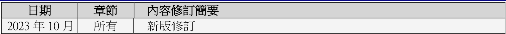

<html><body><table><tr><td>日期</td><td>章節</td><td>内容修訂簡要</td></tr><tr><td>2023年10月</td><td>所有</td><td>新版修訂</td></tr></table></body></html>

## 第 2 页

目錄  
電子行政運作手冊內容修訂概略  
第一章：保費到期通知 .  
1.1 保費到期通知流程  
1.2 保費支付後的餘額安排. 10  
第二章：更改保單. 11  
2.0 一般規則. 11  
2.1  轉讓╱取消轉讓 . 13  
2.2 增加附加保障 17  
2.3 更改地址、電話及電郵.. 20  
2.4 更改年齡╱出生日期 .. 21  
2.5 自動轉帳. 22  
2.6 更改受益人 26  
2.7 更改付款方法 . 28  
2.8 更改保費繳付方式 . 28  
2.9 備用保障權益 29  
2.10 更改身故賠償選項 . 32  
2.11 保證受保權益 33  
2.12 保單遺失聲明╱索取保單複製本 33  
2.13 降低基本計劃名義金額. 33  
2.14 删除附加保障╱降低附加保障保障額.. 35  
2.15 更改紅利運用方式 .. 35  
2.16 展期保險. 36  
2.17 取消額外保費或不保事項 36  
2.18 增加保障額 . 37  
2.19 通脹加保權益 39  
2.20 更改遞增投資權益 .. 41  
2.21 替換受保公司要員 41  
2.22 更改姓名. 44  
2.23 更改職業. 45  
2.24 更改保費支付人利益附加保障 . 46  
2.25 更改計劃. 46  
2.26 更改按期保費 . 48  
2.27 減額繳清保險 52  
2.28 保單復效... 52  
2.29 更正性別. 53

## 第 3 页

2.30 更改簽名. 54  
2.31 對減保費及保費預繳措施 54  
2.32 由標準保費率轉為非吸煙者保費率 . 56  
2.33 因保單持有人去世而需要更改保單持有權 58  
2.34 委任或更改保單承繼人 59  
2.35 委任或更改後備受保人 60  
2.36 更改受保人 61  
2.37 更改受保人至後備受保人 63  
2.38 保單優惠項目申請 . 63  
2.39 保費假期. 64  
2.40 因賠付致計劃終止後延續附加保障. 65  
2.41 身故賠償支付選項 67  
第三章：保單終止 ╱ 期滿 ╱ 轉換 . 68  
3.1 保單終止 68  
3.2 不接納保單（Not Taken） 71  
3.3 期滿. 72  
3.4 轉換 73  
第四章：保單提款 .. . 82  
4.1  提取紅利╱現金儲備. 82  
4.2  行使「終期紅利鎖定權益」及提取已鎖定之終期紅利金額 83  
4.3  貸款 83  
4.4  傳統保單之定期提取. 85  
4.5  更改入息開始年齡/年度 86  
第五章：投資相連壽險計劃之單位基金 . . 88  
5.1 支付派發投資選項 88  
5.2  整付金額╱投資／單次增加認講 . 88  
5.3  基金調配 89  
5.4  更改將來保費╱投資分配比例 . 90  
附錄 91  
附錄一 ：商業客戶之身份證明規定. 91  
附錄二 ：個人客戶之身份證明規定. 93  
附錄三：住址證明要求 94

## 第 4 页

第一章：保費到期通知

1.1  保費到期通知流程

傳統保單

客戶將透過保費通知書及短信收到應付保費的通知 ( 有關付款及支付方式，請於 MauTouch 參考「個人理財產品之付款及支付方式細節」)。

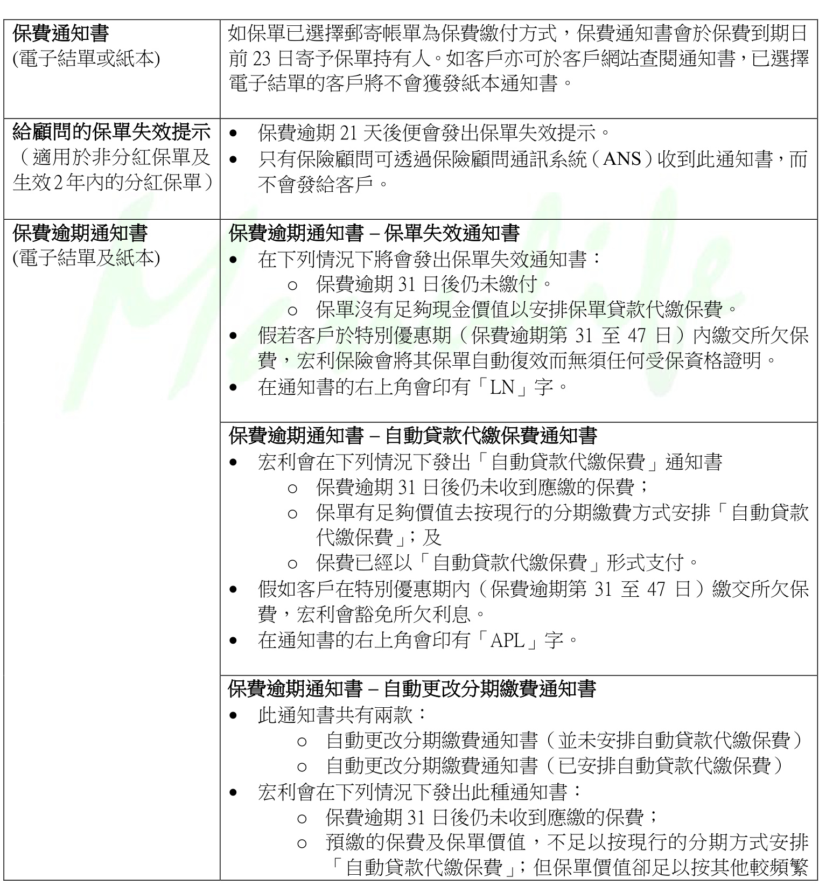

<html><body><table><tr><td>保費通知書 (電子結單或本) 電子結單的客户將不會獲發本通知書。</td><td>如保單已選選郵寄帐單為保費付方式，保費通知書會於保費到期日 前23日寄予保單持有人。如客户亦可於客户網站查閣通知書，已選選</td></tr><tr><td>給顧問的保單失效提示 （適用於非分紅保單及 生效2年内的分紅保單)</td><td>保費逾期21天後便會發出保單失效提示。 只有保顧問可透過保顧問通訊系統（ANS）收到此通知書；而 不會發給客戶。</td></tr><tr><td>保費逾期通知書 (電子結單及本)</td><td>保費逾期通知書－保單失效通知書 ·在下列情况下将會發出保單失效通知書： ○保費逾期31日後仍未付° 保單没有足現金價值以安排保單貨款代保費。 ）假若客户於特别優惠期（保費逾期第31至47日）内交所欠保 費，宏利保會將其保單自動復效而無任何受保資格證明。 在通知書的右上角會印有「LN」字。 保費逾期通知書－自動貨款代缴保費通知書 ·宏利會在下列情况下發出「自動貨款代保費」通知書 保費逾期31日後仍未收到應的保費； 保單有足價值去按現行的分期缴費方式安排「自動貨款 代保費」；及</td></tr><tr><td></td><td>保費已經以「自動貨款代保費」形式支付。 ·假如客戶在特别優惠期内（保費逾期第31至47日）交所欠保 費，宏利會豁免所欠利息。 ·在通知書的右上角會印有「APL」字。 保費逾期通知書－自動更改分期費通知書 ·此通知書共有雨款：</td></tr><tr><td></td><td>自動更改分期費通知書（未安排自動貨款代保費) 自動更改分期費通知書（已安排自動貨款代保費) ·宏利會在下列情况下發出此種通知書： 保費逾期31日後仍未收到缴的保費； 预缴的保費及保單價值，不足以按現行的分期方式安排 「自動貨款代保費」；但保單價值足以按其他较频繁</td></tr></table></body></html>

## 第 5 页

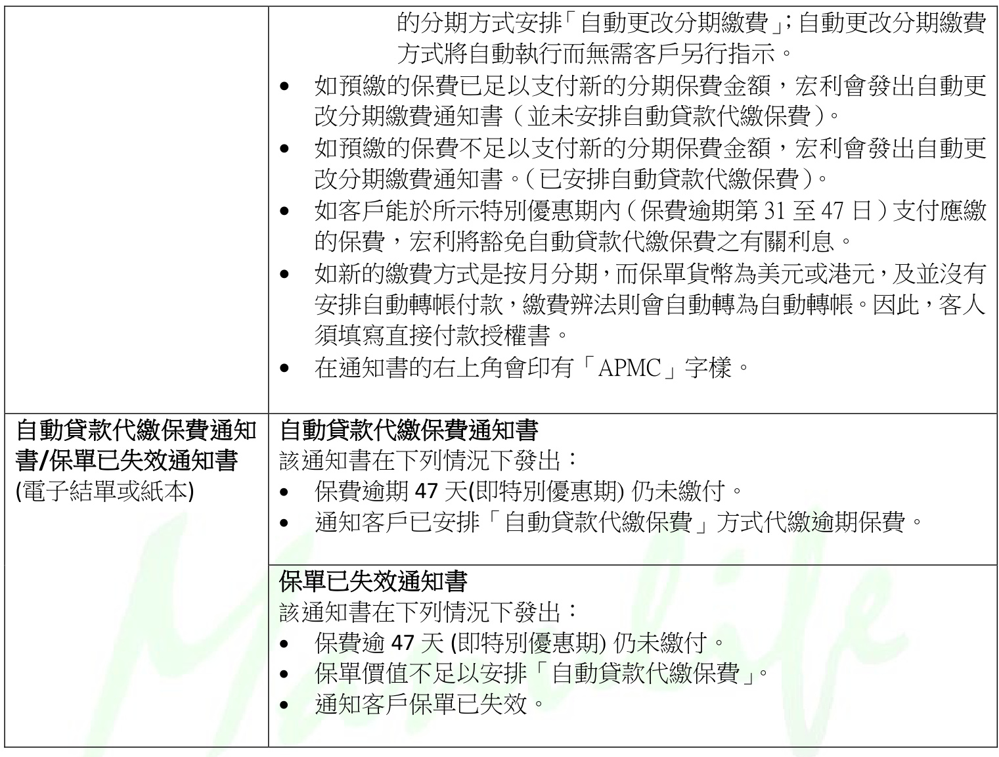

<html><body><table><tr><td rowspan="2">自動貨款代保費通知 書/保單已失效通知書 (電子結單或本)</td><td>的分期方式安排「自動更改分期缴費」；自動更改分期費 方式將自動執行而無需客户另行指示。 如预的保費已足以支付新的分期保費金额；宏利會發出自動更 改分期缴費通知書（未安排自動貨款代缴保費）。 如预的保費不足以支付新的分期保費金额；宏利會發出自動更 改分期費通知書。（已安排自動貨款代保費）。 如客户能於所示特别優惠期内（保費逾期第31至47日）支付應 的保費；宏利將豁免自動貨款代保費之有關利息。 如新的費方式是按月分期，而保單貨為美元或港元及没有 安排自動轉帐付款；費辨法则會自動轉為自動轉帐·因此客人 填寫直接付款授權書。</td></tr><tr><td>在通知書的右上角會印有「APMC」字樣。 自動貨款代缴保費通知書 該通知書在下列情况下發出： 保費逾期 47天(即特别優惠期)仍未付。 通知客戶已安排「自動貨款代保費」方式代缴逾期保費。</td></tr><tr><td></td><td>保單已失效通知書 該通知書在下列情况下發出： 保費逾47天(即特别優惠期)仍未付。 保單價值不足以安排「自動貨款代保費」。 通知客户保單已失效。</td></tr></table></body></html>

以下圖表標示出各類通知書的發出時間：

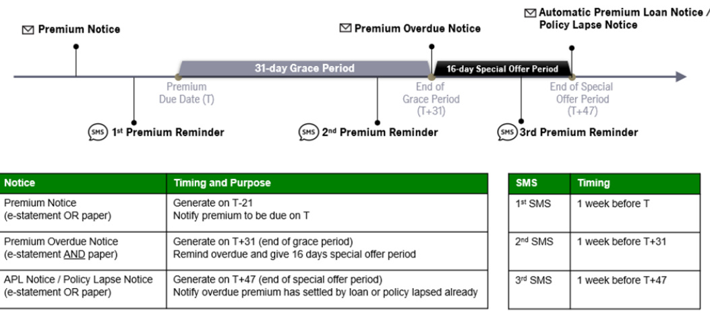

## 第 6 页

投資相連壽險計劃保單（萬利保障計劃、宏寶、靈活投資寶及宏利精選投資保）

a) 寬限期

假如首年內的逾期最低保費（MPRE/Contract Premium）或基金帳戶淨值不足以支付保單月費，客戶會收到保費備忘書。  
靈活投資寶╱萬利保障計劃╱宏寶保單將享有30 日的寬限期（宏利精選投資保之寬限期為31 日）。  
若寬限期過後仍未繳交保費，客戶會收到保單失效通知書，內附有關保單復效的規定。

b) 保費測試萬利保障計劃及宏寶保費測試會在下列時間執行：

首年年尾  
第二年年尾  
其後每兩年進行一次直至二十年止

首年年尾保費測試：

假如已付保費總和 $\angle$ 逾期保費總和，保險顧問的營業積分將被扣回。

第二年年尾保費測試：

假如已付保費總和 $<2{\sf x}$ 年度化MPRE，宏利會發出通知書通知客戶有關：  
o 欠缺；及  
o 保持保單生效應繳付的最低金額。假若宏利仍未收到所需的最低付款，宏利便會跟據保單條款認定該保單失效。  
在其後每兩年的保費測試中，假如保單的退保金額低於零，宏利便會當作第二年年尾保費測試不合格來處理。

靈活投資寶及宏利精選投資保第一年保費測試會在下列時間執行

第二個至第十二個月結日  
第十三個月結日  
第十四個月結日

在第二個至第十二個月結日：在（N）月結日的已收保費總和 $<$ （N -1）月結日的到期最低保費（MPRE/Contract Premium），宏利將發出保費備忘書。假若宏利於其後的一個月結日仍未收到所需的最低付款，客戶將會收到保單失效通知書。保險顧問的營業積分將於保單失效通知書發出後一個月被扣回。

## 第 7 页

第二年保費測試會在下列時間執行

第十三個月結日第十四個月結日第十五個月結日

在第十三╱十四╱十五個月結日：已收保費總和 < 首年到期最低保費（MPRE╱Contract Premium）：保險顧問的營業積分將於所有第二年保費測試失敗後被扣回。

宏利會發出保單失效通知書通知客戶有關：

逾期保費總額；及保持保單生效應繳付的最低金額。

投資相連壽險計劃保單（邁駿投資理財計劃）

a) 寬限期

• 於基本儲蓄帳戶之帳戶價值不足以支付該月之保單月費的情況下，「邁駿投資理財計劃」保單將享有31 日的寬限期，而保單將繼續有效：• 若寬限期過後仍未繳交保費，客戶會收到保單失效通知書，內附有關保單復效的規定。

b) 保單月結日

於每個保單月結日，保單將進行1. 保單月結日測試（MVY Test），及2. 淨保費測試

保單月結日測試（MVY Test）：

自保單生效日或以後，每月自動贖回於基本儲蓄帳戶的基金單位，以支付保單月費。  
保費備忘書將於行使保單月結日測試失敗後發出。  
保單失效通知書將於其後的一個月結日仍未收到所需的付款時發出。  
若連續三個月結日仍未收到所需的付款╱所需的付款不足以支付保單月費及保單未能執行「自動繳付保費」時，保單將告失效。

淨保費測試（Net Premium Test）：

淨保費測試決定自保單生效日以後的淨已繳保費是否足夠支付到期定期總保費。  
淨已繳保費 $\mathbf{\Sigma}=\mathbf{\Sigma}$ 已繳至基本儲蓄帳戶之保費總額（包括「自動繳付保費」之金額，如適用）–每次從基本儲蓄帳戶提取時 (如適用)超出當時免贖回費之基金提取限額的金額之累積總額保費備忘書（如自動轉帳拒付，則發出自動轉帳拒付通知書）將在（N）月結日的淨已繳保費 $\leqq$ （N–1）月結日的到期定期總保費時發出。  
另一份保費備忘書將於其後的一個月結日仍未收到所需的付款時發出。若連續三個月結日仍未收到所需的付款╱所需的付款不足以支付到期定期總保費及保單未能執行「自動繳付保費」時，保單月費中的欠繳保費手續費將從基本儲蓄帳戶內扣除。  
於第一年淨保費測試（第十二、十三、十四個月結日）及第二年淨保費測試（第十三、十四、十五個月結日），若（N）月結日的淨已繳保費 $\leqq$ （N–2）月結日的到期定期總保費時，保險顧問的營業積分將被扣回。

## 第 8 页

c) 自動繳付保費（Automatic Premium Payment）

自動繳付保費為尊尚投資帳戶的一個特點。  
倘若由於欠繳定期總保費或基本儲蓄帳戶價值不足以支付保單月費，於尊尚投資帳戶內的基金將被全部或部份贖回，以支付予基本儲蓄帳戶，用作減低欠繳定期總保費金額或填補基本儲蓄帳戶中到期應付的保單月費。  
宏利會發出保單通知書通知客戶有關自動繳付保費的安排。

投資相連壽險計劃保單（傲富投資理財計劃及傲峰定期投資計劃）

a) 寬限期

在最初供款期，當初期帳戶的結餘不足以扣減保單月費時，保單持有人可享有 31 天的寬限期； 及/或於最初供款期後，累積帳戶不足以扣減保單月費在寬限期過後沒有收到任何繳款或在最初供款期欠繳兩個月保費時，保單終止通知書會郵寄予保單持有人知會該保單的狀況及保單復效之相關要求。

b) 保費備忘書

於最初供款期內

以下任何一個情況出現會導致保單於寬限期後失效：

1. 有欠繳保費；或

2. 初期帳戶的結餘不足以扣減保單月費。

• 當保費到期時而初期帳戶的結餘不足以扣減保單月費時，保費備忘書 (只適用於非自動轉帳之個案)會於月結日發出。  
• 在下一個月結日，如保單內仍有欠繳保費及初期帳戶的結餘不足以扣減保單月費時，保單失效通知書便會發出。

最初期供款結束後

當累積帳戶的結餘不足以扣減保單月費時，保單便會失效。

1. 當累積帳戶的結餘不足以扣減保單月費時，保費備忘書會於月結日發出。2. 在下一個月結日，如累積帳戶的結餘仍不足以扣減保單月費時，保單失效通知書便會發出。

## 第 9 页

1.2  保費支付後的餘額安排

保費支付後的餘額將按照下列金額而作出相應安排：

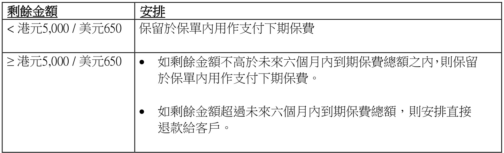

<html><body><table><tr><td>剩餘金额</td><td>安排</td></tr><tr><td><港元5,000/美元650</td><td>保留於保單内用作支付下期保費</td></tr><tr><td>≥港元5，000/美元650</td><td>·如剩餘金额不高於未來六個月内到期保費额之内，则保留 於保單内用作支付下期保费。 如剩餘金额超過未來六個月内到期保費總额，安排直接 退款給客戶。</td></tr></table></body></html>

現時保費支付後的餘額安排（維持不變）：

顧問可透過宏利全接觸於"Payment Suspense"一欄查閱確實餘額日後的繳費通知書，將會先扣除剩餘金額而列出應繳的淨金額客戶可以隨要求退回剩餘金額

## 第 10 页

第二章：更改保單

2.0 一般規則

一般指引

a) 客戶如需作全任何保單更改，可以透過客戶網站或填妥保單更改申請表格申請。 以下更改項目可透過客戶網站申請：

1 更改聯絡資料2 設立直接付款授權指示繳付續期保費3 更改保單受益人4 更改保費繳付方法/方式5 提取保單貸款6 調動／提取保單價值7 轉換現有投資選項8 更改未來投資分配指示如有任何附屬受讓人或受 MPSO╱MWPO 條款限制的保單，需分別取得附屬受讓人及所有受益人同意。b) 不可將更改的生效日期追溯至較早日子。c) 在更改保單申請表內的任何更正都需要客戶簽署全名。以首字母之署名將不獲受理。d) 當使用印鑑、十字記號或指紋印作簽署時，客戶須親身前往客戶服務中心辦理有關申請，客戶服務主任會確認客戶身份。e) 如當受保人年滿十八歲或以上，而有關更改涉及更高承保風險或須提供受保資格證明（EOI）時，受保人及保單持有人均須在有關表格上簽署。f) 如保單附有「保費支付人利益附加保障」，而保費支付人不是保單持有人時，有關涉及增加受保人的承保風險或保單復效申請，均須提交保費支付人及受保人的受保資格證明。因此，保單持有人、受保人及保費支付人均須在有關表格上簽署。g) 更換保險顧問須由「經銷獎酬及規管部」處理。h) 保險顧問可透過 e-APIS 中查閱客戶保單的「保費及付款工作表」，如需獲取更多客戶保費及貸款記錄，請遞交客戶之書面申請。i) 有關付款及支付方式，請於ManuTouch 參考「個人理財產品之付款及支付方式細節」。

## 第 11 页

保險顧問通訊系統 (ANS)

公司於收妥下列保單更改申請後的兩個工作天內，會透過保險顧問通訊系統 (ANS) 向保險顧問發送有關通知：

基金轉換╱更改基金分配╱保單注入款項 (如保單整付╱基金轉移╱基金分配；傳真轉換；轉換；更改基金分配；定期自動基金轉換；增加認購)提取基金 (如傳真贖回部份基金；設立定期提取基金╱更改定期提取基金)• 退保放棄投保$\cdot$ 保單復效增加保障• 保障升級• 增加名義金額

如保險顧問於遞交更改保單申請兩個工作天內仍未收到有關訊息，請盡快聯絡經銷服務櫃枱或致電熱線服務，以避免日後爭拗。

所需服務處理時間見列表。申請完成後，客戶╱保險顧問會收到由宏利發出的保單批註或通知書。請核對批註或通知書上的資料，如有錯漏，請在批註或通知書發出日起三十天內通知行政部。我們在確認有關資料為錯誤前，有權視之為正確無誤，並作為客戶就保單所作出的有關行政及/或投資分配 (如適用) 的依據。

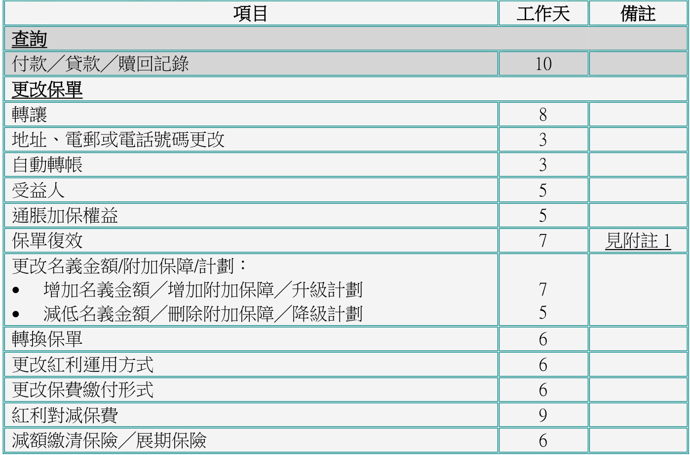

<html><body><table><tr><td>项目</td><td>工作天</td><td>備注</td></tr><tr><td>查詢</td><td></td><td></td></tr><tr><td>付款／貨款／回記錄</td><td>10</td><td></td></tr><tr><td>更改保單</td><td></td><td></td></tr><tr><td>轉</td><td>8</td><td></td></tr><tr><td>地址、電郵或電話號碼更改</td><td>3</td><td></td></tr><tr><td>自動轉帐</td><td>3</td><td></td></tr><tr><td>受益人</td><td>5</td><td></td></tr><tr><td>通加保權益</td><td>5</td><td></td></tr><tr><td>保單復效</td><td>7</td><td>见附 1</td></tr><tr><td>更改名義金额/附加保障/計劃： 增加名義金额／增加附加保障／升級計劃 减低名義金／刪除附加保障／降級計劃</td><td>7</td><td></td></tr><tr><td>· 轉换保單</td><td>5 6</td><td></td></tr><tr><td>更改紅利運用方式</td><td>6</td><td></td></tr><tr><td>更改保費付形式</td><td>6</td><td></td></tr><tr><td>紅利對减保費</td><td>9</td><td></td></tr><tr><td>减额清保／展期保</td><td>6</td><td></td></tr></table></body></html>

*表格标题：一般服務所需時間 (由交妥所有所需文件起計算)*

## 第 12 页

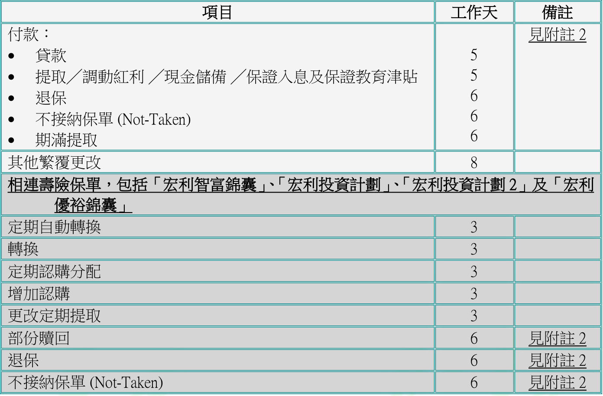

<html><body><table><tr><td>项目</td><td>工作天</td><td>備</td></tr><tr><td>付款： 貨款 提取／調動紅利／現金備／保證人息及保證教育津貼 退保</td><td>5 5 ６ 6</td><td>见附 2</td></tr><tr><td>· 不接納保單 (Not-Taken) 期满提取 其他繁覆更改</td><td>6 8</td><td></td></tr><tr><td colspan="3">相連壽保單，包括「宏利智富錦囊「宏利投資計劃「宏利投資計劃2」及「宏利</td></tr><tr><td colspan="3">優裕錦囊」</td></tr><tr><td>定期自動轉換</td><td>3</td><td></td></tr><tr><td>轉換</td><td>3</td><td></td></tr><tr><td>定期購分配</td><td>3</td><td></td></tr><tr><td>增加購</td><td>3</td><td></td></tr><tr><td>更改定期提取</td><td>3</td><td></td></tr><tr><td>部份回</td><td>6</td><td>见附 2</td></tr><tr><td>退保</td><td>６</td><td>见附 2</td></tr><tr><td>不接纳保單 (Not-Taken)</td><td>6</td><td>见附注2</td></tr></table></body></html>

重要：所需服務如未能於上述工作天內完成，請在遞交更改申請三十天內，聯絡經銷服務櫃枱或致電熱線服務，以保障客戶及公司利益。

附註：

附註（1）索取醫療報告的時間除外。  
附註（2）等待最後繳付款項確認期間及銀行處理電子付款予客戶的時間除外。

每日截止時間

保單行政服務文件及保單款項的截止時間定立為每日下午三時正，是項設定適用於與投資相連保單及傳統人壽保單。逄星期一至星期五下午三時正或之前於經銷服務中心及客戶服務中心與及設於各代理人樓層的個人保險文件收集箱所收取的保單行政服務文件及保單款項將視為於同一天收妥並會獲得優先處理。• 於下午三時後收取的文件及款項會視為於下一個工作天才收到並於下一個工作天處理。

2.1  轉讓╱取消轉讓

a) 轉讓分為兩種：絕對轉讓附屬抵押轉讓

## 第 13 页

b) 除非有證明文件（需經客戶服務中心或經銷服務中心職員核證）可證實轉讓人與受讓人之間的直系親屬關係（僅限父母、配偶及子女，兄弟姊妹除外），否則不可向保險顧問作出絕對轉讓或抵押轉讓。

c) 保單簽發後首十三個月內就無可保利益之一方（非保險顧問）所作出的轉讓，均需在客戶服務中心職員的見證下簽署作實。此等轉讓個案會按月存檔並向經銷獎酬及規管部作出匯報。

d) 若保單擁有權於保單簽發後一年內轉予內地客戶及該內地客戶並非現有保單持有人之任何直系親屬（即父母、配偶、子女等），則必須往利園客戶服務中心辦理有關手續。

e) 若保單擁有權於保單簽發後一年內轉予內地客戶及該內地客戶為現有保單持有人之任何直系親屬（即父母、配偶、子女等），則必須遞交有關直系親屬之證明文件。

f) 若符合所有規定，轉讓即時生效。

g) 保單持有人不可轉讓兒童信託保單（即在簽發保單時，受保人未滿十八歲且該保單為第三者保單）直至受保人年屆十八歲，而當時受保人已轉為保單持有人則除外。

h) 若保單為自願醫保計劃，客戶只能在一年內更改保單持有人一次。

i) 不接納退稅年金計劃保單轉換保單持有人。

j) 於日本以外居住及工作的日本國民日籍申請人必須符合下列條件方可更改保單持有人，並且必須於表格 F856 聲明以下幾點：

i) 客戶須有另一司法管轄區的居留權 (如以香港為例，香港身份證為有效證明)；及  
ii) 客戶必須已於國外居住最少三年；及  
iii) 客戶必須已放棄其日本居留權 (住民票) 或填寫表格 F856 向宏利證明他／她並非日本居民並打算繼續居住於日本以外。

絕對轉讓

a) 絕對轉讓將保單持有人的所有合約權益轉讓給「保單絕對轉讓契約」 （表格 T07_AA）內的新保單持有人(「宏利智富錦囊」、「宏利投資計劃2」及「宏利優裕錦囊」的保單持有人請填寫表格 WM10)。

b) 有關規定：

「保單絕對轉讓契約」 （表格T07_AA）(「宏利智富錦囊」、「宏利投資計劃」、 「宏利投資計劃2」及「宏利優裕錦囊」的保單持有人請填寫表格 WM10)重要資料聲明書 - 內地人士在港投購人身╱壽險保單，只適用於持有中華人民共和國居民身份證的人士

## 第 14 页

已核實之新保單持有人的香港身份證╱護照副本(如屬海外客戶，可接受提供兩份載有相片之不同身份證明文件副本) ，宏利服務中心的宏利員工或保險顧問可作核實的人士。  
保單持有人或擁有 $>25\%$ 股權或投票權的最終受益人的住宅地址證明的副本 (詳見附錄三)  
投資相連壽險保單需填寫「風險承擔能力問卷 (RPQ) 」  
如保單為「宏利智富錦囊」、「宏利投資計劃」及「宏利投資計劃2」並包含支付派發投資選，請同時遞交「支付派發投資選項申請表（宏利智富錦囊 / 宏利投資計劃）(T39) 」及提供帳戶資料證明

請按此處查閱有關新保單持有人的更多規定（如新保單持有人為商業客戶，請提交「商業保險問卷」（表格U02）及按此處查閱更多規定）

c) 新舊的保單持有人及不可更改之保單受益人（如適用）均須簽署。

d) 原有保單內收取身故賠償金額（因受保人身故）的指定受益人將被撤銷。身故賠償金額將支付予：

新指定受益人  
未有指定受益人受保人的遺產（適用於第二者保單）；或新保單持有人（適用於第三者保單）

e) 絕對轉讓可能不適用於「住院保障計劃」，詳情請參閱保單條款。

f) 翡翠人民幣儲蓄計劃的新保單持有人必須為香港╱澳門之永久居民。

g) 在完成有關手續後，保單絕對轉讓契約的副本將會發給新保單持有人。而新及原先的保單持有人亦會收到有關保單主權更改的確認信，而保險顧問會收到確認信之副本。

註釋：於2014年7月1日前簽發的in-scope保單，如發現保單持有人具有「美國身份」指標，我們會向客戶發出「FATCA信件」要求客戶在一個月內填交W-8BEN╱W-8BEN-E或W9表格（理財顧問將透過Agent Notification System收到該信件副本）。

附屬抵押轉讓

a) 附屬抵押轉讓影響保單的所有權。在保單持有人仍未清還附屬抵押受讓人的債務時，授予附屬抵押受讓人保單之所有合約權益。換言之，一旦保單持有人清還所欠債務時，附屬抵押受讓人便失去保單的合約權益。

b) 有關規定：

「保單抵押轉讓╱取消保單抵押轉讓」 （表格T07_CA）附屬抵押受讓人的香港身份證╱護照副本

## 第 15 页

請按此處查閱有關附屬抵押受讓人的更多規定

如附屬抵押受讓人為商業客戶，請提交：  
1. 最新的商業登記證；  
2. 公司註冊證書╱註冊證明書；  
3. 證明簽署人士已獲授權處理保單的授權書或董事會決議；  
4. 組織章程大綱及細則 (備註：組織章程大綱適用於二零一四年三月三日以前註冊成立之公司，除非公司已通過董事會決議或修改通知書修改其組織章程大綱，使其載於章程細則內。)  
5. 已核實之過去12 個月內發出列有董事及股東資料的公司查册報告\*

\*公司查冊：

(1) 由客戶提供經公司註冊處或專業第三者（如律師、公證人、會計師等）確認之認證副本或  
(2) 由保險顧問直接在公司註冊處進行查冊後取得的公司查冊報告之副本及必須在副本上聲明該報告乃由他╱她直接進行查冊所得。  
c) 在完成有關手續後，保單抵押轉讓╱取消保單抵押轉讓的副本將會發給保單持有人。而保單持有人亦會收到有關附屬抵押轉讓的確認信，保險顧問會收到確認信之副本。  
d) 該保單轉讓並無更改其受益人或信託人，受讓人可隨時以書面形式轉換更改受益人或信託人。

取消抵押

a) 填寫「保單抵押轉讓╱取消保單抵押轉讓」表格的第二部份（表格T07_CA）。客戶需在 表格內指明為「取消抵押」。  
b) 當保單持有人已清還欠附屬抵押受讓人的全部債項時，保單持有人或客戶應向附屬抵押受讓人取得書面同意，取消該附屬抵押轉讓。附屬抵押受讓人須填妥及簽署「保單抵押轉讓╱取消保單抵押轉讓」表格的第二部份，並由見證人簽署，假如附屬抵押受讓人為商業客戶，還需蓋上公司印章。

c) 如附屬抵押受讓人為商業客戶及授權簽署人士已更改，請提交以下額外文件：

1. 最新的商業登記證；  
2. 公司註冊證書╱註冊證明書；  
3. 證明簽署人士已獲授權處理保單的授權書或董事會決議；  
4. 組織章程大綱及細則 (備註：組織章程大綱適用於二零一四年三月三日以前註冊成立之公司，除非公司已通過董事會決議或修改通知書修改其組織章程大綱，使其載於章程細則內。)  
5. 已核實之過去12個月內發出列有董事及股東資料的公司查册報告\*

## 第 16 页

\*公司查冊：

(1)  由客戶提供經公司註冊處或專業第三者（如律師、公證人、會計師等）確認之認證副本或  
(2) 由保險顧問直接在公司註冊處進行查冊後取得的公司查冊報告之副本及必須在副本上聲明該報告乃由他╱她直接進行查冊所得。

轉換兒童保單持有人

a) 一份已設立信託人的兒童保單如受保人（「兒童」）年屆十八歲，他╱她將成為保單之持有人。當受保人年屆十八歲時，信託人將無權代表受保人行使任何有關之保單更改及權益。

b) 信託人之保單持有權轉換至受保人之有關規定︰

轉換兒童保單持有人申請表 （表格T29），並附有「受益人及持權人 」條款，由受保人簽署  
已核實之受保人身份證副本(如屬海外客戶，可接受提供兩份載有相片之不同身份證明文件副本)  ，宏利服務中心的宏利員工或保險顧問可作核實的人士。新保單持有人的住址證明 (詳見附錄三)如需更改指定受益人，須填寫更改保單申請表 （表格T02）

d) 在完成有關手續後，客戶將獲發轉換兒童保單持有人申請表副本一份。而新及原先的保單持有人亦會收到有關保單主權更改的確認信，保險顧問會收到確認信之副本。

c) 當受保人年屆十八歲時，若持有權需轉讓予第三者，除提供受保人身份證副本外，必須填寫保單絕對轉讓契約表格（表格T07_AA），並且由新保單持有人、保單持有人（「受保人」）及見證人共同簽署作實。有關規定，請參閱絕對轉讓。

註釋：如發現保單持有人具有「美國身份」指標，我們會向客戶發出「FATCA信件」要求客戶在一個月內填交W-8BEN/W-8BEN-E或W9表格（理財顧問將透過Agent Notification System收到該信件副本）。

2.2  增加附加保障

一般指引

a) 只可以增加宏利目前可提供的附加保障。  
b) 由「宏利人壽保險公司」 （“MLI”） 簽發的保單 （即保單號碼首兩個數字為“01” ）不再接受增加附加保障(except exercising “Cover-Me-Again” option)  
c) 有關規定：

## 第 17 页

• 從ManuTouch 獲取報價的特定申請表格；或更改保單申請表（表格T02）及保單復效申請╱受保資格聲明（表格U36）

• 有關稅務合規條款的證明之投保申請附加資料，如此申請為不可衍生保單價值的基本計劃內加入可衍生保單價值的附加保障。如發現保單持有人或受益人具有以下身份指標，則需同時遞交以下表格：o 「美國身份」指標： W-8BEN-E﹝供公司客戶填寫﹞或W9﹝供美國人士 / 實體為美國人士、美國公司、合夥組織、遺產、或信託﹞o 「非香港身份」指標： 個人稅務居民身份自我證明表格《通用報告準則和海外帳戶稅收合規法案》﹝供個人客戶填寫﹞或實體稅務居民身份自我證明表格﹝供公司客戶填寫﹞ 控權人稅務居民身份自我證明表格﹝供被動非財務實體公司客戶填寫﹞  
• 理財需要分析（如適用者）重要資料聲明書 - 內地人士在港投購人身╱壽險保單（只適用於持有中華人民共和國居民身份證的人士）需付保費（如適用者）  
$\cdot$ 有關問卷（如適用者）請參閱「電子行政作手冊新生意及核保程序」查閱一般體檢及財務核保要求。受保人或需因健康狀況而提供進一步的體檢要求。核保部提出的其他要求：1. 如受保人於所有公司包括此申請的投保總額超過 1,500,000 美元，請填寫「財政狀況問卷」（表格U01）。2. 若增加或提高家庭計劃成員的住院保障，請填寫「住院保障問卷（適用於家庭成員）」（表格U31）。

d) 新增的附加保障會在下一個月結日生效。

e) 如屬醫療或危疾附加保障，保險顧問應提醒客戶注意有關醫療及或危疾計劃的緩接期。

f) 就「住院附加保障」、「安康人生住院附加保障」、「精彩生活住院附加保障」、「住院保障計劃」及「我‧健康」醫療計劃而言，請參考以下有關增加及減低保障的細則：

更改受保人之數目可在下一個月結日生效。如屬「安康人生住院附加保障」、「精彩生活住院附加保障」及「我‧健康」醫療計劃，可選擇增加或減低保障，但家庭計劃申請將不獲受理。• 在月結日生效的任何更改，將會根據上一個周年日的已達年齡計算保費。

g) 兒童保單（投保年齡為0 至15 歲）新增「現金扶危附加保障」及╱或「一世無憂危疾附加保障」及╱或「安康人生危疾附加保障」時，若總投保額超過1,200,000 港元╱150,000 美元╱180,000 加元╱105,000 英磅，受保人的父母必須持有危疾保障。請於「更改保單申請表」（表格T02 ）– 「其他」一項上註明有關危疾保障的金額及保險公司名稱。

## 第 18 页

h) 就「伴我行」醫療儲備」而言，當剩餘醫療儲備╱退休醫療儲備少於指定最低儲備時不可增加附加保障。

i) 在完成有關手續後，客戶會收到以下文件：

一份批註有關保單條款（如適用者）

投資相連壽險計劃

a) 有關規定：

從 ManuTouch 獲取報價的特定申請表格；或更改保單申請表（表格 T02）及保單復效申請╱受保資格聲明（表格U36）  
理財需要分析（如適用）  
風險承擔能力問卷（如適用）  
重要資料聲明書及投保人聲明書投資相連壽險計劃(投資相連壽險)保單（如適用）需付保費（如適用）  
有關問卷（如適用）  
按期保費差額（若舊按期保費低於新按期保費）  
請參閱「第一部份（第二章）：新增業務—核保指引」查閱一般體檢及財務核保要求。受保人或需因健康狀況而提供進一步的體檢要求。  
核保部提出的其他要求：  
1. 如受保人於所有公司包括此申請的投保總額超過 1,500,000 美元，請填寫「財政狀況問卷」（表格U01）。  
2. 若增加或提高家庭計劃成員的住院保障，請填寫「住院保障問卷（適用於家庭成員）」（表格U31）。  
3. 若申請「懷孕保障」，請填寫「懷孕保障問卷」（表格U43）。 $\mathrm{~\circ~}$ （須與「我的智愛女性附加保障 – 懷孕保障」 建議書摘要一併遽交）。

b) 增加附加保障的規限：

萬利保障計劃：每年只可增加一次

宏寶：

增加後按期保費符合新的最低規定（每一萬保額三十元）只可於對上一次增加的一年後增加

靈活投資寶、宏利精選投資保及邁駿投資理財計劃、傲富投資理財計劃及傲峰定期  
投資計劃:  
• 視乎該附加保障之產品特性

c) 增加附加保障的最低╱最高保額必須符合保費率手冊的有關規定。

## 第 19 页

d) 增加部份仍須遵從以加各項的有關限制：

年齡基本計劃╱附加保障的保額如屬「萬利保障計劃」、「靈活投資寶」及「宏利精選投資保」，基本計劃內多繳的首次費用，絕不可用以支付其後因增加附加保障而招致的首次費用。範例：

基本計劃： 保單生效日期：靈活投資寶 95 年 6 月 13 日由 13/6/95 起至 12/6/96 的首次費用於 13/6/95 收取的保費於 13/8/95 到期的首次費用

預支的首次費用

MPRE：每月 $\$100$   
$=100.00\times12$ 個月 $=1200.00$   
$=1200.00$   
$\mathbf{\Lambda}=100.00\times2=200.00$   
$\begin{array}{r l}{=}&{{}1200.00-200.00=1000.00}\end{array}$   
= $50.00\times12$ 個月 $=600.00$ 0.00$50.00-0.00=50.00$

新增的現金扶危保障生效於 13/8/95現金扶危保障的MPRE：每月 $\$5$ 50由 13/8/95 起至 12/8/96 的首次費用已收取保費：

於 $13/8/95$ 逾期的首次費用

雖然己收取的保費（ $\$1200$ ），高於 96 年 8 月 13 日逾期的首次費用（ $\$200+$ $\$50=9250$ ），保單亦會因不能通過保費測試而失效。

e) 在完成有關手續後，客戶可獲發更改保單批註。

整付保費計劃

整付保費計劃並不設有附加保障，因此增加附加保障將不會接納。

儲蓄產品簡易投保申請

保險顧問應在提出更改前獲取一份報價表。

2.3  更改地址、電話及電郵

a) 有關規定：

客戶可透過填寫及簽署「更改聯絡資料表格」﹝表格CS01a﹞更改聯絡資料。如簽署無效，公司將致電客戶跟進。

b) 在完成有關手續後，「更改通訊地址確認書」將會同時寄往保單持有人最新及更新前的通訊地址。

## 第 20 页

c) 如保單持有人之通訊地址已失效，公司會向已於宏利提供有效香港 ╱澳門流動電話號碼之保單持有人，發出手機短訊提示需更新有關紀錄。若通訊地址已持續失效四個月，公司會再次向保單持有人發出手機短訊以作跟進。  
d) 如保單持有人之通訊地址已失效，而該保單持有人並未於宏利提供有效香港 ╱澳門流動電話號碼但提供了有效電郵地址，宏利則以電郵方式發放「郵寄地址不正確」之電子提示予保單持有人以作提示。  
e) 顧問亦會透過「宏利全接觸」之「保險顧問通訊系統 Agent Notification System（ANS）」獲得通知有關客戶通訊地址已失效，以便與客戶跟進及更新地址。  
f) 如客戶地址於失效後第一、第二及第三個月仍未更新，顧問亦會透過ANS 獲發送「備忘通知」、「最後通知」及透過 Secure In Box 獲發送一份「地址失效客戶列表」報告。此外，各分區總監及經銷總監亦會每月透過 Secure In Box 及電郵獲發送「地址失效客戶報告摘要」作檢閱用途，該摘要會列岀地址失效超過四個月的客戶數目。  
g) 保險顧問必須跟進聯絡資料不正確的保單，並建議客戶更新聯絡資料。  
備註：如發現保單持有人具有「美國身份」或「非香港身份」指標，我們會向客戶發出「FATCA  
信件」或「CRS信件」要求客戶在一個月內填交W-8BEN/W-8BEN-E或W9或有效的稅務居民身份  
自我證明表格（理財顧問將透過Agent Notification System收到該信件副本）。

2.4  更改年齡╱出生日期

a) 若客戶發現在宏利的記錄內，受保人或保費支付人的出生日期一欄，與實際日期不同，應立刻通知宏利。

b) 這類錯漏會有以下結果：無需更改受保人或保費支付人的保險年齡需更改受保人或保費支付人的保險年齡

c) 有關規定：

「更改個人資料表格」﹝表格CS01b﹞或「更改保單申請表」（表格T02）  
因保險年齡報細了而需補交的保費  
假如保險年齡須更改，需交出保單合約  
有關年歲的證明文件副本香港身份證出生證明書洗禮證明書

## 第 21 页

護照 歸化證明書 身份證明書 回港證

當身份證明文件未能反映受保人╱保費支付人的正確投保年齡（如只顯示其出生年份），受保人╱保費支付人可到民政事務總署就其出生日期宣誓以用作證明年齡的補充資料。

備註：如發現保單持有人具有「美國身份」或「非香港身份」指標，我們會向客戶發出「FATCA信件」或「CRS信件」要求客戶在一個月內填交W-8BEN/W-8BEN-E或W9或有效的稅務居民身份自我證明表格（理財顧問將透過Agent Notification System收到該信件副本）。

更改出生日期而年齡不變

a) 不會影響保單保費。  
b) 受保人的出生日期更改後，客戶可獲得「通知書」以確認收到客戶所提供的年齡證明資料。

更改出生日期及年齡

a) 會影響保單保費。  
b) 客戶或保險顧問應事先索取報價表。  
c) 將會出現以下兩種情況：投保申請表的保險年齡報大了投保申請表的保險年齡報小了

d) 投保申請書上的保險年齡報大了，亦可能多收了保費。多繳的保費將於完成更改手續後退回。若保單已簽發五年，只可退回多出的現金價值。

e) 投保申請上書的保險年齡報小了，亦可能少收了保費。須於提出更改時補交保費。補交的保費須支付利息。否則有關保額將會作出相應調整。

f) 在完成有關手續後，客戶可獲得：

受保人或保費支付人的出生日期更改後，客戶可獲得「通知書」以確認收到客戶所提供的年齡證明資料。  
更改保單批註（如保額有作出相應調整）。

2.5 自動轉帳

## 第 22 页

設立自動轉帳 (銀行帳戶) (繳付續保保費)

a) 要設立自動轉帳服務，客戶須：? 填妥一份直接付款授權書」或於客戶網站申請• 在自動轉帳服務開始生效之前，安排繼續支付保費。  
b) 不接受用於直接付款授權設置的電子錢包或虛擬銀行。  
c) 成功設立自動輚帳後，尚未登記電子結單服務的客戶將會收到短信。選擇電子結單服務的客戶將會收到電子提示，通知他們在客戶網站查看電子結單。 顧問將同時透過 ANS 通知獲取電子版。如自動轉帳設立被拒，客戶和顧問亦會收到自動轉帳設立被拒通知書。  
e) 如保單為非每月繳費的自動轉帳客戶，於銀行扣帳扣日前約兩個工作天會收到短訊提示，好讓客戶作更好的付款安排，避免因自動轉帳被拒而引致保單失效。顧問亦可透過ANS 收取相關資訊。  
f) 如自動轉帳拒付，客戶和顧問會於轉帳日約十個工作天後收到自動轉帳拒付通知書。  
g) 若該保單已設置了自動扣繳逾期保費的安排而當月的自動轉帳被拒，逾期的保費將於下月的同一轉帳日自動扣繳。  
h) 如果連續三次自動轉帳被拒（因戶口資金不足），自動轉帳便會暫停。

補過自動轉帳

a) 對於仍然生效的保單，除非其自動轉帳已失效，欠交的保費可於下一次自動轉帳時補過 。  
b) 此服務亦適用於一次過償還自動貸款代繳保費，可選連利息或不連利息償還。

c) 辦理手續：

• 請填寫「更改保單申請表」（表格T02）或「自動轉帳付款安排申請表」（表格T02c）或其副本；  
• 若要指定在某一次自動轉帳時補過所欠款項，行政部須於該轉帳日十天前收到有關服務的要求。

d) 投資相連壽險計劃保單︰必須於「更改保單申請表」（表格T02）或「自動轉帳付款安排申請表」（表格 $\mathtt{T02c}$ ）註明分期付款次數，而金額必須為按期保費之倍數。

e) 有關轉帳日期之規定：

<html><body><table><tr><td>原先轉帐日期</td><td>補過自動轉帐日期</td></tr><tr><td>3号</td><td>28號或3號</td></tr></table></body></html>

## 第 23 页

<html><body><table><tr><td>14号</td><td>3號或14號</td></tr><tr><td>28号</td><td>14號或28號</td></tr></table></body></html>

自動扣繳逾期保費服務

a) 自動扣繳逾期保費服務會為客戶於下月的轉帳日自動扣繳其逾期保費。  
b) 此服務適用於已設有直接付款授權 (表格DDA) 的香港及澳門保單。經由宏利信用卡或通聯支付的自動轉帳並不包括在此服務中。  
c) 如客戶欲更改有關自動扣繳逾期保費的安排，請填妥並交回更改保單申請表 (表格T02) 或自動轉帳付款安排申請表 (表格T02c)。  
d) 此服務適用於傳統保單、萬用壽險及投資相連壽險計劃保單  
e) 此服務適用於月繳、季繳、半年繳及年繳的繳付形式。• 月繳– 將在下月收取最多兩期保費 （即上月的逾期保費及該月的保費）$\cdot$ 季繳、半年繳及年繳 – 將在下月收取最多一期保費（即上期的逾期保費）

f) 逾期的保費將於下月的同一轉帳日自動扣繳:

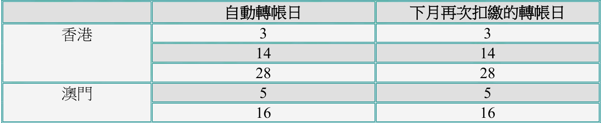

<html><body><table><tr><td></td><td>自動轉帐日</td><td>下月再次扣的轉帐日</td></tr><tr><td rowspan="3">香港</td><td>3</td><td>3</td></tr><tr><td>14</td><td>14</td></tr><tr><td>28</td><td>28</td></tr><tr><td rowspan="2">澳門</td><td>5</td><td>5</td></tr><tr><td>16</td><td>16</td></tr></table></body></html>

g) 如客戶的自動轉帳安排已被暫停，自動扣繳逾期保費也將會暫停。

h) 如逾期保費是在自動轉帳拒付通知書發出後及下月轉帳日之前已繳付，我們將不會安排自動扣繳逾期保費。  
i) 在自動轉帳拒付通知書發出前所繳付的款項，將不會被視為用於繳付通知書上的拒款，我們仍會於下月的轉帳日安排自動扣繳逾期保費 (未有逾期保費的傳統保單除外)。

取消╱恢復╱暫停自動轉帳

請填妥「更改保單申請表」（表格 T02）或「自動轉帳付款安排申請表」（表格 T02c）或其副本。

用自動轉帳償還貸款

a) 除了投資相連壽險計劃保單外，客戶可透過自動轉帳，償還保單貸款。• 償還貸款的分期繳費方式須與保單的一樣。

## 第 24 页

· 轉帳金額應為某個指定的償還額或貸款總額加上利息（以較低者為準）。若要指定在某一次自動轉帳時償還保單貸款，行政部須於該轉帳日十天前收到有關服務的要求。

b) 請填妥「更改保單申請表」（表格 T02）或「自動轉帳付款安排申請表」（表格 T02c）或其副本。

自動轉帳 (宏利信用卡)

a) 只有宏利信用卡持有人才可申請以宏利信用卡方法付款。  
b) 只適用於按月繳費的港元及美元保單。  
c) 不適用於投資相連壽險計劃保單。  
d) 將會在保費到期付款日之前 23 日處理該項繳費交易。  
e) To set up Manulife Credit Card Payment Method, client should:請清楚填寫宏利信用卡直接付款授權書（ 表格 T21 黃色表格）每份宏利信用卡直接付款授權書只可為一份保單繳付保費。

f) 如果發生拒付，客戶會收到有關通知，而保險顧問亦會收到一份通知書的副本。

取消宏利信用卡付款方法

a) 如果新的付款方法是自動轉帳，便要遞交直接付款授權書。 表格 T19b) 若非轉為以自動轉帳付款，便要遞交更改保單申請表（表格 T02 ）。

更改自動轉帳

a) 更改自動轉帳包括：

更改自動轉帳還款額  
更改自動轉帳戶口  
更改轉帳日  
暫停現行自動轉帳  
恢愎失效的自動轉帳  
取消自動轉帳  
更改付款人

## 第 25 页

b) 有關規定：

更改保單申請表（表格T02）  
直接付款授權書（表格 T19）  
o 更改自動轉帳戶口  
o 重設自動轉帳日（如重新設定自動轉帳授權）  
o 恢愎失效已久的自動轉帳；或  
o 更改付款人  
撤消現有自動轉帳戶口  
預繳保費直至新自動轉帳戶口啟動

2.6  更改受益人

a) 第二者保單（即保單持有人亦為受保人）可指定任何人作受益人。  
b) 第三者保單（即保單持有人不同於受保人）可指定任何人作受益人，但不可指定為保單持有人之遺產，而保單持有人及受保人均具有可保利益。  
c) 除非有證明文件（需經客戶服務中心或經銷服務中心職員核證）可證實保單持有人╱受保人與受益人之間的直系親屬關係（僅限父母、配偶、子女及兄弟姊妹），否則不會接納以保險顧問作為受益人之申請。  
d) 自願醫保每年只限更改受益人一次。  
e) 如於某些情況下保單持有人未能指定個別之受益人以收取身故賠償金額，請參閱下表有關填寫第二及第三者保單之適當字眼︰

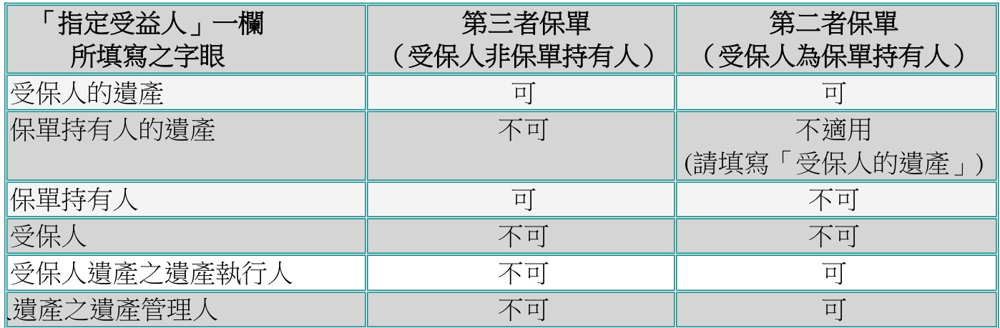

<html><body><table><tr><td>「指定受益人」一 所填寫之字眼</td><td>第三者保單 (受保人非保單持有人)</td><td>第二者保單 (受保人為保單持有人)</td></tr><tr><td>受保人的遗產</td><td>可</td><td>可</td></tr><tr><td>保單持有人的遗產</td><td>不可</td><td>不適用 (請填寫「受保人的產」）</td></tr><tr><td>保單持有人</td><td>可</td><td>不可</td></tr><tr><td>受保人</td><td>不可</td><td>不可</td></tr><tr><td>受保人遗產之遗產執行人</td><td>不可</td><td>可</td></tr><tr><td>遗產之遗產管理人</td><td>不可</td><td>可</td></tr></table></body></html>

f) 有關規定：

更改保單申請表（表格T02）。於「指定受益人」部份，清楚填寫受益人全名、與受保人關係，及為核實指定受益人的身份及作紀錄之用， 提供受益人的香港身份證╱護照╱商業登記證號碼 \*。(備註: 請參閱個別保單合約有關付款予受益人的條款，一般而言，身故賠償給予受保人身故時在世的受益人。)

## 第 26 页

或

指定受益人表格 (表格 T02b)  
清楚填寫受益人資料如上述所列。如於方格內選擇「特別安排」，保單之身故賠償將根據所示的百份比支付予 (1) 指定受益人(受保人身故時尚生存之受益人)及 (2) 指定受益人之遺產(受保人身故時已去世之受益人)。

或

於客戶網站更改受益人選擇受益人類別及輸入所需受益人的正確資料。

• 如使用表格 T02b，而其中一位受益人為「慈善機構」及已選擇「特別安排」，須：

o 清楚填寫慈善機構全名、與受保人關係為「慈善機構」，及提供該慈善機構的註冊編號.o 保險顧問可建議客戶個別通知該慈善機構已被指定為保單其中一位的受人\*為遵守防止洗黑錢規定及於處理索償時準確識別受益人的身份，任何投保申請在指定受益人或其後更改受益人時，均須在有關申請表上提供受益人及信託人（如適用）的香港身份證╱護照╱商業登記證號碼。未能提供齊備資料的投保申請將不予受理，唯受益人為受保人的「直系親屬」則可獲豁免。「直系親屬」指以下其中一項關係：

1. 父╱母  
2. 子╱女  
3. 兄弟╱姊妹  
4. 丈夫╱妻子

g) 指定受益人申請不適用於「住院保障計劃」。根據「住院保障計劃」條款，受益人必須為「保單持有人或保單持有人之遺產」。  
h) 在完成有關手續後，客戶可根據電子結單選項獲得一份更改指定受益人確認信。 顧問將透過 ANS 通知獲取電子版。  
i) 如屬第二者保單內所指定的受益人去世，身故賠償會給予次位受益人（如適用）。如無次位受益人，賠償會在受保人去世時撥入其遺產。  
j) 如屬第三者保單，其受益人亦是保單持有人，詳情請按此處。

未成年受益人

a) 假如受益人未滿18 歲，即受益人為未成年及沒有法定地位。  
b) 保單持有人應為孩子在未成年其間（即孩子18 歲前）指定一位信託人，否則，支付賠償時，情況便會變得十分複雜。  
c) 假如客戶指定配偶為信託人，客戶亦可同時指定一位候補信託人。  
例如：「陳大文，兒子」  
（當受益人未成年時，全部受益款項應交予其信託人，即本人之妻子蔡賢淑。假如該信託  
人亦已辭逝，候補信託人則為本人之妹陳小玲。）

## 第 27 页

d) 假如次位受益人為未成年人士，其信託人不能是首位受益人。因為當次位受益人有權領取受益款項時，信託人亦即首位受益人已經辭逝。

2.7   更改付款方法

a) 有關規定：

透過客戶網站申請，或  
更改保單申請表（表格 T02）（亦接受副本）及直接付款授權書（表格 T19）如繳  
付方法為自動轉帳  
b) 如申請每月繳付方式，則必須以自動轉帳為繳付方法  
c) 在完成有關手續後，更改保費繳付形式的確認信 (紙本或電子版) 將根據客戶登記的結單發送方式發送。顧問將透過 ANS 通知獲取電子版。

2.8  更改保費繳付方式

傳統計劃、萬利保障計劃靈活投資寶、宏利精選投資保及邁駿投資理財計劃、傲富投資理財計劃及傲峰定期投資計劃

a) 有關規定：

透過客戶網站申請(只限傳統計劃)；從 ManuTouch 獲取報價的特定申請表格；或  
更改保單申請表（表格T02）或其副本  
需付保費╱預繳保費（如適用者）  
新的直接付款授權書（如適用者，請參考表格 T19）或透過客戶網站申請  
撤消現有直接付款授權書或撤消委託付款書（如適用者）

b) 更改在下一個月結日生效。(適用於傳統計劃)

c) 萬利保障計劃、靈活投資寶、宏利精選投資保及邁駿投資理財計劃、傲富投資理財計劃及 傲峰定期投資計劃只提供月繳及年繳保費繳費方式。

d) 若將保單轉為月繳，須遞交直接付款授權書。

## 第 28 页

e) 客戶須支付足夠的保費以便辦理自動轉帳。從月繳轉至其他分期（即每季╱每半年╱每年）須支付需付保費。

範例：

按月已支付四期保費

從月繳轉至年繳，須支付保費金額 $=8\diagup12$ 年費。$\cdot$ 從月繳轉至半年繳，須支付保費金額 $=2\diagup12$ 年費。

f) 在完成有關手續後，更改分期繳費確認通知書(紙本或電子版) 將根據客戶登記的結單發送方式發送。顧問將透過 ANS 通知獲取電子版。

宏寶

a) 程序和有關規定與傳統保單相同。  
b) 但在計算新的分期保費金額時，須符合最低規定。

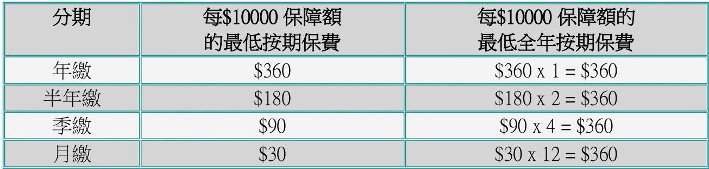

<html><body><table><tr><td>分期</td><td>每$10000 保障额 的最低按期保費</td><td>每$10000保障额的 最低全年按期保費</td></tr><tr><td>年缴</td><td>$360</td><td>$360 x 1 = $360</td></tr><tr><td>半年</td><td>$180</td><td>$180 x 2 = $360</td></tr><tr><td>季缴</td><td>$90</td><td>$90 x 4 = $360</td></tr><tr><td>月</td><td>$30</td><td>$30 x 12 = $360</td></tr></table></body></html>

2.9  備用保障權益

a) 於可行使「備用保障權益」前1 個月，公司會向客戶發出邀請信重申有關之保障權益。b) 客戶可購買另一份可供行使「備用保障權益」而最相近的危疾保障╱附加保障。c) 可供投保之危疾產品

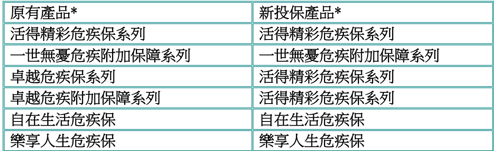

<html><body><table><tr><td>原有產品*</td><td>新投保產品*</td></tr><tr><td>活得精彩危疾保系列</td><td>活得精彩危疾保系列</td></tr><tr><td>一世無蔓危疾附加保障系列</td><td>一世無蔓危疾附加保障系列</td></tr><tr><td>卓越危疾保系列</td><td>活得精彩危疾保系列</td></tr><tr><td>卓越危疾附加保障系列</td><td>活得精彩危疾保系列</td></tr><tr><td>自在生活危疾保</td><td>自在生活危疾保</td></tr><tr><td>樂享人生危疾保</td><td>樂享人生危疾保</td></tr></table></body></html>

## 第 29 页

\* 新投保產品之保費繳付期不應較原有產品之保費繳付期為長。

d) 生效日：

申請「活得精彩危疾保」、「自在生活危疾保」及「樂享人生危疾保」系列：

保單生效日為投保申請書簽署日根據現有慣例，接受追溯至較早的生效日申請申請「一世無憂危疾附加保障」系列：

保障生效日為保單周年日  
新增附加保障生效日規例1：如遞交申請日與即將到來的周年日相距2 個月或以下，新增附加保障生效日為即將到來的周年日規例 2：如遞交申請日與即將到來的周年日相距多於 2 個月，新增附加保障生效日為上個周年日  
適用於投資相連保單 – 規例3- 新增附加保障生效日為即將到來的周年日

一般指引：

## 第 30 页

投保「活得精彩危疾保」、「自在生活危疾保」及「樂享人生危疾保」系列

1. 宏利會向客戶發出邀請信重申有關之保障權益

2. 表格 U03 及相關文件

於可行使「備用保障權益」限期內遞交申請  
須填寫計劃╱附加計劃名稱及保障  
在 特 別 指 示 一 欄 註 明 “Execute the Cover-me-option of policy no XX-  
XXXXXXX-X”

3. 投保申請附加資料

使用「宏利全接觸」內有關行使備用保障權益的投保申請附加資料表格

4. 索取計劃書/建議書摘要 (PS) 報價索取「活得精彩危疾保」系列之計劃書，於索取計劃書時請準備以下之資料

之前計劃的保單編號保費繳付期（請注意，新保單的保費繳付期必須相同或少於之前的保單保費繳付期）保障額（請注意，新保單的保障額必須相同或少於之前的保單之保障額）• 附加保費（如適用）

香港之保險顧問   於經銷服務中心(ASC)獲取計劃書及計劃書摘要(PS)  
澳門之保險顧問  於澳門客戶中心獲取計劃書及計劃書摘要(PS)或連同所需計劃書的資料寄電郵至(macauadm@manulife.com)

5. 增加保費或不保事項的投保申請附加資料表格 (F856) – 如有

6. 首期保費  
7. 保單持有人有效的身份証明文件，如香港智能身份証  
8. 保單持有人的住宅地址證明的副 (詳情請參閱附錄三)  
9. 理財需要分析（如適用）  
10.重要資料聲明書 - 內地人士在港投購人身╱壽險保單（只適用於持有中華人民共和  
國居民身份證的人士）

新增「一世無憂危疾附加保障」系列

1. 宏利會向客戶發出邀請信重申有關之保障權益

2. 表格 T02 及相關文件

於可行使「備用保障權益」限期內遞交申請須填寫計劃╱附加計劃名稱及保障額• 在其他一欄註明 “Execute the Cover-me-option of policy no “XX-XXXXXXX-X”

3.   投保申請附加資料• 使用「宏利全接觸」內有關行使備用保障權益的投保申請附加資料表格

4.   增加保費或不保事項的投保申請附加資料表格 (F856) – 如有  
5.  保費差額 (如須要)  
6.  理財需要分析（如適用）  
7.  重要資料聲明書 - 內地人士在港投購人身╱壽險保單（只適用於持有中華人民共和  
國居民身份證的人士）

## 第 31 页

2.10   更改身故賠償選項

萬利保障計劃、靈活投資寶及宏利精選投資保

a) 身故賠償選擇有兩種：選擇A：固定身故賠償選擇B：遞增身故賠償

b) 選擇A：固定身故賠償\* – 賠償金額相等於（取較高者）

基本計劃保障額在受保人去世時的保單帳戶淨值加上由宏利當時訂定的金額\* 最後的賠償金額包括所有有效的附加保障額

c) 選擇B：遞增身故賠償 – 賠償金額相等於以下兩者之和• 基本計劃保障額及所有有效的附加保障額；及在受保人去世時的保單帳戶淨值。

d) 保單生效 13 個月後便可更改身故賠償選擇（適用於靈活投資寶及萬利保障計劃）。宏利精選投資保則可於任何時候作出更改。

e) 由選擇A（固定）轉為選擇B（遞增）須提交受保資格證明。

萬利保障計劃：在更改生效日，基本保障額將會下降，下降金額相等於帳戶淨值。  
靈活投資寶：基本保障額將維持不變。  
宏利精選投資保：基本保障維持不變，但並不適用於有重病應急保障之計劃。

f) 由選擇B（遞增）轉為選擇A（固定）︰

萬利保障計劃：在更改生效日，基本保障額將會增加，增加金額相等於累積價值。  
靈活投資寶：基本保障額將維持不變。  
宏利精選投資保：基本保障維持不變。

g) 有關規定：

更改保單申請表（表格T02）  
保單復效申請╱受保資格聲明（表格 U36）第二、四及五部份（如身故賠償選擇  
由「固定」轉為「遞增」）h) 生效日期為宏利批準客戶的書面要求後的下一個月結日。  
i) 在完成有關手續後，客戶可獲得一份更改保單批註。

宏寶

a) 有關規定與萬利保障計劃相同。

## 第 32 页

b) 每次更改死亡賠償選擇須相隔至少一年。

2.11 保證受保權益

a) 「保證受保權益(GIO) 」 可於現金扶危附加保障及現金扶危附加保障(如適用)行使。  
b) 透過行使「保證受保權益」，客戶可以轉換保費模式由隨受保人年齡每年調整至水平式保費。水平式保費不會隨年齡遞增，但保費率並不保証。  
c) 客戶可於保單生效後的第 3 個及以後的任何保單周年日，以及達 61 歲前行使此權益。  
d) 於行使此權益後，保障會延長至 100 歲。

e) 有關規定：

從ManuTouch 獲取報價的特定申請表格；或更改保單申請表（表格T02）  
理財需要分析  
內地人士在港投購人身／壽險保單重要資料聲明書 (只適用於持有內地居民身份  
證人士)  
需付保費（如適用者）

f) 在完成有關手續後，客戶可獲得一份更改保單批註

2.12  保單遺失聲明╱索取保單複製本

a) 當保單遺失或損壞，客戶應知會宏利。

b) 有關規定：

更改保單申請表（表格T02）手續費為港元200（索取保單複製本者適用）注意：已簽發一年或以上的保單將不獲發保單複製本。

c) 在完成有關手續後：

客戶可獲發一張保單證書，內記錄了保單的重要內容，而客戶無需支任何費用。  
客戶若已支付有關手續費，可獲發保單複製本。  
如客戶遺失的保單合約已發出一年以上，則只可獲發保單證書。

2.13  降低基本計劃名義金額

## 第 33 页

傳統計劃

a) 有關規定：• 從ManuTouch 獲取報價的特定表格，或更改保單申請表（表格T02）  
b) 更改後的名義金額和保費金額需符合保費率手冊上的最低規定。  
c) 更改生效日期在下一個月結日。  
d) 在完成有關手續後，客戶可獲得一份更改保單批註。  
e) 假如保單附有通脹加保權益，降低基本計劃名義金額後，通脹加保權益亦會停止。  
f) 有關降低「伴我行」醫療儲備的名義金額，請參閱ManuTouch 內之「伴我行」醫療品手冊。

投資相連壽險計劃

a) 可適用於︰

萬利保障計劃o 保單生效日後及o 對上一次增加╱減少保額一年後「靈活投資寶」及「宏利精選投資保」o 保單生效日後  
「邁駿投資理財計劃」o 不接受降低基本儲蓄保費的定期保費金額  
傲富投資理財計劃及傲峰定期投資計劃o 不接受降低基本保費的定期保費金額

b) 「靈活投資寶」、「萬利保障計劃」及「宏利精選投資保」的每次最少降低保額為10,000 美元，並須符合保費率手冊的最低規定。

c) 有關規定：

更改保單申請表（表格T02）

d) 降低保額帶來的影響：

萬利保障計劃o MPRE╱Contract Premium 維持不變o 按期保費不可低於MPRE  
宏寶o 可獲佣金保費不變

## 第 34 页

o 但按期保費不可少於可獲佣金保費「靈活投資寶」及「宏利精選投資保」

o MPRE╱Contract Premium 會因應保障降低而減少  
o 但按期保費不可低於 MPRE╱Contract Premium  
o 假如該降低保障在首十三個月內進行，營業積分將被扣回  
o 假如保單附有通脹加保權益，降低基本保額後，通脹加保權益亦會停止

e) 在完成有關手續後，客戶可獲得一份更改保單批註

整付保費計劃

a) 有關規定：更改保單申請表（表格T02）  
b) 更改後的保障額及保費金額須符合保費率手冊上的最低規定。  
c) 所發還金額為降低保額前及降低保額後的現金價值差額，而非未應用之保費部份範例：舊現金價值 $=\$8,000$ 降低保額後的現金價值 $\boldsymbol{\mathbf{\Phi}}=\$5,000$ 總可退回金額 $=\$8,000-855,000=\S3,000$ (不等於退回保費)

d) 完成有關手續後，客戶可獲發一張基本保額保單批註。

2.14   删除附加保障╱降低附加保障保障額

a) 有關規定：• 從ManuTouch 獲取報價的特定申請表格，或更改保單申請表（表格T02）  
b) 若刪除住院保障內的家庭成員，須在表格T02 上清楚列明要求刪除的成員全名。  
c) 在完成有關手續後，客戶將獲發更改保單批註一份。

2.15  更改紅利運用方式

一般而言，紅利運用方式會因應不同產品及其保單條款而有不同。

a) 有關規定：從ManuTouch 獲取報價的特定申請表格，或更改保單申請表（表格T02）及保單復效申請╱受保資格聲明（表格U36）第二及四部份，如將紅利運用方式轉為：

## 第 35 页

o 紅利繳清增額保險或適用的卓越保障計劃由第 6 個保單年度開始可申請 的遞增保障   
o 一年定期壽險並積存剩餘紅利   
o 一年定期壽險並將剩餘紅利購買紅利繳清增額保險

b) 在完成有關手續後，客戶獲得一份更改保單批註

2.16 展期保險

a) 此乃保單內其中一項不可作廢權益，亦即是當保單持有人停止支付保費時，其中一種運用保單價值的方法。

b) 有關規定：

透過ManuTouch 取得報價連表格，或更改保單申請表（表格T02）

c) 展期保險的保障額為保單的原保障額，加上繳清增額保險及扣除保單貸款。

包括紅利不包括紅利（需要提取所有紅利，並會寄往保單持有人的通訊地址）

d) 非標準保費率的保單並不符合申請展期保險的條件。

e) 在完成有關手續後，客戶可獲得一份更改保單批註。

2.17  取消額外保費或不保事項

a) 因應不同原因，當客戶的受保風險高於一般人時，便要支付額外保費或保單載有不保事項。

b) 當受保風險降低時（如減低血壓），客戶可要求︰

減低額外保費， 取消額外保費，或 取消不保事項

c) 有關規定：

更改保單申請表（表格T02）第十一部份：其他保單復效申請╱受保資格聲明（表格U36）其他核保部要求的文件或事項

## 第 36 页

d) 在完成有關手續後，客戶可獲得一份更改保單批註。

2.18 增加保障額

傳統計劃

a) 增加保額有兩種增加基本計劃保障額增加附加保障保障額

b) 由「宏利人壽保險公司」 （“MLI”） 簽發的保單 （即保單號碼首兩個數字為“01” ）不再接受增加保額（下列產品除外）：

現金扶危附加保障（包括行使保證受保權益）保寶安心兒童附加保障早期危疾附加保障（包括行使保證受保權益）

c) 有關規定：

從ManuTouch 獲取報價的特定申請表格，或更改保單申請表（表格T02）及 保單復  
效申請╱受保資格聲明（表格U36）  
理財需要分析（如適用者）  
重要資料聲明書 - 內地人士在港投購人身╱壽險保單（只適用於持有中華人民共和  
國居民身份證的人士）  
需付保費  
有關問卷（如適用者）  
建議書摘要 (適用於增加基本計劃保障額)  
退回保單合約 (適用於增加基本計劃保障額)

d) 根據新的保障額可能需遞交更多的健康資料，甚至須進行身體檢查。

e) 更改後的保障額和保費金額需符合保費率手冊上的最高規定。

f) 更改生效日期：

若為增加基本計劃保障額，更改生效日期應為保單周年日，及必須於保單簽發後六個月內提出申請。若為增加附加保障保障額，更改生效日期應為下一個月結日。

g) 在完成有關手續後，客戶可獲得一份更改保障額批註(適用於增加附加保障保障額)或保單合約(適用於增加基本計劃保障額)。

## 第 37 页

投資相連壽險計劃

a) 當中包括：

增加基本計劃保障額（不接受增加「邁駿投資理財計劃」、 「傲富投資理財計劃」  
及「傲峰定期投資計劃」的定期保費金額）  
增加附加保障保障額

b) 增加基本計劃保額適用於︰萬利保障計劃

o 保單生效日後，但每年只可加保一次  
o 任何增加保障額但未有加大原總保額稱之為「還原」。o 增加保額分為兩種

1) 「I1」類增加：

$\cdot$ 須支付更多保費此情況發生於保單價值少於零；及╱或仍未繳付最少保費（應為兩年），在此情況發生下客人須在月結日前交回欠缺金額。保險顧問應先在提出更改前獲取一份報價表。

2) 「I2」類增加：因客保單已擁有額外金額而無需支付更多保費宏寶o 每年只可增加一次o 增加後按期保費符合新的最低規定（每一萬保額三十元）

「靈活投資寶」及「宏利精選投資保」

o 保單生效日後

c) 增加保障部份仍須遵從以加各項的有關限制：

年齡  
基本計劃╱附加保障的保障額  
如屬「萬利保障計劃」、「靈活投資寶」及「宏利精選投資保」，基本計劃內多繳的首次費用，絕不可用以支付其後因增加保障範圍而招致的首次費用。

d) 更改後的保障額和保費金額需符合保費率手冊上的最高規定。

e) 若為增加附加保障保障額，更改生效日期為下一個月結日。

f) 保單原先的保障額為保單的最高總保障額。總保障額為基本保障額加上附加保障保障額。

g) 有關規定：

更改保單申請表（表格T02）  
保單復效申請╱受保資格聲明（表格U36）  
需付保費（如適用者）  
按期保費差額（若增加後，原先的按期保費低於新的最低按期保費規定）

## 第 38 页

理財需要分析\*風險承擔能力問卷\*重要資料聲明書及投保人聲明書投資相連壽險計劃(投資相連壽險)保單(表格IFSAD MIP/ 表格 IFSAD FIP/VIP $+.$ /JIP)\*\*備註： 如原先的按期保費大於上一保單年度之按期保費的 $125\%$ ，此文件必需遞交。

h) 在完成有關手續後，客戶可獲得一份更改保單批註及理財需要分析、風險承擔能力問卷及重要資料聲明書及投保人聲明書投資相連壽險計劃 (投資相連壽險)保單的副本（如適用）。

2.19  通脹加保權益

取消 / 終止傳統保單基本計劃通脹加保權益 (韭危疾保障)

a) 通脹加保權益（IPO）：於首十個保單周年日，基本保障額會每年按原有基本計劃的指定百分比增加而無需出示受保資格證明。

b) 附有通脹加保權益的保單，計劃遞增保障通知書會於保單週年日45 天前寄予有關客戶，通知書會列出新及現時的保障額及每期的保費總數。假如客戶欲拒絕該項加保須通知保險顧問。客戶欲更改該權益時，須提出申請，否則被當作接納。

保單持有人於保單周年日前23 天收到以下文件：

保單周年通知書通脹加保權益保單批註d) 更改通脹加保權益分為兩種：

取消一年通脹加保權益 終止通脹加保權益

e) 有關規定：

更改保單申請表（表格T02），或保單持有人的書面申請，或其副本f) 保單持有人需於保單周年日後 31 天內提出拒絕該項加保的申請。逾期者將被當作降低保障額，通脹加保權益便會失效。

g) 通脹加保權益會在下列情況下終止：

保單終止  
保單持有人連續兩次拒絕接受增額  
任何減保的情況  
任何不能作廢權益行使後

h) 當通脹加保權益失效後便不可再復效。

## 第 39 页

i) 在完成有關手續後，客戶可獲得一份更改保單批註。

宏利精選投資保

a) 保障額將於未來十年每年遞增百分之五。  
b) 遞增保額及完全傷殘豁免權益（如有）的基本保費以受保人當時的年齡計算；年度化按期保費將按同一金額調高。  
c) 保險顧問圴會按遞增保額賺取營業積分及佣金。  
d) 於下列情況下，營業積分將於遞增保額的第十三個月後自動扣回︰• 客戶無繳付在新增保障下已遞增的保費金額，或• 遞增保額後繳付的保費總額少於經調整的按期保費。

終止危疾保障通脹加保權益

a) 通脹加保權益可附加於首次申請之危疾保障。  
b) 通脹加保權益只可於使用標準保費比率（沒有額外保費或額外不受保項目）的情況下附加於危疾保障上。更改後的保障額及保費金額需符合保費率手冊上的最高規定。  
c) 當附有通脹加保權益的危疾保障生效一年後，有關保障額將於其後的周年日開始，連續十年每年增加原有危疾保障額的 $5\%$ ，而無需出示受保資格證明。  
d) 終止通脹加保權益的有關規定：• 更改保單申請表（表格T02），或保單持有人的書面申請，或其副本•

e) 通脹加保權益會在下列情況下終止：

基本計劃或危疾附加保障終止或失效後當保單持有人拒絕接受通脹加保權益危疾保障基本計劃或附加保障減低保額任何不能作廢權益行使後

f) 當通脹加保權益失效後便不可再復效。

g) 在完成有關手續後，客戶可獲得一份更改保單批註。

## 第 40 页

2.20   更改遞增投資權益

a) 遞增投資權益為「宏利精選投資保」獨有之保單權益，預期保費於保單週年日會按照所指定之百分比遞增。  
b) 遞增投資權益通知書會於保單週年日 45 天前寄予有關客戶，通知書會列出有關預期保費之金額及生效日期，保單持有人可於新保費金額生效之前要求取消或終止此權益。  
c) 遞增投資權益批註於保單週年日 23 天前寄予有關客戶，並作為確認下一年度之預期保費遞增之證明文件及保單合約之一部份。  
d) 客戶可在保單生效日後要求增加權益、更改其百份比或取消（取消以後之遞增）。遞增投資權益與通脹加保權益並不可以互相共存。  
e) 更改將會於宏利收到有關更改之書面通知後之保單周年日生效。

f) 有關規定：

更改保單申請表（表格T02）  
保單持有人的書面申請  
理財需要分析  
風險承擔能力問卷  
重要資料聲明書及投保人聲明書投資相連壽險計劃(投資相連壽險)保單(Form  
IFSAD)

g) 完成有關手續後，客戶會收到一份更改保單批註及理財需要分析、風險承擔能力問卷及重要資料聲明書及投保人聲明書投資相連壽險計劃 (投資相連壽險)保單的副本（如適用）。

2.21   替換受保公司要員

a) 替換受保公司要員只適用於部分傳統保單，及該保單於簽發時已列明此項選擇權益。此類保單必須以公司名義作為保單持有人並為其主要行政人員而購買，保單持有人可行使替換受保公司要員選擇權益來更改保單內受保之主要行政人員。

b) 適用於終身壽險及定期保險的更改規則均有分別。

c) 有關規定：

更改保單申請表（表格T02）  
申請表連同新受保人的資料  
手續費港元200  
保險合約  
需付保費

## 第 41 页

d) 必須符合以下\`拉規定：

原有保單於簽發時已列有替換受保公司要員選擇權益保單持有人與新受保人之間擁有可保利益

e) 會沿用同一保單。

f) 客戶應在提出更改前索取報價表並需提供新受保人的以下資料：

出生日期性別吸煙狀況

g) 在一般情況下，受保人須按其年齡及新保額規定提交健康證明。

h) 更改生效日為宏利集齊所有受保資格證明並批準該項申請。

i) 新保單的自殺及可異議條款按更改生效日計算。

j) 在完成有關手續後，客戶可獲得：

沿用原先保單編號附有新受保人的保險合約退款（如適用者）

替換定期保險計劃內的受保公司要員

a) 附有新受保人的保單，即日為保單生效日期。  
b) 任何未使用的保費會用於新保單內。  
c) 增加了的保費會發放佣金及營業積分。  
d) 若保費降低可能會扣回營業積分，但不會當作保單失效論。

替換終身人壽保險內的受保公司要員

a) 採用原保單的生效日期。假如新的受保人在保單生效後才出生，保單生效日期則為最接近其出生日的保單周年日。  
b) 保險年齡乃按以上 a 小節而訂定的保單生效日期計算，新受保人最近的一個生日的歲數。保費及現金價值亦會重新計算。  
c) 新保障額將按以下計算：

## 第 42 页

為了維持原保單的現金價值重新訂定保障額新保額與原保額一樣

o 假如新現金價值較原保單為少，將可獲得發還。  
o 假如新現金價值較原保單為多，須支付差額的 $103\%$ 作為手續費。（請參閱以下列換終身人壽保險內的受保公司要員範例）d) 任何附於原保單內的附加保障將被取消。但可為新保單根據現有規定加入附加保障。  
e) 所有在原保單內積存的紅利將會轉至新保單。  
f) 所有在原保單內的貸款亦將會轉至新保單。  
g) 假如原保單已附屬抵押予他人，該附屬抵押在新保單內仍有效。

範例：替換終身人壽保險內的受保公司要員

原行政人員壽險計劃的保額為500,000 港元，受保人為45 歲男性，每年保費16,265 港元。該受保人在五年後離層而新的受保人為35 歲男性。

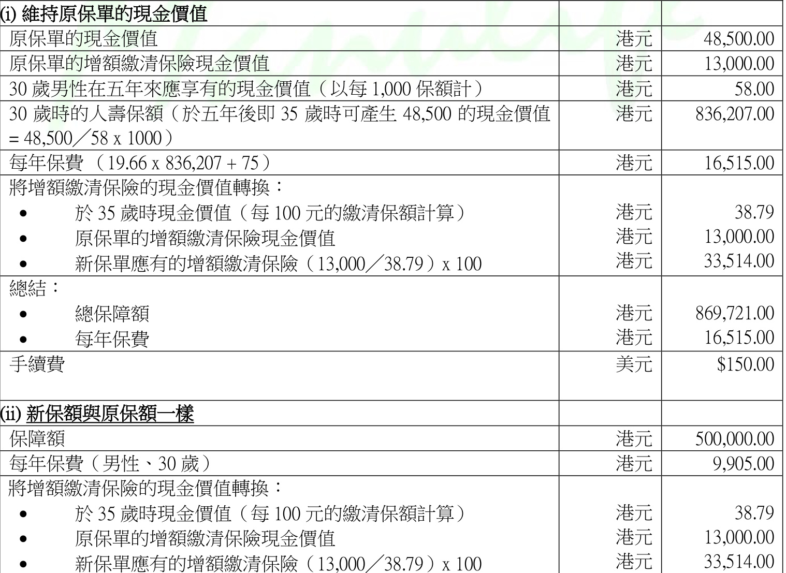

<html><body><table><tr><td>(i)維持原保單的現金價值</td><td></td><td></td></tr><tr><td>原保單的現金價值</td><td>港元</td><td>48,500.00</td></tr><tr><td>原保單的增缴清保現金價值</td><td>港元</td><td>13,000.00</td></tr><tr><td>30男性在五年來應享有的現金價值（以每1,000保额計)</td><td>港元</td><td>58.00</td></tr><tr><td>30 時的人保额（於五年後即 35 時可產生 48,500 的現金價值</td><td>港元</td><td>836,207.00</td></tr><tr><td>= 48,500/58 x 1000) 每年保費（19.66x 836,207+75）</td><td>港元</td><td>16,515.00</td></tr><tr><td>將增清保的現金價值轉换： · 於35時現金價值（每100 元的清保额計算） · 原保單的增额清保险現金價值</td><td>港元 港元</td><td>38.79 13,000.00</td></tr><tr><td>新保單應有的增额清保（13,000／38.79）x100 總結： · 總保障额</td><td>港元 港元</td><td>33,514.00 869,721.00</td></tr><tr><td>· 每年保費 手續費</td><td>港元 美元</td><td>16,515.00 $150.00</td></tr><tr><td></td><td></td><td></td></tr><tr><td>(ii)新保额與原保额一樣</td><td></td><td></td></tr><tr><td>保障</td><td>港元</td><td>500,000.00</td></tr><tr><td>每年保費（男性丶30） 將增额清保的現金價值轉換：</td><td>港元</td><td>9,905.00</td></tr><tr><td>於35 時現金價值（每100 元的清保额計算）</td><td>港元</td><td></td></tr><tr><td>原保單的增额清保現金價值</td><td>港元</td><td>38.79</td></tr><tr><td>· 新保單應有的增额缴清保（13.000／38.79）x100</td><td>港元</td><td>13,000.00 33,514.00</td></tr></table></body></html>

## 第 43 页

<html><body><table><tr><td colspan="2">计算現金價值退款：</td></tr><tr><td colspan="2">原保單的現金價值</td></tr><tr><td></td><td>港元 (a) 48,500.00 港元</td></tr><tr><td>在五年後的現金價值（男性丶30）</td><td>(b) 29,000.00</td></tr><tr><td>退還給公司的款项=（a-b-150 美元《手續費》）</td><td>港元 19,350.00</td></tr></table></body></html>

2.22  更改姓名

a) 更改姓名包括以下項目：

更改姓氏  
更改英文名字  
更改名字  
增加姓名  
刪減姓名  
更改錯誤拼字  
公司名稱

b) 更改姓名適用於以下人士：

受保人  
保單持有人  
保費支付人  
住院附加保障及住院保障計劃內的家庭成員

c 有關規定：

「更改個人資料表格」﹝表格CS01b﹞

有關證明文件：

o 改名契及身份證╱護照之核證副本  
o 入境事務處證書及身份證╱護照之核證副本  
o Certificate of Naturalization Statutory Declaration 及身份證╱護照之核證副本  
o 加上英文名字的登記事項證明書及身份證╱護照之核證副本  
o 結婚證書核證副本（供辦理冠上丈夫姓氏之用）  
o 列有別名的出生證明書核證副本（僅適用於十一歲以下人士）  
o 公司更改名稱證書核證副本

d) 核證副本辦理方法︰

查閱有關文件正副本後，保險顧問可自行核實及確認複印本為核證副本，並在核證副本上寫上保險顧問姓名、編號及分行地點以兹證明。  
客戶及保險顧問可親臨客戶服務中心出示各證明文件的正本，客戶服務主任會為客戶複印文件並確認為核證副本。

## 第 44 页

保險顧問可將各證明文件的正本交予高級分行經理或以上級別的經理覆核、複印並進行核實。客戶可自行從律師、公證人或各區民政事務處辦理核證副本的手續。

e) 在完成有關手續後，客人將獲發保單批註。  
f) 如客人申請更改姓名，同時亦有意更改其本人之簽名， 請按此處查閱有關詳情。

備註：如發現保單持有人具有「美國身份」或「非香港身份」指標，我們會向客戶發出「FATCA信件」或「CRS信件」要求客戶在一個月內填交W-8BEN/W-8BEN-E或W9或有效的稅務居民身份自我證明表格（理財顧問將透過Agent Notification System收到該信件副本）。

2.23  更改職業

a) 如保單內有意外相關保障及客戶如已更改職業，務須盡快通知宏利。

b) 有關規定：

更改保單申請表（表格T02），需清楚列出新職位的詳情，所需提供資料包括︰

o 工作職銜  
o 工作內容  
o 新公司名稱  
o 新公司地點（城市及國家）  
o 新公司業務性質  
o 入息（註明以每月或每年計算）  
o 聘用日期  
c) 視乎工作類別，客戶或需填寫有關問卷。  
d) 更改在下一個月結日生效。  
e) 如職業類別並無更改，客戶將收到保單更改通知書。如職業類別已作相關更改，客戶將收到更改保單資料批註。

備註：如發現保單持有人具有「美國身份」或「非香港身份」指標，我們會向客戶發出「FATCA信件」或「CRS信件」要求客戶在一個月內填交W-8BEN╱W-8BEN-E或W9或有效的稅務居民身份自我證明表格（理財顧問將透過Agent Notification System收到該信件副本）。

## 第 45 页

2.24   更改保費支付人利益附加保障

增加保費支付人利益附加保障

a) 須符合以下情況：受保人年齡 $<25$ 保費支付人年齡 $<60$

b) 有關規定：

從ManuTouch 獲取報價的特定申請表格；或更改保單申請書（表格T02）  
及保單復效申請╱受保資格聲明（表格U36）  
需付保費  
有關投資相連壽險計劃之保單，更改將於核保部批準有關申請後的下一個月結日生效。

c) 在完成有關手續後，客戶可獲發保單批註。

更改保費支付人利益附加保障（只適用於宏寶）

a) 宏寶提供兩種保費支付人利益附加保障，並容許更換。  
b) 有關規定與附加保費支付人利益保障相同。  
c) 在完成有關手續後，客戶可獲發保單批註。

刪除保費支付人利益附加保障

a) 在兩種情況下保費支付人利益保障將被刪除：

保費支付人已屆60 歲而受保人仍少於16 歲，電腦系統會自動刪除。然而，當受保人16 歲時，傷殘豁免月費保障會自動生效。  
根據客戶的要求b) 有關規則和規定亦與刪除附加保障，詳情請按此處。  
c) 在完成有關手續後，客戶可獲發保單批註。

2.25  更改計劃

傳統計劃

## 第 46 页

a) 更改計劃必須符合該產品手冊上所列之規定。  
b) 轉換申請必需於保單簽發後六個月內提出。只限一次更改計劃申請。

c) 有關規定：

更改保單申請書（表格T02）  
理財需要分析（如適用者）  
重要資料聲明書 - 內地人士在港投購人身╱壽險保單（只適用於持有中華人民共和  
國居民身份證的人士）  
保險合約  
需付保費  
假如將計劃轉換至風險較大或保費較低的計劃，須提交健康證明。（ 保單  
復效申請╱受保資格聲明）  
建議書摘要

d) 在完成有關手續後，客戶可獲發新保單合約。

提高 / 降低醫療保障

提高醫療保障

a) 適用於更改原有的計劃至較高保障的計劃

b) 由「宏利人壽保險公司」 （“MLI”） 簽發的保單 （即保單號碼首兩個數字為“01” ）不再 接受提高住院保障（下列產品除外）：

癌症治療附加保障住院附加保障守護一生醫療附加保障安康人生住院附加保障c) 生效日期為下一個保單月結日

d) 有關規定：

從ManuTouch 獲取報價的特定申請表格；或更改保單申請表 （表格T02）及保單復  
效申請/受保資格聲明 （表格U36）  
住院保障問卷（適用於家庭成員）（表格U31）  
繳付保費， 如需要

e) 在完成有關手續後，客人將獲發保單更改批註。

## 第 47 页

降低醫療保障

a) 適用於更改原有的計劃至較低保障的計劃  
b) 生效日期為下一個保單月結日  
c) 有關規定：• 從ManuTouch 獲取報價的特定申請表格；或更改保單申請表 （表格T02）

d) 在完成有關手續後，客人將獲發保單更改批註。

提高/降低「晉領醫療」或「活亮人生醫療」住院保障

提高保障

a) 適用於想降低周年“墊底費”和/或更改原有的計畫至較高保障的計畫b) 只接受客戶在申請時，其保單沒有附加保費或不保事項的申請c) 客戶需在下一個保單周年日前一個月完成申請

d) 有關規定：

從ManuTouch 獲取報價的特定申請表格；或更改保單申請表 （表格T02）及保單複  
效申請/受保資格聲明 （表格U36）  
投保申請附加資料（表格856）  
繳付保費， 如需要

e) 在完成有關手續後，客人將獲發保單更改批註。

降低保障

a) 適用於想提高周年“墊底費”和/或更改原有的計畫至較低保障的計畫  
b) 客戶需在下一個保單周年日前一個月完成申請  
c) 有關規定：從ManuTouch 獲取報價的特定申請表格；或更改保單申請表 （表格T02）  
d) 在完成有關手續後，客人將獲發保單更改批註。

2.26  更改按期保費

宏寶

降低按期保費a) 須符合以下條件：

## 第 48 页

降低按期保費不會影嚮或降低可獲佣金保費。  
降低按期保費須於以下日期兩年後方可進行：o 開始受保時或o 上一次提高按期保費與上一次降低按期保費須相隔至少一年。  
須於下一月結日前至少10 個工作天提交所有規定。

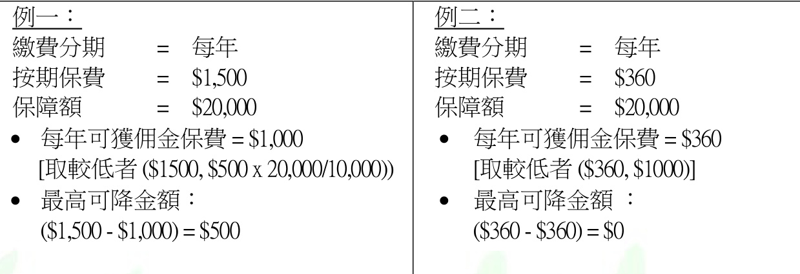

<html><body><table><tr><td>例一： 費分期 二 每年</td><td>例二： 費分期 =每年</td></tr><tr><td>按期保費 二 $1,500</td><td>按期保费 二 $360</td></tr><tr><td>保障额 二 $20,000</td><td>保障额 二 $20,000</td></tr><tr><td>每年可獲佣金保費=$1,000</td><td>每年可獲佣金保費=$360</td></tr><tr><td>[取较低者($1500,$500x 20,000/10,000))</td><td>[取较低者($360,$1000)]</td></tr><tr><td>最高可降金额:</td><td>最高可降金额:</td></tr><tr><td>($1,500 - $1,000) = $500</td><td>($360 - $360) = $0</td></tr></table></body></html>

（換句話說，降低按期保費會招至可獲佣金保費降低，因此不可再降減低按期保費。）

b) 有關規定：

更改保單申請書（表格T02）

c) 完成有關手續後，客戶會收到一份保單更改批註。

增加按期保費

a) 增加按期保費將可招至可獲佣金保費增加。佣金保費 $\mathbf{\Sigma}=\mathbf{\Sigma}$ 取較低者 ﹝按期保費， $500\mathrm{x}$ 保障額 ╱10,000﹞

b) 增加按期保費的影響：

增加一可獲佣金保費層。  
每一新增的可獲佣金保費層，需經第一年的保費測試。其餘的保費測試仍在各層同時進行。  
例一： 例二：  
繳費分期 $\mathbf{\Sigma}=\mathbf{\Sigma}$ 每年 繳費分期 $\mathbf{\Sigma}=\mathbf{\Sigma}$ 每年  
按期保費 $\mathbf{\Sigma}=\mathbf{\Sigma}$ $\$10,000$ 按期保費 = $\$720$   
保障額 = $\$600$ 保障額 = $\$20,000$ • 可獲佣金保費 • 可獲佣金保費$\mathbf{\Sigma}=\mathbf{\Sigma}$ 取較低者 $\S(600,500\times10000\textunderscore10000)$ $\mathbf{\Sigma}=\mathbf{\Sigma}$ 取較低者 $\S\left(720,500\times20,000\right)/\l10,000)$ $\mathbf{\Sigma}=\mathbf{\Sigma}$ 取較低者\$ (600, 500) $\mathbf{\Sigma}=\mathbf{\Sigma}$ 取較低者\$ (720, 1000)$=\$500$ $=\$720$

## 第 49 页

• 可獲佣金保費限額 $=\$500$ • 任何增加按期保費但未有增加保額，會加增一可獲佣金保費層，直至按期保費高於可獲佣金保費 限額為止。• 任何高於可獲佣金保費限額的保費，不會加增可獲佣金保費層。

• 假如按期保費增至 $\$900$ $\cdot$ 每年可獲佣金保費增加 ︰$\$180=($ ）

c) 按期保費的最低增加額如下：

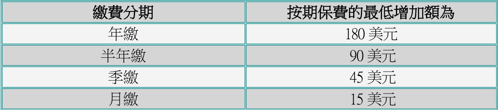

<html><body><table><tr><td>缴费分期</td><td>按期保費的最低增加额為</td></tr><tr><td>年</td><td>180美元</td></tr><tr><td>半年</td><td>90美元</td></tr><tr><td>季</td><td>45美元</td></tr><tr><td>月缴</td><td>15美元</td></tr></table></body></html>

d) 有關規定：

更改保單申請書（表格T02）需付保費（如適用）理財需要分析\*風險承擔能力問卷\*重要資料聲明書及投保人聲明書投資相連壽險計劃(投資相連壽險)保單(表格IFSAD FIP/VIP $+$ /JIP)\*\*備註： 如最新按期保費金額大於上一個保單年度之按期保費金額的 $125\%$ 時，以上註明之文件均需遞交。

注意：須於下一月結日前至少5 個工作天提交所有規定e) 完成有關手續後，客戶會收到一份保單更改批註及理財需要分析、風險承擔能力問卷及重 要資料聲明書及投保人聲明書投資相連壽險計劃 (投資相連壽險)保單的副本（如適用）。

還原按期保費

a) 假如按期保費曾被降低後再增加，降低部分需作「還原」後方可再加增。

b) 還原按期保費是指在降低按期保費後，再增加至保單內的最高記錄額。

c) 還原後的餘額將為增加的按期保費。

範例： 繳費分期 = 每年 按期保費 $\mathbf{\Sigma}=\mathbf{\Sigma}$ $\$1,500$ 保障額 = $\$20,000$ • 每年可獲佣金保費 $\boldsymbol{\mathbf{\Phi}}=\$1,000$

## 第 50 页

[ 取較低者 $(\$1500,500\times20,000,710,000)\mid$   
最高降低金額： $\$1,500-1,000=\S500$   
記錄上的最高按期保費 $\boldsymbol{\mathbf{\Phi}}=\$1,500$   
降低後的現行按期保費 $\boldsymbol{\mathbf{\Phi}}=\$1,000$   
日後的加增按期保費不超過最高額 $\mathrm{\Phi}_{\cdot\mathrm{{91}},500}$ 將當作「還原」按期保費。

d) 有關規定：

更改保單申請書（表格T02）理財需要分析\*風險承擔能力問卷\*• 重要資料聲明書及投保人聲明書投資相連壽險計劃(投資相連壽險)保單(表格IFSAD FIP/VIP+/JIP)\*\*備註： 如最新按期保費金額大於上一個保單年度之按期保費金額的 $125\%$ 時，以上註明之文件均需遞交。注意：須於下一月結日前至少5 個工作天提交所有規定

e) 完成有關手續後，客戶會收到一份保單更改批註及理財需要分析、風險承擔能力問卷及重要資料聲明書及投保人聲明書投資相連壽險計劃 (投資相連壽險)保單的副本（如適用）。

宏利精選投資保

a) 於保單生效日後可隨時更改按期保費。  
b) 最低之按期保費加幅為每年100 美元╱800 港元或每月10 美元╱80 港元。

c) 有關規定：

更改保單申請書（表格T02）  
需付保費（如適用）  
理財需要分析\*  
風險承擔能力問卷\*  
重要資料聲明書及投保人聲明書投資相連壽險計劃(投資相連壽險)保單(表格  
IFSAD FIP/VIP+/JIP)\*\*備註： 如最新按期保費金額大於上一個保單年度之按期保費金額的 $125\%$ 時， 以上註明之文件均需遞交。  
注意：須於下一月結日前至少5 個工作天提交所有規定

d) 完成有關手續後，客戶會收到一份保單更改批註及理財需要分析、風險承擔能力問卷及重要資料聲明書及投保人聲明書投資相連壽險計劃 (投資相連壽險)保單的副本（如適用）。

## 第 51 页

2.27  減額繳清保險

a) 此乃保單內其中一項不可作廢權益，受保人在生時可在以下情況下享有此權益。

保單現有現金價值；  
客人不想繼續繳交保費；及  
客人希望維持一份已繳清保費而保障額較低的保單。

b) 以下的計劃不適用：

非標準保費率保單定期保險投資相連壽險計劃整付保費計劃保單在更改後，其保障額低於保單條款內指定的保障額；或1,000 加幣或其他貨幣的等同值。

c) 減額繳清保險的保額按以下情況計算：

保單的淨現金價值（即保證現金價值減去保單貸款結餘）o 包括紅利o 不包括紅利（需要提取所有紅利，並會寄往保單持有人的通訊地址）  
受保人的已達年齡

d) 有關規定：

從ManuTouch 獲取報價的特定申請表格，或更改保單申請表（表格T02）

e) 在完成有關手續後，客人將獲發更改保單批註。

2.28 保單復效

傳統計劃

a) 保單復效而沒有更改保單生效日期。  
b) 欠繳保費一年以上須支付利息。  
c) 自願醫保失效後將不能復效。  
d) 當受保人的受保資格符合宏利的要求時，保單便可復效。  
e) 保單復效須依照保單條內之可復效期限才能申請復效。(「伴我行」醫療儲備的保單可於保單失效6 個月內復效。其保障追加權益之行使資格將會順延至復保後5 年，並必須符合於保障追加權益一節所列之要求。)

## 第 52 页

f) 復效而不更改保單生效日期保單可根據基本計劃╱附加保障之復效期內提出復效。

有關規定：• 從ManuTouch 獲取報價的特定申請表格，或保單復效申請╱受保資格聲明（表格 U36） 若受保人於特別優惠期內補交所欠保費，便不必簽署此文件 若保單以簡易核保方式簽發及附有附加保障，則需提供受保人之健康資料才可復效保單持有人的香港身份證╱護照副本（如保單持有人為商業客戶，請按此處查閱有關規定）所有逾期保費及利息退回已支付之保證退保價值及保費回贈（如有）新的直接付款授權書（若付款方法改為自動轉帳）• 預繳足夠的保費以便辦理自動轉帳手續

f) 在完成有關手續後，客人將獲發保單復效批註。

投資相連壽險計劃保單

a) 萬利保障計劃及宏寶須於失效後六十天內復效。  
b) 靈活投資寶、宏利精選投資保及邁駿投資理財計劃、傲富投資理財計劃及傲峰定期投資計劃可於失效後一年內復效。  
c) 保單復效批註將會發出給客人。

2.29 更正性別

a) 假如受保人在投保申請書內錯誤申報受保人的性別，應立刻予以更正。

b) 有關規定：

「更改個人資料表格」﹝表格CS01b﹞  
有關更改的法律證明文件  
補交保費及利息

c) 凡因更正性別導致保費增加，客戶需繳交保費的差額，否則有關保障額將會作出相應調整。所欠的保費約超過一年須支付利息。

d) 在完成有關手續後，客人將獲發新的「現金價值及不可作廢權益表」。

## 第 53 页

備註：如發現保單持有人具有「美國身份」或「非香港身份」指標，我們會向客戶發出「FATCA信件」或「CRS信件」要求客戶在一個月內填交W-8BEN/W-8BEN-E或W9或有效的稅務居民身份自我證明表格（理財顧問將透過Agent Notification System收到該信件副本）。

2.30 更改簽名

a) 保單持有人可隨時通知宏利更改其簽名。  
b) 有關規定：• 更改保單申請書（表格T02）  
c) 須在「新簽名式樣」空格上簽署新簽名。並以原有簽名於申請表上簽署，而原有簽名必須與宏利現存檔案相符。  
d) 在完成有關手續後，客戶將獲發確認信，而保險顧問亦會收到確認信的副本。

2.31  對減保費及保費預繳措施

a) 此乃特別為客戶而設，他們在投保初期預支較多的保費以支付日後的保費。客戶保單內的積存紅利或現金儲備亦足以支付日後保費，而投保人無需預支較多的保費。由於紅利累積並非保證，以下列出可提供報價之對減保費及保費預繳措施情況：

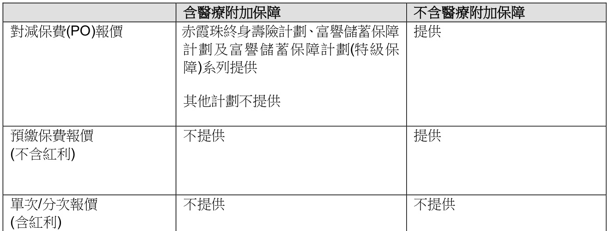

<html><body><table><tr><td></td><td>含醫療附加保障</td><td>不含醫療附加保障</td></tr><tr><td>對减保費(PO)報價</td><td>赤霞珠終身壽計劃、富響蓄保障 計劃及富磐蓄保障計劃(特級保 障)系列提供 其他計劃不提供</td><td>提供</td></tr><tr><td>预缴保費報價 (不含紅利)</td><td>不提供</td><td>提供</td></tr><tr><td>單次/分次報價 (含紅利)</td><td>不提供</td><td>不提供</td></tr></table></body></html>

b) 有關預繳保費的一些特點：

預繳的保費將存放在保單注入款項(PDF)戶口內宏利並不保證其回報率

c) 在某情況下預繳的保費不足以支付日後保費，這種情況的出現通常是紅利/ 保單注入款項的實質利率低於報價表上的預測。客戶須繳交即期保費。

## 第 54 页

d) 對減保費在以下情況適用：

傳統終身人壽保險計劃（「優惠百年保」除外）；及  
新的或已生效的計劃；及  
附加保障而所附屬的基本計劃可作對減保費；及  
按年支付保費；及  
利用郵寄帳單（適用於分期攤付方法）；及  
紅利運用方式為「積存生息」

e) 無論在任何情況下，假如對減保費適用於基本計劃，亦適用於附加保障，亦即是不可將附加保障排除在對減保費的付款安排之外。

f) 兩種預繳保費選擇：

整付保費 在數年內按年攤付

g) 在提出要求前，保險顧問或客戶應先從「宏利全接觸」獲取報價單。

h) 有關規定：

對減保費：於「宏利全接觸」下載「更改保單申請表」及「對減保費說明確認書」。  
顧問可於「宏利全接觸」要求PO 報價並即時取得「更改保單申請表」，該申請表載  
有一個申請編號。相應的PO 說明將在下一個工作天發送至顧問的安全收件匣，其  
中包含「對減保費說明確認書」並載有上述申請編號。  
預繳保費：於「宏利全接觸」下載「更改保單申請表」或「更改保單申請表」﹝表  
格T02﹞上註明「一次過注入預繳款項\$XXX.XX / 按x 年攤付，每年攤付\$XXX.XX。」  
及連同報價表副本。  
有關稅務合規條款的證明之投保申請附加資料，如此對減保費申請為非分紅保單的  
基本計劃。如發現保單持有人或受益人具有以下身份指標，則需同時遞交以下表格：• 「美國身份」指標： W-8BEN-E﹝供公司客戶填寫﹞或W9﹝供美國人士 / 實體為美國人士、美國公司、合夥組織、遺產、或信託﹞• 「非香港身份」指標： 個人稅務居民身份自我證明表格《通用報告準則和海外帳戶稅收合規法案》﹝供個人客戶填寫﹞或 實體稅務居民身份自我證明表格﹝供公司客戶填寫﹞ 控權人稅務居民身份自我證明表格﹝供被動非財務實體公司客戶填寫﹞  
整付保費（如適用者）  
分期攤付的首期保費（如適用者）

補交保費（如需更改保費繳付形式）撤消直接付款授權書或撤消委託付款書（如適用者）

i) 在完成有關手續後，客人可獲發保單批註一份。

## 第 55 页

j) 如紅利納入作對減保費，當對減保費生效後，紅利戶口的總積存包括以下各項：

保單紅利保單紅利應得利息

k) 如現金儲備納入作對減保費，當對減保費生效後，現金儲備積存戶口的總積存包括以下各項：

現金儲備保單現金儲備應得利息

l) 如保單正行使對減保費權益而現金儲備╱保單紅利已納入作對減保費，提取╱調動現金儲備╱保單紅利將不會受理。客戶需以書面指示取消用對減保費權益。

m) 只可向保證現金價值作保單貸款。假如客人要運用紅利作保單貸款，對減保費亦會停止。其後客戶需以書面指示用預繳的保費和利息對減即期保費。

n) 按年攤付方式的特點：

客戶不可在某一年多付而在另一年少付。  
當付款中斷時，預繳的保費有可能不足以支付日後保費， 客戶便需要恢復繳付保費。

o) 假如客人運用以下的不可作廢權益時，預繳的保費及利息將被發還。

退保 減額繳清保險 展期保險

p) 保單退保時，宏利將按保單注入款項結餘收取手續費。該手續費乃基於提取保單注入款項所引致的投資損失及有關行政費用而設立，是項費用金額由精算部計算，並且可不時作出更改。

q) 於下列情況，可能須要支付額外保費以使保單繼續生效：

紅利╱現金儲備分配比例及╱或之利率有所改變；及╱或由於基本計劃及╱或附加保障之非保證保費的調整或保單條款內任何改變，包括但不限於任何附加保障的改變或增加，致使應付保費有所調整。

r) 由「宏利人壽保險公司」 （“MLI”） 簽發的保單 （即保單號碼首兩個數字為“01” ）不再接受設立和更改保費預繳措施（保費預繳提取或退保除外）。

2.32   由標準保費率轉為非吸煙者保費率

a) 若受保人於過去至少 12 個月內已停止吸煙，客戶可將保單的標準保費率轉為非吸煙者保費率\*。

## 第 56 页

b) 保單必須已生效超過一年及受保人健康並無嚴重問題。

c) 有關規定：

填妥 Laboratory Test Requisition Form（表格 U29）及於「栢立醫學化驗所」進行Urine Nicotine (D010) 測試以檢驗小便是否含有尼古丁。測試結果將直接由栢立送交宏利。  
更改保單申請表（表格T02）  
保單復效申請╱受保資格聲明（表格U36）

\* 只適用於設有保費率的保單及有關之保費修訂將根據保單╱產品類別而有所不同。

兒童保單受保人年屆十六歲

a) 兒童保單受保人於年屆十六歲時可將保單的標準保費率轉為非吸煙者保費率，此項更改只適用於能提供非吸煙者保費率之兒童保單基本計劃及/或其附加保障。

b) 有關規定：

更改保單申請表（表格T02）Smoking Questionnaire （表格 U14）  
註︰  
保單持有人及受保人均須在有關表格上簽署。

兒童保單受保人年屆十六歲（包括增加保障）

a) 兒童保單受保人於年屆十六歲時如欲增加保障，所增加保障的有關保費會按照於最新之受保資格證明（Evidence of Insurability）上所示之吸煙習慣計算。如未能申報其吸煙習慣，則會以標準保費率計算。  
b) 增加保障範圍包括增加附加保障及增加保額。  
c) 如適用，二十五歲或以下的兒童保單受保人可獲豁免尼古丁檢驗小便。  
d) 有關規定：從ManuTouch 獲取報價的特定申請表格；或更改保單申請表（表格T02）及保單復效申請╱受保資格聲明（表格U36）註︰保單持有人及受保人均須在有關表格上簽署。

## 第 57 页

2.33   因保單持有人去世而需要更改保單持有權

若保單持有人早於受保人去世，新保單持有人或保單承繼人(如有委任)需要提交申請更改保單持有權。

以下圖表顯示就四個情況下所需提交的文件:

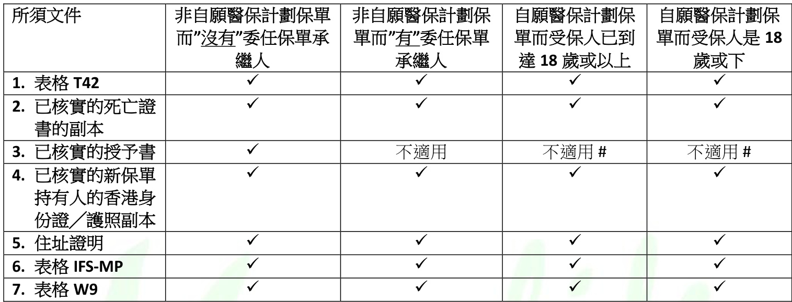

<html><body><table><tr><td>所须文件</td><td>非自醫保計劃保單 而"没有"委任保單承 人</td><td>非自醫保計劃保 單而"有"委任保單 承人</td><td>自醫保計劃保 單而受保人已到 逹18 蕨或以上</td><td>自醫保計劃保 單而受保人是18 或下</td></tr><tr><td>1.表格T42</td><td></td><td></td><td>√</td><td></td></tr><tr><td>2．已核實的死亡證 書的副本</td><td></td><td>V</td><td>V</td><td></td></tr><tr><td>3．已核實的授予書</td><td></td><td>不適用</td><td>不適用#</td><td>不適用#</td></tr><tr><td>4．已核實的新保單 持有人的香港身</td><td>V</td><td>V</td><td>V</td><td>V</td></tr><tr><td>份證／護照副本 5．住址證明</td><td></td><td></td><td></td><td></td></tr><tr><td>6.表格 IFS-MP</td><td></td><td></td><td></td><td></td></tr><tr><td>7.表格W9</td><td></td><td></td><td></td><td></td></tr></table></body></html>

所需文件：

1. 「更改保單擁有權申請表（已去世保單持有人）」（表格T42）

2. 已去世的保單持有人的死亡證書核實副本 \*；

3. 由民政事務總署╱法庭所頒發的「確認通知書」（適用於小額遺產）或「授予書」（「授予書」包括遺囑認證、遺產管理書或附有遺囑的遺產管理書）核實副本\*。並提供遺產清妥證明書 ╱遺產申報誓章。遺產清妥證明書╱遺產申報誓章上必須列明已去世保單持有人所擁有的所有遺產，包括相關保單編號及其死亡賠償額╱退保價值；請注意，在「確認通知書」或「授予書」上，應清楚列明有關保單編號。否則將不獲受理。

4. 已核實之新保單持有人的香港身份證╱護照副本(如屬海外客戶，可接受提供兩份載有相片之不同身份證明文件副本)  ，宏利服務中心的宏利員工或保險顧問可作核實的人士。；及請按此處查閱有關新保單持有人的更多規定（如新保單持有人為商業客戶，請提交「商業保險問卷」（表格U02）及按此處查閱更多規定）

5.  擁有 $>25\%$ 以上股權或投票權的股東的住址證明 (詳見附錄三)。

6. 重要資料聲明書 - 內地人士在港投購人身╱壽險保單，只適用於持有中華人民共和國居民身份證的人士。

## 第 58 页

7. 如該新保單持有人為美國人士 / 實體為美國人士、美國公司、合夥組織、遺產、或信託，則需額外遞交W9 表格；

# 自願醫保計劃

若保單持有人早於受保人去世而生前未有提名任何承繼人，或指定承繼人拒絕接受本保單的轉移，本保單的擁有權將轉移至–

a) 年滿十八（18）歲的受保人；或b) 受保人的家長或監護人（如受保人為未成年人）。倘若家長或監護人拒絕接受本保單的轉移，客人聲明是必須。而本保單的擁有權將轉移至保單持有人的遺產管理人或執行人及需提交遺囑認證、遺產管理書或附有遺囑的遺產管理書的核實副本\*。

\* 可出示相關文件正本並於客戶服務中心的宏利員工或保險顧問辦理核實副本。

有關申請「確認通知書」或「授予書」的詳情，請參見香港特別行政區司法機構–遺產承辦處網  
址：  
英文版本︰https://www.judiciary.hk/en/court_services_facilities/probate.html  
中文版本︰https://www.judiciary.hk/zh/court_services_facilities/probate.html

如「授予書」 “Grant” 中提及了兩位人士被授權為遺產管理人或遺產執行人，即是指該兩位人士共同擁有其保單的擁有權。而於共同擁有權中，若其中一位死亡，其擁有權將自動轉移至另一位仍然在生的共同擁有權的保單持有人，而不需再次提交「更改保單擁有權申請表（已去世保單持有人）」（表格T42）進行轉名申請。

• 在新保單持有人欄位下，請填寫兩位人士的名字及而下一段文字以示其共同擁有權。 “Name of new owner: Mary Lee and Daniel Sze (as joint owners to hold the interest assigned herein).”

• 如客人只填寫兩位人士的名字，而沒有寫上該段文字，其共同擁有權(Joint ownership)不會被確立。換言之，若其中一位死亡，其擁有權將不會自動轉移至另一位仍然在生的共同擁有權的保單持有人，而該保單持有人需再次提交「更改保單擁有權申請表（已去世保單持有人）」（表格T42）進行轉名申請。

備註：如發現保單持有人具有「美國身份」或「非香港身份」指標，我們會向客戶發出「FATCA信件」或「CRS信件」要求客戶在一個月內填交W-8BEN/W-8BEN-E或W9或有效的稅務居民身份自我證明表格（理財顧問將透過Agent Notification System收到該信件副本）。

2.34   委任或更改保單承繼人

a) 保單承繼人雖為 18 歲或以上的自然人，並為保單持有人的直系親屬(包括配偶，父母，子女和兄弟姐妹)

## 第 59 页

b) 所有新生意及現有保單均可委任保單承繼人，以下保單除外：

由公司持有的保單(非自然人)  
聯合持有的保單  
附屬抵押轉讓的保單  
已指定不可撤換之保單受益人  
投資相連壽險保單  
保單持有人同時為保單的受保人

c) 每份保單只能委任一名保單承繼人。保單承繼人可成為多於一份保單之保單承繼人。

d) 有關規定

「委任或更改保單承繼人附加申請書」(表格SPOWNER)以用作委任/ 更改/ 終止保單承繼人

e) 在完成有關手續後，客戶可獲得一份更改保單批註。

2.35 委任或更改後備受保人

a) 只適用於附有更改受保人條款之保單  
b) 後備受保人必須為“自然人”。  
c) 後備受保人必須符合以下其中一個條件：• 後備受保人的實際年齡為60 歲或以下；或• 後備受保人的實際年齡不大於已故受保人的年齡及不大於75 歲。  
d) 後備受保人必須與保單持有人有可保利益 (有關可保利益之詳情，請參閱新生意核保程序之電子行政運作手册)。  
e) 保單中任何時候只有一位後備受保人。  
f) 有關規定• 後備受保人安排附加申請書(Form CONTLI)  以用作委任 / 終止後備受保人  
g) 在完成有關手續後，客戶可獲得一份更改保單批註。

## 第 60 页

2.36  更改受保人

更改受保人

a)  保單持有人可於第一個保單周年日或保單簽發一年後（以較後者為準）提出更改受保人的申請。

b) 於更改生效日，新受保人必須符合以下其中一個條件：

新受保人的實際年齡為60 歲或以下；或新受保人的實際年齡不大於現受保人的年齡及不大於75 歲。

c) 於更改受保人生效時，現受保人及新受保人必須仍然在世。

d) 保單持有人必須與新受保人有可保利益 (有關可保利益之詳情，請參閱新生意核保程序之電子行政運作手册)。

e) 於更改保單受保人後，任何較早前所指定的受益人將於更改生效日自動被撤銷。更改受保人之申請並不適用於已指定不可撤換受益人的保單。

f) （只適用於豐譽傳承保障計劃／創富傳承保障計劃）於更改保單受保人後，附加於保單上之所有附加保障（如有，除保費支付人利益附加保障於更改生效日時符合以下情況外）將由更改生效日起自動終止：

• 後備受保人之最接近一個生日所達之歲數為16 歲以下，以及後備受保人已出生不少於15 日；及  
• 後備受保人與保費支付人利益附加保障下的保費支付人以最接近一個生日計算所達歲數差距為45 年或以下。

g) （只適用於豐譽傳承保障計劃／創富傳承保障計劃以外的基本計劃）於更改保單受保人後，附加於保單上之所有附加保障（如有）將於更改保單受保人的生效日起自動終止，其後亦不可附加任何附加保障。

h) 有關規定

更改受保人申請表( Form T40)$\cdot$ 新受保人之身份證／護照副本新受保人之出世紙副本(只適用於18 歲以下之新受保人)

i) 在完成有關手續後，客戶可獲得一份更改保單批註及更改受益人確認書。

## 第 61 页

嬰孩登記為受保人

a) 只適用於守護無間危疾保（保寶未來）。  
b) 必須於保單的第1 個保單周年日之前的14 天前及新受保人出生後提交申請。  
c) 根據保單條款，新受保人的保障於更改生效日（即保單簽發日或新受保人的出生日期，以較後者為準）開始生效，而原受保人的保障於更改生效日終止。  
d) 於更改保單受保人後，任何較早前所指定的受益人將於更改生效日自動被撤銷。  
e) 有關規定• 嬰孩登記為受保人表格 ［適用於守護無間危疾保（保寶未來）］– Form T43$\cdot$ 嬰孩出世紙的核實副本\*可出示相關文件正本並於客戶服務中心的宏利員工或保險顧問辦理核實副本。

j)  在完成有關手續後，客戶可獲得一份更改保單批註及更改受益人確認書。

## 第 62 页

2.37   更改受保人至後備受保人

a) 如乎合以下條件，後備受保人須於保單已故受保人身故日起計180 日內遞交更改受保人至後備受保人之申請。  
b) 不適用於已指定不可撤換受益人的保單。  
c) 已故受保人的身故日為 (i)第一個保單周年日或之後；或 (ii)保單簽發日一年或之後（以較後者為準）。  
d) 於更改生效日，後備受保人必須符合以下其中一個條件：• 後備受保人的實際年齡為60 歲或以下；或• 後備受保人的實際年齡不大於已故受保人的年齡及不大於75 歲。

e) 後備受保人必須與保單持有人有可保利益 (有關可保利益之詳情，請參閱新生意核 保程序之電子行政運作手册)。

f) 宏利已發出委任後備受保人之更改保單批註。

g) 有關規定

由後備受保人簽署之更改受保人至後備受保人申請表 (Form T41)已故受保人的死亡證書核實副本 \*  
$\cdot$ 新受保人之身份證／護照副本  
\* 可出示相關文件正本並於客戶服務中心的宏利員工或保險顧問辦理核實副本。

h) 在完成有關手續後，客戶可獲得一份更改保單批註及更改受益人確認書。

2.38  保單優惠項目申請

a) 申請資格：

「綽悅女性保障計劃」的「初生嬰兒利是」；或「卓越『新世代』保障計劃」的「免費新世代『優越生活』計劃保障」

b) 有關規定：

保單優惠項目申請表（表格 T33）  
表格 T33 列明的有關證明文件副本  
如申請「初生嬰兒利是」或「學成獎賞」，請提供保單持有人的香港身份證╱護照  
副本（如保單持有人為商業客戶，請按此處查閱有關規定）

## 第 63 页

2.39 保費假期

a) 保費假期可讓客戶靈活地暫延繳付保費而無須終止計劃。

b) 保費假期的特點︰

保費假期不可超過兩年。  
所有附加保障將會終止。  
保單持有人於保費假期內不得更改保單，包括申請保單貸款及提取紅利。  
保單將不會派發紅利及利息。  
保費假期內之身故賠償為保單持有人已繳付之保單累積保費（不附帶利息及不包括額外保費）。  
保費繳付期之完結及保證入息期之開始將根據保費假期相應延後。  
保費假期完結後，保單持有人恢復按原來金額繳付保費。保單之保單生效日期將重新訂定。

c) 宏利將會在保費假期的第二十三個月發出「保費假期終止通知書」，以通知客戶有關保費假期將會於第二十四個月後終止及須要恢復繳付保費。

申請保費假期

a) 保單必須已生效最少兩年，而提出申請時仍然生效。  
b) 提出申請時必須在保費到期日前及已償還所有欠款。  
c) 有關規定︰• 更改保單申請表（表格T02）  
d) 首次的保費假期為完全免費，由第二次保費假期申請起，每次申請將收取港元 200 之手續費（宏利保留調整此收費之權利）。  
e) 在完成有關手續後，客戶可獲得一份更改保單批註。

恢復繳付保費

a) 恢復繳付保費時無須提交受保資格證明及財政狀況證明。b) 保費假期後，保單持有人可按正常的核保手續，重新申請有關的附加保障。c) 有關規定︰

## 第 64 页

更改保單申請表（表格 T02）• 如欲重新申請附加保障，則須填寫保單復效申請╱受保資格聲明（表格 U36）

d) 在完成有關手續後，客戶可獲得一份更改保單批註以註明新保單生效日、期滿日及保費表。

2.40  因賠付致計劃終止後延續附加保障

a) 如基本計劃因賠付而須被終止，客戶可繼續延續合資格的附加保障。此適用於所有受保人，包括非香港居民及非標準保費率的受保人。

b) 合資格的基本計劃及附加保障︰

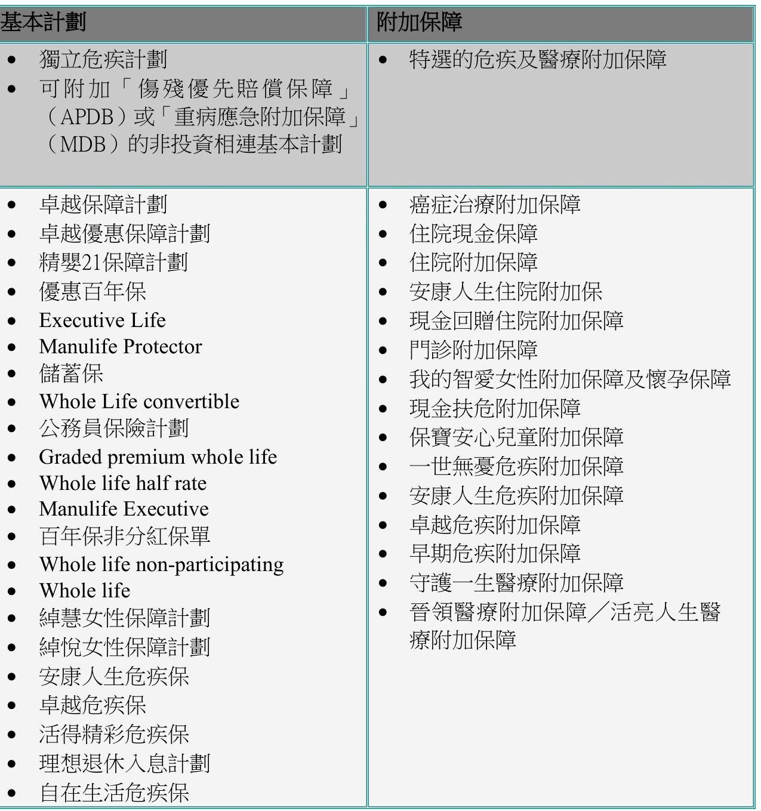

<html><body><table><tr><td colspan="2">基本計劃</td><td>附加保障</td></tr><tr><td></td><td>·獨立危疾計劃 可附加「傷優先賠價保障」</td><td>·特選的危疾及醫療附加保障</td></tr><tr><td></td><td>（APDB）或「重病應急附加保障」 （MDB）的非投資相連基本計劃</td><td></td></tr><tr><td></td><td>卓越保障計劃 卓越優惠保障計劃</td><td>癌症治療附加保障</td></tr><tr><td></td><td>精婴21保障計劃</td><td>住院現金保障 住院附加保障</td></tr><tr><td></td><td>優惠百年保</td><td>安康人生住院附加保</td></tr><tr><td></td><td>Executive Life</td><td>現金回赠住院附加保障</td></tr><tr><td></td><td>Manulife Protector</td><td></td></tr><tr><td></td><td>蓄保</td><td>门診附加保障</td></tr><tr><td></td><td>Whole Life convertible</td><td>我的智愛女性附加保障及懷孕保障</td></tr><tr><td></td><td>公務員保計劃</td><td>現金扶危附加保障</td></tr><tr><td></td><td>Graded premium whole life</td><td>保寳安心兒童附加保障</td></tr><tr><td></td><td>Whole life half rate</td><td>一世無蔓危疾附加保障</td></tr><tr><td></td><td>Manulife Executive</td><td>安康人生危疾附加保障</td></tr><tr><td></td><td>百年保非分紅保單</td><td>卓越危疾附加保障</td></tr><tr><td></td><td>Whole life non-participating</td><td>早期危疾附加保障</td></tr><tr><td></td><td>Whole life</td><td>守護一生醫療附加保障</td></tr><tr><td></td><td>绰慧女性保障計劃</td><td>普领醫療附加保障／活亮人生醫</td></tr><tr><td></td><td>绰悦女性保障計劃</td><td>療附加保障</td></tr><tr><td></td><td>安康人生危疾保</td><td></td></tr><tr><td></td><td>卓越危疾保</td><td></td></tr><tr><td></td><td>活得精彩危疾保</td><td></td></tr><tr><td></td><td>理想退休人息計劃</td><td></td></tr><tr><td></td><td></td><td></td></tr><tr><td></td><td>自在生活危疾保</td><td></td></tr></table></body></html>

## 第 65 页

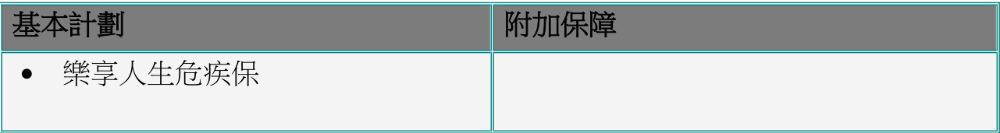

<html><body><table><tr><td>基本計劃</td><td>附加保障</td></tr><tr><td>·樂享人生危疾保</td><td></td></tr></table></body></html>

註：如索償保障為危疾基本計劃，保單中的危疾附加保障將被終止及不獲延續，除非危疾基本計劃及其附加保障內的定義相異。

c) 基本計劃

基本計劃保額已全數支付，有關基本計劃亦會終止。  
現金價值╱退保價值╱期滿價值╱現金儲備╱紅利╱第三者服務╱任何由基本計劃所提供的利益將會停止。  
所有紅利繳清保險利益、積存現金儲備、積存紅利及注入款項戶口結餘將於基本計劃終止後發放予保單持有人。  
所有未符合條件的附加保障將於行使延續附加保障後被即時終止，而其後亦不能提出增加附加保障申請。

d) 延續附加保障

當基本計劃因賠付而被終止時，如保單的保費正獲得豁免，有關延續附加保障的保費將可繼續獲得豁免（雖然有關傷殘優先賠償保障（APDB）及傷殘豁免保費保障（PWB）已被終止）。  
獲延續的危疾附加保障不可繼續享有其後新增的「通脹加保權益」。  
不允許作保單復效。  
不允許新增家庭成員（住院家庭計劃）及提升保額╱保障內容。  
獲延續的危疾附加保障可繼續享有「備用保障權益」。  
可降低住院保障內容及降低保額╱保障內容。

e) 所需文件︰

於「重病保障索償表格」內選擇「因賠付計劃終止後延續附加保障」。（註﹕傷殘優先賠償保障（APDB）索償表格內並沒有「延續附加保障」部分。直到客戶提出第10 次有關索償時，理賠部或行政部將聯絡保險顧問以確認客戶是否申請「延續附加保障」。）  
於ManuTouch 報價系統內選擇申請延續附加保障的保障並編印「更改保單申請表」，  
該表格已載有相關條款及所需客戶聲明；  
所需保費 (如有)

f) 完成後，客戶將收到「保單更改批註」。

## 第 66 页

2.41   身故賠償支付選項

a) 在受保人在生時及保單生效期間，保單持有人可透過申請身故賠償支付選項妥善地處理財富傳承。受益人在任何情況下不會擁有更改此項由保單持有人指定的選項的權利。

b) 身故賠償支付選項包括以分期方式支付或以一筆過形式及分期方式支付。

c) 按保單持有人的指示，以固定百分比及定期支付形式來自訂分期支付。不論受益人數目，每張保單每年可以分期方式定期支付身故賠償款項的百分比，不得少於身故賠償款項的 $2\%$ 。定期支付形式包括每月/ 每季/ 每半年/ 每年。

d) 尚未按身故賠償支付選項以分期方式定期支付的身故賠償款項之餘額，將保留於保單內按非保證年利率積存利息。所有積存利息(如有)將與最後一期的分期款項一同支付。

e) 若保單持有人在申請此選項時，任何受益人當時的年齡為18 歲以下，保單持有人必須為該18 歲以下之受益人指派信託人，才能申請此選項。

f) 此項選項只適用於指定產品，並受公司不時決定的要求約束。合資格申請身故賠償支付結選項的產品清單可於Manutouch 查閱。

g) 此項選項只適用於符合所有以下情況之保單：

保單沒有不可撤換之受益人保單沒有受益人為非個人 (例: 即非自然人，如公司/ 法團)$\cdot$ 保單沒有任何受益人為保單持有人$\cdot$ 保單的受益人數目為5 位以內$\cdot$ 保單必須有指定受益人

h) 此選項適用於聯合持有(jointly-owned)及抵押轉讓(collateral assignment)的保單，並須獲取每一位聯合持有人或受讓人(視何者適用而定)於「身故賠償支付選項附加申請書」上簽署並同意。

i) 有關規定

「身故賠償支付選項附加申請書」(表格DBSO) 以用作申請/ 更改/ 終止身故賠償支付選項

j) 在完成有關手續後，客戶可獲得一份更改保單批註。

## 第 67 页

第三章：保單終止 ╱ 期滿 ╱ 轉換

3.1  保單終止

保單因失效而終止（Lapsed Termination）

當保單的到期保費仍未繳付而所有保單價值已全被運用，保單便會失效，亦即保單已終止。客戶可按保單條款列出的時限內將保單復效。

提取金額╱退保

傳統計劃

a) 假如客戶選擇退保，便不可將保單復效。

b) 可透過 ManuTouch 取得保單退保價值（Surrender value）的報價。

c) 有關規定：

保單期滿／退保申請表（表格 T28b）或客戶的書面要求。  
保單持有人的香港身份證╱護照副本 （如保單持有人為商業客戶，請按此處查閱有關規定）  
取消直接付款╱委託付款表格，如適用。  
若保單已附屬抵押轉讓（collaterally assigned）與他人，需遞交附屬受讓人的書面同意；或取消抵押轉讓表格（表格T07_CA）。  
按 MPSO╱MWPO 條款執行的保單（即不可更改保單的受益人），需取得所有受益人同意。

d) 客戶可指定一個退保日期（但不可追溯至較早日子）。假如客戶並沒有指定退保日期，宏利便會將接獲客戶書面要求的日期作為退保生效日。

e) 如欲將有關金額調動至保單持有人的其他保單，須在表格上清楚註明「至保單編號」、調動金額及調動用途。如「至保單編號」為一份新保單，須在表格上註明調動用途為「繳付首期保費」或「首次認購」，並連同有關新生意投保申請書一併遞交。

f) 客戶可選擇兩種方法提取有關金額：

電子支付服務 （直接存入／轉入保單持有人的指定銀行帳戶或轉數快）支票

g) 完成退保手續後，客戶會收到一份保單退保通知書。

投資相連壽險計劃

## 第 68 页

a) 申請分別有兩種：

提取金額（Withdrawal）/ 贖回 (Redemption)全數退保（Full surrender）

b) 萬利保障計劃/ 宏寶/ 靈活投資寶/ 宏利精選投資保/ 邁駿投資理財計劃傲富投資理財計劃/傲峰定期投資計劃之有關規定：

更改╱保單提款（與投資相連的壽險計劃）申請表（表格T31）  
保單持有人的香港身份證╱護照副本（如保單持有人為商業客戶，請按此處查閱有關規定）  
取消直接付款╱委託付款表格，如適用。  
若保單已附屬抵押轉讓（collaterally assigned）與他人，需遞交附屬受讓人的書面同意；或取消抵押轉讓表格（表格T07_CA）。

c) 宏利智富錦囊／宏利投資計劃／宏利投資計劃2 之有關規定：

宏利智富錦囊／宏利投資計劃投資選項服務申請表 (表格 WM02) ／宏利投資計劃2 投資選項服務申請表 (表格MS02) - 適用於贖回及退保  
宏利智富錦囊／宏利投資計劃／宏利優裕錦囊服務申請表(傳真) (表格WM02F) - 適用於贖回（保單持有人的香港身份證╱護照副本如保單持有人為商業客戶，請按此處查閱有關規定）  
取消直接付款╱委託付款表格，如適用。

d) 提取金額╱贖回╱退保生效日為行政部接獲表格時，以計時器印於表格T31/表格WM02/ 表格MS02 上的日期。

e) 提取金額：

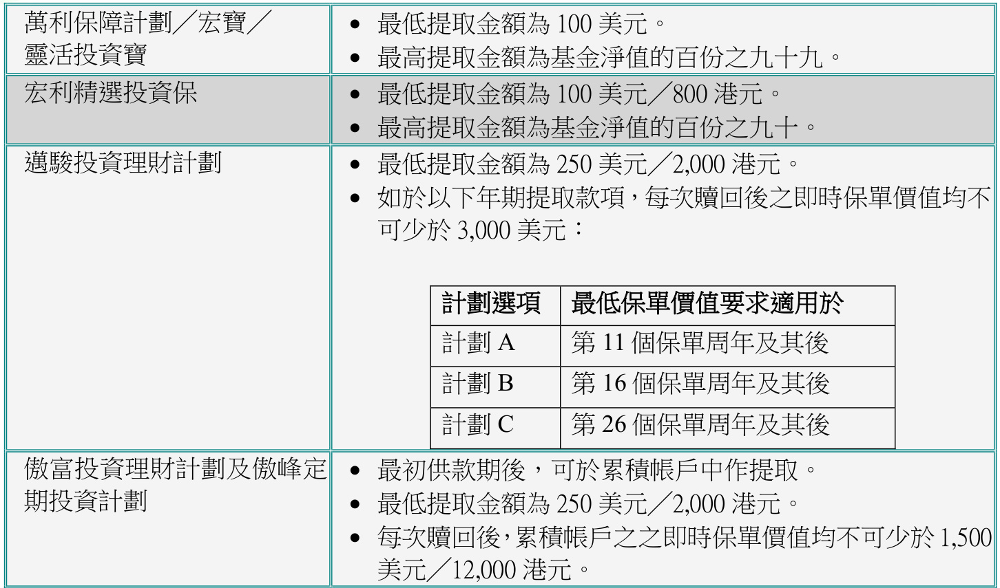

<html><body><table><tr><td>萬利保障計劃／宏寶／ 靈活投資寳</td><td colspan="3">·最低提取金额為100美元° 最高提取金额為基金淨值的百份之九十九。</td></tr><tr><td>宏利精選投資保</td><td colspan="3">：最低提取金额為100美元／800港元。 最高提取金额為基金淨值的百份之九十。</td></tr><tr><td rowspan="4">投資理财計劃</td><td colspan="3">●最低提取金额為250美元／2,000港元° ·如於以下年期提取款，每次回後之即時保單價值均不 可少於3,000美元：</td></tr><tr><td>計劃頂</td><td>最低保單價值要求適用於</td><td rowspan="4"></td></tr><tr><td>計劃A</td><td>第11個保單周年及其後</td></tr><tr><td>計劃B</td><td>第16個保單周年及其後</td></tr><tr><td>計劃C</td><td>第 26 個保單周年及其後</td></tr><tr><td colspan="2">傲富投資理财計劃及傲峰定 期投資計劃</td><td colspan="4">·最初供款期後，可於累积帐戶中作提取° ·最低提取金额為250美元／2,000港元。 ·每次回後，累帐戶之之即時保單價值均不可少於1,500</td></tr></table></body></html>

## 第 69 页

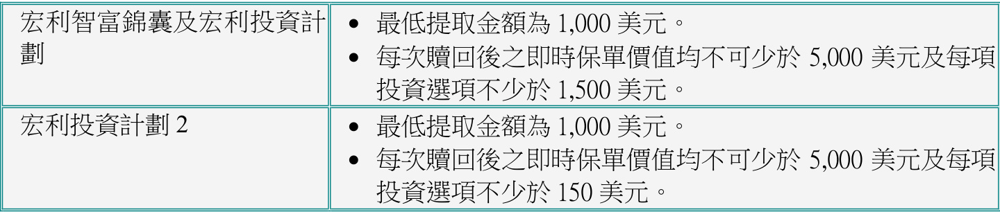

<html><body><table><tr><td>宏利智富錦囊及宏利投資計·最低提取金额為1,000美元。 劃</td><td>·每次回後之即時保單價值均不可少於5,000美元及每填 投資選不少於1,500美元°</td></tr><tr><td>宏利投資計劃2</td><td>·最低提取金额為1,000美元° ·每次回後之即時保單價值均不可少於5,000美元及每頂 投資项不少於150美元°</td></tr></table></body></html>

如提取金額超過可動用基金結餘，本公司將只會贖回最高可動用基金結餘。

f) 附有固定賠償額保單的提取金額：

保障額會根據提取金額及提款手續費下調，如適用  
新投保額會以整數計算  
宏利精選投資保的最低投保額為10,000 美元╱80,000 港元。往後之提取將視為選擇  
遞增身故賠償選擇  
客戶將收到函件確定基本計劃的新保障額

g)

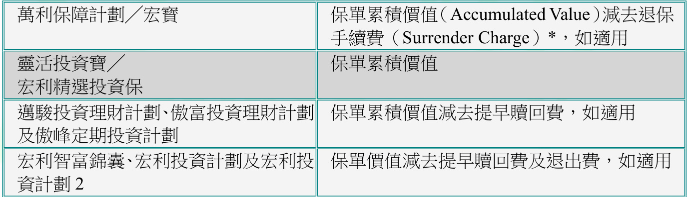

<html><body><table><tr><td>萬利保障計劃／宏寶</td><td>保單累價值（AccumulatedValue）减去退保 手續費（Surrender Charge）*，如適用</td></tr><tr><td>靈活投資寶／ 宏利精選投資保</td><td>保單累價值</td></tr><tr><td>投資理财計劃傲富投資理财計劃 及傲峰定期投資計劃</td><td>保單累價值減去提早回費，如適用</td></tr><tr><td>宏利智富錦囊、宏利投資計劃及宏利投 資計劃 2</td><td>保單價值减去提早回費及退出費，如適用</td></tr></table></body></html>

註：詳情請參閱產品銷售說明書。

\* 萬利保障計劃及宏寳的退保手續費並不相同：

無論提取金額或全部退保，萬利保障計劃的保單都需要繳交退保手續費，並於提取金額內扣除。退保手續費的計算方法如下：

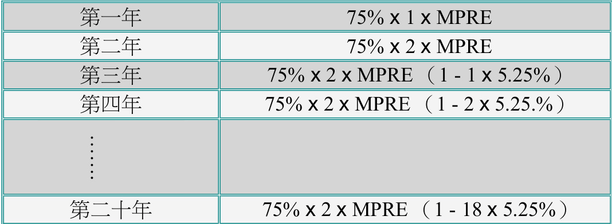

<html><body><table><tr><td>第一年</td><td>75% x 1 x MPRE</td></tr><tr><td>第二年</td><td>75% x 2 x MPRE</td></tr><tr><td>第三年</td><td>75% x 2 x MPRE (1 - 1 x 5.25% )</td></tr><tr><td>第四年</td><td>75% x 2 x MPRE (1 - 2 x 5.25.% )</td></tr><tr><td>·······</td><td></td></tr><tr><td>第二十年</td><td>75% x 2 x MPRE (1 - 18 x 5.25%)</td></tr></table></body></html>

宏寶的退保手續費是根據已支付的可獲佣金保費（Commissionable Premium）總額計算，計算方法如下：

## 第 70 页

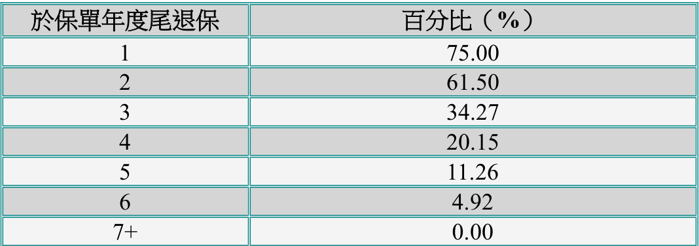

<html><body><table><tr><td>於保單年度尾退保</td><td>百分比（%)</td></tr><tr><td>1</td><td>75.00</td></tr><tr><td>2</td><td>61.50</td></tr><tr><td>3</td><td>34.27</td></tr><tr><td>4</td><td>20.15</td></tr><tr><td>5</td><td>11.26</td></tr><tr><td>6</td><td>4.92</td></tr><tr><td>7+</td><td>0.00</td></tr></table></body></html>

*表格标题：取較低者（每年按期保費 Annual Planned Premium，保障額 $\times\$500,710,000\$ ） $\mathsf{x}$ 該保單已生效年期 $\mathsf{x}$ 退保手續費百分比（如下所列）*

h) 如欲將有關金額調動至保單持有人的其他保單，須在表格上清楚註明「至保單編號」、調動金額及調動用途。如「至保單編號」為一份新保單，須在表格上註明調動用途為「繳付首期保費」或「首次認購」，並連同有關新生意投保申請書一併遞交。

i) 客戶可選擇兩種方法提取有關金額：

電子支付服務 （直接存入／轉入指定銀行帳戶或轉數快）支票

j) 完成退保手續後，提取客戶會收到一份基金提取通知書，全數退保客戶會收到一份保單退保通知書。

3.2 不接納保單（Not Taken）

a) 宏利批核有關申請及簽發保單後，將給予客戶冷靜期。在冷靜期內，客戶可檢討該保單並決定接納與否。

冷靜期為「將保單交付保單持有人或其代表後或將《通知書》發予保單持有人或其代表後，起計的二十一天，以較先者為準」。

b) 當客戶決定不接納該保單時，便可獲退還保費。

投保傳統計劃及「非投資相連整付保費」保單的客戶可獲退回全部保費；至於「投資相連」及「非投資相連整付保費」的保單，宏利會在扣除「市場調整」後，向客戶退回剩餘的保費。

c) 有關規定：

客戶書面表示「不接納」其保單  
保單持有人的香港身份證╱護照副本（如保單持有人為商業客戶，請按此處查閱有  
關規定）  
保單合約 (只限紙本合約)  
在冷靜期內提出有關申請

## 第 71 页

只適用於「自願醫保計劃」及選擇電子版合約的客戶，亦可將已簽署的不接納保單申請副本電郵至 hk_ifp_not_taken@manulife.com，正本申請則無須再次遞交。

d) 完成有關手續後，行政部將送交以下文件給有關人士：

客戶：保費退款支票保單取消通知書  
顧問：有關不接納保單的函件副本透過ANS 收取保單取消通知書副本

3.3  期滿

保單期滿通知書

a) 當人壽保險保障期（保費供款期）完結時，壽險儲蓄計劃（儲蓄計劃）亦同時期滿。b) 如客人之保單將於下一周年期滿，客人將收到一份於期滿日前二十三天連同「保單周年通知書」發出之「保單期滿通知書」。該通知書將列明保單期滿時之保單價值。c) 客戶可全數╱部份提取期滿金額或保留於本公司，後者為預設選擇。

d) 如提取期滿金額，有關規定為：

已簽妥的回條及「付款指示」或保單期滿／退保申請表（表格 T28b）保單持有人的香港身份證╱護照副本（如保單持有人為商業客戶，請按此處查閱有關規定）

期滿保單周年通知書

如期滿金額未被全數提取，有關金額將會保留於本公司的滾存帳戶積存利息。於其後之保單周年，「期滿保單周年通知書」會於保單周年日前二十三日寄予客人，該通知書會列明下一周年日之滾存帳戶結餘。該通知書會於每年發出直至滾存帳戶之金額全數被提取為止。保險顧問亦可透過保險顧問通訊系統收到此有關通知。

保單期滿時將附加保障轉單

a) 當保單期滿時而該保單仍附有其他附加保障，可將該附加保障轉換至新保單而無需受保資格證明。b) 已存在狀況、不受保項目、不可異議條款及自殺條款皆以該附加保障最初的生效日期為準。

## 第 72 页

c) 除「意外賠償保障」，「意外傷亡保障」╱「意外無憂保障」及「可續保定期保障計劃」須轉為「意外死亡及傷殘保障」，「綜合意外附加保障」及「錦鏽十載」，其他轉換至新保單之附加保障必須和原有之附加保障相同。  
d) 已轉換之附加保障保費將根據受保人之所達年齡計算。  
e) 首年佣金及營業積分不適用於已轉換之附加保障，續保佣金則仍然有效。

3.4  轉換

定期保險轉換保單

a) 一份定期保險或定期附加保險，可於保單上列明的轉換期（conversion period）內，轉換為一份水平式保費的終身人壽計劃而無需出示受保資格證明。現時可行使定期保險轉換之終身人壽計劃，可參考個別產品之產品手冊。

b) 受保人的已達年齡必須在65 歲以下。

c) 定期保險轉換保單可分為：

按已達年齡轉換保單（Attained Age Conversion）；或按原先年齡轉換保單（Original Age Conversion）

按已達年齡轉換保單

a) 新保單的保險年齡為受保人的已達年齡。  
b) 新保單的投保額或身故賠償(以最高為準)可維持原有定期保障的投保額，新保單須同時符合最低保障額及最低保費要求。  
c) 若以下附加保障於行使保轉換權益時仍接受新申請及該原本的定期基本計劃或附加該定期保障之原本的保單已終止的情況下，可由原本之定期保障轉換至新保單，而無須提供受保資格證明：

守護一生醫療附加保障住院現金保障 (HI) （若保單持有人接受於新保單內重新計算無索償增額賠償）門診附加保障 (OB)傷殘豁免保費保障 (PWB)^^只適用於保費繳付期達25年或以上之新保單

d) 以下情況須提供受保資格證明：

新保單的保障額高於原先保單基本計劃或附加保障的保額。增加新的附加保障。「傷殘豁免保費保障」附加至保費繳付期少於25 年之新保單e) 轉換後的新保單的保單貨幣可有別於原先保單的貨幣。轉換保單將以帳面兌換率計算。

## 第 73 页

f) 若新保單之投保額及身故賠償少於原本之定期保障，其未轉換部份將按客戶於「保險轉保申請書」（表格T01）內的指示處理。

i. 選擇一：終止其未轉換部份之定期保障ii. 選擇二︰保留其未轉換部份之定期保障但須符合以下要求』︰

最低保障額（即港幣160,000 / 美元20,000 或正常最低定期保險產品要求，以較低者為準）  
• 正常之最低年繳保費

iii. 選擇三：轉換全部或部份定期保障至附加於新保單之定期附加保障，但須符合以下之要求︰

新的定期附加保障將為「精選定期壽險附加保障」，保單持有人可選擇「精選定期壽險附加保障10」或「精選定期壽險附加保障20」。若原本之定期基本計劃為「安居寶」計劃，則可轉換至「安居寶」附加保障或「精選定期壽險附加保障」。部份轉換定期保障至新的定期附加保障之權利，只可行使一次。當轉換至新的定期附加保障後，此新的定期附加保障將不可再次部份轉換此定期附加保障至另一新的定期附加保障。  
已轉換之定期附加保障的佣金將根據原本之保障的已生效年期發放，若原本之保障已生效了2.5年，已轉換之定期附加保障的佣金將以第4年之佣金率計算。  
已轉換之「精選定期壽險附加保障」的保費將根據新保單之保單生效日期時的年齡計算。  
已轉換之定期附加保障的保障額不可少於港幣160,000 / 美元20,000或該附加保障之最低保障額

g) 有關規定：

保險轉保申請書（表格T01）  
傳統計劃投保申請書（表格U03）╱投資相連壽險計劃投保申請書（表格U03L）新轉換保單之計劃建議書  
首期保費  
保單持有人的香港身份證╱護照副本（如保單持有人為商業客戶，請按此處查閱有關規定）  
直接付款授權書（如適用者）  
保單復效申請╱受保資格聲明 （表格 U36）（如適用者）  
理財需要分析（如適用者）  
重要資料聲明書 - 內地人士在港投購人身╱壽險保單（只適用於持有中華人民共和國居民身份證的人士）  
有關問卷（如適用者）  
如受保人已年滿十六歲或以上，受保人及保單持有人均須在有關表格上簽署。

h) 轉換生效日必需與原先定期保險的保單周年日相同。

例子：原先保單的保單生效日為：2006 年2 月15 日

## 第 74 页

• 轉換生效日可以是任何一個月的15 號。i) 轉換生效日可追溯至較早日子，最多為六個月。j) 假如原先保單已作附屬抵押轉讓（Collateral Assignment），需先獲受讓人同意。k) 按已達年齡轉換的保單不可享有通脹加保權益。

l) 按已達年齡轉換保單的報酬計算安排：

若該定期保障為「精選定期壽險」╱「精選定期壽險附加保障」  
o 於簽發後5年內選擇保單轉換︰ 新保單可獲發放所有佣金及營業積分，而舊保單的佣金及 營業積分將被全部扣回。  
o  於簽發5年後選擇保單轉換︰ 新保單可獲發所有佣金，但已轉換至新保單的保費，當中所含的佣金會被扣回。 新保單將可獲發所有營業積分。

$0$ 回扣將不會當作保單失效而影響保單保留率。個案數目亦不會被扣除。

若該定期保障為其他定期保障產品(即「精選定期壽險」及「精選定期壽險附加保障」推出前之定期保障產品：

新保單可獲發所有佣金，但已轉換至新保單的保費，當中所含的佣金將會被扣回。新保單同時將可獲發放所有營業積分。假如原保單於繳齊首十二個月保費前轉換至新計劃，部份的營業積分將被扣回。因為該部份的營業積分已挪至新計劃或屬於原保單在首年內仍未收齊的保費。

範例：

一份按年繳費的保單在繳交了全年保費後七個月轉換為其他保單，原先發放的營業積分，其5╱12將被扣回。  
一份按月繳費的保單在緻交了四個月保費後轉換為其他保單，原先發放的營業積分，其8╱12將被扣回。  
但該營業積分的回扣將不會當作保單失效而影晌保單保留率。

m) 完成轉換手續後客戶可獲得：

新保單合約；  
附加於新保單內有關自殺及不可異議條款的批註；  
附加於舊保單內有關減少╱刪除定期保障額的批註(如有)。

按原先年齡轉換保單

a) 在首五個保單年度內才可作轉換 b) 新保單的簽發年齡必需為原先保單的簽發年齡 c) 保險顧問應先獲取報價表後才安排轉換

## 第 75 页

d) 一般規定（確實規定將根據當時提供之報價表）：

更改保單申請表（表格T02）  
保單復效申請／受保資格聲明（表格U36）（如適用）  
理財需要分析（如適用者）  
重要資料聲明書 - 內地人士在港投購人身╱壽險保單（只適用於持有中華人民共和國居民身份證的人士）  
保險合約  
需付保費，即新保單與舊保單的保費差額。  
保費利息（如適用者）  
如受保人已年滿十六歲或以上，受保人及保單持有人均須在有關表格上簽署。

e) 通脹加保權益：

假如原先保單不備有通脹加保權益或通脹加保權益已失效，新保單亦不可享有。假如原先保單已備有通脹加保權益，除非在申請書內表明，新計劃亦自動享有。客戶需留意通脹加保權益的最高限額及年期，皆根據原先保單計算。

f) 完成轉換保單後客戶可獲：

新保單合約；  
附加於新保單內有關自殺及不可異議條款的批註。

g) 新保單可獲發放所有佣金及營業積分而舊保單的將被全部扣回。但回扣將不會當作保單失效而影晌保單保留率。個案數目亦不會被扣除。

保單期滿時將附加保障轉單

a) 當保單期滿時而該保單仍附有其他可供銷售之附加保障，可將該附加保障轉換至新保單而無需受保資格證明。  
b) 已存在狀況、不受保項目、不可異議條款及自殺條款皆以該附加保障最初的生效日期為準。  
c) 已轉換之附加保障保費將根據受保人之所達年齡計算。  
d) 首年佣金及營業積分不適用於已轉換之附加保障，續保佣金則仍然有效。  
e) 如欲將附加保障轉換至新保單，保險顧問需預先取得特別批核，而相關之申請文件要求會於特別批核獲准時告知保險顧問。

重病應急附加保障（MDB）轉換為現金扶危附加保障（CAB）

a) 若將重病應急附加保障轉換為現金扶危附加保障，只作為刪除重病應急附加保障及新加現金扶危附加保障處理。

## 第 76 页

b) 九十日緩接期會從現金扶危附加保障生效日起計。（註: 若受保人於緩接期內染上重病， 重病應急附加保障及現金扶危附加保障將不會提供任何保障）

c) 有關規定：

更改保單申請表（表格T02）  
保單復效申請╱受保資格聲明（表格U36）  
重要資料聲明書 - 內地人士在港投購人身╱壽險保單（只適用於持有中華人民共和  
國居民身份證的人士）d) 轉換將於下一個保單月結日生效。  
e) 如新保額比原先的保障為高，高出的部份則需經過緩接期後方可生效。  
f) 完成轉換手續後，客戶可獲得更改保單批註。

保寶安心兒童附加保障（CCB）轉換為現金扶危附加保障（CAB）

a) 可於受保人年滿十六歲時轉換。  
b) 轉換將於下一個保單月結日生效。  
c) 於「保寶安心兒童附加保障」內受保的重病沒有緩接期限制。相反，任何「保寶安心兒童附加保障」內不受保的重病，90 日緩接期會從「現金扶危附加保障」之生效日起計算。  
d) 如新保額比原先的保障為高，高出的部份則需經過緩接期後方可生效。

e) 有關規定：

更改保單申請表（表格 T02），填妥第 1A 部份「保單持有人資料」，並於「其他」  
一項寫上「由「保寶安心兒童附加保障」轉換為「現金扶危附加保障」<貨幣 $\Join$ 保  
額>不包括通脹加保權益」  
吸煙習慣問卷（表格U14）  
保單復效申請╱受保資格聲明（表格U36 ）– 如新「現金扶危附加保障的保障額較  
原先的「保寶安心兒童附加保障」的保障額為高  
理財需要分析（如適用者）  
重要資料聲明書 - 內地人士在港投購人身╱壽險保單（只適用於持有中華人民共和  
國居民身份證的人士）

f) 完成轉換手續後，客戶可獲得更改保單批註。

傷殘優先賠償保障（APDB）及傷殘入息附加保障轉換為傷殘入息保障計劃

## 第 77 页

a) 任何並非在賠償階段的「傷殘優先賠償保障」或「傷殘入息附加保障」，均可轉換為180 日或365 日等待期的「傷殘入息保障計劃」。  
b) 新保單的保障額為「傷殘入息附加保障」或「優先賠償附加保障」的 $1/120$ 。  
c) 無需經過醫療核保，但需經過財政及職業核保。  
d) 保障將於下一個保單月結轉換日生效。  
e) 轉換生效日期不可追朔至較早日子。  
f) 已存在狀況以原先附加保障的簽發日期為準。  
g) 需遞交完整的「傷殘保險申請書」（表格U39）。  
h) 理財需要分析（如適用者）  
i) 重要資料聲明書 - 內地人士在港投購人身╱壽險保單（只適用於持有中華人民共和國居民身份證的人士）  
j) 若新保單的保障額超過「傷殘入息附加保障」或「傷殘優先賠償保障」的每月賠償額，該超出的部份作增加保額論。增額部份的已存在狀況以轉換生效日計算。

摯無憂危疾附加保障 (CCIB) 轉換為指定終身人壽計劃

a) 保單持有人可把摯無憂危疾附加保障（基本版）或摯無憂危疾附加保障（加強版）（「原有計劃」）轉換至另一指定終身人壽計劃（「新計劃」）而毋須額外提供受保人可保證明，惟須符合原有計劃的條款內列出的所有條件  
b) 請參照宏利全接觸最新上載的「保單轉換權益之適用計劃」以了解此轉保選項之適用計劃  
c) 此轉保為按已達年齡轉換保單 (Attained Age Conversion)，即新計劃的保險年齡為受保人的已達年齡（有别於精選定期壽險 (ManuTerm)，按原先年齡轉換保單 (Original Age Conversion)並不適用）• 新計劃之保費將根據本公司於轉保日適用之保費率、受保人於轉保日最接近一個生日所達之歲數及受保人於原有計劃所屬之風險級別而釐定• 任何原有計劃的額外保費及/或不保事項將按核保部決定而轉移到新計劃，例如假如摯無憂危疾附加保障已附帶 $50\%$ 的額外死亡率保費，它將會轉移至新計劃對應的額外保費可選擇轉換「全部」 或「部份」原有計劃至新計劃。惟不論選擇「全部」或「部份」轉保，此轉保選項只可行使一次，並於申請及生效後不可撤回。同時，新計劃不可再次轉換至另一個計劃  
在任何情況下亦必須符合新計劃及原有計劃的產品規定，例如最高投保額、最低投保額及最低保費要求等  
新計劃的保單貨幣可能有別於原有計劃的保單貨幣。轉保時，港元與美元相等金額將按照1 美元 : 8 港元兌換率計算

## 第 78 页

以下情況須提供可保證明：

新計劃的名義金額及身故賠償高於原有計劃的保障額增加新的附加保障「傷殘豁免保費保障」附加至保費繳付期少於 25 年之新計劃

d) 有關規定︰

保險轉保申請書（表格 T01）  
傳統計劃投保申請書 （表格 U03）  
新計劃之建議書  
首期保費  
保單持有人的香港身份證 ╱ 護照副本（如保單持有人為商業客戶，請按此處查閱有關  
規定）  
直接付款授權書（DDA）（如適用者）  
保單復效申請 ╱ 受保資格聲明（表格 U36 ）（如適用者）  
理財需要分析（如適用者）  
重要資料聲明書內地人士在港投購人身╱壽險保單（只適用於持有中華人民共和國居  
民身份證的人士）  
有關問卷（如適用者）  
如受保人已年滿十六歲或以上，受保人及保單持有人均須在有關表格上簽署

e) 填寫表格 T01 時︰

$\cdot$ 註明摯無憂危疾附加保障之基本計劃的保單編號註明「此轉保源自」，選擇 「附加定期保障條款」並於橫線上填寫「摯無憂危疾附加保障」轉換類別︰「全部」 或「部份」並註明轉保及不轉保數目註明新的保單生效日期，並必須為原有保單的周月日例子：原有計劃的保障生效日為：2021 年8 月 15 日  轉保生效日可以是任何一個月的 15 號轉保生效日不可追溯六個月以上按已達年齡轉換的新計劃不可享有通脹加保權益假如原先保單已作附屬抵押轉讓（ Collateral Assignment ），需先獲受讓人同意

f) 完成轉保手續後：

## 第 79 页

• 如選擇「全部」轉保，當本公司批准轉保申請後，新計劃將於批准當日簽發，而原有計劃亦將會於同日終止

客戶可獲得：

新計劃的保單合約  
$\cdot$ 附加於新計劃內批註，包括 自殺條款 不可異議條款  
$\cdot\cdot$ 附加於原有計劃內有關減少保障額 ╱ 刪除保障的批註（如有）

g) 報酬：

於原有計劃簽發後5 年內轉保︰

 新計劃可獲發放所有佣金及營業積分  
 原有計劃的佣金及營業積分將被全部扣回於原有計劃簽發5 年後轉保︰  
 新計劃可獲發所有佣金，但已轉換至新計劃的保費，當中所含的佣金將會被扣回  
 新計劃將可獲發所有營業積分

轉保將不會當作保單失效而影響保單保留率。個案數目亦不會被扣除

宏寶（廿一歲時的保障額）

a) 廿一歲時轉換保單

保障額自動增至五倍或增至認可保額意外死亡保障亦可如基本保額一樣轉換，但不可高於1,000,000 美元雖然保障額已增加，但仍可保留現有的按期保費。

b) 轉換前的保障額變更所造成的影響：

在十四歲最後一個月結日後，任何事務招致保額下降將會減低將來可轉換的保額。  
該事務包括：o 降低保障額。  
o 死亡賠償選擇由B（遞增身故賠償）轉至A（固定身故賠償）。  
o 選擇固定身故賠償的保單作部份退保。

c) 如何計算轉換後的保額？

固定身故賠償保障額 $\mathbf{\Sigma}=\mathbf{\Sigma}$ (14 至21 歲期間的最低死亡賠償) $\times4+$ 年屆21 歲時之死亡賠償死亡賠償 $\mathbf{\Sigma}=\mathbf{\Sigma}$ 保障額 – 欠款  
遞增身故賠償保障額 $\mathbf{\Sigma}=\mathbf{\Sigma}$ 認可保額 $\times4+$ 年屆21 歲時之保額認可保額（取較低者）︰ 年屆14 歲時之保額；或

## 第 80 页

14 至21 歲時有效之最低保額

死亡賠償 $\mathbf{\Sigma}=\mathbf{\Sigma}$ （保障額 $^+$ 基金值） – 欠款

例一：固定身故賠償

最初保障額 : 100,000  
於21 歲時的基金值 : 150,000  
於21 歲時的保障額 : $^{100,000^{*}}$   
新保障額 : $(100,000\times4)+(150,000+10,000^{\ast})=560,000$

\*：宏利可按保單規定增加此金額。

例二：遞增身故賠償

最初保障額 100,000(14-21 歲期間並無降低保障額)  
於21 歲時的基金值 : 150,000  
於21 歲時的保障額 : 100,000  
新保障額 : $100,000\times4+100,000=500,000$   
例三：遞增身故賠償  
最初保障額 100,000  
於21 歲時的基金值 90,000  
於16 歲時的保障額 70,000  
於21 歲時的保障額 80,000  
新保障額 $(70,000\times4)+80,000=360,000$

d) 選擇權

在轉換期間兩個月內，受保人如非吸煙者可申請將基本保費率轉為非吸煙者保費率。

## 第 81 页

第四章：保單提款

4.1  提取紅利╱現金儲備

a) 有關紅利（包括現金紅利或繳清保險的現金價值）的報價表可透過ManuTouch 取得。

b) 有關規定：

於客戶網站申請；或填妥的「保單提取或調動紅利／現金儲備（傳統保單）申請表（分紅保單）」（表格T28a）；  
保單持有人的香港身份證╱護照副本（如保單持有人為商業客戶，請按此處查閱有關規定）

c) 除整付保費計劃可於第一個年結日後申請提取紅利外，提取首年紅利是必須繳付第二年之全年保費。

d) 在以下的特別情況，提取紅利將受到限制：

未清還之貸款額已超過保證現金價值  
欠交保費  
保單已失效  
保單正行使對減保費權益╱行使對減保費權益而現金儲備已納入作對減保費特別紅利運用方式  
o 宏利終身人壽保障計劃的紅利運用方式為紅利繳清增額保險（Deferred Paid UAddition）  
o 優惠終身人壽保險計劃的紅利運用方式為紅利保險（Bonus Protection）。

e) 如有任何附屬受讓人或受 MPSO╱MWPO 條款限制的保單，需分別取得附屬受讓人及所有受益人同意。

f) 如屬「MPSO╱MWPO」條款管轄下的保單（即不得更改保單上之受益人），保單持有人及所有受益人均為該紅利的受款人。

g) 如欲將有關金額調動至保單持有人的其他保單，須在表格上清楚註明「至保單編號」、調動金額及調動用途。如「至保單編號」為一份新保單，須在表格上註明調動用途為「繳付首期保費」或「首次認購」，並連同有關新生意投保申請書一併遞交。

h) 提取的紅利╱現金儲備不可應用在不同保單持有人的保單。

i) 提取紅利╱現金儲備時，客戶可選擇通過兩種方法提取：

電子支付服務 （直接存入／轉入指定銀行帳戶或轉數快）o 紅利/現金儲備提取通知書將送交客戶或保險顧問，並會顯示最新選用的收款安排? 支票

## 第 82 页

o 行政部會將有關支票：

 直接發給客戶；或  
 發給保險顧問轉送給客戶。  
 提取紅利的支票連同紅利提取通知書送交客戶或保險顧問。  
 提取現金儲備的支票連同現金儲備提取通知書送交客戶或保險顧問。提取金額可應用在同一保單或持有人的其他保單以：o 支付保費；或  
o 清還貨款。

4.2  行使「終期紅利鎖定權益」及提取已鎖定之終期紅利金額

a) 行使「終期紅利鎖定權益」的有關規定：從ManuTouch 獲取報價的特定申請表格  
b) 處理完成後，客戶會獲發確認通知書。  
c) 通知書亦會上載至 ANS 供顧問參考 。  
d) 如欲提取已鎖定之終期紅利金額，可參閱上述「提取紅利╱現金儲備」部份。

4.3  貸款

傳統計劃

a) 當保單仍然擁有保單價值時，客戶可作保單貸款。當保單正使用積存紅利對減保費時，保單貸款有特定限制，詳情請按此處。  
b) 可貸款額的報價表可透過ManuTouch 取得。

c) 有關規定：

於「宏利全接觸」下載「保單貸款申請（傳統保單）」。「保單貸款申請（傳統保單）」表格合共有3 頁，顧問可於「宏利全接觸」即時取得表格第1 及第2 頁，當中載有一個參考編號。而表格第3 頁將於下一個工作天發送至顧問的安全收件匣，該頁載有上述參考編號及有關貸款而引致保單失效的資料。  
（客戶亦可登入客戶網頁，）就指定計劃申請貸款。保單失效的資料會在客戶確認申請前於網頁上顯示。）  
保單持有人的香港身份證╱護照副本（如保單持有人為商業客戶，請按此處查閱有關規定）  
附屬抵押受讓人（Collateral Assignee）的書面同意（如適用者）  
如屬「MPSO╱MWPO」條款管轄下的保單，所有受益人的書面同意

## 第 83 页

d) 最高貸款額：

一般計算方法：  
$90\%\times$ (現金價值 $^+$ 紅利 – 逾期保費) – 保單貸款  
當保費正使用積存紅利對減保費時：  
$90\%\times$ (現金價值 – 逾期保費) – 保單貸款  
範例：保單保證現金價值 10,000 港元積存紅利 : 8,000 港元貸款結餘 : 5,000 港元  
一般計算方法：最高貸款額 $\c=$ $90\%$ x (10,000 + 8,000) – 5,500$\mathbf{\Sigma}=$ 11,200 港元  
當保費正使用積存紅利對減保費時：最高貸款額 $\mathbf{\Sigma}=\mathbf{\Sigma}$ 90% x 10,000 – 5,000$\mathbf{\Sigma}=$ 4,000 港元  
e) 所有保單貸款都須繳付利息。除非已在保單合約上訂明，利率將由宏利保險訂定。有關利率詳情可參閱「宏利全接觸」內之保費率手冊。  
f) 當貸款結餘超出現金價值時，保單持有人將會收到「保單失效通知書」。此通知書要求保單持有人在指定的特別優惠限期到期日前償還貸款。保險顧問可同時透過「代理人通知系統」（ANS）得知有關消息。  
g) 保證現金價值及紅利扣除欠款後低於貸款結餘時，保單便會失效。  
h) 如欲將有關金額調動至保單持有人的其他保單，須在表格上清楚輸入「至保單編號」、調動金額及調動用途。如「至保單編號」為一份新保單，須在表格上輸入調動用途為「繳付首期保費」或「首次認購」，並連同有關新生意投保申請書一併遞交。  
i) 客戶可選擇以下方法提取貸款金額(於「宏利全接觸」下載「保單貸款申請（傳統保單）」)：電子支付服務 （直接存入／轉入保單持有人的指定銀行帳戶或轉數快）• 支票  
j) 完成後，客戶會收到一份保單貸款通知書，當中載有保單最新的失效資料。

## 第 84 页

投資相連壽險計劃

a) 保單貸款只適用於宏寶、萬利保障計劃、宏利精選投資保及靈活投資保。  
b) 最低貸款額為100 美元╱800 港元。

最高貸款額：

萬利保障計劃╱宏寶 – 淨現金價值的 $75\%$   
靈活投資寶 – 基金淨值的 $90\%$   
宏利精選投資保 – 基金淨值的 $90\%$ x （基金淨值 $^+$ 貸款額） - 貸款額

d) 有關規定：

更改╱保單提款（與投資相連的壽險計劃）申請表（表格T31）保單持有人的香港身份證╱護照副本（如保單持有人為商業客戶，請按此處查閱有關規定）附屬抵押受讓人（Collateral Assignee）的書面同意（如適用者）

e) 可申請貸款之金額以該保單之最高可動用的保單淨帳戶價值為限，而宏利將依據最快可行之日期作為申請貸款金額之生效日。

f) 如欲將有關金額調動至保單持有人的其他保單，須在表格上清楚註明「至保單編號」、調動金額及調動用途。如「至保單編號」為一份新保單，須在表格上註明調動用途為「繳付首期保費」或「首次認購」，並連同有關新生意投保申請書一併遞交。

g) 客戶可選擇兩種方法提取貸款金額：

電子支付服務 （直接存入／轉入指定銀行帳戶或轉數快）支票

h) 完成後，客戶會收到一份保單貸款通知書。

4.4  傳統保單之定期提取

設立╱更改定期提取

a) 於可提供定期提取之傳統保單，設立定期提取金額不設上限。  
b) 定期提取金額會於保單月結日，以自動轉帳方式存入保單持有人之預設銀行帳戶。  
c) 銀行帳戶必須為港元戶口及由保單持有人持有。  
d) 除非該保單為聯合持有保單，否則不接受聯名帳戶。e) 客戶可更改銀行帳戶及定期提取金額。  
f) 付款生效日期為設立╱更改定期提取後之下個提取日期。

## 第 85 页

g) 有關規定：

需填寫「定期提取申請表﹝傳統保單﹞」﹝表格T38﹞；  
帳戶資料證明包括列有帳戶持有人姓名及帳戶號碼之銀行帳單或銀行存摺副本；保單持有人的香港身份證╱護照副本 （如保單持有人為商業客戶，請按此處查閱有關規定）

h) 完成設立╱更改定期提取後，「確認書」送交客戶或保險顧問。

i) 完成自動轉帳給付定期提取後，「定期提取通知書」送交客戶或保險顧問。

暫停定期提取

a) 客戶可暫停定期提取  
b) 生效日期將以處理申請當日為準。  
c) 如定期提取金額未能成功存入保單持有人之銀行帳戶，定期提取指示將會被取消，及是次之提取金額會自動保留在保單內以作積存。  
d) 如申請保單貸款，定期提取指示亦相應被取消。  
e) 有關規定：• 需填寫「定期提取申請表﹝傳統保單﹞」﹝表格T38﹞；  
f) 完成暫停定期提取後，「暫停保證入息定期提取通知書」送交客戶或保險顧問。

4.5  更改入息開始年齡/年度

a) 申請更改入息開始年齡/年度的要求：

從ManuTouch 獲取的「更改入息開始年齡/年度申請表」，顧問可按以下步驟索取：  
o 於 ManuTouch 之 Income Start Age/ Year Change 頁面輸入新入息開始年齡/年度以索取報價。  
o 「更改入息開始年齡/年度申請表」連同「更改入息開始年齡/年度說明」將於下一個工作天 (或兩個工作天如輸入日時間為下午六時或之後)，以 PDF 檔案格式透過 ANS 傳送給顧問。該 ANS 亦將可於 To Do List - Policy Maintenance 目錄下獲取，並保留 30 日。

## 第 86 页

o 保單持有人於報價單有效期內簽署及遞交「更改入息開始年齡/年度申請表」，而「更改入息開始年齡/年度說明」則可供保單持有人保存作日後參考用途。

b) 處理完成後，客戶會獲發「更改保單資料批註」。

## 第 87 页

第五章：投資相連壽險計劃之單位基金

5.1 支付派發投資選項

a) 附有股息作定期分派特點類別之投資選項 (支付派發投資選項)適用於宏利智富錦囊，宏利投資計劃及宏利投資計劃2。  
b) 宏利將從支付派發投資選項所連繫至相關基金所收取的股息(如有)，派發予於宏利公佈支付金額派發的當天 (“記錄日”)仍持有該支付派發投資選項的保單持有人。  
c) 支付派發投資選項不適用於基金自動轉換安排  
d) 單次認購之詳情, 請按此處  
e) 基金調配之詳情, 請按此處  
f) 保單持有人為指定收取支付金額者  
g) 支付派發投資選項申請表(宏利智富錦囊╱宏利投資計劃) (表格T39)  
h) 附有帳戶持有人姓名及帳戶號碼之銀行月結單或存摺影印本 (只接受港元帳戶)

5.2  整付金額╱投資／單次增加認講

<html><body><table><tr><td></td><td>Form T31</td><td>Form WM02</td><td>Form MS02</td><td>Temporary Receipt</td><td>FNA</td><td>RPQ</td><td>IFSAD/ IFSADTU</td></tr><tr><td>萬利保障計劃</td><td>√</td><td></td><td></td><td>√</td><td><*</td><td>√*</td><td>√*</td></tr><tr><td>宏寶</td><td>√</td><td></td><td></td><td></td><td>√*</td><td>√*</td><td><*</td></tr><tr><td>靈活投資保</td><td></td><td></td><td></td><td></td><td>*</td><td>*</td><td><*</td></tr><tr><td>宏利精投資保</td><td>√</td><td></td><td></td><td></td><td><*</td><td>√*</td><td><*</td></tr><tr><td>投資理财計劃</td><td></td><td></td><td></td><td></td><td></td><td></td><td></td></tr><tr><td>傲富投資理财計劃</td><td>√</td><td></td><td></td><td></td><td></td><td></td><td></td></tr><tr><td>宏利智富錦囊</td><td></td><td></td><td></td><td></td><td></td><td></td><td></td></tr><tr><td>宏利投資計劃</td><td></td><td></td><td></td><td>√</td><td>√</td><td>√</td><td></td></tr><tr><td>宏利投資計劃2</td><td></td><td></td><td></td><td></td><td>√</td><td>√</td><td>√</td></tr></table></body></html>

\*These documents are required if the lump sum payment is over $150\%$ of annualized planned premium as of last policy anniversary. The maximum total accumulation subscription amount for MIPLUS is USD1.25 million per life insured.

## 第 88 页

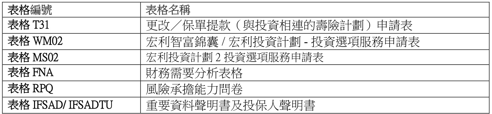

<html><body><table><tr><td>表格编號</td><td>表格名</td></tr><tr><td>表格 T31</td><td>更改／保單提款（與投資相連的壽計劃）申請表</td></tr><tr><td>表格WM02</td><td>宏利智富錦囊/宏利投資計劃-投資頂服務申請表</td></tr><tr><td>表格MS02</td><td>宏利投資計劃2投資選頂服務申請表</td></tr><tr><td>表格 FNA</td><td>财務需要分析表格</td></tr><tr><td>表格 RPQ</td><td>風承能力問卷</td></tr><tr><td>表格IFSAD/IFSADTU</td><td>重要資料聲明書及投保人聲明書</td></tr></table></body></html>

5.3  基金調配

a) 客戶可調配全部或部份基金。

b) 有關規定︰

客戶可登入宏利客戶網頁進行轉換基金手續; 或  
更改╱保單提款（與投資相連的壽險計劃）申請表（表格T31）– 第 1A 部份╱宏利智富錦囊╱ 宏利投資計劃投資選項服務申請表 (表格 WM02) – 第 A 部份╱宏利投資計劃2 投資選項服務申請表 (表格 MS02) –  第二部份請使用「 調動現有基金」部份作有關基金調配。  
請分別在「由」及「至」列清楚填寫轉出及轉入基金的代號，並剔選適用方格以註明百分比、單位及金額。  
於同一基金調配交易中，相同基金不應同時被「轉出」及「轉入」。「靈活投資寶」、「宏利精選投資保」及「邁駿投資理財計劃」「傲富投資理財計劃」及「傲峰定期投資計劃」之所選每項基金轉換百分比最少為 $10\%$ ，總轉換金額必須為不少於250 美元/ 2,000 港元的整數。  
「邁駿投資理財計劃」的基本儲蓄帳戶及尊尚投資帳戶不可作跨帳戶基金調配。  
「傲富投資理財計劃」的初期帳戶、累積帳戶及尊尚投資帳戶不可作跨帳戶基金調配。  
「傲峰定期投資計劃」的初期帳戶、累積帳戶不可作跨帳戶基金調配。萬利保障計劃及宏寶之所選每項基金轉換百分比最少為 $20\%$ 。總轉入百分比必須為 $100\%$ 。  
宏利智富錦囊及宏利投資計劃的基金轉換百分比必定是整數及轉換金額必需大於美金250 元  
宏利投資計劃 2 的基金轉換百分比必定是整數及轉換金額必需大於美金150 元

c) 完成有關手續後，客戶可獲一份基金調配通知書。

## 第 89 页

5.4  更改將來保費╱投資分配比例

a) 客戶可更改日後保費╱投資分配比率。

b) 有關規定︰

客戶可登入宏利客戶網頁進行轉換基金手續; 或  
填寫更改╱保單提款（與投資相連的壽險計劃）申請表（表格T31）–第1C 部份或  
宏利智富錦囊/ 宏利投資計劃投資選項服務申請表 (表格 WM02) – 第A 部分╱宏利  
投資計劃2 投資選項服務申請表 (表格 MS02) –  第一部份  
• 須列明投資基金的比率，總比率為 $100\%$ 。  
• 「靈活投資寶」、「宏利精選投資保」及「邁駿投資理財計劃」、「傲富投資理財計劃」及「傲峰定期投資計劃」之每項基金分配百分比最少為 $10\%$ ，同時必須為整數。「萬利保障計劃」及「宏寶」的最少分配百分比則為 $20\%$ 。宏利智富錦囊及宏利投資計劃的每項基金分配必需大於美金250 元。宏利投資計劃2 的每項基金分配必需大於美金 150 元。

c) 在完成有關手續後，客戶可獲得一份更改保單批註。

## 第 90 页

附錄

附錄一 ：商業客戶之身份證明規定

商業客戶若進行以下各類保單交易時，均須提交身份證明文件：

保單復效• 保單貸款╱提取紅利╱增長紅利╱現金儲備╱保證入息╱保證每年入息╱保證現金儲備或保證教育津貼基金贖回╱提取金額（投資相連壽險計劃保單）不接納保單、撤銷申請或申請遭拒絕保單退保保單期滿• 退還多付保費• 更改保單擁有權

除申請更改保單擁有權外，如客戶之前已就同一份保單遞交身份證明文件，則無須再次遞交有關文件。

除下述身份證明文件外，宏利或會於有需要的情況下要求申請商戶遞交其他身份證明文件。

A) 法團商戶申請人

如申請商戶為在任何證券交易所之上市公司（或其上市公司之子公司）或被保險業監管局（保監局）、香港金融管理局（金管局）及證券及期貨事務監察委員會（證監會）或在同等的司法管轄區授權及監督之金融機構，或政府或在香港或在同等管轄區的公共機構，須遞交下列文件：

(1) 最新的商業登記證副本；  
(2) 公司註冊證書╱註冊證明書副本；  
(3) 證明簽署人士已獲授權處理保單的授權書或董事會決議；  
(4) 所有獲授權簽署人士之香港身份證╱護照副本；  
(5) 組織章程大綱及細則副本 (備註：組織章程大綱適用於二零一四年三月三日以前註冊成立之公司， 除非公司已通過董事會決議或修改通知書修改其組織章程大綱， 使其載於章程細則內。)已核實之過去12 個月內發出列有董事及股東資料的公司查冊報告\*（非香港成立的公司，提交在過去12 個月內由有關公司的當地註冊代理人簽發之職權證明書（現任職位證明書）或同等文件）；  
(7) 所有主要股東(即行使或控制百分之二十五或以上公司股權或投票權的實益擁有人)的香港身份證╱護照副本 (備註：如申請更改保單擁有權，請提交已核實之身份證明文件副本，宏利服務中心的宏利員工或保險顧問可作核實的人士。如屬海外客戶，可接受提供兩份載有相片之不同身份證明文件副本)  ；  
(8) 提交已完成及簽署的「商業保險問卷」（Form U02）－ 只適用於申請更改保單擁有權才須提交此文件；  
(9) 提交已完成及簽署的實體稅務居民身份自我證明表格〈Form CRS/FATCA_ENT〉。若為被動非財務實體，每名控權人需填寫控權人稅務居民身份自我證明表格《通用報告準則》〈Form CRS_CP〉－ 只適用於申請更改保單擁有權才須提交此文件；及  
(10) 提交已完成及簽署的W8-BENE﹝供公司客戶填寫﹞或W9﹝供美國人士 / 實體為美國人士、美國公司、合夥組織、遺產、或信託﹞－ 只適用於申請更改保單擁有權才須提交此文件。

## 第 91 页

註：於初步審批後，保單持有人或須提供其他證明文件。

\* 公司查冊：

（1）由客戶提供經公司註冊處或專業第三者（如律師、公證人、會計師等）確認之認證副本或  
（2） 由保險顧問直接在公司註冊處進行查冊後取得的公司查冊報告之副本及必須在副本上聲明該報告乃由他╱她直接進行查冊所得。

若申請類別不在上述所示，有關規定為：

按照上述簡化盡職審查下之第（1）-（10）項文件要求；以及若公司的擁有權架構由多層公司組成，則須核實最終主要實益擁有人的身份。

B) 非法團商戶

(1) 最新的商業登記證或同等證明副本；  
(2) 證明簽署人士已獲授權作出投保申請的授權書或指令；  
(3) （a）控制非法團體的管理人士、（b）所有持有╱擁有 $25\%$ 或更多的資本或利潤或投票權的實益擁有人（如適用）之香港身份證╱護照副本 (備註：如申請更改保單擁有權，請提交已核實之身份證明文件副本，宏利服務中心的宏利員工或保險顧 問可作核實的人士。如屬海外客戶，可接受提供兩份載有相片之不同身份證明文件副本)  
(4) 所有在表格上簽署的授權人之香港身份證╱護照副本；  
(5) 提交已完成及簽署的「商業保險問卷」（Form U02）－ 只有申請更改保單擁有權才須提交此文件；及  
(6) 當進行內部評估後，可被要求提交額外資料。

注意：

a) 對於獲授權簽署人士、主要股東及董事之身份證明文件詳情，請參閱個人客戶的文件要求。  
b) 申請表須由授權書或董事會決議所列明之授權簽署人士簽署並註明「代表[公司名稱]簽署」或「獲[公司名稱]授權簽署」，請參照以下其中一個範例：i. 以印章印上「代表[公司名稱]簽署」 或 「獲[公司名稱]授權簽署」的字 (通常是方形印章) ; 或ii. 以書寫「代表[公司名稱]簽署」或 「獲[公司名稱]授權簽署」

\* 保監局－保險業監管局；金管局－香港金融管理局；  證監會－證券及期貨事務監察委員會

## 第 92 页

附錄二 ：個人客戶之身份證明規定

（A）香港永久性居民必須提交客戶的香港身份證之副本。（B）非永久性香港居民必須提交客戶的（1）香港身份證及（2）有效之旅遊證件╱相關國民身份證之副本。（C）中國居民必須提交客戶的（1）中國身份證╱出生證明書及（2）旅遊證明文件之副本。（D）外國申請人 (非中國居民)必須遞交客戶的旅遊證明文件╱國民身份證╱國民駕駛執照之副本。對於在香港出生的12 歲以下兒童（為受保人），務必提交（1）香港出生證明書╱旅遊證明文香港身份證及（2）未成年人士的父母或監護人的香港身份證之副本。

認可旅行證件之例子：

（一）護照；或  
（二）澳門特別行政區永久性居民身份證；或  
（三）台灣居民往來內地通行證；或  
（四）海員身份證明文件；或  
（五）內地居民的台灣旅遊許可證；或  
（六）由入境事務處處長簽發的澳門居民旅遊證；或（七）往來港澳通行證。

註： 1) 於初步審批後，保單持有人或須提供其他證明文件，例如國籍證明。2) 身份證明所需資料：全名；出生日期；國籍；獨特識別編號〈例如身份證或護照號碼）及文件類別。識別文件應載有客戶的照片。3) 來往港澳通行證可作為證明客戶為中國公民的有效「旅遊證明文件」，但須連同非永久性香港 / 澳門身份證副本一併遞交。4) 如同事對國民身份證╱駕駛執照之接受有疑問，可向經理諮詢。如有需要，經理可進一步向 AML Compliance 確定。

## 第 93 页

附錄三：住址證明要求

可接受的住址證明，文件須附有保單持有人的姓名或商業保險中的實益擁有人的姓名。

(1) 最近由政府部門或機構發出的通訊 (如: 稅單，差餉費賬單) ；  
(2) 最近由認可機構發出的銀行或信用卡 / 借記卡結單，該文件不可直接由互聯網中屏幕截圖，即不接受此複印本載有互聯網址 (請參閱以下樣本1和2) ；  
(3) 最近公共服務賬單 ；  
(4) 電話 (包括流動電話) ，互聯網服務或收費電視等之月結單；  
(5) 保險顧問 / 經紀人 / 中介人之探訪紀錄聲明 (只適用於香港地址)，對於海外地址，代理商可以向投保人發送一封信到居住地址，並用AML04提交簽名的簽收確認書。請參閱AML04表格「客户住址證明之替代聲明」  
(6) 由宏利保險或其他獲授權保險公司或金融機構發出之信件， 如 ：保單周年報表，保費通知書，保單報告等；  
(7) 法院任命書 (如 ：清盤人或遺囑認證書) ;  
(8) 非香港居民 ：由政府發出附有照片的駕駛執照或載有目前居住地的有效國民身份證

注意事項

• 為符合「保險業監管局」指引3（GL3）要求，保險顧問及保險經紀必須向客戶解釋遞交住址證明的原因。以下為有關闡釋：宏利人壽保險 (國際) 有限公司受百慕達金融管理局和百慕達法規的監管，而需向客戶索取住址證明  
• 客戶的住址證明應與投保申請書一併遞交，或在任何情況下，在保單簽發之前遞交  
• 住址證明的發出日期必須為新保單投保書簽署日起計90日或以內（除以上第8點）  
• 如遞交稅單，差餉費賬單，其信件發出日期可於新保單投保書簽署日的前一個季度發出  
• 不接受「轉交公司地址」，「轉交個人地址」，商業地址或郵政信箱作為住址證明