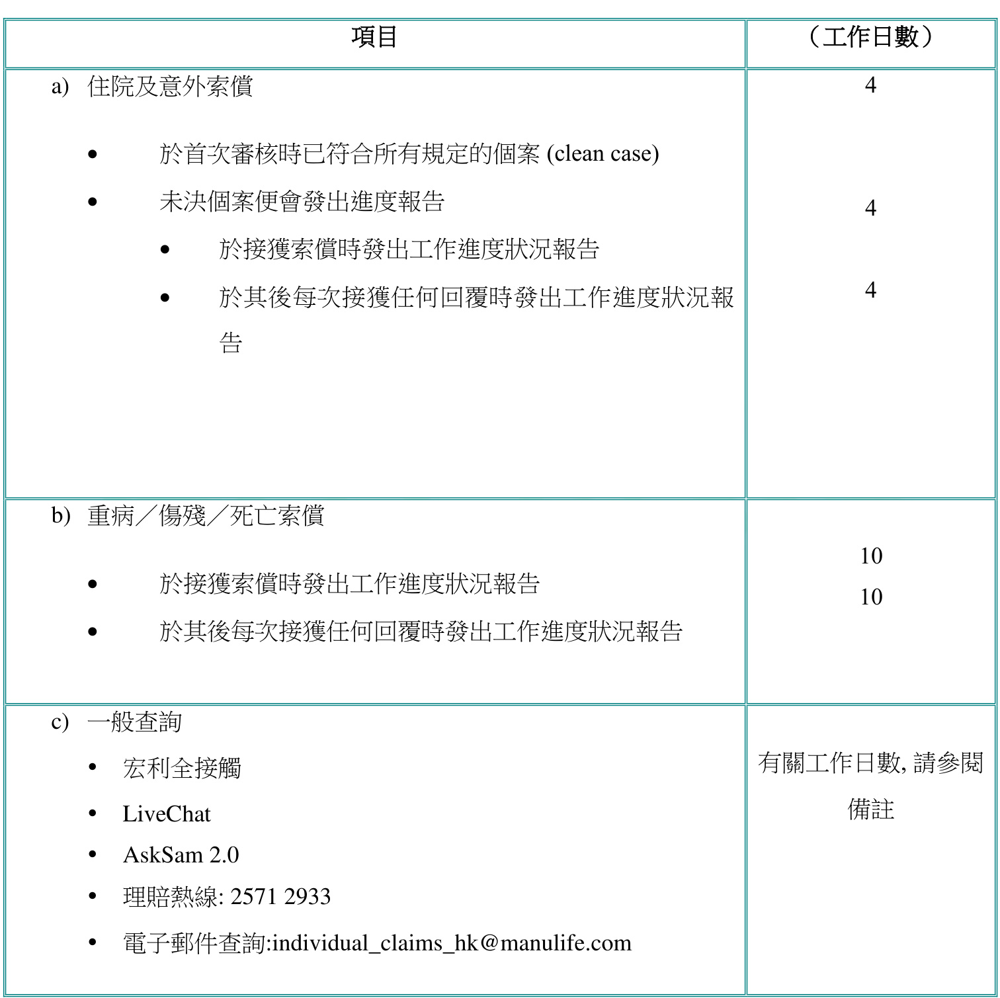

## 第 0 页

電子行致薄作手用

中 文 版、二零二四年一月

第三部分：理賠

最後更新日期:  2024 年 01 月

僅供內部使用

備註: 電子行政運作手冊的內容將不時修訂。 請參閱宏利全接觸內的 IFP Bulletin、 $\cdot\cdot$ IFP NewsFlash 或每月於「宏利全接觸」內的提要以便及時了解最新信息。

## 第 1 页

常用指令

指令

簡易按鍵

文件

1. 首頁 Ctrl + Shift + Pg Up  
2. 前一頁 Ctrl + Pg Up  
3. 下一頁 Ctrl + Pg Dn  
4. 最後一頁 Ctrl + Shift + Pg Dn  
5. 前往頁數… Ctrl + N  
6. 回上文 Ctrl + ß  
7. 往下文 Ctrl + à  
8. 尋找﹝文字搜尋 Ctrl + F  
9. 尋找下一個 Ctrl + G  
10. 列印 Ctrl + P

檢示

11. 放大 Ctrl + +  
12. 縮小 Ctrl + -  
13. 按視窗大小 Ctrl + 0  
14. 實際大小 Ctrl + 1  
15. 按闊度 Ctrl + 2  
16. 按清晰度 Ctrl + 3

## 第 2 页

電子行政運作手冊內容修訂概略

<html><body><table><tr><td>索引</td><td>修訂碼</td><td>内容修訂簡要</td></tr><tr><td colspan="3">2024年01月内容修訂</td></tr><tr><td colspan="3">第三部份：理賠</td></tr><tr><td>第六章</td><td>24_01_01</td><td>重疾病索－规定</td></tr><tr><td>第六章</td><td>24_01_02</td><td>表格C72自闲症譜系障、專注力不足/過度活罐症丶妥瑞症</td></tr><tr><td>第六章</td><td>24_01_03</td><td>重疾病索－规定</td></tr><tr><td>第七章</td><td>24_01_04</td><td>靈活自在年金計劃－规定</td></tr><tr><td>第八章</td><td>24_01_05</td><td>癌症治療保障-癌症保障</td></tr><tr><td>第九章</td><td>24_01_06</td><td>保寶安心兒童附加保障索－规定</td></tr><tr><td>第十章</td><td>24_01_07</td><td>女性保障計劃索价－原位癌索－规定</td></tr><tr><td>第十章</td><td></td><td>24_01_08女性保障計劃索－妊娠期疾病索－规定</td></tr></table></body></html>

## 第 3 页

第三部份：理賠

第一章：死亡索償 . 5  
1.1  受保人死亡 6  
1.2 保費支付人(並非保單持有人)死亡 . .. 21  
1.3 保費支付人(兼保單持有人)死亡 . 22  
第二章：意外索償（AB/ACB/ADDB/AI/AAB/AE/AF/PA/AK） . 23  
第三章：保單恩恤援助計劃（CAP） . 28  
第四章：傷殘索償（PWB/ PB/ APDB/ DI/ PIB/ PIP/ MB/ MG/ ALCI/ LCI） . 30  
傷殘索償 (PWB／PB／APDB ／DI ／PIB／PIP／MB ／MG) ... .. 30  
傷殘索償 (ALCI／LCI) . 32  
第五章：醫療索償（HP/HB/PLHB/GLHB/HI/RP/RB/HN/HH/HO/HP599/HB599/HN599/HT599/HV599/HS599）  
. 34  
第六章：嚴重疾病索償（MDB/ CAB/ CI/PPCI/CLB/VITA/CR/CT/ESCIB/CV/RK/CY） .. 51  
第七章：靈活自在年金計劃（RK） . 56  
第八章：癌症治療保障（CTB） . 57  
第九章：保寶安心兒童附加保障索償（CCB） .... 61  
第十章：女性保障計劃索償 (PL/ PM/ MYPLB） .. 63  
10.1 重病索償 . .. 64  
10.2 原位癌索償 .. 64  
10.3 妊娠期疾病索償 . 65  
10.4 初生嬰兒先天性疾病索償 .. 65  
10.5 準媽媽身故保障 . 65  
第十一章：各項理賠程序所需時間 . .. 66  
附註 . . 68  
附註一 ：商業客戶之身份證明規定 . 69  
附註二 ：理賠金額提款電子支付服務 . 72  
附註三：特別付款方法 . . 74  
附註四：代繳住院費用服務及指定醫療機構及指定醫生的門診癌症治療免找數服務（適用於宏利晉領 /  
活亮人生醫療保障系列 / 附加保障 / 宏利晉悅自願醫保靈活計劃） . 78  
附註五 ：日間手術免找數電子服務 . ... 83  
附註六 ：可賠償金額估算 / 初步評估之程序 .. 85

## 第 4 页

第一章：死亡索償

返回第三部份

頁數

1.1  受保人死亡 6

1.1.1 不可異議索償 9  
1.1.2 可異議索償 10  
1.1.3 意外死亡索償 .15  
1.1.4 各種規定 17  
1.1.5 死亡索償被拒 .18  
1.1.6 死亡索償所需文件清單 .19  
1.1.7 受保人於中國大陸死亡 20  
1.1.8 受保人於香港、澳門和中國大陸以外的地區死亡 20

1.2 保費支付人(並非保單持有人)死亡

1.3 保費支付人(兼保單持有人)死亡 . 22

## 第 5 页

客人在填寫行政表格時作出的資料修正，必須在旁加簽作實，否則申請將不受理。

1.1  受保人死亡

a) 於同一保單內有關人士之死亡包括有：

受保人死亡  
保單持有人（並非受保人）死亡  
保費支付人（並非保單持有人）死亡  
保費支付人（兼保單持有人）死亡  
受益人死亡

b) 死亡索償分類如下：

不可異議索償（其定義請按此處）  
可異議索償（其定義請按此處）  
可異議索償所需之額外規定見 1.1.2 小節。詳情請按此處。

c) 假如基本計劃附有下列之附加保障，於索償時，需要符合額外規定。

意外死亡保障（ADB）  
意外傷亡及傷殘保障（ADDB）  
意外傷亡賠償（AI）  
意外傷亡保障（AB）  
綜合意外附加保障 (AAB)  
「萬無一失」個人意外保障計劃 (AE)  
「萬無一失」個人意外附加保障 (AF)  
個人意外計劃 (PA)  
「萬無一失」個人意外附加保障 2 (AK)

d) 有關規定見1.1.3 小節。詳情請按此處。是否有其他規定要視乎個別情況而定。

## 第 6 页

若受益人為身故人的遺產，須出示以下文件：

− 遺囑認證書的核實副本或  
− 遺產管理書的核實副本。遺囑認證書/遺產管理書核實副本須由香港執業律師或該保險顧問的所屬分區總監（或以上職級的經銷主管）／ 經銷運作部分區總監或經銷服務中心／ 銀行分行主管或經紀公司代理人之所屬主管或客戶服務中心加以認證  
− 經認證的核實副本，請提供簽署人的正楷全名  
− 銀行分行主管或經紀公司代理人之所屬主管，請提供商業認證  
− 分區總監或以上職級的經銷主管可前往客戶服務中心或經銷服務中心辦理核實副本

詳情請按此處參閱 1.1.4 小節。

e) 死亡索償所需文件之清單見 1.1.6 小節。詳情請按此處。

f) 死亡索償獲批淮後，我們將向受益人發出以下文件：

死亡賠償支票死亡賠償通知書

g) 死亡索償可能因個別理由而被拒。在這情形下，宏利將扣除保單於提出索償前所欠款項後退回所有保費。詳情請按此處參閱 1.1.5 小節。

h)    宏利會依據受保人的身故日期計算其所有保單下的身故賠償，惟不包括財富管理產品及邁駿投資理財計劃。就財富管理產品及邁駿投資理財計劃，本公司會按收取以下資料的日期計算身故賠償：

(i) 本公司規定有關索償人的所有身份證明文件；

## 第 7 页

(ii) 本公司規定有關受保人身故及其死因的確鑿證明；(iii) 任何本公司認為對此理賠個案重要的其他事實資料

## 第 8 页

1.1.1 不可異議索償

a) 當人壽保險受保人於以下日期兩年後死亡乃屬不可異議索償：保單簽發日；或最近的保單復效日；或以下各項更改的生效日期：增加名義金額；或增加附加保障保額價值；或• 增加額外附加保障。以較後者為準  
b) 基本規定索償人聲明（表格 C01）- 如受保人的國籍非中國/香港，相關國籍的護照或身份證明文件需一併遞交死亡證明書核實副本- 死亡證明書核實副本須由香港執業律師或該保險顧問的所屬分區總監（或以上職級的經銷主管）／ 經銷運作部分區總監或經銷服務中心／ 銀行分行主管或紀公司代理人之所屬主管或客戶服務中心加以認證  
經認證的核實副本，請提供簽署人的正楷全名  
銀行分行主管或經紀公司代理人之所屬主管，請提供商業認證  
分區總監或以上職級的經銷主管可前往客戶服務中心或經銷服務中心辦理  
核實副本受益人與身故受保人的關係證明副本，如出生證書、結婚證書（若保單持有人在保單申請表及／或指定受益人表格沒有提供受益人的香港身份證／護照號碼）受益人或索償人之最新的香港身份證／護照副本（如受益人為商業客戶，請按此處參閱有關規定）  
註：護照續期後護照號碼會有所變動。 如受益人是我們現有的客戶，護照號碼將有可能在提交死亡索賠時與本公司記錄不符。

## 第 9 页

保單持有人及受保人之最新的香港身份證／護照副本（如保單持有人為商業客戶，請按此處參閱有關規定）

c) 索償人聲明表格可在www.manulife.com.hk 或宏利全接觸下載或向經銷輔助部索取。該表格應由每一位死亡賠償之索償人(即受益人)填寫，每位受益人簽署一份索償人聲明便可。假如受益人為未成年人士（即 18 歲以下），索償人聲明應由以下人士填寫：未成年人士的指定信託人；或未成年人士的合法監護人。如果未成年受益人沒有指定信託人或合法監護人，宏利須代為保管有關之死亡賠償款項直至以下情況出現：該兒童年屆18 歲；或法庭替其委任監護人(請提供合法監護人文件的核實副本)。

死亡證明書是受保人死亡之證明

我們接受:

死亡證明書的正本；或死亡證明書之核實副本須由香港執業律師或該保險顧問的所屬分區總監（或以上職級的經銷主管）／ 經銷運作部分區總監或經銷服務中心／銀行分行主管或經紀公司代理人之所屬主管或客戶服務中心加以認證經認證的核實副本，請提供簽署人的正楷全名• 銀行分行主管或經紀公司代理人之所屬主管，請提供商業認證

1.1.2 可異議索償

a) 當人壽保險受保人於以下日期兩年內死亡乃屬可異議索償。保單簽發日；或最近的保單復效日；或

## 第 10 页

以下各項更改的生效日期：增加名義金額；或增加附加保障保額價值；或增加附加保障。以較後者為準

b) 除了1.1.1 b 小節的基本要求外，還須要額外遞交以下文件：

醫生聲明（表格 C02）  
醫療報告/醫療檔案（如有需要）  
保險顧問報告

c) 醫生聲明表格可在 www.manulife.com.hk 或宏利全接觸 下載或向經銷輔助部索取。醫生聲明表格須由受保人過身時的應診醫生填寫。任何費用須由索償人支付。

d) 因應情況而定，本公司有權索取醫療報告，詳列受保人的病歷。

e) 本公司可向受保人接受治療之診所或醫院索取醫療報告。如需索取醫療報告，保險顧問應通知受益人索償將要較長時間處理。

f) 所有可異議索償個案均須提交《保險顧問報告》(保證受保保單除外) ，以便搜集更多有關該個案的資料。請參閱下頁保險顧問報告範本。

## 第 11 页

Agent’s Report

TO INDIVIDUAL CLAIMS DEPARTMENT (MFC B 21/F)   
FROM   
DATE   
SUBJECT GUIDELINES TO AGENT – REPORTS ON CLAIMS   
POLICY NO :

1. How long did you know the deceased policyholder/insured?

2. How were you introduced to the deceased policyholder/insured and by whom?

3. Do you know whether the deceased policyholder/insured held other policies in other insurance companies? If so, please give the name of the insurer(s) and amount(s) of benefits provided.

4. Do you know the name and address of the deceased policyholder/insured’s employer?

## 第 12 页

5. How many interviews were held with the deceased policyholder/insured at the time when the policy was sold?

6. Give details of the last interview with the deceased policyholder/insured prior to the date of death.

7. How frequent was service requested from the policyholder/insured and how frequent did you meet the client? Please specify the dates, times and contents of discussions if possible.

8. Which item(s) in the policy contract that the deceased policyholder/insured was interested in?

9. At the time when the application was taken, what particulars relating to the health of the deceased policyholder/insured could you notice? For example, did the client look unwell but claim good health. What other details of behaviour or health you may noticed at that time?

## 第 13 页

10. Did the client show any reluctance to take a medical examination? Was there any discussion about reducing the face amount because the client wished not to see a doctor?

11. Any other specific information that relates to an individual claim. For example, the client may have the tendency of wanting to die.

The objective of obtaining the following report from you is to provide the Company with the fullest possible information to process the claim.

## 第 14 页

1.1.3 意外死亡索償

a) 倘若基本計劃附有下列附加保障：  
• 意外死亡保障（ADB）意外傷亡及傷殘保障（ADDB）意外傷亡賠償（AI）意外傷亡保障（AB）綜合意外附加保障(AAB)「萬無一失」個人意外保障計劃(AE)「萬無一失」個人意外附加保障(AF)個人意外計劃(PA)  
• 「萬無一失」個人意外附加保障 2(AK)  
b) 倘若死因是出於意外，我們需要取得下列額外資料：警方報告副本和警察口供紙副本交通意外報告副本死因裁判官報告副本驗屍報告副本報章剪報 ﹙如有﹚  
c) 由警方發出的警方報告，警察口供紙和交通意外報告提供有關受保人死亡時的情況及死因線索等資料。假如警方不能確定受保人的死因，他們通常會將案件交由死因研究庭作進一步調查。  
d) 死因裁判官報告是一份於研訊受保人死因完畢後所作出的報告，報告內載有死因庭就其死因作出的裁決。  
e) 驗屍報告是另一份政府官方報告，有助確定受保人的死因。  
f) 報章剪報（如有的話）同樣有助確定受保人的死因。剪報可經由保險顧問或受益人提供給理賠部。  
g) 宏利會根據受保人的死因，決定受保人是否符合保單條文中之意外死亡。  
h) 假如受保人被認定為死於意外，下列附加保障保額（如適用者）便會加入死亡賠償內：意外死亡保障（ADB）意外傷亡及傷殘保障（ADDB）意外傷亡賠償（AI）意外傷亡保障（AB）綜合意外附加保障(AAB)「萬無一失」個人意外保障計劃(AE)「萬無一失」個人意外附加保障(AF)個人意外計劃(PA)「萬無一失」個人意外附加保障 2(AK)

## 第 15 页

## 第 16 页

1.1.4 各種規定

a) 倘若受益人為身故人的遺產，我們需要以下文件： 侗若受益人為身故人的想屋’找们需要以下文件·

• 遺囑認證書的核實副本（若死者生前已立下遺囑）  
. 遺產管理書的核實副本（若死者生前並無立下遺囑）索償人在此情況下應向高等法院的認證註冊處申請遺囑認證或遺產管理書。遺囑認證委任一名或多名遺囑執行人；而遺產管理書則委任一名遺產管理人。被委任的遺囑執行人或遺產管理人會是保單死亡賠償的合法受益人。 宏利於收到所需的文件後便會向其支付死亡賠償。

b) 受保日本人士如在投保申請書中聲明已把日本居留權註銷，就理賠所需必須提供以下額外文件：除籍證明 – 日本居留權註銷，即受保人已放棄其住民票的證明

c) 如發現受益人具有「美國身份」指標，我們會向受益人發出「FATCA 信件」要求客戶提交W-8BEN╱W-8BEN-E 或W9 表格連同相關文件（理財顧問透過宏利全接觸下載）。

d) 如果發現具有其他稅務居民的指標，則可能需要提供 CRS 自我證明（理財顧問透過宏利全接觸 下載）。

## 第 17 页

1.1.5 死亡索償被拒

a) 如宏利能夠證明保單持有人或受保人隱瞞或虛報任何其所知悉而與投保有關的重要事實，不論該等隱瞞或虛報出現於投保申請書、任何健康資料表格或任何作為受保資格證明的書面說明或答覆，有關身故索償均會被拒。

b) 此準則並不適用於虛報年齡的情況。如發現年齡失實，我們會於支付身故賠償前，根據受保人確實年齡重新計算保單保額及保費。

c) 除非另有說明，根據公司所定的政策，我們視虛報受保人吸煙習慣為虛報重要資料，宏利會完全拒絕接受有關索償，因受保人的吸煙習慣對風險分類有重大影響。由於受保人應清楚自己是否吸煙，故此類虛報將被視為一種為降低保費而蓄意欺騙的行為。

d) 所有保險顧問的營業積分及佣金亦會被回扣。

## 第 18 页

1.1.6 死亡索償所需文件清單

<html><body><table><tr><td>项目</td><td>不可索/ 保證受保保單</td><td>可索</td></tr><tr><td colspan="3">基本规定：</td></tr><tr><td>索價人聲明(C01)</td><td>需要</td><td>需要</td></tr><tr><td>死亡證明書核實副本</td><td>需要</td><td>需要</td></tr><tr><td>受保人及索人最新的身份證或護照副本</td><td>需要</td><td>需要</td></tr><tr><td>索價人與受保人的關係證明副本</td><td>需要</td><td>需要</td></tr><tr><td>醫生聲明(C02)</td><td>不需要</td><td>需要</td></tr><tr><td>醫療報告/医療檔案</td><td>不需要</td><td>需要</td></tr><tr><td>保顧問報告</td><td>不需要</td><td>需要</td></tr><tr><td colspan="3">意外死亡：</td></tr><tr><td>警方報告和警察口供副本</td><td>需要</td><td>需要</td></tr><tr><td>交通意外報告副本</td><td>需要</td><td>需要</td></tr><tr><td>死因裁判官報告副本</td><td>可能需要</td><td>可能需要</td></tr><tr><td>驗報告副本</td><td>可能需要</td><td>可能需要</td></tr><tr><td>報章剪報</td><td>可能需要</td><td>可能需要</td></tr><tr><td colspan="3">其他：</td></tr><tr><td>遗證書或遗產管理書的核實副本*（若 受益人為身故人的遗產)</td><td>需要</td><td>需要</td></tr><tr><td>合法监護人文件的核實副本（若受益人未满 需要 18及没有指定受人）和未满18之受 益人最新的身份證及出生證明</td><td></td><td>需要</td></tr><tr><td>受保日本人士</td><td>除籍證明</td><td>除籍證明</td></tr><tr><td>W9/W8表格 (美國指標)</td><td>需要</td><td>需要</td></tr><tr><td>CRS 自我證明</td><td>需要</td><td>需要</td></tr></table></body></html>

## 第 19 页

1.1.7    受保人於中國大陸死亡

除於1.1 小節中所列的有關規定外，還須要遞交以下文件：

a) 死亡公證書正本或核實副本  
b) 居民死亡醫學證明﹙推斷﹚書正本或核實副本  
c) 死者的戶籍註銷證明書正本或核實副本 ﹙適用於中國公民﹚  
d) 死者的香港身份證註銷證明書正本或核實副本﹙適用於香港公民﹚  
e) 遺體入口證明書副本(如有)  
f) 火葬證書/落葬證書副本(如有)  
g) 道路交通事故認定書/責任書副本﹙適用於中國內地﹚

1.1.8   受保人於香港、澳門和中國大陸以外的地區死亡

除1.1 所列明的要求外，所有死亡證明均須由相關領事館或律師翻譯成英文或中文版本並附上誓章。

## 第 20 页

1.2 保費支付人(並非保單持有人)死亡

a) 倘若保單附有保費支付人利益保障，而保費支付人(並非保單持有人)去世，我們需要以下文件：

\* 死亡證明書  
\* 索償人聲明 (C01)  
\* 已故的保費支付人的年齡證明

b) 假如保費支付人於可異議時期死亡，還須額外遞交以下文件：

\* 由診所或醫院發出的醫療報告  
\* 醫生聲明  
\* 保險顧問報告

c) 當保費支付人利益保障的索償獲得批准，宏利會豁免此保單保費直至受保人年齡滿 25 歲。

## 第 21 页

1.3 保費支付人(兼保單持有人)死亡

詳情請參閱1.2 小節。

有關1.2 小節之詳情請按此處。

## 第 22 页

第二章：意外索償（AB/ACB/ADDB/AI/AAB/AE/AF/PA/AK）

返回第三部份

a) 申請意外索償者（不涉及受保人死亡），所需文件如下：

由索償人仕及合資格的應診醫生填寫的意外索償表格（表格 C12）病假證明書的正本或副本。付款收據正本（索償意外保障內之醫療賠償者適用）。理賠部要求的其他文件(如有)? 保單持有人之最新的香港身份證／護照副本以申請在世利益索償（如索償人並非保單持有人，則須提交索償人之香港身份證／護照副本）註：如保單持有人為商業客戶，請按此處參閱有關規定

b) 假如受保人死亡，請按此處參閱本部份第一章所載的死亡索償程序。

c) 填妥的意外索償表格須在意外受傷後三十日內交回本公司。

d) 醫療賠償：

若受保人因意外受傷而需接受醫生之內科或外科治療、前往醫院接受治療，或接受註冊護士之護理服務，本公司將根據以下各項賠償實際所需的醫療費用，惟最高賠償額為保額的百分之五：

意外賠償 (AI)意外傷亡保障 (AB)意外無憂附加保障 (ACB)綜合意外附加保障 (AAB)

若受保人因意外受傷而需接受醫生之內科或外科治療、前往醫院接受治療，或接受註冊護士之護理服務，本公司將根據以下各項賠償實際所需的醫療費用，惟最高賠償額為保額的百分之六：

## 第 23 页

「萬無一失」個人意外保障計劃 (AE)「萬無一失」個人意外附加保障 (AF)個人意外計劃 (PA)「萬無一失」個人意外附加保障2 (AK)

e) 跌打索償 -  須遞交以下資料：

i) 請填妥「意外索償表格」第一部份（表格C12），並由索償人簽署。  
ii) 由公開執業跌打醫師發出的診金收據正本，收據上須註明病症。  
iii) 普通科醫生的求診證明（即應診醫生報告或註明病症的診金收據）。適用於「萬無一失」個人意外保障計劃(AE)及「萬無一失」個人意外附加保障(AF)，如索償金額超過5,000港元。  
iv) 保單持有人最新的香港身份證／護照副本（如索償人並非保單持有人，則須同時遞交索償人的香港身份證／護照副本）。如保單持有人為商業客戶，請按此參閱所須遞交的資料。  
v) 理賠部要求的其他文件(如有)

註：

1. 於一九九六年九月一日或之後簽發的保單，從事第四類職業的受保人並不享有跌打索償保障。  
2. 於一九九六年九月一日前簽發的保單，從事第三類職業的受保人並不享有跌打索償保障。  
普通科醫生是指持有西醫學位之註冊醫生。客戶如欲就跌打治療提出索償，必須先向普  
通科醫生求診。「萬無一失」個人意外保障計劃(AE)，「萬無一失」個人意外附加保障  
(AF)及萬無一失」個人意外附加保障2 (AK)則不在此限。

AB/AC/AAB 賠償上限：

每次求診100港元；及每宗意外的求診次數上限為10次；及

## 第 24 页

每年的求診次數上限為10次。  
賠償金額會計入醫療賠償。

「萬無一失」個人意外保障計劃(AE)／附加保障(AF)的賠償限制：

- 可獲賠償的跌打或脊醫治療以每日1次為限；及- 每次求診的最高賠償額為200港元；及- 有關賠償將計入醫療賠償。

-     於「萬無一失」個人意外保障計劃／附加保障生效期間，每年就所有傷患接受跌打或脊醫治療的最高賠償總額為 2,000 港元或其等值。

f)    脊椎神經醫生費的索償相同於跌打索償，但於 AI,AB,ACB 及 AAB 均可適用於任何職業類別。

g) 如就物理治療申請索償，須提供註冊醫生的轉介信。

h)     如就物理治療申請索償，須提供註冊醫生的轉介信。牙科治療費或牙醫費並不包括在內，除了「萬無一失」個人意外附加保障2 (AK)的每個保單年度之最高賠償額為2,000港元。此項保障適用於賠償在意外發生日起計的2星期內就健全的天生牙齒接受醫療所需之緊急牙科治療而引致的實際收費。而該治療必須由註冊牙醫於牙醫診所或醫院進行，只包括止血、X光、脫牙及齒根管治療。

i) 當索償獲批准，客戶將收到：-   賠償支票及支付通知書

j)   「綜合意外附加保障」已於二零零六年十一月一日面世，以取代原先的「意外無憂附加保障」。有關索償程序或規定見上文或合約條文。

## 第 25 页

個人意外計畫 (PA)

1. 費用或支出須於發生意外當日起計 365 天內招致。

2. 必須由受保人的主診醫生書面推薦方可就與傷患直接有關的情況享用出院後家居護理服務 。（服務僅限每天 1 次，而上限為15 次）

3. 輔助器材賠償只適用於發生意外當日起計 90 天內購買下列器材：（每一保單年度最高報銷限額 － 以港元計）－ 拐杖－400 港元接疊式助行架400 港元護膝－400 港元輪椅－2,000 港元

4. 跌打／針灸費用 - 每次意外最高賠償額為 600 港元

5. 脊醫/物理治療費用 - 每次最高賠償額為 300 港元

接受註冊脊醫治療前必須先由醫生證明經診斷的傷患的確需要接受有關治療。接受物理治療前應先由醫生和註冊物理治療師證明經診斷的傷患的確需要接受有關治療。

6. 跌打／針灸費用及脊醫/物理治療費用不應超過醫療賠償的百分之十

## 第 26 页

「萬無一失」個人意外附加保障2 (AK)

1. 費用或支出須於發生意外當日起計 365 天內招致。

2. 每宗意外的賠償上限為百分之六的保障額。

3. 跌打／針灸費用 - 每次求診最高賠償額為 200 港元及每年的最高賠償總額為 2,000 港元。

4. 脊醫/物理治療費用 - 每次最高賠償額為400 港元及每年的最高賠償總額為 4,000 港元。

－ 接受註冊脊醫治療前必須先由醫生證明經診斷的傷患的確需要接受有關治療。－ 接受物理治療前應先由醫生和註冊物理治療師證明經診斷的傷患的確需要接受有關治療。

5. 牙科治療 - 每個保單年度之最高賠償額為 2,000 港元。此項保障用於賠償在意外發生日起計的2 星期內就健全的天生牙齒接受醫療所需之緊急牙科治療而引致的實際收費。而該治療必須由註冊牙醫於牙醫診所或醫院進行，只包括止血、X 光、脫牙及齒根管治療。

有關歸還意外保障索償單據核實副本之措施指引

所有索償單據正本均作影像掃瞄處理及於公司以外另作儲存單據，正本一律不予歸還。

如在提交過程中有合理指令，本公司只歸還單據核實副本，敬請留意，歸還單據核實副本所需處理時間一般約為10 個工作天。

## 第 27 页

第三章：保單恩恤援助計劃 （CAP）

返回第三部份

a) 這計劃的目的是援助因末期疾病招致難以預期的支出而陷財政困難的客戶。

b) 規定：

? 保單恩恤援助計劃的申請表（表格 C16）須由受保人及其應診醫生填寫。理賠部要求的其他文件(如有)所有有關人士的書面協議：受保人保單持有人受益人附屬抵押受讓人（如適用者）

受保人／保單持有人需證明申請保單恩恤援助是最後的財政資源（例如已動用其他宏利的保險資源：申請保單貸款及提取累積紅利等）。

受保人身患末期病症：

預期只得少於十二個月的壽命及經由公司的醫生證實有此疾病

受保人精神正常

保單持有人要以附屬方式將保單轉讓予宏利。  
保單持有人之最新的香港身份證／護照副本以申請在世利益索償（如索償人並非保單持有人，則須提交索償人之香港身份證／護照副本）  
註：如保單持有人為商業客戶，請按此處參閱有關規定

c) 保單恩恤援助計劃最高貸款額為下列金額（以較低者為準）：

$\$50,000$ 美元呈交保單恩恤援助計劃申請時的保單死亡賠償額的 $50\%$

## 第 28 页

d) 保單恩恤援助計劃貸款者須支付利息，息率相等於現時保單貸款利率。利息時有變動，現時保單貸款利率為年息 $10\%$ 。  
e) 保單持有人需於受保人康復後償還貸款及繼續繳交保費。  
f) 當所有負債相等於保單保額時，保單便會終止。

g) 當受保人死亡時，所有保單負債將於保單死亡賠償中扣除，債項包括：

保單貸款  
自動貸款代繳保費  
未繳付的保費  
保單恩恤援助計劃貸款  
所有累積利息  
欠款

h) 保單恩恤援助計劃貸款申請獲批准後，客戶須填妥以下文件：

保單恩恤援助計劃貸款協議書  
保單恩恤援助計劃表格  
第一部份披露聲明  
第二部份欠單

i) 宏利於收到客戶已填妥的以上表格後，就會將有關的貸款支票交予客戶。

## 第 29 页

第四章：傷殘索償（PWB/ PB/ APDB/ DI/ PIB/ PIP/ MB/ MG/ ALCI/ LCI）

返回第三部份

傷殘索償 (PWB／PB／APDB ／DI ／PIB／PIP／MB ／MG)

a) 傷殘索償只適用於當受保人或保費支付人(如適用)連續至少六個月完全喪失工作能力（傷殘入息保障則有不同的等待期）。

b) 規定（適用於首次提交傷殘索償申請者）：

受保人及應診醫生所填妥之傷殘索償表格（表格 C03）。  
應診醫生所發出的所有病假紙副本。  
理賠部要求的其他文件(如有)  
保單持有人之最新的香港身份證／護照副本以申請在世利益索償（如索償人並非保單持有人，則須提交索償人之香港身份證／護照副本）  
註：如保單持有人為商業客戶，請按此處參閱有關規定  
另加規定（DI／PIB／PIP）：  
入息證明（例如：傷殘前12 個月的稅單副本）  
職業證明

c) 索償人須在傷殘開始後十二個月內呈交傷殘索償表格。

d) 當首次提交的傷殘索償申請獲得批准後，客戶會獲得：

豁免保費傷殘入息賠償（只限於附有 DI／PIB／PIP 的保單）暫時性完全傷殘每月賠償（只限於附有安居寶的保單）

注意：客戶應注意，在萬利保障計劃內的傷殘豁免月費保障（WMD），將可獲豁免月費而並非按期保貴（Planned Premium）。 至於靈活投資寶，將獲豁免最低保費（MPRE）。

## 第 30 页

e) 獲批准的傷殘索償會定期再作覆核。每一宗傷殘索償的覆核期各有不同，需由理賠部對每個案作出決定。

f) 當覆核先前已獲批准的傷殘索償時，宏利需要下列文件：

由受保人及應診醫生填妥的持續傷殘索償表格（表格 C04）理賠部要求的其他文件(如有)

g) 持續傷殘索償獲批准後，客戶會獲得：

豁免保費傷殘入息賠償（只限於附有 DI／PIB／PIP 的保單）。

## 第 31 页

傷殘索償 (ALCI／LCI)

如就「長期護理持續入息賠償」（LCI）提出索償，請遞交以下文件：

「長期護理持續入息附加保障潛在索償通知書」（表格 C29）；• 保單持有人之最新的香港身份證／護照副本以申請在世利益索償（如索償人並非保單持有人，則須提交索償人之香港身份證／護照副本）註：如保單持有人為商業客戶，請按此處參閱有關規定

表格C29將用作：

於合資格申報期內對長期護理持續入息優先賠償／長期護理持續入息賠償的索償前通知書；或• 長期護理持續入息優先賠償／長期護理持續入息賠償的正式索償申請

如就「長期護理持續入息優先賠償」（ALCI）提出索償，請遞交以下文件：

「長期護理持續入息附加保障潛在索償通知書」（表格 C29）； 保單持有人之最新的香港身份證／護照副本以申請在世利益索償（如索償人並非保單持有人，則須提交索償人之香港身份證／護照副本）註：如保單持有人為商業客戶，請按此處參閱有關規定

表格C29將用作：

• 於合資格申報期內對長期護理持續入息優先賠償／長期護理持續入息賠償的索償前通知書；或• 長期護理持續入息優先賠償／長期護理持續入息賠償的正式索償申請

## 第 32 页

如就「意外長期傷殘保障」提出索償，請遞交以下文件：

由受保人及應診醫生填寫的「索償人聲明－傷殘」（表格 C03）  
• 應診醫生發出的病假證明書  
• 理賠部要求的其他文件(如有)  
• 保單持有人之最新的香港身份證／護照副本以申請在世利益索償（如索償人並非保單持有人，則須提交索償人之香港身份證／護照副本）

註：如保單持有人為商業客戶，請按此處參閱有關規定

## 第 33 页

第五章：醫療索償（HP/HB/PLHB/GLHB/HI/RP/RB/HN/HH/HO/HP599/HB599/HN599/HT599/HV599/HS599）

返回第三部份

a) 以下各項適用於下列保障的索償：

住院保障申請索償：

1. 住院保障計劃（HP）  
2. 住院附加保障（HB）  
3. 住院附加保障 – 非香港居民 ﹙HN﹚  
4. 安康人生住院附加保障（PLHB）  
5. 精彩生活住院附加保障 (GLHB)  
6. 「我·健康」醫療計劃  (I’m Well)  
7. 「伴我行」醫療計劃 (FM)  
8. 守護一生系列  (HP599/HB599/HN599)  
9. 晉領醫療保障系列 (HH)  
10. 活亮人生醫療保障系列 (HO)  
11. 倍康醫療加保計劃 (HT599)  
12. 自願醫保計劃 (HV599)  
13.  晉悅自願醫保靈活計劃 (HS599)

住院現金保障的索償

i.  住院現金保障（HI）ii. 現金回贈住院附加保障計劃 (RP)iii. 現金回贈住院附加保障 (RB)iv. 保費回贈住院現金保障計劃﹙RH﹚

b) 規定適合以上1 至 13 之住院保障申請索償及以上 i 至 iv 之住院現金保障的索償  ：

由受保人/保單持有人及應診醫生填妥的「醫療保險 – 住院及手術賠償表索償表格」（表格 C13）

## 第 34 页

醫院發出的收據正本; 電子收據副本﹙宏利如有疑問，可能會要求付款證明﹚；其他保險公司發出的收據核實副本及賠償明細表 （如果宏利不是第一付款人）  
• 只限於住院現金保障的索償才會接受付款收據或電子收據副本收費單正本化驗、檢驗、藥物丶膳食和醫療套餐﹙如適用﹚費用細分診斷證明副本﹙例如出院紙/病假證明書/就診證明書﹚  
· 醫院提供之全套醫療文件副本，包括:化驗、診斷、影像和病理報告之副本及出院紙副本出生證書的正本或核實副本（如果索償人是受保人的子女）保單持有人之最新的香港身份證／護照副本以申請在世利益索償（如索償人並非保單持有人，則須提交索償人之香港身份證／護照副本）註：如保單持有人為商業客戶，請按此處參閱有關規定如果於中國大陸住院︰a) 港澳居民來往內地通行證b) 入院記錄/出院總結副本c) 每日住院病歷紀錄和費用細分副本設定自動轉賬的銀行賬戶證明（只適用於之前未在宏利設立自動轉賬銀行賬戶，且宏利只接受保單持有人本人的銀行賬戶，不接受聯名賬戶）理賠部要求的其他文件(如有)

c) 理賠程序及優化理賠管理 (適用於宏利晉悅/晉領/活亮人生醫療保障)生效日: 2020 年3 月2 日（以提交日期為準）

以審慎評估作為保障保單持有人的利益，理賠管理將會優化，辨認及打擊濫用索償。下列情況將進行更深入的調查, 故預計索償處理時間將會較長:

1. 較長的住院時間 (例如：非手術的住院> 7 天, 進行手術的住院> 14 天)

## 第 35 页

2. 早期索償、慢性疾病或重大疾病  
3. 高額的化驗檢測、檢查或藥物費用  
4. 在住院期間, 超過 1 名/多名專科醫生或主診醫生  
5. 過高的膳食費

除現有的索償文件要求外，客戶需於遞交宏利晉悅/晉領/活亮人生醫療保障的索償申請時，提供以下附加基本文件:

1. 醫院提供之全套醫療文件副本，包括:化驗、診斷、影像和病理報告之副本及出院紙副本  
2. 化驗、檢驗、藥物和膳食費用細分副本

d) 去疣/良性表皮病變手術理賠索償附加文件:

1. 由應診醫生填妥的「去疣/良性表皮病變手術理賠 - 附加表格 」(表格C-EN0Q02)  
2. 診所發出具蓋章的收據正本  
3. 在此治療中心與這次去疣手術的所有會診記錄  
4. 手術記錄，包括手術時間，手術藥物，治療的身體部位和疣數量  
5. 取決於治療的身體部位的敏感性，手術前和手術後的臨床照片，並由患者簽名  
6. 病理報告(適用於手術刮除術)  
7. 具體收費明細，包括具體療程、療程用的藥物、化驗檢查以及所有的醫療和/或非醫療服  
務的詳細資訊。

## 第 36 页

e) 上述文件須在有關醫療費用支出後 90 日內呈交。

f) 住院索償獲批准後，客戶獲得：

賠償金額所有理賠通知書

## 第 37 页

有關豁免住院索償第二部份（由主診醫生填寫）的準則

a) 該收據已向另一家保險公司索償; 或b) 該索償必需符合以下所有項目：

入住香港醫院管理局/澳門衛生局轄下醫院的公眾病房  
每天固定收費  
總住院收費少於 500 美元或 4,000 港元或 4,000 葡幣  
遞交列有診斷結果的病假證明（或其他正式證明文件，例如出院紙）之副本

c) 合格期限

保單生效 $\leq2$ 年 – 只限下列診斷結果 – 請按此處• 保單生效 $>2$ 年 – 任何診斷結果（不受保項目除外）– 請按此處

診斷結果名單：

## 第 38 页

<html><body><table><tr><td>Accident Cause</td><td>意外造成</td><td>Influenza</td><td>流行性感冒</td></tr><tr><td>Allergic Rhinitis</td><td>過敏性鼻炎</td><td>Laryngitis</td><td>喉炎</td></tr><tr><td>Appendicitis</td><td>蘭尾炎 (盲腸炎)</td><td>Lymphadenitis</td><td>淋巴結炎</td></tr><tr><td>Balanitis</td><td>頭炎</td><td>Measles</td><td>麻疹</td></tr><tr><td>Bronchitis</td><td>支氣管炎</td><td>Mole/Subcutaneous Cyst</td><td>痣／皮下囊</td></tr><tr><td>Cellulitis</td><td>蜂畿炎</td><td>Musculoskeletal Pain</td><td>肌（與）骨骼痛</td></tr><tr><td>Chalazion</td><td>板腺囊</td><td>Otitis Externa</td><td>外耳炎</td></tr><tr><td>Chest Infection</td><td>胸部感染</td><td>Parotitis</td><td>腮腺炎</td></tr><tr><td>Cholecystitis</td><td>囊炎</td><td>Peritonitis</td><td>腹膜炎</td></tr><tr><td>Chondritis</td><td>软骨炎</td><td>Pharyngitis</td><td>咽炎</td></tr><tr><td>Cystitis</td><td>膀胱炎</td><td> Pneumonia</td><td>肺炎</td></tr><tr><td>Duodenitis</td><td>十二指腸炎</td><td>Renal Stones</td><td>臀石</td></tr><tr><td>Enteritis</td><td>腸炎</td><td>Roseola</td><td>玫瑰疹</td></tr><tr><td>Fascitis</td><td>筋膜炎</td><td>Rubella</td><td>德國麻疹</td></tr><tr><td>Gastritis</td><td>胃炎</td><td>Tonsilitis</td><td>扁桃腺炎</td></tr><tr><td>Gastroenterocolitis</td><td>胃腸結腸炎</td><td>Tracheitis</td><td>氣管炎</td></tr><tr><td>Gastroenteritis</td><td>胃腸炎</td><td>Upper Respiratory Tract</td><td>上呼吸道感染</td></tr><tr><td>Hemorrhoids</td><td>痔疽</td><td>Infection Urinary Tract Infection</td><td>尿道炎</td></tr><tr><td>Hepatitis A</td><td>甲型肝炎</td><td>Viral Infection</td><td>聲带息肉</td></tr><tr><td>Hernia</td><td>疝氣 (小腸氯)</td><td>Vocal Polyps</td><td>聲带息肉</td></tr><tr><td></td><td>單纯厄疹</td><td></td><td></td></tr><tr><td>Herpes Zoster</td><td></td><td>Warts</td><td>疣</td></tr></table></body></html>

## 第 39 页

非住院手術之住院保障索償指引

根據個別合約條款，住院保障之保障範圍並不包括非住院手術。然而隨著醫學技術的進步，若干小手術已可於一般醫生診所內進行。有鑑及此，本公司亦會酌情為該類手術及有關開支提供保障。

可獲保障的手術開支項目包括：

i. 手術費  
ii. 麻醉師費（如有）  
iii. 手術室費（如有）  
iv. 藥費 – 只限於手術當天使用的藥物  
v. 診症費（如有）  
vi. 手術相關檢查、測試及化驗費

惟不包括以下開支項目：

i. 所有非手術相關檢查、測試及化驗費ii. 於醫生診所以外進行的皮膚科手術，包括但不限於美容／整容中心、皮膚中心、激光中

## 第 40 页

非手術癌症治療

電療指作為癌症治療的一部分，在專科醫生的直接監督和控制下，使用高能量電離輻射以控制或破壞惡性細胞。此方法可用於根治和預防方面

<html><body><table><tr><td>住院計劃</td><td>門診</td><td>住院 需符合保單條款中 「醫療所需」的定義</td></tr><tr><td>舊的住院計劃 E.g. HP, HB, HC, I'm Well</td><td>手術费 (75%) 雜費 (包括日間床位費/椅)</td><td>手術费 (75%)</td></tr><tr><td>守護一生</td><td>長期治療 (包括日間床位费/椅)</td><td>醫院雜費</td></tr><tr><td>晋领/活亮醫療保障系列</td><td>癌症治療 (包括日間床位费/椅)</td><td>癌症治療</td></tr><tr><td>癌症治療附加保障</td><td>非手術癌症治療 (包括日間床位费/椅)</td><td>住院及手術 (附加住院及手術保障)</td></tr><tr><td>自醫保</td><td>訂明非手術癌症治療</td><td>訂明非手术癌症治療</td></tr></table></body></html>

## 第 41 页

化療  - 指使用一種或多種細胞毒素性抗腫瘤藥物（亦被稱為“化學治療藥物”)，為受保癌症進行標準治療的一部分，也用於防止復發及維持緩解。化療必須在專科醫生的指導和監管下進行

<html><body><table><tr><td>住院計劃</td><td>门診</td><td>住院 需符合保單條款中 「醫療所需」的定義</td></tr><tr><td>舊的住院計劃 E.g. HP, HB, HC, I'm Well</td><td>手術費 (75%) 雜費 (包括日間床位費/椅)</td><td>手術费(75%)</td></tr><tr><td>守護一生</td><td>長期治療 (包括日間床位费/椅)</td><td>醫院雜費</td></tr><tr><td>晋领/活亮醫療保障系列</td><td>癌症治療 (包括日間床位費/椅)</td><td>癌症治療</td></tr><tr><td>癌症治療附加保障</td><td>非手术癌症治療 (包括日間床位費/椅)</td><td>住院及手術 (附加住院及手術保障)</td></tr><tr><td>自醫保</td><td>訂明非手术癌症治療</td><td>訂明非手術癌症治療</td></tr></table></body></html>

## 第 42 页

標靶治療指使用藥物或其他物質以針對腫瘤生長的特定分子靶點，阻止癌細胞生長，分裂，進展和生存的癌症治療方法

<html><body><table><tr><td>住院計劃</td><td>门診</td><td>住院 需符合保單條款中 「醫療所需」的定義</td></tr><tr><td>舊的住院計劃 E.g. HP, HB, HC, I'm Well</td><td>不獲賠</td><td>醫院雜費</td></tr><tr><td>守護一生</td><td>長期治療 (包括日間床位費/椅)</td><td>醫院雜費</td></tr><tr><td>晋领/活亮醫療保障系列</td><td>癌症治療 (包括日間床位費/椅)</td><td>癌症治療</td></tr><tr><td>癌症治療附加保障</td><td>非手術癌症治療 (包括日間床位費/椅)</td><td>住院及手術 (附加住院及手術保障)</td></tr><tr><td>自醫保</td><td>訂明非手术癌症治療</td><td>訂明非手術癌症治療</td></tr></table></body></html>

## 第 43 页

荷爾蒙療法 - 指通過藥物操控內分泌系統減少或阻止人體的荷爾蒙分泌或干擾荷爾蒙運作，以減慢或阻止對荷爾蒙敏感的腫瘤之增長的治療)

<html><body><table><tr><td>住院計劃</td><td>門診</td><td>住院 需符合保單條款中 「醫療所需」的定羲</td></tr><tr><td>舊的住院計劃 E.g. HP, HB, HC, I'm Well</td><td>不獲賠</td><td>醫院雜費</td></tr><tr><td>守一生</td><td>不獲賠</td><td>醫院雜費</td></tr><tr><td>晋领/活亮醫療保障系列</td><td>癌症治療 (包括日間床位費/椅)</td><td>癌症治療</td></tr><tr><td>癌症治療附加保障</td><td>非手术癌症治療 (包括日間床位費/椅)</td><td>住院及手術 (附加住院及手術保障)</td></tr><tr><td>自醫保</td><td>訂明非手術癌症治療</td><td>訂明非手术癌症治療</td></tr></table></body></html>

訂明診斷成像檢測訂明診斷成像檢測理賠索償文件

1. 由受保人及應診醫生填妥的「醫療保險 – 住院及手術賠償表索償表格」(表格C13）  
2. 診所/成像檢測中心發出的收據正本  
3. 應診醫生轉介信副本  
4. 訂明診斷成像檢測報告副本

## 第 44 页

手術對比表

請在下面的示例中比較不同計劃之間的手術賠償，僅供參考和說明。

例子 1

•假設：有額外住院保障的計劃C /普通房級別的額外住院保障  
•根據 HB / HP / HC / I'm Well 等或 ManuGuard，外科醫生最高費用：52,500 港元  
•在 HB / HP / HC / I'm Well 等或 ManuGuard 下，手術百分比： $12.5\%$   
•自願醫保：小型手術 $\dot{\mathbf{\zeta}}=5250$ 港元  
•收據顯示外科醫生的費用 $=7000$ 港元

食管胃十二指腸鏡檢查（OGD）

<html><body><table><tr><td></td><td>HB/HP/HC/I'm Well 等</td><td>ManuGuard</td><td>VHIS</td></tr><tr><td>外科醫生費</td><td>HKD52,500 x 12.5% 索賠款=HKD6,562.5</td><td>HKD52,500 x 12.5% 索价賠款=HKD6,562.5</td><td>小型手術索賠款: HKD5,250</td></tr></table></body></html>

90 日內再做另外一次 OGD

<html><body><table><tr><td></td><td>HB/HP/HC/I'm Well 等</td><td>ManuGuard</td><td>VHIS</td></tr><tr><td rowspan="2">外科醫生費</td><td rowspan="2">HKD52,500 x 12.5% 索赔款=HKD6,562.5 由於是按每次切口計算， 因此 90天内將另外計算 由於是按每疾病計算， 12.5% 因此在 90天内它将被 視為相同的12.5%</td><td rowspan="2">HKD52,500 x 12.5% 索價賠款=HKDO MMB 赔款=HKD5,600</td><td>索價賠款:HKD5,250</td></tr><tr><td>由於是按每次手計 算，因此將被視為另一 次“小型"手術·</td></tr></table></body></html>

## 第 45 页

例子 2  
假設：有額外住院保障的計劃 C /普通房級別的額外住院保障  
•根據 HB / HP / HC / I'm Well 等或 ManuGuard，外科醫生最高費用：52,500 港元  
•在 HB / HP / HC / I'm Well 或 ManuGuard 下，手術百分比： $15\%$   
•自願醫保分類：小型手術 5250 港元  
•收據顯示外科醫生的費用 $\mathrm{\hbar=HKD7000}$

<html><body><table><tr><td></td><td>HB/HP/HC/I'm Well 等</td><td>ManuGuard</td><td>VHIS</td></tr><tr><td>外科醫生费</td><td>HKD52,500 x 15% 索價賠款=HKD7,000</td><td>HKD52,500 x 15% 索價賠款=HKD7,000</td><td>Minor Operation 索價赔款:HKD5,250</td></tr></table></body></html>

*表格标题：結腸鏡檢查*

90 日內再做另外一次結腸鏡檢查

<html><body><table><tr><td></td><td>HB/HP/HC/I'm Well 等</td><td>ManuGuard</td><td>VHIS</td></tr><tr><td rowspan="2">外科醫生費</td><td rowspan="2">HKD52,500 x 15% 索價賠款=HKD7,000 由於是按每次切口計 算；因此 90天内將另外 計算15%</td><td>HKD52,500 x 15 % 索價賠款=HKD875 (i.e. HKD52,500 X 15% = HKD7,875扣除上次 HKD7,000)</td><td>索價赔款：HKD5,250 由於是按每次手計 算；因此將被視為另一</td></tr><tr><td>MMB 赔款=HKD4,900 由於是按每疾病計算， 因此在 90天内它将被視 為相同的15%</td><td>次“小型"手術</td></tr></table></body></html>

## 第 46 页

例子 3  
假設：有額外住院保障的計劃 C /普通房級別的額外住院保障  
•根據 HB / HP / HC / I'm Well 等或 ManuGuard，外科醫生最高費用：52,500 港元  
•在 HB / HP / HC / I'm Well 下，手術百分比： $75\%$   
•ManuGuard 手術百分比： $55\%$   
•自願醫保分類：中型手術 13,125 港元  
•收據顯示外科醫生的費用 $=40{,}000$ 港元

<html><body><table><tr><td></td><td>HB/HP/HC/I'm Well 等</td><td>ManuGuard</td><td>VHIS</td></tr><tr><td>外科醫生費</td><td>HKD52,500 x 75% 索價賠款=HKD39,375</td><td>HKD52,500 x 55% 索价賠款=HKD28,875</td><td>Intermediate Operation 索賠款:HKD13,125</td></tr></table></body></html>

*表格标题：白內障手術（單焦度人工晶狀體）*

<html><body><table><tr><td>外科醫生費</td><td>HB/HP/HC/I'm Well 等</td><td>ManuGuard</td><td>VHIS</td></tr><tr><td rowspan="2"></td><td rowspan="2">HKD52,500 x 75% 索价賠款=HKD13,125 (最高每疾病 100%) 由於是按每次切口計 算；因此 90天内將另外 計算75% (最高100%)</td><td>HKD52,500 x 55 % 索价賠款=HKD0</td><td>Intermediate Operation 索价賠款:HKD13,125</td></tr><tr><td>MMB 赔款=HKD32,000 由於是按每疾病計算， 因此在 90天内它將被視</td><td>由於是按每次手計 算，因此將被視為另一 次“中型"手術</td></tr></table></body></html>

*表格标题：90 日內再做另外一次白內障手術（單焦度人工晶狀體）*

*表格脚注：備註: 多焦人工晶狀體不會賠償*

## 第 47 页

自願醫保計劃下的病房級別

醫院提供不同設備的病房選項，而醫院就病房的分類可能與於相關保單/保障條款下病房之釋義有所不同。

若你對個別病房選項是否符合於該等保單/保障條款就相關病房級別的釋義存疑, 請致電理賠熱線: 2571 2933 或電郵: individual_claims_hk@manulife.com 查詢。

## 第 48 页

中國內地指定醫院名單

中國內地指定醫院名單可在 https://www.manulife.com.hk/zh-hk/individual/services/useful-information/designated-hospitals-in-mainland-china.html 或宏利全接觸下載

宏利保險（國際）有限公司（於百慕大註冊成立的有限公司）（“公司”）在中國內地指定醫院名單包括：

• 公司指定醫院（如所列）$\cdot\cdot$ 中華人民共和國正式列為三級公立醫院的醫院（包括指定和非指定的三級公立醫院）

中國內地指定醫院名單適用於下列醫療或危疾保障計劃 :

「癌症治療附加保障」  
「守護安心癌症附加保障」  
「智選癌症附加保障」  
「晉領醫療保障系列」、「晉領醫療附加保障」、「活亮人生醫療保障系列」及「活亮  
人 生醫療附加保障」  
「守護一生」醫療附加保障(香港/澳門以外居住人士)  
「住院附加保障」(香港/澳門以外居住人士)「樂齡關懷保障計劃」及「珀齡關懷保障計劃」  
「心愛一家保」  
「悠然危疾保」  
「宏利晉悅自願醫保靈活計劃」  
「活耀人生危疾保 2」及「活耀人生危疾保 2 (加強版) 」  
「摯無憂危疾附加保障（基本版）」及「摯無憂危疾附加保障（加強版）」  
「守護無間危疾保」及「守護無間危疾保（保寶未來）」  
「活耀人生危疾保」PRO

## 第 49 页

處理收據指引﹙遺失/ 電子﹚

1. 收據正本 (OR) 或核實副本 (CTC) 遺失（即 OR/CTC 收據遺失，但保單持有人/被保險人提供了副本）  
-保單持有人/受保人填寫“遺失收據正本及/或核實副本聲明”表格

2. 處理電子收據

- 常應用於在中國內地住院申請，電子收據可以打印彩色或黑白，但非原始正式收據  
-  2023 年 4 月修訂後的醫院和事故索賠表 (C13)，索賠表中帶有選項，供受保人/保單持有人填  
寫  
- 備註：宏利保留索取付款證明的權利

有關歸還住院保障索償單據核實副本之措施指引

所有索償單據正本均作影像掃瞄處理及於公司以外另作儲存單據，正本一律不予歸還。

如在提交過程中有合理指令，本公司只歸還單據核實副本，敬請留意。歸還單據核實副本所需處理時間一般約為10 個工作天。

## 第 50 页

第六章：嚴重疾病索償（MDB/ CAB/ CI/PPCI/CLB/VITA/CR/CT/ESCIB/CV/RK/CY）

返回第三部份

a) 規定：

請由以下人士填妥「重病保障索償表格」第一部份及第二部份:

「重病保障索償表格」第一部份 - 由受保人／保單持有人填寫及簽署表格 CIP1 「重病保障索償表格」第一部份

「重病保障索償表格」 第二部份 - 應診醫生報告部份由應診醫生填寫、簽署及蓋章

• 表格 C05 冠狀動脈搭橋手術  
• 表格 C06 主要器官移植  
• 表格 C07 癱瘓  
• 表格 C08 腎衰竭  
• 表格 C09 心肌梗塞（連同入院後首五日所進行的心電圖掃描及驗血報告）  
• 表格 C10 癌病（連同病理檢驗報告）  
• 表格 C11 中風  
• 表格 C17 多發性硬化  
• 表格 C18 末期肺病  
• 表格 C19 柏金遜病  
• 表格 C20 進行性肌肉萎縮  
• 表格 C21 末期疾病  
• 表格 C22 完全及永久傷殘  
• 表格 C23 紅斑狼瘡  
• 表格 C24 腦炎  
• 表格 C25 嚴重類風濕關節炎  
• 表格 C26 良性腦腫瘤  
• 表格 C27 女性保障及女性原位癌保障  
• 表格 C28 血管成形術及其他冠狀動脈之創傷性治療  
• 表格 C57 嗜鉻細胞瘤  
• 表格 C58 膽道重建手術  
• 表格 C59 須作手術之大腦動脈瘤 或腦動靜脈畸形  
• 表格 C60 植入大腦內分流器  
• 表格 C61 糖尿病視網膜病變  
• 表格 C62 意外受傷所需的面容重建手術  
• 表格 C63 次級嚴重腦炎  
• 表格 C64 次級嚴重腎臟疾病  
• 表格 C65 單眼失明  
• 表格 C66 骨質疏鬆症連骨折  
• 表格 C67 單肺切除手術  
• 表格 C68 一型糖尿病  
• 表格 C69 川崎病  
• 表格 C70 斯蒂爾病  
• 表格 C71 其他  
• 表格 C72 自閉症譜系障礙、專注力不足/過度活躍症、妥瑞症  
• 表格 MLC_FB 受保人的父母或孩子的聲明及授權表格連同上述相關的索償表格  
• 所有相關醫療文件副本，包括但不限於手術報告、病理化驗報告、求診記錄、干預治療記錄、驗血結果、影像報告、化驗報告、預約單、治療時間表、註冊醫生/ 醫院轉介信、醫療收據、寧養中心記錄  
詳細醫療報告（未有列於上述的其他重病）理賠部要求的其他文件(如有)  
• 保單持有人之最新的香港身份證／護照副本以申請在世利益索償（如索償人並非保單持有人，則須提交索償人之香港身份證／護照副本）註：如保單持有人為商業客戶，請按此處參閱有關規定  
•   受保日本人士如在投保申請書中聲明已把日本居留權註銷，就理賠所需必須提供以

## 第 51 页

<html><body><table><tr><td>·表格C30</td><td>雙目失明</td></tr><tr><td>·表格C31</td><td>肢</td></tr><tr><td>·表格C32</td><td>昏迷/次級重昏迷</td></tr><tr><td>·表格C33</td><td>再生障性箕血</td></tr><tr><td>·表格C34</td><td>心瓣手術/心瓣膜疾病的次級創傷性治療</td></tr><tr><td>·表格C35</td><td>失/單耳失</td></tr><tr><td>·表格C36</td><td>丧失語言能力</td></tr><tr><td>·表格C37</td><td>重灼傷/意外引[致面部灼傷/意外引[致的次級重灼</td></tr><tr><td>·表格C38</td><td>傷 囊性臀髓病</td></tr><tr><td>·表格C39</td><td>遗傅性肌肉萎缩症</td></tr><tr><td>·表格C40</td><td>脊髓灰質炎 (小兒麻症)</td></tr><tr><td>·表格C41</td><td>主動服手術／主動胍疾病或主動瘤的血管介人治療</td></tr><tr><td>·表格C42</td><td>因職業引致之後天免疫力缺乏症</td></tr><tr><td>·表格C43</td><td>暴發性病毒性肝炎/肝炎連肝硬化</td></tr><tr><td>·表格C44</td><td>原發性肺動服高血壓</td></tr><tr><td>·表格C45</td><td>嚴重頭部創傷/腦硬膜下血手术</td></tr><tr><td>·表格C46</td><td>細菌性（脊）膜炎／次級細菌性膜（脊）膜炎</td></tr><tr><td>·表格C47</td><td>植物人</td></tr><tr><td>·表格C48</td><td>亞爾兹默氏病/不可還原器質腦退化性疾病</td></tr><tr><td>·表格C49</td><td>心肌病</td></tr><tr><td>·表格C50</td><td>因輸血而感染愛滋病</td></tr><tr><td>·表格C51</td><td>克雅二氏症</td></tr><tr><td>·表格C52</td><td>急性壤死性胰炎</td></tr><tr><td>·表格C53</td><td>重症肌無力</td></tr><tr><td>·表格C54</td><td>感染性心内膜炎</td></tr><tr><td>·表格C55</td><td>失去一肢及一眼</td></tr><tr><td>·表格C56</td><td>核上神經逐渐痪</td></tr></table></body></html>

## 第 52 页

## 第 53 页

下額外文件：除籍證明 – 即受保人已放棄其住民票的證明b) 索償表格須在病症首次獲診斷後 30 日內呈交。

## 第 54 页

中國內地指定醫院名單

中國內地指定醫院名單可在https://www.manulife.com.hk/zh-hk/individual/services/useful-information/designated-hospitals-in-mainland-china.html 或宏利全接觸下載

宏利保險（國際）有限公司（於百慕大註冊成立的有限公司）（“公司”）在中國內地指定醫院名單包括：

• 公司指定醫院（如所列）• 中華人民共和國正式列為三級公立醫院的醫院（包括指定和非指定的三級公立醫院）

中國內地指定醫院名單適用於下列醫療或危疾保障計劃 :

「癌症治療附加保障」  
「守護安心癌症附加保障」  
「智選癌症附加保障」  
「晉領醫療保障系列」、「晉領醫療附加保障」、「活亮人生醫療保障系列」及「活  
人 生醫療附加保障」  
「守護一生」醫療附加保障(香港/澳門以外居住人士)  
「住院附加保障」(香港/澳門以外居住人士)  
「樂齡關懷保障計劃」及「珀齡關懷保障計劃」  
「心愛一家保」  
「悠然危疾保」  
「宏利晉悅自願醫保靈活計劃」  
「活耀人生危疾保 2」及「活耀人生危疾保 2 (加強版) 」  
「摯無憂危疾附加保障（基本版）」及「摯無憂危疾附加保障（加強版）」  
「守護無間危疾保」及「守護無間危疾保（保寶未來）」  
「活耀人生危疾保」PRO

## 第 55 页

第七章：靈活自在年金計劃（RK）

返回第三部份

規定:

「重病保障索償表格」第一部份 (表格 CIP1 ) - 由受保人／保單持有人填寫及簽署表格 CIP1 「重病保障索償表格」第一部份

「重病保障索償表格」 第二部份 - 應診醫生報告部份由應診醫生填寫、簽署及蓋章

表格 C08 腎衰竭• 表格 C11 中風• 表格 C19 柏金遜病理賠部要求的其他文件(如有)

• 保單持有人之最新的香港身份證／護照副本以申請在世利益索償（如索償人並非保單持有人，則須提交索償人之香港身份證／護照副本）註：如保單持有人為商業客戶，請按此處參閱有關規定受保日本人士如在投保申請書中聲明已把日本居留權註銷，就理賠所需必須提供以下額外文件：除籍證明 – 即受保人已放棄其住民票的證明  
• 索償表格須在病症首次獲診斷後 30 日內呈交。

## 第 56 页

第八章：癌症治療保障（CTB）

返回第三部份

癌症保障

「重病保障索償表格」第一部份 (表格 CIP1 ) - 由受保人／保單持有人填寫及簽署「重病保障索償表格」 第二部份 - 應診醫生報告部份 (表格 C10 - 癌病）由應診醫生填寫、簽署及蓋章病理檢驗報告副本理賠部要求的其他文件(如有)保單持有人最新的香港身份證／護照副本以申請在世利益索償（如索償人並非保單持有人，則須提交索償人之香港身份證／護照副本）註：如保單持有人為商業客戶，請按此處參閱有關規定受保日本人士如在投保申請書中聲明已把日本居留權註銷，就理賠所需必須提供以下額外文件：除籍證明 – 即受保人已放棄其住民票的證明

可選的保障:

住院及手術保障

規定適合以下保障計劃：

由受保人/保單持有人及應診醫生填妥的「醫療保險 – 住院及手術賠償表索償表格」（表格 C13）醫院發出的收據正本; 電子收據副本﹙宏利如有疑問，可能會要求付款證明﹚；其他保險公司發出的收據核實副本及賠償明細表 （如果宏利不是第一付款人）收費單正本? 化驗、檢驗、藥物丶膳食和醫療套餐﹙如適用﹚費用細分

## 第 57 页

診斷證明副本﹙例如出院紙/病假證明書/就診證明書﹚• 醫院提供之全套醫療文件副本，包括:化驗、診斷、影像和病理報告之副本及出院紙副本出生證書的正本或核實副本（如果索償人是受保人的子女）保單持有人之最新的香港身份證／護照副本以申請在世利益索償（如索償人並非保單持有人，則須提交索償人之香港身份證／護照副本）註：如保單持有人為商業客戶，請按此處參閱有關規定如果於中國大陸住院︰a) 港澳居民來往內地通行證b) 入院記錄/出院總結副本c) 每日住院病歷紀錄和費用細分副本設定自動轉賬的銀行賬戶證明（只適用於之前未在宏利設立自動轉賬銀行賬戶，且宏利只接受保單持有人本人的銀行賬戶，不接受聯名賬戶）理賠部要求的其他文件(如有)

索償表格須在病症首次獲診斷後 90 日內呈交。

## 第 58 页

中國內地指定醫院名單

中國內地指定醫院名單可在https://www.manulife.com.hk/zh-hk/individual/services/useful-information/designated-hospitals-in-mainland-china.html 或宏利全接觸下載

宏利保險（國際）有限公司（於百慕大註冊成立的有限公司）（“公司”）在中國內地指定醫院名單包括：

• 公司指定醫院（如所列）• 中華人民共和國正式列為三級公立醫院的醫院（包括指定和非指定的三級公立醫院）

中國內地指定醫院名單適用於下列醫療或危疾保障計劃 :

「癌症治療附加保障」  
「守護安心癌症附加保障」  
「智選癌症附加保障」  
「晉領醫療保障系列」、「晉領醫療附加保障」、「活亮人生醫療保障系列」及「活亮  
人 生醫療附加保障」  
「守護一生」醫療附加保障(香港/澳門以外居住人士)  
「住院附加保障」(香港/澳門以外居住人士)「樂齡關懷保障計劃」及「珀齡關懷保障計劃」  
「心愛一家保」  
「悠然危疾保」  
「宏利晉悅自願醫保靈活計劃」  
「活耀人生危疾保 2」及「活耀人生危疾保 2 (加強版) 」  
「摯無憂危疾附加保障（基本版）」及「摯無憂危疾附加保障（加強版）」  
「守護無間危疾保」及「守護無間危疾保（保寶未來）」  
「活耀人生危疾保」PRO

## 第 59 页

處理收據指引﹙遺失/ 電子﹚

1. 收據正本 (OR) 或核實副本 (CTC) 遺失（即 OR/CTC 收據遺失，但保單持有人/被保險人提供了副本）− 保單持有人/受保人填寫“遺失收據正本及/或核實副本聲明”表格

3. 處理電子收據

− 常應用於在中國內地住院申請，電子收據可以打印彩色或黑白，但非原始正式收據  
− 2023 年 4 月修訂後的醫院和事故索賠表 (C13)，索賠表中帶有選項，供受保人/保單持有人填寫  
− 備註：宏利保留索取付款證明的權利

有關歸還癌症治療保障索償單據核實副本之措施指引

所有索償單據正本均作影像掃瞄處理及於公司以外另作儲存單據，正本一律不予歸還。如在提交過程中有合理指令，本公司只歸還單據核實副本，敬請留意。歸還單據核實副本所需處理時間一般約為10 個工作天。

## 第 60 页

第九章：保寶安心兒童附加保障索償（CCB）

返回第三部份

規定：

a) 重病賠償：

「重病保障索償表格」第一部份  - 由受保人／保單持有人填寫及簽署表格 CIP1 「重病保障索償表格」第一部份

「重病保障索償表格」 第二部份 - 應診醫生報告部份由應診醫生填寫、簽署及蓋章

表格 C10 : 癌病（連同病理檢驗報告）  
表格 C06 : 主要器官移植  
表格 C32 : 昏迷  
表格 C37 : 嚴重灼傷  
表格 C30/65 : 失明  
表格 C35 : 失聰  
表格 C36 : 喪失語言能力  
表格 C31 : 斷肢

詳細醫療報告（未有列於上述的其他重病）理賠部要求的其他文件(如有)

b) 因受傷之醫療賠償：

意外索償表（表格 C12）付款收據正本理賠部要求的其他文件(如有)

c) 保單持有人之最新的香港身份證／護照副本以申請在世利益索償（如索償人並非保單持有人，則須提交索償人之香港身份證／護照副本）註：如保單持有人為商業客戶，請按此處參閱有關規定

## 第 61 页

d) 跌打索償 - 須遞交以下資料：

i) 請填妥「意外索償表格」第一部份（表格C12），並由索償人簽署。ii) 由公開執業跌打醫師發出的診金收據正本，收據上須註明病症。iii) 普通科醫生的求診證明（即應診醫生報告或註明病症的診金收據）。iv) 保單持有人最新的香港身份證／護照副本（如索償人並非保單持有人，則須同時遞交索償人的香港身份證／護照副本）。如保單持有人為商業客戶，請按此參閱所須遞交的資料。

v) 理賠部要求的其他文件(如有)

註：

1. 普通科醫生是指持有西醫學位之註冊醫生。客戶如欲就跌打診療提出索償，必須先向普通科醫生求診。

賠償上限：

每次求診100港元；及  
每宗意外的求診次數上限為10次；及每年的求診次數上限為10次。  
賠償金額會計入醫療賠償。e) 如就物理治療申請索償，須提供註冊醫生的轉介信。  
f) 牙科治療費或牙醫費並不包括在內。

## 第 62 页

第十章：女性保障計劃索償 (PL/ PM/ MYPLB）

返回第三部份頁  
10.1  重病索償 . 64  
10.2 原位癌索償 .. 64  
10.3 妊娠期疾病索償. .. 65  
10.4 初生嬰兒先天性疾病索償 .. 65  
10.5 準媽媽身故保障 . 65

## 第 63 页

10.1 重病索償

規定：請按此處參閱本部份第六章 6a 及6b 小節。

10.2 原位癌索償

a) 規定：

「重病保障索償表格」第一部份 (表格 CIP1 ) - 由受保人／保單持有人填寫及簽署  
「重病保障索償表格」 第二部份 - 應診醫生報告部份（表格 27 – 女性保障及女性原  
位癌保障）由應診醫生填寫、簽署及蓋章  
病理檢驗報告副本  
理賠部要求的其他文件(如有)保單持有人之最新的香港身份證／護照副本以申請在世利益索償（如索償人並非保單持有人，則須提交索償人之香港身份證／護照副本）  
註：如保單持有人為商業客戶，請按此處參閱有關規定

b) 索償表格須在病症首次獲診斷後 30 日內呈交。

## 第 64 页

10.3  妊娠期疾病索償

a) 規定：

「重病保障索償表格」第一部份 (表格 CIP1 ) - 由受保人／保單持有人填寫及簽署  
「重病保障索償表格」 第二部份 - 應診醫生報告部份（表格 27 – 女性保障及女性原  
位癌保障）由應診醫生填寫、簽署及蓋章理賠部要求的其他文件(如有)保單持有人之最新的香港身份證／護照副本以申請在世利益索償（如索償人並非保單持有人，則須提交索償人之香港身份證／護照副本）註：如保單持有人為商業客戶，請按此處參閱有關規定

b) 索償表格須在病症首次獲診斷後 30 日內呈交。

10.4 初生嬰兒先天性疾病索償

規定：請參閱本部分第 10.3.a 及 10.3.b

10.5 準媽媽身故保障

規定：請按此處參閱本部分第一章, 1.1 節。

## 第 65 页

返回第三部份

<html><body><table><tr><td>项目</td><td>(工作日數)</td></tr><tr><td>a）住院及意外索 於首次蕃核時已符合所有规定的個案(clean case)</td><td>4</td></tr><tr><td>未决個案便會發出進度報告 於接獲索時發出工作進度狀况報告 於其後每次接獲任何回覆時發出工作進度狀况報 告</td><td>4 4</td></tr><tr><td>b）重病／傷残／死亡索價 於接獲索价時發出工作進度狀况報告 於其後每次接獲任何回覆時發出工作進度狀况報告</td><td>10 10</td></tr><tr><td>c）一般查詢 宏利全接觸 LiveChat AskSam 2.0 理賠熱線：25712933 電子郵件查詢:individual_claims_hk@manulife.com</td><td>有關工作日數,請参 備</td></tr></table></body></html>

*表格标题：第十一章：各項理賠程序所需時間*

## 第 66 页

備註︰

（1） 「Clean case」將不會獲發理賠進度報告；服務時間並不包括索取醫療報告所需時間。﹙如向醫療管理局索取醫療報告/醫療檔案，需要6-8 星期﹚  
（2） 有關最新理賠進度, 請瀏覽宏利全接觸中「理賠資訊站」。  
（3） 請 在 電 子 郵 件 主 題 上 註 明 標 有 “Request CTC”,  “Surgical %”,  “Appeal” or“Enquiry”  ，保單編號及索賠編號，預計所需處理時間為 2 個工作日。由於查詢郵件數量太多，其他索賠查詢 的預計所需處理時間將會較長。

## 第 67 页

附註

返回第三部份

頁

附註一 ：商業客戶之身份證明規定 . 69  
附註二 ：理賠金額提款電子支付服務 . 72  
附註三：特別付款方法 74  
附註四：代繳住院費用服務及指定醫療機構及指定醫生的門診癌症治療免找數服務（適用於宏  
利晉領 / 活亮人生醫療保障系列 / 附加保障 / 宏利晉悅自願醫保靈活計劃） . 77  
附註五 ：日間手術免找數電子服務 .. 82  
附註六 ：可賠償金額估算 / 初步評估之程序 . . 84

## 第 68 页

附註一 ：商業客戶之身份證明規定

商業客戶（保單持有人／受益人）若進行在世利益索償及死亡索償時，均須提交身份證明文件。如果以下文件已經遞交，不需要再次遞交。但文件已改變或更新，就需要再次遞交。

除下述身份證明文件外，宏利或會於有需要的情況下要求申請商戶遞交其他身份證明文件。

1. 法團商戶申請人（非獲保險業監管局、金管局及證監會\* 認可及並非受該等機構監管）基本計劃為定期壽險或醫療相關保險（住院／門診／傷殘入息／危疾保險計劃）或申請商戶為認可股票市場之上市公司﹝不論產品﹞

須遞交下列文件的副本：

(1) 最新的商業登記證；  
(2) 公司註冊證書／註冊證明書；  
(3) 證明簽署人士已獲授權處理保單的董事會決議；  
(4) 獲授權簽署人士之智能香港身份證／護照；

須遞交下列文件的正本：

(5) 證明簽署人士已獲授權作出投保／索償申請的授權書（如未能提供以上第(3)項）。

若申請類別不在上述所示，有關規定為：

1. 最新的商業登記證及公司註冊證書；  
2. 所有獲授權簽署人士之智能香港身份證／護照；  
3. 公司章程大綱及細則 (注：公司章程大綱及細則用於企業於2014 年3 月3 日前组成；除非分辨率或變更通知董事會表示協會的備忘錄納入公司章程。）；  
4. 最新的證明簽署人士已獲授權處理保單的授權書（正本）或董事會決議；  
5. 董事及股東的最新公司查冊資料的核實副本（如屬非香港本地公司，則須提供客戶註冊代理人於六個月內簽發的公司成立所在地董事在職證明或相等證明）;

## 第 69 页

6. 公司所有主要股東（即任何有權行使或控制行使百分之十或以上公司投票權的人士）、  
最少兩名公司董事（包括常務董事）的智能香港身份證／護照；及  
7. 若公司的擁有權架構由多層公司組成，則須核實最終主要實益擁有人的身份。  
8. 6 個月內發出的董事在職證明書或同等證明。  
9. 進一步的內部評估時可能會要求提供更多資料。

2. 由保險業監管局、金管局或證監會\* 認可及受其監管的財務機構 － 所有產品

1. 所有獲授權簽署人士之香港身份證／護照；及

2. 證明簽署人士已獲授權處理保單的董事會決議或授權書（正本）或獲授權簽署人士名冊（授權書／董事會決議／簽署人士名冊須載有獲授權人士的姓名及簽名式樣）。

3. 非法團商戶

1. 最新的商業登記證；

2. 證明簽署人士已獲授權處理保單的正本授權書或指令；及

3. 以下人士須提交智能香港身份證／護照：

i. 對非法人團體的管理行使控制權的人士ii. 實際受益人iii. 所有獲授權簽署人士

4. 實際受益人的住址證明進一步的內部評估時可能會要求提供更多資料。

## 第 70 页

\* 保監局－保險業監管局；

金管局－香港金融管理局；證監會－證券及期貨事務監察委員會

標準認證人士：在香港經營業務或擁有特許資格的律師、公證人、核數師或專業會計師。建議向宏利提供該律師、公證人、核數師及專業會計師的姓名，以核證其是否合資格的標準認證人士（例如： 四大會計師行）

## 第 71 页

附註二 ：理賠金額提款電子支付服務

客戶只需在索賠表中選擇「轉數快」 (FPS)/ 「直接付款」(Direct Credit)/ 「自動轉賬」 (Autopay)選項即可。 詳情請參考以下 「轉數快」 / 「直接付款」選項：

<html><body><table><tr><td>付款指示</td><td>銀行每日交易限</td><td>銀行每日交易限额</td></tr><tr><td>「轉數快」 (FPS)</td><td><港元1,000,000(或等值)</td><td>≥港元1,000,000 (或等值): 將以支票支付 x</td></tr><tr><td>「直接付款」 (Direct Credit) )/ (自助搏眼)</td><td><港元300,000/美元37,500</td><td>≥港元300,000/美元37,500 :将以支票支付 x</td></tr></table></body></html>

「轉數快」：

1. 結算金額將以港元存入保單持有人的轉數快戶口（保單持有人姓名與銀行戶口持有人姓名必須相同）。  
2. 每個轉數快賬戶每日交易限額為港元 1,000,000。 如果付款超過交易限額，金額將通過支票支付（支票形式為預設支付選項）。  
3. 一般情況下從處理銀行到賬需時 2 天。  
4. 指定的轉數快手機號碼只供轉數快付款之用，不會更新公司保單持有人聯絡資料的紀錄。  
5. 任何新的轉數快支付指令將取代現有的默認電子支付方式（如有）。  
6. 現時電子錢包（即八達通錢包、支付寶-香港、微信支付-香港等）的轉數快收款限額較低（部分限額可能低至港元3,000/筆）。 請提醒客戶如欲透過轉數快收取較高金額的款項，請將轉數快預設收款戶口設定為銀行戶口。

## 第 72 页

「直接付款」( Direct Credit) / 「自動轉賬」 (Autopay)：

1. 申請把提取款項存入以下其中一個指定的銀行賬戶：  
− 現時「直接付款授權」（DDA）的銀行賬戶（繳付保費所用）  
− 上一次以「直接存入」方式收取理賠金額的銀行賬戶  
2. 新指定「直接存入」的銀行賬戶（如透過新指定賬戶收款，客戶須提供顯示賬戶持有人姓名及賬戶號碼之銀行賬戶證明，如月結單或銀行存摺的副本）  
3. 結算金額將以港元存入保單持有人的銀行戶口（保單持有人姓名與銀行戶口持有人姓名必須相同）。  
4. 每個銀行賬戶每日交易限額為 港元300,000 /美元37,500 –而美元僅限香港上海滙豐銀行有限公司。 如果付款超過交易限額，金額將通過支票支付（支票形式為預設支付選項）。  
5. 一般情況下，從處理到存入匯豐/恆生銀行賬戶需時3天。如非匯豐／恒生銀行賬戶，入賬時間需多一天。  
6. 有關索償申請表格上指定的新賬戶將取代現時紀錄內理賠金額的「直接存入」賬戶。  
7. 索償支付通知書將如常發送予客戶／保險顧問，並會顯示最新選用的收款安排。  
8. 備註：設定自動轉賬的銀行賬戶證明只適用於之前未在宏利設立自動轉賬銀行賬戶。

## 第 73 页

附註三：特別付款方法

通聯支付 (All-In-Pay, AIP)

條件

如符合以下條件，客戶可以使用「通聯支付」 提供的跨境支付醫療理賠服務：

1. 訪港內地客戶（中華人民共和國居民身份證持有者）  
2. 適用於特定醫療計劃／附加保障之理賠款項  
3. 每筆交易金額 -  最低為港元5,000 / 最高為港元200,000  
4. 只適用於沒有紅利之保單

交易費

每筆透過通聯支付處理之理賠款項，將會收取理賠金額的 $1\%$ 及每筆交易 3 元人民幣。交易費將於理賠金額中扣除。

提交文件

1. 已填妥的款項指示申請表（理賠款項）（表格號碼：AIP_CLM01） \*借記卡戶口持有人必須為保單持有人

2. 已填妥的保單摘要（表格號碼：AIP_ CLM02）  
3. 借記卡的正反面影印本  
4. 醫院收據正本（索償申請所需文件）  
5. 戶口持有人的身份證明影印件（索償申請所需文件）

註：

i. 以上文件需與索償申請一并遞交。ii. 於「醫療保險 － 住院及手術賠償表」 (申請表編號: C13) – “其他資料” 欄目註明：English: Allinpay Request/   Chinese: 經「通聯支付」賠償

## 第 74 页

iii. 以上文件為單次使用，下次理賠時需再次提交文件。

iv. 申請文件遞交後，不能作出修改。

v. 如申請不被接納，理賠金額將以港元劃線支票發放。

匯率

每筆交易的實際匯率將會根據交易當天通聯支付之貨幣兌換匯率進行折算。

ANS通知 和 SMS通知

1. 當理賠款項已轉賬到客戶的銀行戶口，保險理財顧問會收到ANS通知。

2. 當理賠款項發出後，宏利將根據保單紀錄，向保單持有人發送手機短訊通知（手機短訊將顯示理賠款項淨額（人民幣）。(註：理賠款項淨額（人民幣）為扣除所有交易費之後的理賠數額。)

通聯支付借記卡的樣本

## 第 75 页

非劃線支票和銀行匯票服務

非劃線支票和銀行匯票服務，以方便向在香港沒有銀行賬戶的內地客戶（持有中國身份證的客戶）付款。 鑑於該保單是在香港或澳門簽發的，以下類型的支付適用於此服務：

理賠支付

1. 醫療/意外索償現金限額為港元二十萬； 或  
2. 危疾索償現金限額為港元一百萬

特別支付安排：

香港簽發之保單:

1. 非劃線支票（只限港元），可在香港指定的花旗銀行分行兌現 或2.  無公司標誌的銀行匯票（由香港的銀行付款）用於自行安排銀行入賬澳門簽發之保單:1. 非劃線支票（港元/澳元），可在澳門星展銀行分行兌現

兌現/銀行匯票程序：

1. 如正常索償支票入賬遭拒，，代理人須電郵至 Individual_Claims_HK@manulife.com 並提供保單編號、索償編號、支票金額以申請特別付款安排。  
2. 理賠部將在審查請求後將表格“內地客戶聲明 - 特別付款安排”（MCV004 適用於在香港簽發之保單/ MCV004_M 適用於在澳門簽發之保單）發送給代理人以供客戶填寫。  
3. 代理人將完成的 MCV004/MCV004_M（見註釋 i）表格和理賠支票的原件提交給理賠部門批准。

## 第 76 页

4. 非劃線支票/銀行匯票準備好後，非劃線支票將由客戶領取，並在指定的客戶服務中心 /澳門工作人員見證下簽署 MCV 005 只適用於在香港簽發之保單/MCV005_M 適用於在香港簽發之保單（見註釋 ii）， 而銀行匯票將發送至代理人辦公室供代理人領取。

註釋：

i. MCV004/MCV004_M - “內地客戶聲明 - 特別付款安排”（賠償函）將在支付請求經過審查和證明合理後提供給代理人。 該表格用於指示 宏利 使用特別付款選項，確認客戶同意賠償並允許客戶授權指定方收取支票。  
ii. MCV005 - /MCV005_M-“內地客戶交付特別付款方式確認書”（確認函）將由客戶在客戶服務中心/澳門行政中心領取非劃線支票時簽署。  
iii. 由於該安排需要特別批准，因此可能需要更長的時間才能完成。 最終決定將由宏利自行決定。就非劃線支票，花旗銀行現時將收取港元 55 的服務費，並從支票付款中扣除。  
iv. 該等服務費將由花旗銀行不時修訂。 客戶需自行承擔銀行匯票因中國個別銀行限製而無法存入的相關風險，且處理速度可能因銀行而異。

備註所有特別支付服務的周轉時間 (TAT) 取決於內部、服務提供商和銀行處理。

## 第 77 页

附註四：代繳住院費用服務及指定醫療機構及指定醫生的門診癌症治療免找數服務（適用於宏利晉領 / 活亮人生醫療保障系列 / 附加保障 / 宏利晉悅自願醫保靈活計劃）

查詢熱線：

香港: (852) 2510 3941  
中國免付專線：408 428 017

A. 初步授權申請（代繳住院費用）:

1. 資格: 受保人的保單最少已生效 180 日或以上便符合申請資格 ，但大多數獲成功處理的申請，保單均已持續生效兩年或以上。

2. 遞交申請的程序 :

a) 在 www.manulife.com.hk 下載「代繳住院費用服務初步授權申請表格」(C_PA01_ClaimSimple).  
b)  將填妥的申請表格（所有部份必須填寫，並由保單持有人及受保人簽署）及所有相關的診斷報告，包括但不限於組織病理學報告及成像檢測報告（如超聲波、電腦斷層、磁力共振、正子放射斷層掃描等），並其他與病症相關的資料於入院前最少五個工作日經由 ClaimSimple 網站提交。處理海外住院的代繳住院費用申請需要更長時間處理（約需要十至十四個工作天）亦只限於與我們的合作夥伴有合約關係的海外醫院。請儘早遞交申請。  
c)  現階段，保險顧問 / 保單持有人 / 受保人仍可以電郵方式遞交初步授權申請表格至hkcare@manulife.com 。但長遠的安排，公司可能只保留經由 ClaimSimple 網站提交的途徑。

3. 當我們收到初步授權申請（於系統內完成輸入索引及建立紀錄的程序後），保險顧問 / 保單持有人若有提供手提電話號碼，將會收到手機短訊通知。短訊內將顯示客戶的保單編號及評估參考編號 (PAYYMMxxxxxxx) 。手機短訊現階段只適用於香港及澳門的手提電話帳號。當保險顧問收到手機短訊時，他 / 她同時亦會在宏利全接觸系統內收到 ANS 訊息。

4. 預先評估服務團隊會仔細審閲申請的資料，如需要補充資料及 / 或需要保險顧問 / 保單持有人 / 受保人闡明某些資料，我們會透過電郵 （以保單編號及評估參考編號為電子郵件主題）先與保險顧問聯

## 第 78 页

絡。保險顧問 / 保單持有人將會收到手機短訊的通知需要遞交更多的資料。如有需要，預先評估服務團隊亦會致電保險顧問商討是次申請的細節。當保險顧問收到手機短訊時，他 / 她同時亦會在宏利全接觸系統內收到ANS 訊息。5. 保險顧問 / 保單持有人 / 受保人可直接回覆我們發出的電郵以遞交被要求的補充文件及其他資料，請保留保單編號及評估參考編號為電子郵件主題，以便我們能夠將新收的資料與原來的申請個案關聯起來。6. 如我們收不到保險顧問 / 保單持有人 / 受保人的回覆，我們的系統將發出手機短訊提示。倘若在受保人入院前仍未收到回覆，宏利將保留終止該申請的權利而不作另行通知，亦不會作出代繳住院費用的安排。保單持有人需要先支付住院費用，再向宏利遞交賠償申請。當保險顧問收到手機短訊時，他 / 她同時亦會在宏利全接觸系統內收到 ANS 訊息。7. 保險顧問 / 保單持有人 / 受保人於遞交初步授權申請後，如欲與預先評估服務團隊聯絡，或要遞交補充資料予我們，可以電郵至 hkcare@manulife.com 。請以客戶的保單編號及評估參考編號為電子郵件主題以便我們能將資料與原來的申請個案關聯起來。8. 當完成初步授權申請的審理後，我們會作出決定。獲審批的個案，保險顧問及保單持有人將會收到簡單的手機短訊通知。確認審批的回覆函會列明初步授權金額、預計客戶需要自付的金額（如有）、醫院及房間級別、住院的日期及給客戶的特別提示。回覆函將發送至宏利全接觸系統 (類別 : ANS) 及客戶於宏利網站的帳號內。同時我們會向醫院發出保證書列明初步授權審批的資料。9. 已獲初步授權申請審批的受保人於入院時需要向院方出示身份證明文件以核實身份。10. 受保人在醫院接受治療 / 手術。如治療計劃及手術在住院期間有任何改變，保險顧問 / 保單持有人 / 受保人應盡快通知我們以便再審理及作出適當的安排。11. 出院時，保單持有人 / 受保人需要 :

a) 於醫院的帳單 / 文件上簽署並確認服務及相關的費用。  
b) 向醫院繳付任何自付額及扣除初步授權金額後的淨額 ; 醫院或會向受保人收取其他費用如陪伴人的床費、個人的用品及供應物、其他行政費用等。凡由客戶支付的費用，必需向醫院取回正式收據。是否可以獲得賠償將按保單條款及理賠部的最終理賠決定為準。  
c) 填妥及交回「醫療保險 - 住院及手術賠償表」（C13）並連同所有診斷報告的副本、醫院發出的出院總結的副本及正本收據，按正常的程序遞交理賠申請。  
12. 凡使用代繳住院費用服務，宏利進行醫療理賠評估時，會先從晉領 / 活亮人生醫療保障系列/ 附加保障 / 宏利晉悅自願醫保靈活計劃作出賠償。當理賠部收到醫院單據後，會仔細審核醫院帳單是否有不合資格的費用。在一般的情況下，宏利會先向醫院支付發票金額的全數。如有不合資格的費用及 / 或超出受保人的保障限額的費用，該筆費用會成為保單持有入需要繳付的差額。如在同一次住院賠償中有合資格的理賠額可支付予保單持有人，存在的差額可以全部或部份被抵銷。  
13. 完成理賠評估後將收到 ANS 訊息，而保單持有入則收到手機短訊。宏利會發出「差額通知書 」如仍有差額需要保單持有人支付。  
14. 保單持有人應儘快以支票支付差額 （遞交時需連同差額通知書一併交回宏利），否則會影響客戶往後的免找費服務的申請。

## 第 79 页

B. 於指定醫療機構及指定醫生的門診癌症治療免找數服務申請 :

\* 保險保險顧問可於宏利全接觸內找到門診癌症治療免找數服務之指定醫療服務提供者及指定醫生名單，而客戶可參考客戶宏利網頁 www.manulife.com.hk 內提供的門診癌症治療免找數服務之指定醫療服務提供者及指定醫生名單。名單列出指定醫療服務提供者 / 醫療中心，由於指定醫生名單會時有變更，保險顧問 / 保單持有人 / 受保人必須先確定主診醫生是否宏利的指定醫生及已參加宏利的門診癌症治療免找數服務。

1. 資格 : 受保人的第一張癌症住院或手術的賠償申請已被理賠部成功處理即合乎資格申請此項服務。

2. 申請程序 :

a.   保險顧問 / 單持有人 / 受保人電郵至 hkcare@manulife.com 要求身份證明信函。請註明電郵主題為「要求身份證明信函 – 保單編號 XXX」及於電郵內提供受保人、指定醫療機構及指定醫生的名稱。預先評估服務團隊會核實受保人資格及核對該醫療機構及醫生是否在我們的指定名單上。  
b. 符合資格的受保人，我們會以電郵回覆並發出「身份證明信函」。請注意，我們只會向在宏利的指定醫療服務提供者 / 醫療中心及指定的主診醫生處接受門診癌症治療，並合符資格享用此項保障的受保人發出「身份證明信函」。  
c.    收到我們發出的「身份證明信函」後，受保人可以向指定醫療機構及指定醫生預約診症時間。

## 第 80 页

d.   診症後，如受保人需要接受癌症治療，指定醫療機構及指定醫生會要求保單持有人 / 受保人填寫「初步保障審核表格」的第一部份，並向宏利提供治療計劃的詳情以協助保單持有人 / 受保人申請免找數服務。

3. 當我們的系統收到初步保障審核申請（完成輸入索引的程序後），保險顧問 / 保單持有人若有提供手提電話號碼，將會收到手機短訊通知。短訊內將顯示客戶的保單編號及評估參考編號 (PAYYMMxxxxxxx) 。手機短訊現階段只適用於香港及澳門的手提電話帳號。當保險顧問收到手機短訊時，他 / 她同時亦會在宏利全接觸系統內收到 ANS 訊息。

4.  預先評估服務團隊會仔細審閲申請的資料，如有問題或需要更多資料，我們會先聯絡指定醫療機構及指定醫生。若所需的資料是由保單持有人 / 受保人擁有，我們會聯絡保險顧問（通常以電郵）向保單持有人 / 受保人索取資料。保險顧問 / 保單持有人將會收到手機短訊的通知需要遞交補充資料。如有需要，預先評估服務團隊亦會致電保險顧問商討是次申請的細節。當保險顧問收到手機短訊時，他 / 她同時亦會在宏利全接觸系統內收到 ANS 訊息。

5.  當完成門診癌症治療免找數服務的審理後，我們會作出決定。獲審批的個案而沒有預先確定的客戶自付金額，保險顧問及保單持有人將會收到手機短訊通知批核之代繳費用限額（這情況沒有確認審批的回覆函，保險顧問同時會收到保險顧問系統訊息）。但若確認審批時發覺有客戶自付金額及其他需要支付的費用，除手機短訊外，我們會發出確認審批的回覆函列明批核之代繳費用限額及客戶需要自付的金額、治療日期及給客戶的特別提示。確認審批的回覆函將發送至宏利全接觸系統 (類別 : ANS) 及客戶於宏利網站的帳號內。同時我們會向指定醫療機構發出保證書列明批核的詳細資料。不獲審批的個案，我們會發送手機短訊通知及回覆函解釋不獲審批的原因。

6.  已獲審批的受保人在接受治療前需要向指定醫療機構 / 醫療中心出示身份證明文件以核實身份。

7.  若受保人在治療期間情況有變化需要改變治療計劃，指定醫療機構及指定醫生會再向宏利提供新的資料以便我們再審理及作出適當的安排。

8.  於每次治療後，保單持有人 / 受保人需要 :a) 簽署並確認服務及相關的費用。

## 第 81 页

b) 向指定醫療機構繳付自付金額（如有）及扣除初步授權金額後的淨額 ; 指定醫療機構會向受保人收取其他未獲審批的費用。凡由客戶支付的費用，必需向指定醫療機構取回正式收據。是否可以獲得賠償將按保單條款並理賠部的最終理賠決定為準。  
c) 填妥及交回「醫療保險 - 住院及手術賠償表」（C13）並連同所有診斷報告的副本及正本收據，按正常的程序遞交賠償申請。

9.  凡使用門診癌症治療免找數服務，宏利進行醫療理賠評估時，會先從晉領 / 活亮人生醫療保障系列 / 附加保障 / 宏利晉悅自願醫保靈活計劃作出賠償。當理賠部收到指定醫療機構 / 醫療中心的帳單後，會仔細審核帳單是否有不合資格的費用。在一般的情況下，宏利會先向指定醫療機構支付發票金額的全數。如有不合資格的費用及/或超出受保人的保障限額的費用，該筆費用會成為保單持有入需要繳付的差額。如在同一次賠償中有合資格的理賠額可支付予保單持有人，存在的差額可以全部或部份被抵銷。

10. 完成理賠評估後將收到 ANS 訊息，而保單持有入則收到手機短訊。宏利會發出「差額通知書 」如有差額需要保單持有人支付。保單持有人應儘快以支票支付差額（遞交時需連同差額通知書一併交回宏利），否則會影響客戶往後的免找數服務申請。

## 第 82 页

附註五 ：日間手術免找數電子服務

• 受保人於指定醫生的診所透過電子平台核實是否符合資格享用此項服務，再由醫生為客戶提交電子申請。若批核成功，受保人可亨全數/部份醫療費用預先代繳服務。  
• 此服務適用於指定醫療計劃，並受條款及細則約束。此服務是一項行政安排，並非計劃的產品特點。  
• 受保人的保單最少已生效 180 日以上便符合申請資格  ， 並沒有相關的不保事項及/或個別不保事項。

此電子服務適用於下列醫療保障計劃:

宏利全護航自願醫保靈活計劃並有「附加醫療保障」的保單 (HV)  
• 宏利晉悅自願醫保靈活計劃(沒有自付費的計劃或年度自付費餘額 $\scriptstyle=\$0$ ) (HS)  
• 晉領醫療保障系列/附加保障(沒有自付費的計劃或年度自付費餘額 $\scriptstyle=\$0$ ) (HH/HQ)活亮人生醫療保障系列/附加保障(沒有自付費的計劃或年度自付費餘額 $\scriptstyle=\$0$ ) (HO/HR)守護一生醫療保障計劃/附加保障(HB599/HP599/HN599) 並已附加「額外醫療保障」或「特額外醫療保障」- 此保障由2023 年8 月15 日起提供

申請及理賠程序:

1. 手術前諮詢:

- 從宏利綱站www.manulife.com.hk獲取日間手術醫生名單，揀選及預約醫生進行諮詢。  
- 於預約時，請說明您是宏利客戶並希望享用日間手術免找數電子服務。  
- 請於手術前不少於五個工作天提交申請。

2. 於診所內提交初步批核申請:

- 當確認因醫療所需而要進行合資格的日間手術，按診所職員的指示， 於診所內掃描所提供的二維碼登入宏利日間手術免找數電子服務網頁。

## 第 83 页

- 選擇您的醫生、輸入您的香港身份證號碼、出生日期及手提電話號碼。- 點選於網頁顯示的合資格保單，並按｢提交｣作初步批核申請。您的醫生將會 收到有關申請通知。

3. 初步批核結果通知

- 您的醫生會直接向我們提交初步批核申請所需的資料，以完成整個申請程序。我們會於3個工作天內以手機短訊通知客戶（及以手機短訊及ANS訊息通知保險顧問）初步批核結果、已批核的代繳金額 及客戶需自付之金額（如適用）。若審核時發現客戶之預先評估申請已超出保單之保障額或有其它客戶須要支付的金額，除手機短訊／ANS訊息外 ，我們亦會於客戶網上服務平台以信件形式通知客戶，副本會同時傳送至保險顧問的宏利全接觸 （ManuTouch） 內的顧問系統（ANS）。  
- 如有關申請不獲批核或未有如期進行有關手術，客戶需要自行向有關日間手術中心繳付手術前的醫生諮詢費用。  
- 不在受保障範圍內的費用，客戶需直接向日間手術中心繳付費用。  
- 如有需要，宏利將會聯絡保險顧問作進一步的解釋及跟進該等個案。

4. 進行日間手術當天

- 如期進行日間手術。  
- 客戶需繳付自付之金額（如適用）。如相關費用沒有超出已批核代繳金額，您無須 繳付任何費用。

5. 遞交索償及審核

- 指定醫療服務提供者將向我們遞交收據以作結算。 我們會通知客戶繳付超出可賠償金額的費用。  
假若客戶須要及已支付自付之金額，請保單持有人填寫「住院及手術賠償表」(C13) 第一部份，並需在賠償表 (C13) 第一部份內提供初步評估的參考編號 IFP – PAxxxxxxxxxxx。將已填妥的「住院及手術賠償表」(C13) 第一部份連同正本收據及有關理賠文件交予宏利作審批。

## 第 84 页

附註六 ：可賠償金額估算 / 初步評估之程序

受保人接受醫療服務前，我們會為您估算您從自願醫保保單可得到的賠償金額 (“可賠償金額估算”)。若您同時享有「附加醫療保障」，我們會為您提供初步評估。

可賠償金額估算適用於所有自願醫保計劃。  
• 初步評估只適用於自願醫保靈活計劃中有「附加醫療保障」的保單 (即高額醫療保障 / 特級高額醫療保障) 。若在香港接受醫療服務並獲我們批准簽發的初步評估，附加醫療共同保險則可獲豁免，即「附加醫療保障」所需的 $20\%$ 共同保險可獲豁免。

入院 / 手術前

第一步: 遞交「自願醫保  - 可賠償金額估算 / 初步評估申請書」- 在 www.manulife.com.hk 下載「自願醫保 - 可賠償金額估算 / 初步評估申請書」(C_PA02_ClaimSimple).於入院 / 手術前不少於五個工作天，將填妥的表格經 ClaimSimple 網站提交。請勿郵寄或投入宏利收件箱。若屬急症治療，初步評估的申請須於該治療後的合理時間內遞交予宏利。受保人接受該醫療服務前，若費用及/或治療有任何改變 ，需重新遞交已修改之初步評估表格予宏利。

第二步: 估算及結果通知

- 宏利按收到的資料，計算可賠償金額。  
- 我們會於5個工作天內以手機短訊及經宏利全接觸 （ManuTouch） 內的顧問系統（ANS）訊息(內附回覆函) 通知保險顧問初步批核結果。客戶可透過客戶網上服務平台查閱及下載回覆函。如客戶在申請表上有提供指定電話號碼，我們會發放手機短訊通知客戶。  
- 回覆函內將列明預計可賠償之金額、客戶需自付之金額及特別提示。

## 第 85 页

- 若我們在評估及審核過程中需要客戶遞交額外的資料或需要跟進其它問題，我們會繼續以電郵帳戶hkcare@manulife.com與保險顧問及客戶聯絡。- 如有需要，宏利將會聯絡保險顧問作進一步的解釋及跟進該等個案。

住院時/後

第三步: 住院 / 手術

- 受保人按計劃入院  / 進行手術 。保單持有人 / 受保人需繳交相關的費用，取回收據及附有分項收費的賬單。

第四步: 遞交索償

填寫「住院及手術賠償表」(C13) 並將整份理賠文件交予宏利。o 第一部份: 由保單持有人 / 受保人填寫o 第二部份: 由主診醫生 / 外科醫生填寫，所需費用由索償人自行承擔- 如屬初步評估，保單持有人 / 受保人需在賠償表 (C13) 內提供初步評估的參考編號 IFP –PAxxxxxxxxxxx。若接受的治療與原來發出的初步評估（例如價錢及/或治療）有所不同 [註解 3]，主診醫生需要在賠償表內提供詳情並解釋出現差別的原因。

第五步:  理賠檢視 / 評估

- 理賠部將按最終收到的文件 / 資料作評估並處理賠償。倘若收到的理賠資料不完整，賠償申請將不會被處理 ; 並會要求遞交補充資料。